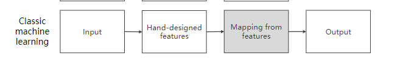
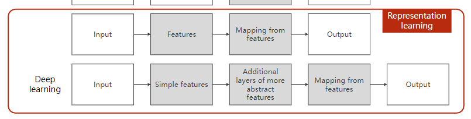

## 基本

1. 区别
    1. 普通算法：人工设计算法结构，进行问题解答 
    2. 机器学习：根据数据集来进行算法的设计
2. 类型
    1. rule—base 基于一些原子规则来设计的一些算法
        1. 比如将不同类型的反函数都记下来，然后指定计算规则
        2. 缺点；
            1. 规则越来越多
            2. 越来越难维护
    2. 手工特征提取
        1. 筛选出几个明显特征，将这几个特征建立特征与输出之间的联系
            1. 
        2. 找到一个映射，相当于y = f（x）
    3. 表示学习
        1. 希望那个特征也能提取出来，自动特征提取
        2. 
        3. 维度诅咒
            1. 维度越多，需要的样本越大 指数上升
            2. 数据集贵
                1. 需要人工先打标签
        4. 维度降低 尽量表示高维空间中的信息
            1. 线性映射
            2. 非线性映射
            3. 流形
                1. 作用：进行降维
                2. 比如一个三维的东西，其有一维的数据都是相同差不多的，可以将这一维进行忽略，即只考虑其他维度
    4. 深度学习
        1. 无监督
        2. 端到端
        3. 特征提取到特征映射同时训练