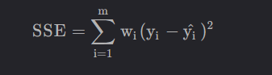

## 流程

1. dataset 数据集

2. model 模型

3. training 训练

4. inferring 推理

    1. 机器

    2. 人工

        ## 数据集

        1. 分类
            1. 训练集
                1. 结果已知
                2. 尽量接近真实的数据
                3. 一般进行再分
                    1. 训练集
                        1. 进行开发
                    2. 验证集
                        1. 结果已知，在训练集训练完成后，先进行一下评估，在进行测试
            2. 测试集
                1. 结果未知
        2. 过拟合
            1. 在学习过程中，将一些无关因素考虑进去，比如图像噪声，造成结果的错误

        3. 独热编码

            “独热编码”（One-Hot Encoding）是一种常用的数据编码方法，通常用于将分类数据转换为机器学习算法可以处理的形式。
        
            在独热编码中，每个不同的类别被表示为一个向量，这个向量的长度等于所有可能类别的数量。对于给定的类别，它的向量表示中只有一个元素为1，其余元素为0。这个唯一为1的元素位置表示类别的索引。这种编码方式确保了每个类别之间的独立性。
        
            例如，假设有三个类别：苹果、橙子和香蕉。进行独热编码后：
        
            - 苹果可能被编码为 `[1, 0, 0]`
            - 橙子可能被编码为 `[0, 1, 0]`
            - 香蕉可能被编码为 `[0, 0, 1]`
        
            这种编码方式常用于机器学习任务中，特别是对于分类问题和神经网络的输出层，它能够有效地表示分类数据，同时避免了类别之间的偏好或大小关系。
        
            在某些情况下，独热编码可能会导致高维度的稀疏数据，特别是当分类的数量很多时，这可能会增加数据的复杂度和计算成本。
        
        ## 模型
        
        1. 对于一个线性模型，y = ax + b，可以将其进行维度降低，将b给忽略，进行简化 y = ax 
            1. 注意：对于我们来说，y = ax + b 中，未知数是a 和b，而不是x 和y ，因此其是二维的，将b忽略后，其变成一维。之所以这么变，是因为b对y是恒定的影响，而a是不恒定的影响
        2. 进行线性拟合
            1. y = a x
                1. 首先取a 为一个随机数，
            2. evaluate 评估 参数方程
                1. 方差为损失值

## 训练

1. 训练流程

    1. 选取合适的线性拟合方程

        1. 对于一个线性模型，y = ax + b，可以将其进行维度降低，将b给忽略，进行简化 y = ax 
            1. 注意：对于我们来说，y = ax + b 中，未知数是a 和b，而不是x 和y ，因此其是二维的，将b忽略后，其变成一维。之所以这么变，是因为b对y是恒定的影响，而a是不恒定的影响

    2. 选取随机的参数

        1. 通过一个随机或者人为设置的数，来带入参数方程
            1. 

    3. 进行结果的评估

        1. 用途：用于判断参数的优劣

            1. 

        2. 误差也成为损失值

        3. 方法（损失函数）：

            1. SSE（和方差）

                在统计学里，该参数计算的是拟合数据和原始数据对应点的误差的平方和，计算公式为，

                

                其中 y i y\_i yi 是真实数据 y i ^ \\hat{y\_i} yi^ 是拟合的数据， w i > 0 w\_i>0 wi\>0 从这里可以看出SSE越接近于0，说明模型选择和拟合更好，数据预测也越成功。接下来的MSE和RMSE因为和SSE是同出一宗，所以效果一样。

            2. MSE（均方误差）

                该统计参数是预测数据和原始数据对应点误差的平方和的均值，也就是 S S E n \\frac{SSE}{n} nSSE 和 S S E SSE SSE 没有太大的区别，计算公式为:

                

                

                其中 n n n 为样本的个数。

            3. RMSE（均方根误差）

                该统计参数，也叫回归系统的拟合标准差，是MSE的平方根，计算公式为

                

        4. 改变参数，再进行新一轮的判断

            1. 通过增大或缩小参数进行新一轮的判断

        5. 对比

            1. 将不同的参数绘制成图表，找到误差最小的参数，选择该参数即可
                1. 
            2. 在深度学习中，一般并不是根据参数来绘制图表的，而是轮数，一般随着轮数的增加，结果会先好再坏，需要选取最优的一个
                1. 

## 推理

1. 例子
    1. 在课程花费时间与获得分数之间的关系
        1. 
    2. 结果
        1. 对于结果已知的，是数据集
        2. 对于结果未知的，训练的测试集或者推理
    3. 在训练时，对于结果已知，可以进行监督训练，用于判断模型好坏，对于结果未知的，不可以进行看答案进行模型的修改，只用于判断

相关代码：

对于二维图像

