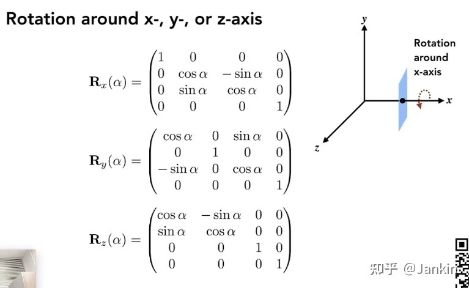
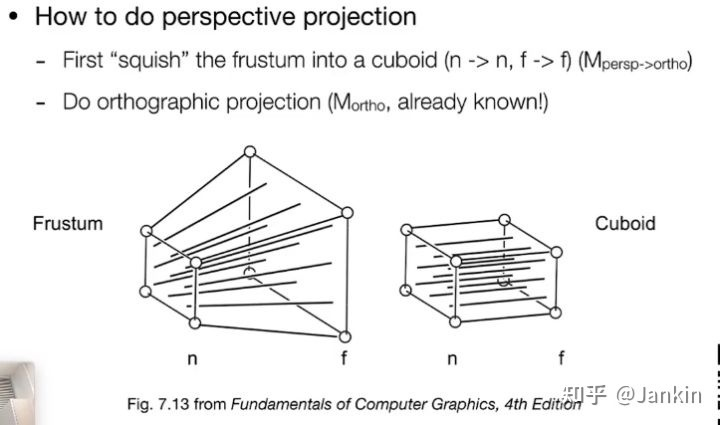
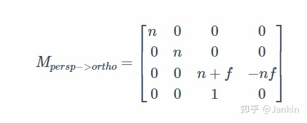
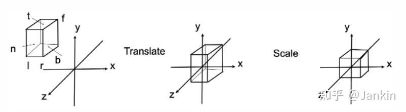
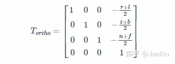
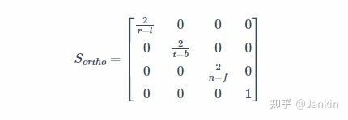
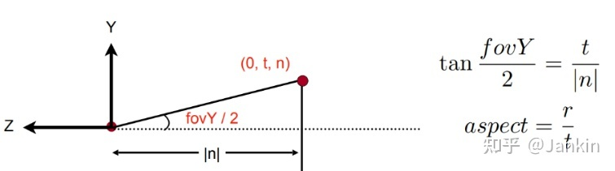
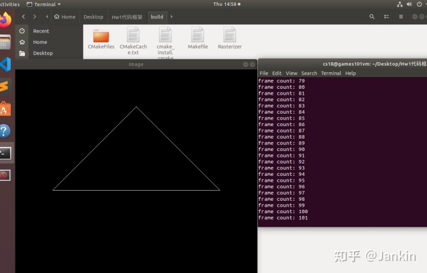

## 1-作业要求

本次作业的任务是填写一个旋转矩阵和一个透视投影矩阵。

给定三维下三个点 v0(2.0, 0.0, −2.0), v1(0.0, 2.0, −2.0), v2(−2.0, 0.0, −2.0), 你需要将这三个点的坐标变换为屏幕坐标并在屏幕上绘制出对应的线框三角形。

旋转矩阵：get\_model\_matrix(float rotation\_angle): 逐个元素地构建模型变换矩阵并返回该矩阵。在此函数中，你只需要实现三维中绕 z 轴旋转的变换矩阵，而不用处理平移与缩放。

透视投影矩阵：get\_projection\_matrix(float eye\_fov, float aspect\_ratio, float zNear, float zFar): 使用给定的参数逐个元素地构建透视投影矩阵并返回该矩阵。

预期效果：当你在上述函数中正确地构建了模型与投影矩阵，光栅化器会创建一个窗口显示出线框三角形。由于光栅化器是逐帧渲染与绘制的，所以你可以使用 A 和D 键去将该三角形绕 z 轴旋转 (此处有一项提高作业，将三角形绕任意过原点的轴旋转)。当你按下 Esc 键时，窗口会关闭且程序终止。

## 2-理解思路

本次作业主要分成两个内容

1-绕Z轴旋转的旋转矩阵

2-投影变换矩阵

## 3-旋转矩阵



我们将绕z轴的矩阵填入即可

```cpp
//自己定义的角度值转弧度制
inline double Degree(double angle)  {return angle*MY_PI/180.0;}

//M
//逐个元素构件变化矩阵
//实现三维中绕z轴的变换矩阵
Eigen::Matrix4f get_model_matrix(float rotation_angle)
{
    //Identity函数得到一个4×4的单位矩阵
    Eigen::Matrix4f model = Eigen::Matrix4f::Identity();

    //把输入的角度制变成弧度制
    double degree=Degree(rotation_angle);
    //构件一个绕z轴的旋转矩阵
    model << cos(degree), -sin(degree), 0, 0,
            sin(degree), cos(degree), 0, 0,
            0, 0, 1, 0,
            0, 0, 0, 1;
    return model;
}
```

## 3-透视投影变换矩阵

分成两步

1-将透视投影变成正交投影

2-将正交投影变到正则立方体内

### 3-1透视投影变成正交投影



透视投影相当于先在不改变其z轴的前提下，由近大远小原则，将远处物体投影到近处平面上，然后再将其按正交投影，投影到屏幕上

用我们上节课得到的结论

[Jankin：GAMES101 Lecture 3 Transformation cont 变换深入](https://zhuanlan.zhihu.com/p/535879888)

该矩阵是：



```cpp
    // 1. 透视投影转为正交投影矩阵
    float n = zNear;
    float f = zFar;
    Eigen::Matrix4f M_persp2Ortho;
    M_persp2Ortho << n, 0, 0, 0,
		0, n, 0, 0,
		0, 0, n + f, -n * f,
		0, 0, 1, 0;
```

### 3-2正交投影变成正则立方体

正交投影就是先将其移动到原点，再将其规划范成为立方体，使其正规化，这个是标准，便于以后的计算，因此需要先将生成的立方体转化为正交投影



- l = left
- r = right
- b = bottom
- t = top
- f = far

其中 先平移，平移矩阵为：



后缩放，缩放矩阵为



这里我们会发现，没有r, t, b, l这些值。我们有的只是fov和aspect\_ratio，所以要转化一下



于是就可以得到对应关系

```cpp
float fov = eye_fov * MY_PI / 180.0;

float t = -n * tan(fov / 2.);
float b = -t;
float r = aspect_ratio * t;
float l = -r;
```

透视投影的到的代码如下：最后记得先变成正交，再变成正则立方体；

```cpp
//逐个元素构建投影矩阵
//input eye_fov视锥角 （Field of vision）
//input aspect_ratio 横纵比
//input zNear 近平面N
//input zFar 远平面F
Eigen::Matrix4f get_projection_matrix(float eye_fov, float aspect_ratio,
                                      float zNear, float zFar)
{
    // Students will implement this function

    Eigen::Matrix4f projection = Eigen::Matrix4f::Identity();

    // 1. 透视投影转为正交投影矩阵
    // 上课推导的公式
    float n = zNear;
    float f = zFar;
    Eigen::Matrix4f M_persp2Ortho;
    M_persp2Ortho << n, 0, 0, 0,
		0, n, 0, 0,
		0, 0, n + f, -n * f,
		0, 0, 1, 0;

    // 2. 正交投影转换到正则立方体
    float fov = eye_fov * MY_PI / 180.0;

    float t = -n * tan(fov / 2.);
    float b = -t;
    float r = aspect_ratio * t;
    float l = -r;

    //平移到原点
    Eigen::Matrix4f M_ortho, trans, scale;
    trans << 1, 0,  0,  -(r+l)/2,
             0, 1,  0,  -(t+b)/2,
             0, 0,  1,  -(n+f)/2,
             0, 0,  0,  1;

    //缩放到正则立方体
    scale << 2/(r-l),   0,  0,  0,
                0,  2/(t-b),   0,  0,
                0,  0,  2/(n-f),    0,
                0,  0,  0,  1;
    M_ortho =  scale * trans;
            
    projection = M_ortho * M_persp2Ortho ;
    return projection;
}
```

最后的效果如下:

