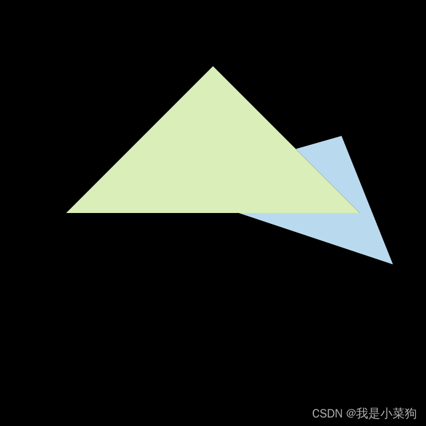
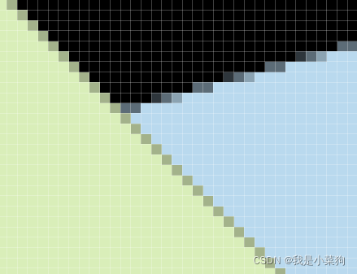
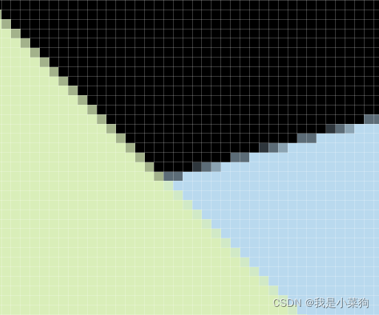
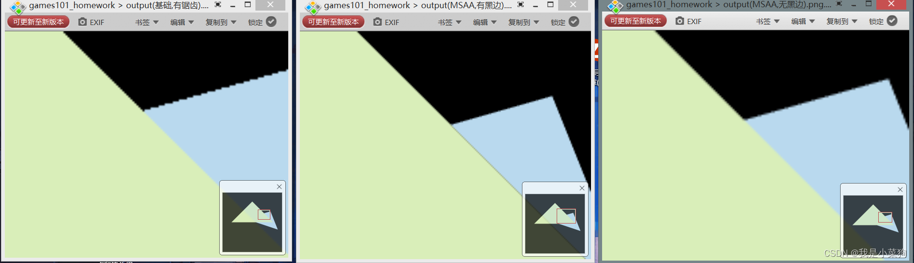

## 课程总结与理解（光栅化）

写完作业后来总结一波，这一章主要解决的就是**光栅化和反走样问题**，我之前一直对光栅化没有深入的了解，这次总算懂了一点点，首先就是在通过[MVP](https://so.csdn.net/so/search?q=MVP&spm=1001.2101.3001.7020)操作之后，我们得到一个标准立方体，**接下来需要进行视口变换，将标准立方体的x和y与屏幕坐标x和y对应（作业代码里已经写得很清楚了）**，然后就是真正进行**光栅化操作**，以每个三角形为单位，逐个进行绘制：**通过遍历图像上的像素点**（这里有一些加速处理，比如bouding box，扫描线等等），**然后判断像素点的中心点是否在三角形中**（叉乘判断，若三者叉乘符号相同，便是在内部），**若在三角形中，则首先需要对该像素进行深度测试，若该像素深度小于深度缓存的深度即表面通过深度测试，此时便对该像素进行着色，也就是给该像素赋予颜色值，如此往复，最终实现绘制**。若要使用反走样技术，比如MSAA，就通过超采样实现，但这会带了更多的开销，不同的反走样技术实现起来也不同。**解决了之前理论课一直没弄明白的点：先模糊再采样的本质是什么？即改变颜色再着色，而先采样再着色则是先着色再改变周围像素块的颜色。**

## 基本要求实现

首先是实现基本需求，完成最基本的光栅化。主要解决的问题是**创建bouding box，判断像素中心点是否在三角形内部，z-buffer深度测试。**  
创建bouding box，如下;我看有的人对max进行了向上取整，我感觉没有必要，直接用int截断就行，这个大家有空可以思考思考，我感觉挺有意思。

```cpp
    int min_x, max_x, min_y, max_y;
    min_x = std::min(v[0].x(), std::min(v[1].x(), v[2].x()));
    max_x = std::max(v[0].x(), std::max(v[1].x(), v[2].x()));
    min_y = std::min(v[0].y(), std::min(v[1].y(), v[2].y()));
    max_y = std::max(v[0].y(), std::max(v[1].y(), v[2].y()));
```

判断像素中心点是否在三角形内部，如下；

通过三角形三条边向量分别与点与向量起点形成的向量做点乘，若其结果均为正或均为负则代表其在三角形内

```cpp
static bool insideTriangle(float x, float y, const Vector3f* _v)
{   
    // TODO : Implement this function to check if the point (x, y) is inside the triangle represented by _v[0], _v[1], _v[2]
    Vector3f Q = {x,y,0};

    Vector3f p0p1 = _v[1] - _v[0];
    Vector3f p0Q = Q - _v[0];

    Vector3f p1p2 = _v[2] - _v[1];
    Vector3f p1Q = Q - _v[1];

    Vector3f p2p0 = _v[0] - _v[2];
    Vector3f p2Q = Q - _v[2];

    //类定义里面已经定义是逆时针，所以只用考虑同正情况。
    return p0p1.cross(p0Q).z() > 0 && p1p2.cross(p1Q).z() > 0 && p2p0.cross(p2Q).z()>0;
}
```

z-buff深度测试，如下：

```cpp
  iterate through the pixel and find if the current pixel is inside the triangle
   for (int x = min_x; x <= max_x; x++)
   {
       for (int y = min_y; y <= max_y; y++)
       {
           //判断像素中心点是否在连续三角形内，若在三角形内，就尝试对该像素进行着色，若深度测试通过，便着色
           if (insideTriangle(x + 0.5, y + 0.5, t.v))
           {
               // If so, use the following code to get the interpolated z value.
               auto tup = computeBarycentric2D((float)x + 0.5, (float)y + 0.5, t.v);
               float alpha;
               float beta;
               float gamma;
               std::tie(alpha, beta, gamma) = tup;
               float w_reciprocal = 1.0 / (alpha / v[0].w() + beta / v[1].w() + gamma / v[2].w());
               float z_interpolated = alpha * v[0].z() / v[0].w() + beta * v[1].z() / v[1].w() + gamma * v[2].z() / v[2].w();
               z_interpolated *= w_reciprocal;
               //深度测试，通过便着色，并同时将深度存入缓存
               //这里有个细节之前没注意，就是buf的取值要用get_index函数
               if (depth_buf[get_index(x, y)] > z_interpolated)
               {
                   // TODO : set the current pixel (use the set_pixel function) to the color of the triangle (use getColor function) if it should be painted.
                   //深度存入缓存
                   depth_buf[get_index(x, y)] = z_interpolated;
                   Vector3f point = { (float)x,(float)y,z_interpolated};
                   Vector3f color = t.getColor();
                   //着色
                   set_pixel(point, color);
               }
           }
       }
   }
```

坑:

1. 像素int与图像float是否转化

   1. 对于一个屏幕来说，当对屏幕上一个图形进行光栅化，其由于是由像素组成，可以将像素看成一个方块，此时起始为0，而直接将float赋值给int，会产生截断，最终导致屏幕最左边始终在图像最左边，而对于最右边来说，由于像素是有具体体积的，假设float = 1.9，而int 截断后为1，虽然此时1小于flaot1.9，但1代表其第二个像素，而第二个像素的最右边坐标为2，依旧把该图像包含进去，因此不必考虑因最终像素截断导致像素小于图像

2. 走样

   1. 若不对其进行反走样，则直接判断像素中点是否在三角形之间即可，通过传入像素中点坐标即x+0.5,y+0.5，此时若放大图像会导致锯齿化
   2. 反走样：
      1. 通过提高采样率，再对高精度采样率结果进行模糊而提高反走样效果，此时假设一个像素代表四个像素，使用count记录其数目，则分别对这四个像素进行判断是否在三角形中间，同时其若在像素中间则使count+1，同时判断其是否小于该像素代表的最小深度，小于则更新其最小深度，最终将该像素的亚颜色通过coun/4来得到
         1. 问题：其会导致两个有颜色重叠部分有黑边，是因为对一个像素来说，该像素完全是由最前面那个元素所贡献的，此时尽管其离视线最近，但其可能所占比例较小，最总导致该像素是浅化的颜色，同时和其背后颜色造成对比，呈现出黑色
         2. 改进：对每个像素中的四个部分均保留其颜色和最小深度，只有满足该像素的最小深度是才对对该像素颜色进行更新，同时在计算整个像素颜色时，通过对该像素四个部分进行颜色加比例计算

3. 进行深度插值

   1. 知道三维中的三角形三个顶点以及三角形投影后的顶点，需要知道三角形内部的深度信息，需要进行重心插值计算，对投影后三角形内部的点，可以通过重心插值进行反推回原先其深度，而不需要进行逆变换来求初始深度

   

总体来说，难度不大，只是有一些小细节需要注意，**其次要能看懂一点点源码**，要不然有些地方不好写。结果如下：  
  
**放大之后的锯齿感可以说相当的明显**  


## MSAA实现（有黑边）

接下来是MSAA的实现（有黑边），我一开始感觉难度不大，后面就被坑了，出现了黑边==

```cpp
    //MSAA超采样（有黑边），着色时仅仅考虑了背景色和三角形颜色，没有考虑其他三角形的颜色
    std::vector<Eigen::Vector2f> super_sample_step
    {
        {0.25,0.25},
        {0.75,0.25},
        {0.25,0.75},
        {0.75,0.75},
    };
    // iterate through the pixel and find if the current pixel is inside the triangle
    for (int x = min_x; x <= max_x; x++)
    {
        for (int y = min_y; y <= max_y; y++)
        {
            int count = 0;
            float minDepth = FLT_MAX;
            for (int i = 0; i < 4; i++)
            {
                if (insideTriangle(x + super_sample_step[i][0], y + super_sample_step[i][1], t.v))
                {
                    count++;
                }
            }
            if (count > 0)
            //若像素的四个样本中有一个在三角形内，就要对这个像素进行深度测试，然后颜色直接就是所占比例
            {
                auto tup = computeBarycentric2D(x + 0.5, y + 0.5, t.v);
                float alpha;
                float beta;
                float gamma;
                std::tie(alpha, beta, gamma) = tup;
                float w_reciprocal = 1.0 / (alpha / v[0].w() + beta / v[1].w() + gamma / v[2].w());
                float z_interpolated = alpha * v[0].z() / v[0].w() + beta * v[1].z() / v[1].w() + gamma * v[2].z() / v[2].w();
                z_interpolated *= w_reciprocal;
                //深度测试，通过便着色，并同时将深度存入缓存
                //这里有个细节之前没注意，就是buf的取值要用get_index函数
                if (depth_buf[get_index(x, y)] > z_interpolated)
                {
                    // TODO : set the current pixel (use the set_pixel function) to the color of the triangle (use getColor function) if it should be painted.
                    //深度存入缓存
                    depth_buf[get_index(x, y)] = z_interpolated;
                    Vector3f point = { (float)x,(float)y,z_interpolated };
                    Vector3f color = t.getColor()*count/4; //t.getColor()* count / 4.0f + (4 - count) * frame_buf[get_index(x, y)] / 4.0f
                    //着色
                    set_pixel(point, color);
                }
            }
        }
    }
```

  
**不难发现，虽然图像整体锯齿感减弱，但是三角形交叉处出现黑边。**  


## MSAA的实现（无黑边）

接下来是MSAA的实现（无黑边），花了差不多一个上午解决掉了，还是有点蛋疼的，**首先要先去思考出现黑边问题的本质原因是什么？是由于上面那个MSAA的方法，对三角形光栅化时时仅仅考虑了背景色和该三角形颜色，没有考虑其他三角形的颜色**，比如在交叉线上，可能绿色占四分之一，蓝色占四分之三，而上面那个方法实施的时候是绿色占四分之一，黑色占四分之三（或者反过来，这个不重要，关键是这个思想），**因此解决这个问题的办法就是把每个像素的四个样本的深度和颜色都记录下来，说白了就是直接将其看作四倍的图像进行处理，然后再进行着色。**

先照猫画虎地把记录样本的两个数组定义出来。（要对源码有一点明白，要不然你可能都不知道我在讲啥。。。）

```cpp
        std::vector<Eigen::Vector3f> frame_buf;
        std::vector<Eigen::Vector3f> super_frame_buf;

        std::vector<float> depth_buf;
        std::vector<float> super_depth_buf;
```

```cpp
void rst::rasterizer::clear(rst::Buffers buff)
{
    if ((buff & rst::Buffers::Color) == rst::Buffers::Color)
    {
        std::fill(frame_buf.begin(), frame_buf.end(), Eigen::Vector3f{0, 0, 0});
        std::fill(super_frame_buf.begin(), super_frame_buf.end(), Eigen::Vector3f{ 0, 0, 0 });

    }
    if ((buff & rst::Buffers::Depth) == rst::Buffers::Depth)
    {
        std::fill(depth_buf.begin(), depth_buf.end(), std::numeric_limits<float>::infinity());
        std::fill(super_depth_buf.begin(), super_depth_buf.end(), std::numeric_limits<float>::infinity());
    }
}

rst::rasterizer::rasterizer(int w, int h) : width(w), height(h)
{
    frame_buf.resize(w * h );
    depth_buf.resize(w * h );
    super_frame_buf.resize(w * h*4);
    super_depth_buf.resize(w * h*4);
}
```

再定义一个函数，用来取超采样数组里的值。

```cpp
int rst::rasterizer::get_super_index(int x, int y)
{
    return (height*2 - 1 - y) * width*2 + x;
}
```

核心代码

```cpp
std::vector<Eigen::Vector2f> super_sample_step
    {
        {0.25,0.25},
        {0.75,0.25},
        {0.25,0.75},
        {0.75,0.75},
    };
    // iterate through the pixel and find if the current pixel is inside the triangle
    for (int x = min_x; x <= max_x; x++)
    {
        for (int y = min_y; y <= max_y; y++)
        {
            //判断是否通过了深度测试
            int judge = 0;
            //具体思路就是记录四倍的数据量，把超采样的数据都记下来，直接就当做四倍的图像处理
            for (int i = 0; i < 4; i++)
            {
                if (insideTriangle(x + super_sample_step[i][0], y + super_sample_step[i][1], t.v))
                {
                    auto tup = computeBarycentric2D(x + super_sample_step[i][0], y + super_sample_step[i][1], t.v);
                    float alpha;
                    float beta;
                    float gamma;
                    std::tie(alpha, beta, gamma) = tup;
                    float w_reciprocal = 1.0 / (alpha / v[0].w() + beta / v[1].w() + gamma / v[2].w());
                    float z_interpolated = alpha * v[0].z() / v[0].w() + beta * v[1].z() / v[1].w() + gamma * v[2].z() / v[2].w();
                    z_interpolated *= w_reciprocal;
                    if (super_depth_buf[get_super_index(x*2 + i % 2, y*2 + i / 2)] > z_interpolated)
                    {
                        judge = 1;
                        // TODO : set the current pixel (use the set_pixel function) to the color of the triangle (use getColor function) if it should be painted.
                        //深度存入缓存
                        super_depth_buf[get_super_index(x*2 + i % 2, y*2 + i / 2)] = z_interpolated;
                        //颜色存入缓存
                        super_frame_buf[get_super_index(x*2 + i % 2, y*2 + i / 2)] = t.getColor();
                    }
                }
            }
            if (judge)
            //若像素的四个样本中有一个通过了深度测试，就需要对该像素进行着色，因为有一个通过就说明有颜色，就需要着色。
            {
                Vector3f point = { (float)x,(float)y,0 };
                Vector3f color = (super_frame_buf[get_super_index(x*2 , y*2)]+ super_frame_buf[get_super_index(x*2+1, y*2)]+ super_frame_buf[get_super_index(x*2, y*2+1)]+ super_frame_buf[get_super_index(x*2+1, y*2+1)])/4;
                //着色
                set_pixel(point, color);
            }
        }
    }
```

  
可以发现，这个过渡还是比较顺滑的。  


## 最终效果对比



## 感悟

