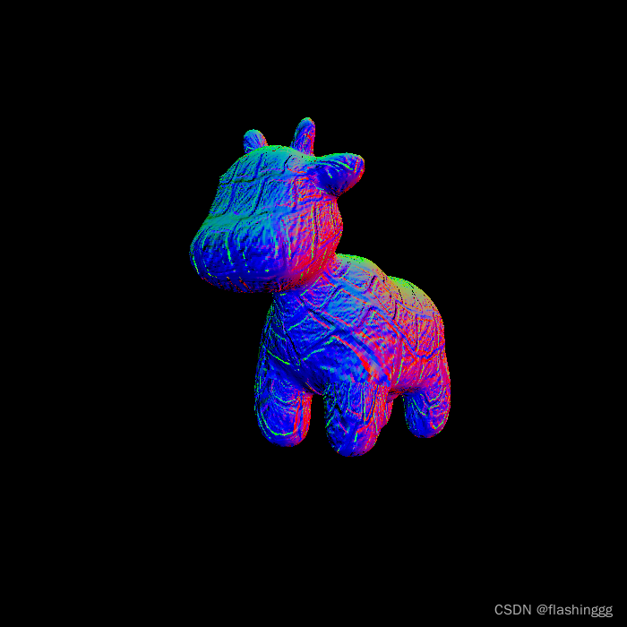

1. 实验分别讨论了法向量，颜色，光照的影响

   1. 法向量通过贴图或物体获得，控制其外观凹凸
   2. 颜色控制其色彩
      1. 由漫反射控制
   3. 光照控制其明暗变化
      1. 通过光照控制

2. Blinn-Phong 模型计 算 Fragment Color.

   1. 相当于已知物体，相机位置，光线与物体关系，求相机看到的物理光照

   2. 光照 = 环境光照 + 漫反射光照（理解为物体吸收的直接反射光照*能量衰减 + 反射光照（高光）

   3. ```c++
      Eigen::Vector3f phong_fragment_shader(const fragment_shader_payload& payload)
      {
          Eigen::Vector3f ka = Eigen::Vector3f(0.005, 0.005, 0.005);
          Eigen::Vector3f kd = payload.color;
          Eigen::Vector3f ks = Eigen::Vector3f(0.7937, 0.7937, 0.7937);
      
          auto l1 = light{{20, 20, 20}, {500, 500, 500}};
          auto l2 = light{{-20, 20, 0}, {500, 500, 500}};
      
          std::vector<light> lights = {l1, l2};
          Eigen::Vector3f amb_light_intensity{10, 10, 10};
          Eigen::Vector3f eye_pos{0, 0, 10};
      
          float p = 150;
      
          Eigen::Vector3f color = payload.color;
          Eigen::Vector3f point = payload.view_pos;
          Eigen::Vector3f normal = payload.normal;
      
          Eigen::Vector3f result_color = {0, 0, 0};
          for (auto& light : lights)
          {
              // TODO: For each light source in the code, calculate what the *ambient*, *diffuse*, and *specular* 
              // components are. Then, accumulate that result on the *result_color* object.
              auto v = eye_pos -point ; //相机位置减去物体位置，视线向量
              auto l = light.position - point; // 光照向量
              auto h = (v + l).normalized(); // 反射到相机光线与光照法向量夹角，求其夹角中心
              auto r = l.dot(l); //求光源到物体距离
              auto ambient = ka.cwiseProduct(amb_light_intensity); //环境光
              auto diffuse = kd.cwiseProduct((light.intensity/r) * std::max(0.0f ,normal.normalized().dot(l.normalized())));// 漫反射光，衰减系数*反射光线*光照强度
              auto specular = ks.cwiseProduct((light.intensity/r)* std::max(0.0f,pow(normal.normalized().dot(h),p))); // 反射光线，通过pow来扩大其角度的影响，只有反射光线与射线向量非常接近时才进行高光
              result_color += (ambient + diffuse + specular);
          }
      
          return result_color * 255.f;
      }
      ```

   4. 样子：

      1. 
      2. 有光照无颜色

3. texture_fragment_shader() 

   1. 先将x，y对应的纹理颜色取出，作为物体的颜色，其颜色绝大多数有漫反射决定

   2. ```c++
      Eigen::Vector3f texture_fragment_shader(const fragment_shader_payload& payload)
      {
          Eigen::Vector3f return_color = {0, 0, 0};
          if (payload.texture)
          {
              // TODO: Get the texture value at the texture coordinates of the current fragment
              return_color = payload.texture->getColor(payload.tex_coords.x(),payload.tex_coords.y());// 取出颜色
          }
          Eigen::Vector3f texture_color;
          texture_color << return_color.x(), return_color.y(), return_color.z();//整合颜色
      
          Eigen::Vector3f ka = Eigen::Vector3f(0.005, 0.005, 0.005);
          Eigen::Vector3f kd = texture_color / 255.f;  //传递到漫反射颜色
          Eigen::Vector3f ks = Eigen::Vector3f(0.7937, 0.7937, 0.7937);
      
          auto l1 = light{{20, 20, 20}, {500, 500, 500}};
          auto l2 = light{{-20, 20, 0}, {500, 500, 500}};
      
          std::vector<light> lights = {l1, l2};
          Eigen::Vector3f amb_light_intensity{10, 10, 10};
          Eigen::Vector3f eye_pos{0, 0, 10};
      
          float p = 150;
      
          Eigen::Vector3f color = texture_color;
          Eigen::Vector3f point = payload.view_pos;
          Eigen::Vector3f normal = payload.normal;//法向量
      
          Eigen::Vector3f result_color = {0, 0, 0};
      
          for (auto& light : lights)
          {
              auto v = eye_pos - point; //v为出射光方向（指向眼睛）
              auto l = light.position - point; //l为指向入射光源方向
              auto h = (v + l).normalized(); //h为半程向量即v+l归一化后的单位向量
              auto r = l.dot(l); //衰减因子
              auto ambient = ka.cwiseProduct(amb_light_intensity);
              auto diffuse = kd.cwiseProduct(light.intensity / r) * std::max(0.0f, normal.normalized().dot(l.normalized()));
              auto specular = ks.cwiseProduct(light.intensity / r) * std::pow(std::max(0.0f, normal.normalized().dot(h)), p);
              result_color += (ambient + diffuse + specular);
              // TODO: For each light source in the code, calculate what the *ambient*, *diffuse*, and *specular* 
              // components are. Then, accumulate that result on the *result_color* object.
      
          }
      
          return result_color * 255.f;
      }
      ```

   3. 

   4. 有光照有颜色，无凹凸

4. bump_fragment_shader() 

   1. 实现界面凹凸，物体不改变其实际的形状，仅贴图模型保留其形状，当需要实现凹凸时，通过传入x，y获得其高度变化（高度的导数），对其进行物体明暗处理

   2. ```c++
      Eigen::Vector3f bump_fragment_shader(const fragment_shader_payload& payload)
      {
          
          Eigen::Vector3f ka = Eigen::Vector3f(0.005, 0.005, 0.005);
          Eigen::Vector3f kd = payload.color;
          Eigen::Vector3f ks = Eigen::Vector3f(0.7937, 0.7937, 0.7937);
      
          auto l1 = light{{20, 20, 20}, {500, 500, 500}};
          auto l2 = light{{-20, 20, 0}, {500, 500, 500}};
      
          std::vector<light> lights = {l1, l2};
          Eigen::Vector3f amb_light_intensity{10, 10, 10};
          Eigen::Vector3f eye_pos{0, 0, 10};
      
          float p = 150;
      
          Eigen::Vector3f color = payload.color; 
          Eigen::Vector3f point = payload.view_pos;
          Eigen::Vector3f normal = payload.normal;
      
      
          float kh = 0.2, kn = 0.1;
       
      	   auto n=normal;
          float x=n.x(),y=n.y(),z=n.z();
          // TODO: Implement bump mapping here
          // Let n = normal = (x, y, z)
          Eigen::Vector3f t = {x*y/sqrt(x*x+z*z),sqrt(x*x+z*z),z*y/sqrt(x*x+z*z)};
          Eigen::Vector3f b = n.cross(t);
          Eigen::Matrix3f TBN;
          TBN<<t[0],b[0],n[0],   //用于将贴图模型中的数据转化为模型世界中的，由于光线相对整个物体法线来说是少的，（光线不是时刻都有），若将贴图的中的法线都转化到模型世界不如将光线直接在贴图模型中运算，最后得到结果，将其转化为模型世界
              t[1],b[1],n[1],
              t[2],b[2],n[2];
          float u=payload.tex_coords[0];//渲染点对应的uv坐标
          float v=payload.tex_coords[1];
          float w=payload.texture->width;//模型对应纹理的尺寸
          float h=payload.texture->height;
          //norm是将贴图中的法线信息转为一维
          float dU = kh * kn * float(payload.texture->getColor(u+1.0/w,v).norm()-payload.texture->getColor(u,v).norm());//u+1.0/w表示在u的方向上增加1/贴图宽度个距离，相当于求导数，通过大的减小的获得的距离导数
          float dV = kh * kn * float(payload.texture->getColor(u,v+1.0/h).norm()-payload.texture->getColor(u,v).norm());
          Eigen::Vector3f ln = {-dU, -dV, 1};// 切线转化为法向量
          //转换到世界坐标
          n = (TBN * ln).normalized();
      
          Eigen::Vector3f result_color = {0, 0, 0};
          result_color = n;
      
          return result_color * 255.f;
      
      }
      ```

   3. 无光照：

      1. 

   4. 有光照：

      1. 

5. displacement_fragment_shader() 

   1. ```c++
      Eigen::Vector3f displacement_fragment_shader(const fragment_shader_payload& payload)
      {
          
          Eigen::Vector3f ka = Eigen::Vector3f(0.005, 0.005, 0.005);
          Eigen::Vector3f kd = payload.color;
          Eigen::Vector3f ks = Eigen::Vector3f(0.7937, 0.7937, 0.7937);
      
          auto l1 = light{{20, 20, 20}, {500, 500, 500}};
          auto l2 = light{{-20, 20, 0}, {500, 500, 500}};
      
          std::vector<light> lights = {l1, l2};
          Eigen::Vector3f amb_light_intensity{10, 10, 10};
          Eigen::Vector3f eye_pos{0, 0, 10};
      
          float p = 150;
      
          Eigen::Vector3f color = payload.color; 
          Eigen::Vector3f point = payload.view_pos;
          Eigen::Vector3f normal = payload.normal;
      
          float kh = 0.2, kn = 0.1;
          
         	float x = normal.x();
      	float y = normal.y();
      	float z = normal.z();
      	Eigen::Vector3f t{ x*y / std::sqrt(x*x + z * z), std::sqrt(x*x + z * z), z*y / std::sqrt(x*x + z * z) };
      	Eigen::Vector3f b = normal.cross(t);
      	Eigen::Matrix3f TBN;
      	TBN << t.x(), b.x(), normal.x(),
      		t.y(), b.y(), normal.y(),
      		t.z(), b.z(), normal.z();
      
      	float u = payload.tex_coords.x();
      	float v = payload.tex_coords.y();
      	float w = payload.texture->width;
      	float h = payload.texture->height;
      
      
      	float dU = kh * kn * (payload.texture->getColor(u + 1.0f / w, v).norm() - payload.texture->getColor(u , v).norm());
      	float dV = kh * kn * (payload.texture->getColor(u, v + 1.0f / h).norm() - payload.texture->getColor(u , v).norm());
      
      	Eigen::Vector3f ln{ -dU,-dV,1.0f };
      
      	point += (kn * normal * payload.texture->getColor(u , v).norm());
      
      	normal = TBN * ln;
      	normal = normal.normalized();//将生成的模型用于光照颜色，更加精确的法向量
      
      
      
          Eigen::Vector3f result_color = {0, 0, 0};
      
          for (auto& light : lights)
          {
              // TODO: For each light source in the code, calculate what the *ambient*, *diffuse*, and *specular* 
              // components are. Then, accumulate that result on the *result_color* object.
              	Eigen::Vector3f light_dir = light.position - point;
      		Eigen::Vector3f view_dir = eye_pos - point;
      		float r = light_dir.dot(light_dir);
      
      		// ambient
      		Eigen::Vector3f La = ka.cwiseProduct(amb_light_intensity);
      		// diffuse
      		Eigen::Vector3f Ld = kd.cwiseProduct(light.intensity / r);
      		Ld *= std::max(0.0f, normal.dot(light_dir.normalized()));
      		// specular
      		Eigen::Vector3f h = (light_dir + view_dir).normalized();
      		Eigen::Vector3f Ls = ks.cwiseProduct(light.intensity / r);
      		Ls *= std::pow(std::max(0.0f, normal.dot(h)), p); //使用法向量
      
      		result_color += (La + Ld + Ls);
      
      
          }
      
          return result_color * 255.f;
      }
      ```

   2. 相对于上者增加光照模型，明暗细节更加充足，无颜色，总纹理颜色

   3. 