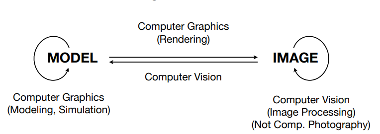

1. 学习目的

   1. •基本的智力挑战 - 
      1. 与现实的虚拟世界创建和互动 - 
      2. 需要了解物理世界的各个方面 - 
      3. 新的计算方法，显示，技术，技术
   2. 技术挑战 - 
      1. （透视）预测，曲线，表面的数学
      2. 照明和阴影的物理
      3. 代表3D中的 /操作形状 - 动画 /仿真 
      4. 3D图形软件编程和硬件

2. 学习内容

   1. 光栅化
      1. Project geometry primitives (3D triangles / polygons) onto the screen 
      2. Break projected primitives into fragments (pixels) 
      3. Gold standard in Video Games (Real-time Applications)
   2. 曲线和网格
   3. 光追
   4. 动画仿真–高级

3. 计算机图形学与计算机视觉区别

   1. 理解
      1. 
      2. 计算机图形学是三维模型投影到二维平面，或者三维模型与三维模型之间的转化
      3. 计算机视觉是二维图像到二维图像和二维图像到三维模型之间的转化
   2. 其界限并不清晰

   