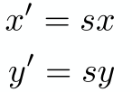
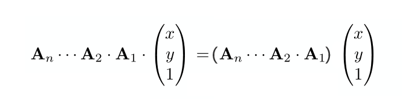
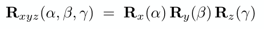

# 1\. 二维变换

## 1.1 缩放变换

  
如上图，如果想把一个图形缩小为原来的0.5倍，那么就需要x坐标变为0.5倍，y坐标也变为0.5倍，可以用以下表达式表示  
  
前面两节已经学了一些矩阵方面的知识，那么这两个表达式可以用矩阵的形式表示如下  
  
上面的矩阵表达式针对x轴和y轴进行相同比例的缩放，实际中两个方向上的缩放可能不尽相同，例如x轴缩放为0.5倍与轴不缩放，这时只需要把矩阵表达式稍作修改即可  
  
Sx表示在x轴方向上缩放的倍数，Sy表示在y轴方向上缩放的倍数

## 1.2.镜像变换

  
如上图需要将物体以y轴进行镜像，那么可以用以下表达式表达  
  
也可以用矩阵形式的表达  
  
**一些其他镜像矩阵**  
  


  


## 1.3 剪切变换

  
如上图这个变换好像是拽着图形的右上角沿着x轴向右拉了一段距离，称为剪切变换。  
剪切变换有以下特点

- 变换后物体的y坐标保持不变
- x坐标在最高的点平移了a，最低点没有移动
- 其它的点移动距离a \* Y (Y表示物体上点的y坐标值)

用矩阵形式的表达为  


## 1.4 旋转变换

说旋转，默认指的是 **绕原点(0,0)逆时针旋转**，下图是物体绕原点逆时针旋转θ角的示意图  
  
以上变换同样可以写成矩阵的形式  


## 1.5 平移变换

### 1.5.1 什么是线性变换

什么是线性变换，前面提到的变换都可以使用以下表达式表示  
  
都可以使用矩阵形式表示为  
  
继而表示为：输出坐标 = 变换矩阵 × 输入坐标 的形式  


满足以上条件的变换称为 **线性变换**

### 1.5.2 平移变换(仿射变换)

  
如上图需要把一个图形沿x轴平移tx，沿y轴平移ty，可以用以下表达式表示  
  
你会发现，它 **无法用前面熟悉的线性变换矩阵的形式表示**，也就是说平移变换是**非线性变换**

只能用以下矩阵形式表示，上面把这种变换称为非线性变换，其实它有专门的名字叫**仿射变换**  
  
人们总是希望能有一个统一的方法来表示同类事物，希望平移变换也能够像其他变换一样用同样的形式表示，使用起来更加便捷统一。

前辈大牛们经过各种尝试，想出了一个办法，就是引入**齐次坐标**

### 1.5.3 平移变换齐次坐标表示(线性)

**什么是齐次坐标**

齐次坐标与笛卡尔坐标系相比，会比笛卡尔坐标系多出一维，例如原来的坐标系是二维，转为齐次坐标系后就会变成三维，如果在卡尔坐标系上有点(x,y);当转换为齐次坐标后这个点变为(wx,wy,w);反过来同样适用，如果在其次坐标系中有一个点(x,y,w)，转换到笛卡尔坐标系下，这个点应该表示为(x/w,y/w),一个点在齐次坐标下有无数的表示法，例如笛卡尔坐标系下有点(1,2)，在其次坐标系下它可以表示为(1,2,1)、(2,4,2)、(3,6,3) …

**点和向量转为齐次坐标表示**

点(x,y)转为齐次坐标表示为  


向量(x,y)转为齐次坐标表示为  
  
这里解释一下在转为齐次坐标的过程中，点在末尾添加1，而向量添加0。  
向量具有平移不变形，任何一个向量平移后表示原来的向量，在向量转为齐次坐标形式的时候，在末尾添加0，就是为了保护这个向量在平移过程中不发生变化。

**平移变换齐次坐标表示**

平移变换原本是仿射变换，通过引入齐次坐标后，可以使用线性变换的形式表示  


这样我们的目的就达到了，把平移变换也表示为一个矩阵乘以一个坐标的线性变换的形式

## 1.6 逆变换

  
一个物体做一个变换，变换完以后要恢复到原来的位置，变换回原来的位置的过程称为**逆变换**，逆变换在数学上的实现是乘以变换矩阵的 **逆矩阵**

## 1.7 组合变换

组合变换就是对一个物体进行多个变换，例如同时进行平移和旋转变换  


上图中有两套组合变换

- 先平移(1,0)，再旋转45度
- 先旋转45度，再平移(1,0)

你会发现虽然都作了相同的变换，但是**变换的顺序不同**最终的**结果也不同**，是因为矩阵A乘矩阵B与矩阵B乘矩阵A的结果不同(上一节学习的矩阵相乘性质)

**组合变换矩阵相乘应用的顺序**  
  
上图中A1，A2一直到An表示变换矩阵，一个点进行组合变换时，应用在该点的矩阵是从右到左。即矩阵An乘An-1一直乘到A1，实际应用到点的顺序是A1，A2一直到An

**矩阵乘法结合律使用**  
之前的学习中我们知道矩阵相乘交换律不适用，但是适用结合律，既然适用有什么妙用，接下来看看  
一个点做多个变换即多个矩阵相乘再乘以这个点，根据矩阵乘法结合律，可以先把这些矩阵相乘，乘完在与这个点相乘，只要**保证矩阵相乘的顺序不变**即可  


## 1.8 非原点的旋转变换

  
我们学会了物体绕原点旋转，对于一个不是绕原点旋转的变换需要换个思维实现，实现过程分三步

1. 将物体旋转要绕的点移动到原点，
2. 移到原点后做旋转变换
3. 旋转变换完成后平移回原来的位置

这个过程用一个表达式表示  
  
矩阵变换作用在物体上的顺序是从右到左，所以上面表达式表示，先平移T(-c)到原点,然后旋转R(α)，最后平移到原来位置T（c)，一定要注意**先后顺序**

## 1.9 刚体变换

只有平移和旋转组成的变换称为刚体变换，例如一个物体先旋转45度在x轴方向上平移一个单位，这样的变换称为刚体变换，刚体变换的本质是一个物体的位置和角度发生了变换，物体本身的形状并不发生任何变化  
假如有一个刚体变换先逆时针旋转45度，在沿x轴平移1个单位，那么这个变换可以用下面的矩阵表示  
  
上面的变换是先进行线性变换-旋转，在进行仿射变换-平移，这时可以把两个变换的矩阵合并为一个矩阵，之所以可以合并因为在同一个矩阵同时表示两种变换时，会先进行线性变换再进行仿射变换，这与我们提到的变换顺序是一致的，两种变换合并为一个矩阵用来表示刚体变换，这个矩阵称为刚体变换矩阵  


**刚体变换的逆变换**  
二维刚体变换的逆变换矩阵，只需要把原变换矩阵左上角2×2矩阵(上图蓝色框部分)转置，右侧最后一列(上图红色框部分)的平移分量符号取反。就可以得到**刚体变换的逆变换矩阵**

## 1.10 二维主要变换总结

图形变换中的三大变换为缩放、旋转、平移。下面把这三类变换的变换矩阵罗列一下，方便日后使用

**缩放矩阵**  
  
  
**旋转矩阵**  
  
上述旋转矩阵是绕原点逆时针旋转的变换矩阵，当需要得到顺时针旋转的变换矩阵时，可以通过**顺时针旋转**的变换矩阵进行**逆变换**得到**逆时针旋转**的变换矩阵，即  
  
你会发现这个矩阵不就是逆时针旋转变换矩阵的转置矩阵，没错就是这样的，旋转变换矩阵的逆矩阵与转置矩阵就是同一个矩阵。像这样一个矩阵的转置等于这个矩阵的逆，我们称这个矩阵是 **正交矩阵**

  
**平移矩阵**  


# 2 三维变换

## 2.1 三维平移变换

  
三维坐标系转为齐次坐标，与二维坐标系转为齐次坐标类似，一个点在末尾添加1，一个向量添加0。

二维平移矩阵是仿射变换，可以转换到齐次坐标下使用线性变换的形式表示，三维平移矩阵也是**仿射变换**，同样的道理也可以转换到齐次坐标下用线性变换矩阵的形式表示，下图就是齐次坐标下三维平移变换矩阵  


## 2.2 三维缩放矩阵

我们知道了而是缩放矩阵了，那么推理三维缩放矩阵非常简单，就是在矩阵中增加一维z分量即可，三维缩放矩阵就可以表示如下  


## 2.3 三维旋转矩阵

### 2.3.1 绕z轴旋转矩阵

绕z轴旋转矩阵的推导  


如上图，若有一点p在x轴和y轴所在平面上，p到到原点o的距离为r，即op=op’=r；p点到原点o的连线与x轴的夹角是α，p点绕z轴旋转β角，p点旋转到p’点的位置，则可以得到以下关系

```javascript
x = cos(α)*r
y = sin(α)*r
x' = cos(α+β)*r
y' = sin(α+β)*r
```

三角函数两角求和公式

```javascript
cos(α+β) = cos(α)*cos(β) - sin(α)*sin(β)
sin(α+β) = sin(α)*cos(β) + cos(α)*sin(β)
```

使用上面的关系和三角函数求和公式得到

```javascript
x' = cos(α+β)*r 
= (cos(α)*cos(β) - sin(α)*sin(β))*r 
= (cos(α)*r)*cos(β) - (sin(α)*r)*sin(β) //将x1 = cos(α)*r 和 y1 = sin(α)*r 带入
= x*cos(β) - y*sin(β)

y' = sin(α+β)*r 
= (sin(α)*cos(β) + cos(α)*sin(β))*r 
= (sin(α)*r)*cos(β) + (cos(α)*r)*sin(β) //将x1 = cos(α)*r 和 y1 = sin(α)*r 带入
= y*cos(β) + x*sin(β)
= x*sin(β) + y*cos(β)

z' = z
```

上面得到的结果是绕z轴旋转β角的结果，把β替换为α则有

  
最终得到绕z轴旋转α角的旋转矩阵  


### 2.3.2 绕x轴旋转矩阵

推导方法参照绕z轴旋转矩阵推导  


### 2.3.3 绕y轴旋转矩阵

推导方法参照绕z轴旋转矩阵推导  


### 2.3.4 绕任意轴旋转矩阵

绕任意轴旋转可分解为绕x轴旋转α角，绕y轴旋转β角，绕z轴旋转γ角，用以下形式表示  


将绕绕三轴旋转转化为绕一个单位向量**n**旋转α角，**向量n默认穿过原点**，用下面的矩阵表示  


上面这个公式只适用于绕穿过原点的向量旋转变换，如果遇到绕任意轴时怎么办？  
在二维空间中旋转若不是绕原点旋转，需要先平移到原点，再作旋转，最后要平移回原来的位置，三维空间中绕未穿原点的向量旋转，可以先将旋转轴平移至穿过原点，进行旋转，旋转完成后再进行平移的逆变换，将物体移回原来位置