- - [1 模型变换(modeling transformation)](https://blog.csdn.net/qq_38065509/article/details/105309174#1_modeling_transformation_18)
    - [2 摄像机变换(camera tranformation)](https://blog.csdn.net/qq_38065509/article/details/105309174#2_camera_tranformation_21)
    - [3 投影变换(projection tranformation)](https://blog.csdn.net/qq_38065509/article/details/105309174#3_projection_tranformation_53)
    - - [3.1 正交投影变换(Orthographic Projection Transformation)](https://blog.csdn.net/qq_38065509/article/details/105309174#31_Orthographic_Projection_Transformation_56)
        - [3.2 透视投影变换(Perspective Projection Transformation)](https://blog.csdn.net/qq_38065509/article/details/105309174#32_Perspective_Projection_Transformation_80)
    - [4 视口变换(viewport transformation)](https://blog.csdn.net/qq_38065509/article/details/105309174#4_viewport_transformation_118)
    - [Reference](https://blog.csdn.net/qq_38065509/article/details/105309174#Reference_131)

(本篇文章同步发表于知乎专栏：[https://zhuanlan.zhihu.com/p/144329075](https://zhuanlan.zhihu.com/p/144329075) 欢迎三连关注)

我们可以这样来描述视图变换的任务：将虚拟世界中以（x,y,z)为坐标的物体变换到 以一个个像素位置(x,y) 来表示的屏幕坐标系之中(2维)，这确实是一个较为复杂的过程，但是整个过程可以被细分为如下几个步骤：

**(1) 模型变换(modeling tranformation)：这一步的目的是将虚拟世界中或者更具体点，游戏场景中的物体调整至他们应该在的位置**

**(2) 摄像机变换(camera tranformation)：在游戏中我们真正在乎的是摄像机(或者说眼睛)所看到的东西，也就是需要得到物体与摄像机的相对位置**

**(3) 投影变换(projection tranformation)：根据摄像机变换得到了所有可视范围内的物体对于摄像机的相对位置坐标(x,y,z)之后，便是根据是平行投影还是透视投影，将三维空间投影至标准二维平面(\[-1,1\]^2)之上 （tips：这里的z并没有丢掉，为了之后的遮挡关系检测）**

**(4) 视口变换(viewport transformation)：将处于标准平面映射到屏幕分辨率范围之内，即\[-1,1\]^2 → \\rightarrow →\[0,width\]\*\[0,height\], 其中width和height指屏幕分辨率大小**

有了如上4个步骤之后，整个视图变换的过程就变的清晰了起来，如下给出一个具体例子帮助理解：  
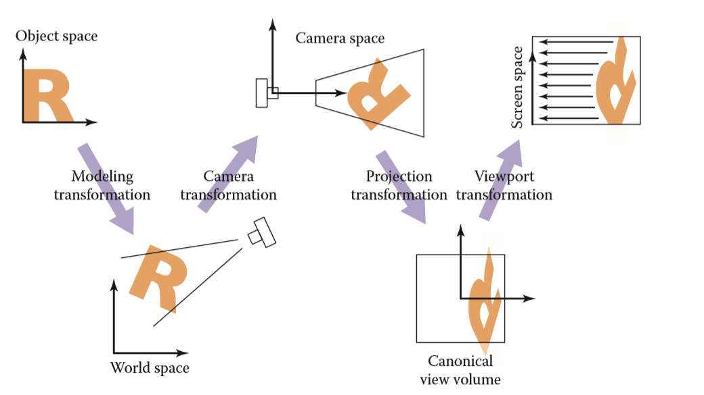

上图的4个箭头分别对应了上文所讲述的4个具体步骤，接下来我们就具体讲解这4个步骤到底做了什么。

## 1 模型变换(modeling transformation)

关于模型变换其实在开头部分便已经讲清楚了，就是利用基础的变换矩阵将世界当中的物体调整至我们想要的地方(旋转，平移，缩放)。

## 2 摄像机变换(camera tranformation)

Camera transformation属于比较复杂的一部分，但其实一但掌握了套路，也十分容易理解，希望我的解释能够帮助到你。

正如上文所说摄像机变换的目的是得到所有可视物体与摄像机的相对位置，怎么得到？非常直观的一步，我们把物体和摄像机一起做移动，如果能够把摄像机的坐标轴(假设为u,v,w 分别对应原世界空间中的x,y,z)移动到标准的x，y，z轴，那么此时物体的坐标不自然便是相对坐标了吗！

因此核心问题就变成了如何表示或者说如何将camera的坐标系与原世界坐标系重合呢？我们先定义3个东西

**相机或眼睛位置 (eye postion) e**  
**观察方向 (gaze postion) g**  
**视点正上方向 (view-up vector ) t**

有了这三者定义之后，我们便可以建立摄像机坐标系了，定义如下：  
  
其中u，v，w分别对应标准坐标系下的x，y，z，示意图如下：  

(tips:这里为什么不直接拿 t 当做基底向量是因为摄像机的头可能是歪着看的，就像图中一样 )

如此成功建立摄像机坐标系之后，如何将其移动到原世界坐标系呢？

**1 将相机位置移动至原点**  
**2 通过旋转矩阵将二者坐标系重合**

第一步只需简单的减去相机位置坐标 e 即可，而第二步也曾在[计算机图形学一：基础变换矩阵总结(缩放，旋转，位移)](https://blog.csdn.net/qq_38065509/article/details/105156501)就以讲过，只需用 ( u , v , w ) T (u,v,w)^T (u,v,w)T矩阵便可轻松表示将摄像机坐标系旋转至世界坐标系了，如果不理解的读者请移步其中2.2节花个1,2分钟读一下就能明白！

相信到这整个摄像机变换的过程已经十分清楚了，我们定义该变换矩阵为 M c a m M\_{cam} Mcam定义如下：  

（本文中所有矩阵都是左乘），最右边的矩阵代表第一步操作移至原点，旁边那个矩阵则代表第二步操作将坐标系重合。

tips：这里用了齐次坐标系表示！

## 3 投影变换(projection tranformation)

投影变换时除了摄像机之外另外一个重点，在经过摄像机变换之后得到的依然时三维空间中的顶点坐标，如何将其映射至二维空间坐标就交给投影变换完成。正如我们所熟知的那样投影又主要分为正交投影和透视投影，依次介绍

### 3.1 正交投影变换(Orthographic Projection Transformation)

正交投影是相对简单的一种，坐标的相对位置都不会改变，所有光线都是平行传播，我们只需将物体（可视部分，即上图的那个长方体）全部转换到一个 \[ − 1 , 1 \] 3 \[-1,1\]^3 \[−1,1\]3的空间之中即可（其中x，y坐标便是投影结果，保留z是为了之后的遮挡检测）

**tips：这里可能会有读者疑问，为什么要压缩到一个小立方体呢？其实这只是为了之后的计算更加的方便而已，在转换到屏幕坐标的时候就会重新拉伸回来，不必太做纠结，只需抓住正交投影的变化核心是，所有物体的相对大小位置都不会有任何变化。**

先定义可视空间如上图所示，其中：  
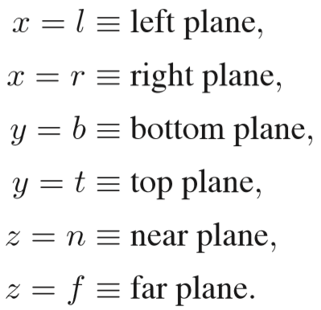  
如何将这么一个范围转换为 \[ − 1 , 1 \] 3 \[-1,1\]^3 \[−1,1\]3的空间呢，这其实就是一个空间的缩放，具一个简单的二维例子从 \[ x l , y l \] ∗ \[ x h , y h \] → \[ x l ′ , y l ′ \] ∗ \[ x h ′ , y h ′ \] \[x\_l,y\_l\]\*\[x\_h,y\_h\]\\rightarrow\[x\_l^{\\prime},y\_l^{\\prime}\]\*\[x\_h^{\\prime},y\_h^{\\prime}\] \[xl,yl\]∗\[xh,yh\]→\[xl′,yl′\]∗\[xh′,yh′\]：  
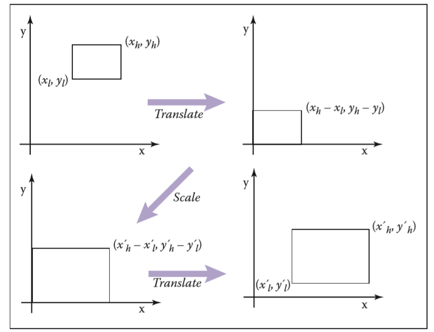  
图示已然很清晰，是一个更加通用的例子，从任意一个范围转换到任意一个范围，同样也是分三步

**1 将原空间范围的左下角移至原点**  
**2 放大给定倍数**  
**3 将缩放后的空间范围移至新空间范围**  
这样一个general的二维例子用矩阵来表示就是这样：  
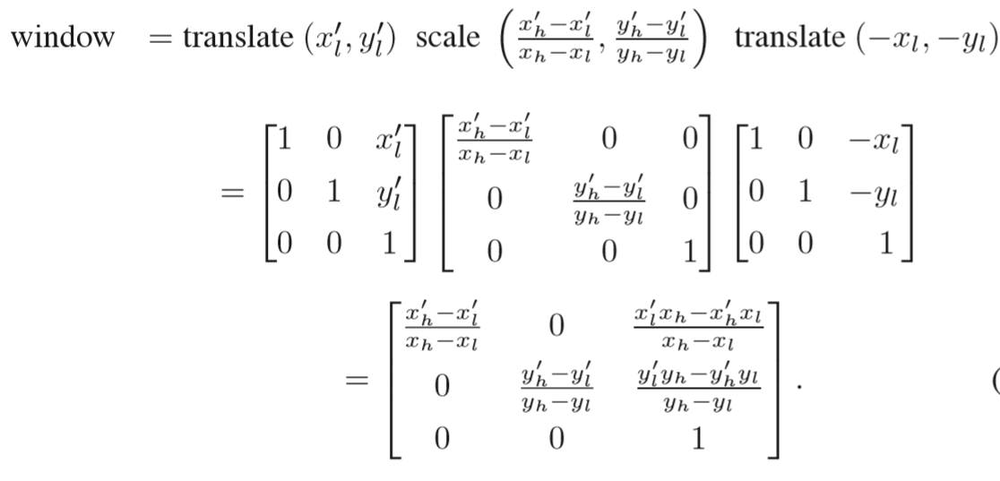  
是不是非常直观呢，当然也可以非常简单的推广到三维，即 \[ x l , y l \] ∗ \[ x h , y h \] ∗ \[ z l , z h \] → \[ x l ′ , y l ′ \] ∗ \[ x h ′ , y h ′ \] ∗ \[ z l ′ , z h ′ \] \[x\_l,y\_l\]\*\[x\_h,y\_h\]\*\[z\_l,z\_h\]\\rightarrow\[x\_l^{\\prime},y\_l^{\\prime}\]\*\[x\_h^{\\prime},y\_h^{\\prime}\]\*\[z\_l^{\\prime},z\_h^{\\prime}\] \[xl,yl\]∗\[xh,yh\]∗\[zl,zh\]→\[xl′,yl′\]∗\[xh′,yh′\]∗\[zl′,zh′\]：这里不给出计算过程，直接给出最后变换矩阵  
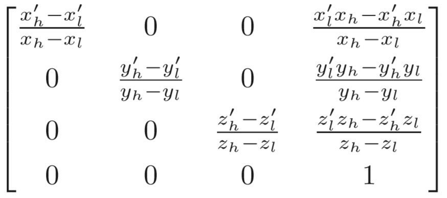

这样得到了一个general的变换矩阵之后，正交投影变换只需将相应的数据带入即可，定义正交变换矩阵 M o r t h M\_{orth} Morth如下：  
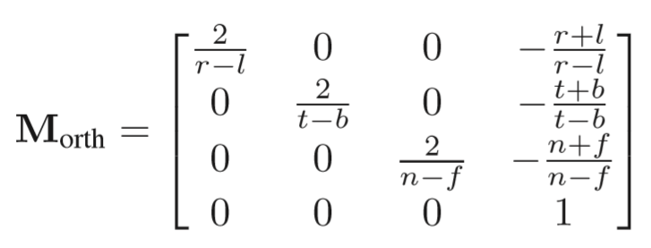

### 3.2 透视投影变换(Perspective Projection Transformation)

  
透视投影就是最类似人眼所看东西的方式，遵循近大远小，如果说正交投影都是水平光线，那么透视投影则显然不是了(左透视，右正交)  
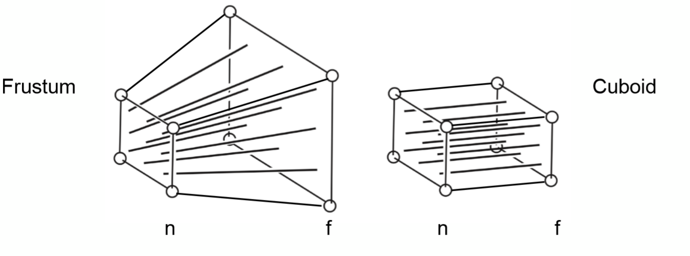

此时，投影过程可用下图解释，将 ( x , y , z ) (x,y,z) (x,y,z)一点投影至投影屏幕之后，他的坐标变为 ( x ′ , y ′ , z ′ ) (x^{\\prime},y^{\\prime},z^{\\prime}) (x′,y′,z′)  
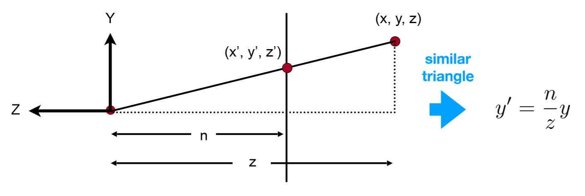  
图中原点代表视点，z = -n代表投影平面，利用相似三角形性质不难得出图中投影之后的坐标

那么利用齐次坐标的性质，希望找到一个矩阵完成如下变换：  
  
即：  
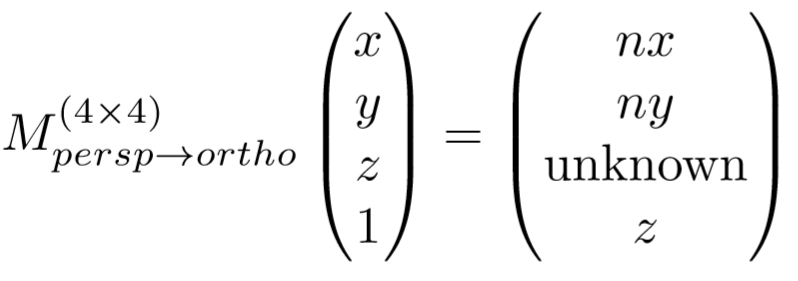  
（如果形象化的描述一下的话，就是利用这个变换矩阵将整个空间压缩了一下，使其对应了真正透视投影的坐标，最后不要忘了要利用正交转换到 \[ − 1 , 1 \] 3 \[-1,1\]^3 \[−1,1\]3的空间之内)

首先，这个矩阵的前两行和最后一行是能很快确定出来的，根据最后的齐次坐标，如下：  
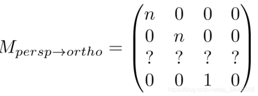  
那么如何确定第三行呢，这里就要运用透视投影的一个性质：

**可视空间，即本节第一张图的Frustum的前后面变换之后z坐标不变**

- Any point on the near plane will not change
- Any point’s z on the far plane will not change

设第三行为(0,0,A,B) ,利用这个性质分别代入远近平面的任意两点就可以列出两个等式  
A n + B = n 2 An + B = n^2 An+B\=n2  
A f + B = f 2 Af + B = f^2 Af+B\=f2  
容易解出 A = n + f A = n + f A\=n+f, B = − n f B = -nf B\=−nf。

得最后变换矩阵为  
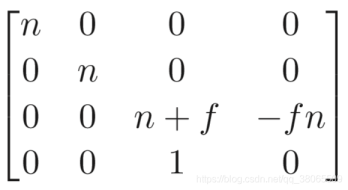  
最后的一步，将这个被压缩过的空间，重新正交投影成标准小立方体，故定义透视投影变换 M p e r M\_{per} Mper如下

M p e r = M o r t h o M p e r s p → − o r t h o \\large{M\_{per} = M\_{ortho}M\_{persp\\rightarrow-ortho}} Mper\=MorthoMpersp→−ortho

其中两个矩阵都已再上文定义过。计算结果如下：  
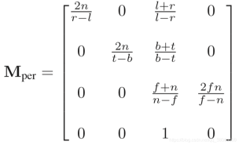

## 4 视口变换(viewport transformation)

这一步就很简单了，一开始也介绍过就是两个范围空间的转换 \[ − 1 , 1 \] 2 → \[ 0 , w i d t h \] ∗ \[ 0 , h e i g h t \] , \[-1,1\]^2\\rightarrow\[0,width\]\*\[0,height\], \[−1,1\]2→\[0,width\]∗\[0,height\],在正交变换一节已详细解释清楚，这里直接套公式即可  

呼~  
至此历经上述4个变换，我们就已经成功的把游戏世界的任意可视物体转换到屏幕上了！回顾一下，其实也不是很难，只要分清步骤就会十分清晰。

**总结：变换 M = M v i e w M p e r M c a m M m o d e l \\large{M = M\_{view}M\_{per}M\_{cam}M\_{model}} M\=MviewMperMcamMmodel**

### 重心坐标（Barycentric Coordinates）

- [1 重心坐标的定义及求解](https://blog.csdn.net/qq_38065509/article/details/105446756#1__5)
- - [1.1 基础定义](https://blog.csdn.net/qq_38065509/article/details/105446756#11__6)
    - [1.2 几何面积角度求解](https://blog.csdn.net/qq_38065509/article/details/105446756#12__13)
    - [1.3 坐标系角度求解](https://blog.csdn.net/qq_38065509/article/details/105446756#13__35)
- [2 重心坐标的运用](https://blog.csdn.net/qq_38065509/article/details/105446756#2__51)
- [Reference](https://blog.csdn.net/qq_38065509/article/details/105446756#Reference_61)

(本篇文章同步发表于知乎专栏：[https://zhuanlan.zhihu.com/p/144360079](https://zhuanlan.zhihu.com/p/144360079) 欢迎三连关注)

本节会详细介绍重心坐标的定义以及解法,并简略的提及重心坐标在图形学中的运用(具体的运用会在之后的笔记中给出)

# 1 重心坐标的定义及求解

## 1.1 基础定义

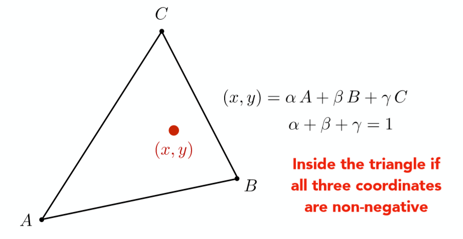

给定三角形的三点坐标A, B, C，该平面内一点(x,y)可以写成这三点坐标的线性组合形式，即 ( x , y ) = α A + β B + γ C (x,y) = \\alpha A+\\beta B+ \\gamma C (x,y)\=αA+βB+γC 且满足 α + β + γ = 1 \\alpha + \\beta + \\gamma=1 α+β+γ\=1 则称此时3个坐标A,B,C的权重 α , β , γ \\alpha, \\beta ,\\gamma α,β,γ为点 ( x , y ) (x,y) (x,y)的重心坐标。

（特别的，如图中所说的，如果该点在三角形内部则三点坐标都为非负数，我们会在1.3节给出简要的叙述。）

## 1.2 几何面积角度求解

除却1.1节中重心坐标的基础定义之外，重心坐标还有一个另外一个角度的等价定义，如下图：

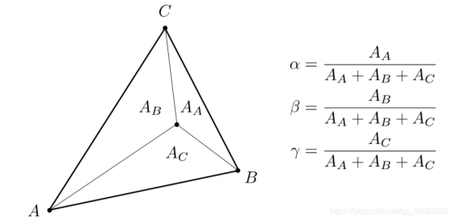  
将一点(x,y)与A,B,C三点直接连接，构成三个三角形面积分别为 A A , A B , A C A\_A,A\_B,A\_C AA,AB,AC,即可直接定义出重心坐标如图中公式所示。

(tips：如果这个点在某个边的外侧，那么该点与这条边构成的三角形面积计算为负值(不想深究的读者可暂时忽略这条tips))

好了根据这条定义，我们只需求出各个三角形的面积便可以直接得出重心坐标了！

我们已知图中4点坐标，那么求出面积自然是很简单的，这里利用行列式的几何意义直接求解，即任意2个2维向量组合成矩阵的行列式的绝对值，为这两条向量所围成平行四边形的面积 (如果对行列式几何意义不清楚的话建议前往B站搜索3B1B的线代本质)。设任意一点为P(x,y)，则由：

**A B = ∣ A P , A C ∣ A\_B = |AP,AC| AB\=∣AP,AC∣, 其中AP,AC为列向量 符号||为行列式**  
**A C = ∣ A B , A P ∣ A\_C=|AB,AP| AC\=∣AB,AP∣**  
**A A = ∣ B C , B P ∣ A\_A = |BC,BP| AA\=∣BC,BP∣**

此处省略行列式计算步骤，不难得出  
  

注意，求出其中2个之后第三个可以根据性质直接求出。

## 1.3 坐标系角度求解

针对重心坐标系的另外一种等价视角便是，以A点为原点，AB,AC分别为新的坐标系的单位向量构建坐标系，如图所示：  
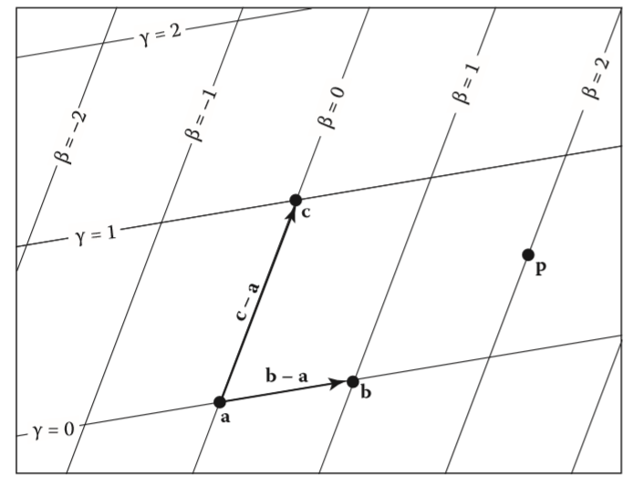

其中给定任意点P的坐标可以用 β , γ \\beta,\\gamma β,γ来表示，即 P ( β , γ ) P(\\beta,\\gamma) P(β,γ),不难得出，P点坐标在原坐标系中的位置满足：  
  
进一步化简得到：  
  
到这里其实就可以发现，我们已经成功的把P用三角形的三个顶点的线性组合表示了，并且3个权重之和为1，完全符合定义，因此这是一种完全等价的角度！

从这种角度出发，我们完全可以将上式表现成一个线性方程组来求解出 β , γ \\beta,\\gamma β,γ，两个未知量，两个式子，如下：  
  
解出该方程组的解其实与1.2节中面积的角度式完全一样的，不在这里展开。

最后我们看一下在1.1节所说的3个重心坐标都是非负的时候，点一定在三角形内，你是否可以从本节的坐标系角度之中直接看出呢？

# 2 重心坐标的运用

重心坐标在图形学中最重要的运用便是插值，他可以根据三个顶点A,B,C的属性插值出任意点的属性，无论是位置，颜色，深度，法线向量等等，而这些属性在之后的着色或是消除隐藏曲面都有很大的作用。这里只举一个在[计算机图形学三：光栅化1(直线的数值微分算法,中点Brensenham算法, 三角形的光栅化](https://blog.csdn.net/qq_38065509/article/details/105418437)中所提到的光栅化三角行的具体运用，即判断一个点是否在三角形内，完全可以用本节的重心坐标是否都大于0来代替之前的叉乘(其实二者一定程度上是等价的)。利用该条件来进行sample 再判断是否画出该像素。

这里还有一个小问题上一节中没有提到就是，如果一个点正好处于两个三角形的公共边之上那么，这个点该算作是哪个三角的呢  
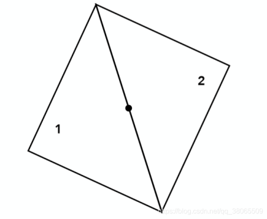  
答案是只要你自己规定好就行，无所谓算哪个三角形的！

在虎书（Fundamentals of Computer Graphics 4th）中作者利用了取任意屏幕外一点判断该公共边所对应的点是否与该点处于公共边同一侧来判断这个点的归属。具体可以参考虎书的8.1节

最后如果本文对你有帮助求点赞求收藏求一个大大的关注 😃，后序会持续更新，感谢阅读！