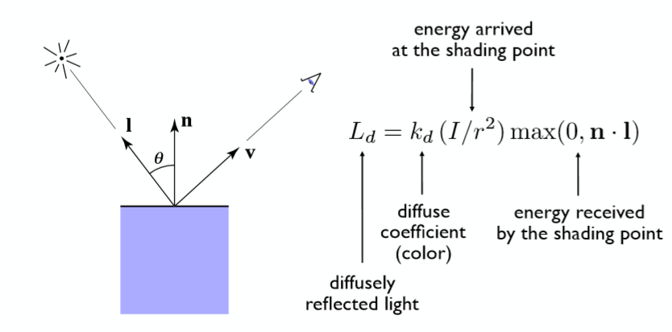
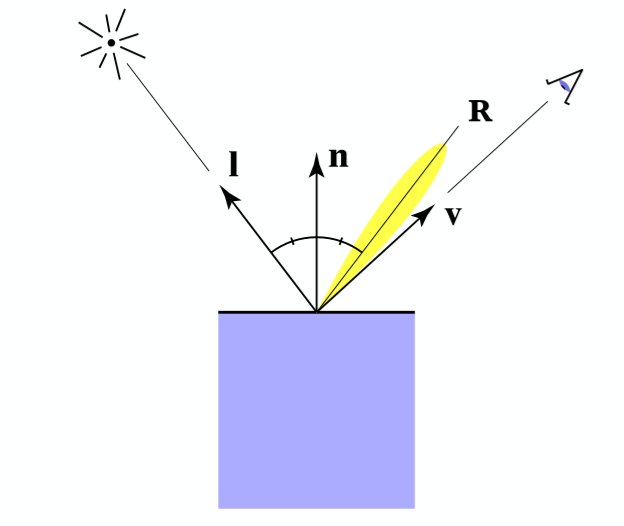
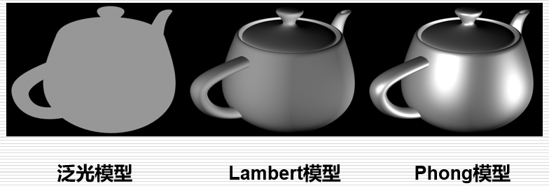
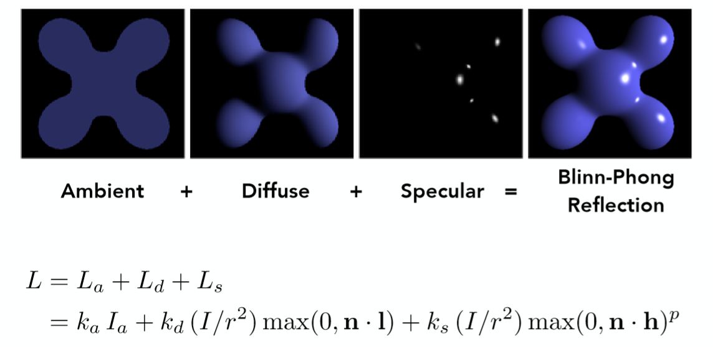
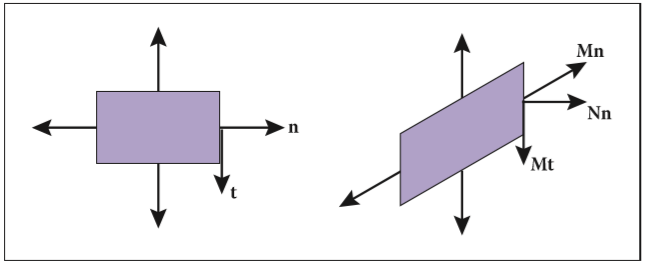

### 光照模型

- [1 我们为何能够看到物体？](https://blog.csdn.net/qq_38065509/article/details/105691559#1__5)
- [2 泛光模型](https://blog.csdn.net/qq_38065509/article/details/105691559#2__18)
- [3 Lambert漫反射模型](https://blog.csdn.net/qq_38065509/article/details/105691559#3_Lambert_27)
- [3 Phong反射模型](https://blog.csdn.net/qq_38065509/article/details/105691559#3_Phong_49)
- [4 Blinn-Phong反射模型](https://blog.csdn.net/qq_38065509/article/details/105691559#4_BlinnPhong_60)
- [5 着色方法(频率)](https://blog.csdn.net/qq_38065509/article/details/105691559#5__70)
- - [5.1 Flat Shading](https://blog.csdn.net/qq_38065509/article/details/105691559#51_Flat_Shading_72)
    - [5.2 Gouraud Shading](https://blog.csdn.net/qq_38065509/article/details/105691559#52_Gouraud_Shading_77)
    - [5.3 Phong Shading](https://blog.csdn.net/qq_38065509/article/details/105691559#53_Phong_Shading_92)
- [Note：变换法线向量](https://blog.csdn.net/qq_38065509/article/details/105691559#Note_99)
- [总结](https://blog.csdn.net/qq_38065509/article/details/105691559#_117)
- [Reference](https://blog.csdn.net/qq_38065509/article/details/105691559#Reference_123)

(本篇文章同步发表于知乎专栏：[https://zhuanlan.zhihu.com/p/144331612](https://zhuanlan.zhihu.com/p/144331612) 欢迎三连关注)

到了这一部分，我们就开始进入到着色（shading）的环节了，简单来说shading就是计算出每个采样像素点的颜色是多少。本文所要介绍的是局部光照模型，并不是真正准确的模型，但是优点是计算快，效果可以接受，至今依然广泛的运用在各种游戏之中。具体会从最基础的泛光模型，Lambert漫反射模型，再到Phong反射模型，Blinn-Phong反射模型一步步推进详细详解我们如何得到一个局部光照模型。

# 1 我们为何能够看到物体？

在进入具体模型讲解之时，我们以该章标题的问题作为一个开始，其实问题的答案我想大家都知道，**之所以物体能被我们观察，是因为人眼接收到了从物体来的光。** 没错，这其实也就是局部光照模型的基础，可以具体看看究竟有几种类型光线能从物体到人眼呢？  
  
如上图，可以先将光线**简单**的分为3类：

**1\. 镜面反射**  
**2\. 漫反射**  
**3\. 环境光**

好，明白以上分类之后我们便进行具体模型的讲解！

(Note：本文中光强，光的亮度，光的能量皆指同一个概念，目前阶段暂不做区分，另外所有**方向向量都为单位向量**）

# 2 泛光模型

第一个， 泛光模型即只考虑环境光，这是最简单的**经验**模型，只会去考虑环境光的影响，并且不会去精确的描述，而只是用一个简单的式子表示  
  
其中 K a K\_a Ka代表物体表面对环境光的反射率， I a I\_a Ia代表入射环境光的亮度， I e n v I\_{env} Ienv存储结果，即人眼所能看到从物体表面反射的环境光的亮度。效果如下：  
  
没错，泛光模型只能让我们看到一个物体的平面形状，怎么能够有体积感呢，这就要添加漫反射了，即Lambert漫反射模型。

（tips：其中反射率还是光的亮度都是一个3维的RGB向量，为什么一个物体能够有颜色，其实就是它吸收了一定颜色的光，将剩下的光反射出来，也就有了颜色）

# 3 Lambert漫反射模型

所谓Lambert漫反射模型其实就是在泛光模型的基础之上增加了漫反射项。漫反射便是光从一定角度入射之后从入射点向四面八方反射，且每个不同方向反射的光的强度相等，而产生漫反射的原因是物体表面的粗糙，导致了这种物理现象的发生。  
  
这种漫反射我们该去怎么模拟呢？首先应该考虑入射的角度所造成的接收到光强的损失，如下图所示：  
  
只有当入射光线与平面垂直的时候才能完整的接受所有光的能量，而入射角度越倾斜损失的能量越大，具体来说，我们应该将光强乘上一个 c o s θ = l ⋅ n cos\\theta = l \\cdot n cosθ\=l⋅n，其中 l l l是入射光方向， n n n为平面法线方向。

好了！除了入射角度之外，光源与照射点的距离也应该考虑，直观来说，离得越远当然强度也就越弱！具体来说如图所示：  
  
图中中心为一个点光源，光线均匀的向周围发射，可以想象光源发射出来的能量其实是一定的，那么在任意两个圈上接受到的能量之和一定相等。而离圆心越远，圆的面积越大，单位面积所接受能量也就越弱，因此会将光强 I I I 除上一个 r 2 r^2 r2。

OK，如此我们便可以**较为正确**的去模拟漫反射了！如下式：  
  
其中 k d k\_d kd为漫反射系数， I I I入射光强， n , l n,l n,l分别如图中所示为法线向量和入射方向，max是为了剔除夹角大于90°的光。  
注意漫反射光线强度是与出射方向无关的，因此无论人眼在哪观察接收到的强度都是一样的！  
将环境光与漫反射一起考虑之后：  
  
因为漫反射的存在我们已经能够很明显的看出茶壶的体积感了，但依然感觉不是很真实，因为缺少了高光！即镜面反射，下一节将介绍在Lambert模型之内再加入镜面反射，从而得到Phong模型！

(tips：通过改变漫反射模型的3维反射系数 k d k\_d kd，我们就能够得到物体表面不同的颜色)

# 3 Phong反射模型

相信所有读者都对镜面反射十分了解，这是我们从小学就知道的物理知识了！如图所示 R R R为镜面反射方向, v v v为人眼观察方向。  
  
除了考虑漫反射中提到的光源到反射点的距离 r r r之外，需要注意的是，观察方向在镜面反射时是很重要的，具体来说，只有当观察方向集中在反射方向周围很近的时候才能看见反射光，因此在镜面反射中会考虑 R R R 与 v v v 的夹角 α \\alpha α。如下式：  
  
其中 k s k\_s ks为镜面反射系数， I I I为入射光强， r r r为光源到入射点距离，注意这里在max剔除大于90°的光之后，我们还乘了一个指数p，添加该项的原因很直接，因为离反射光越远就越不应该看见反射光，需要一个指数p加速衰减  
  
最后我们把环境光，漫反射光，镜面反射光全部累加得到Phong模型效果：  
  
可以看出，此时模型其实已经非常接近真实效果了！那么Blinn-Phong反射模型是什么呢？它只是对phong模型计算反射方向与人眼观察方向角度的一个优化！

# 4 Blinn-Phong反射模型

如上文所提，我们将反射方向与人眼观察方向夹角替换成如下图所示的一个半程向量和法线向量的夹角  
  
这样的得到的结果其实是与真实计算反射与人眼观察夹角的结果是非常近似的(具体来说该角度是正确角度的一半)，但好处在于大大加速了角度计算的速度，提升了效率！

读者可以自己试试计算半程向量与反射向量谁快（加法次数，乘法次数比较）  
(tips:反射向量可由入射方向在法线方向投影的两倍减去入射方向得出)

整体计算公式：  

# 5 着色方法(频率)

在上文中我们讲解完了局部光照模型，其中主要利用了观察方向，入射光线与法线向量的位置关系，但并没有具体说究竟是三角形面的法线向量还是三角形顶点的法线向量，这也就牵扯出了本章内容——着色频率（面着色，顶点着色，像素着色），这3种不同的着色频率其实也就对应了三种不同方法。接下来一一介绍

## 5.1 Flat Shading

面着色，顾名思义以每一个面作为一个着色单位。模型数据大多以很多个三角面进行存储，因此也就记录了每个面的法线向量，利用每个面的法线向量进行一次Blinn-Phong反射光照模型的计算，将该颜色赋予整个面，效果如下：  
  
Flat Shading 虽然计算很快，只需对每一个面进行一次着色计算，但是效果确是很差的，可以很明显的看到一块块面形状。因此一种改进方法就是对三角形面的每个顶点进行着色，再对三角形面内的颜色插值，即Gouraud Shading。

## 5.2 Gouraud Shading

Gouraud Shading会对每个三角形的顶点进行一次着色，那么首当其冲的问题便是，我们只有每个面的法线向量，如何得到每个顶点的法线向量呢。做法其实很简单，将所有共享这个点的面的法线向量加起来求均值，最后再标准化就得到了该顶点的法线向量了。

有了每个三角形的顶点向量之后，自然就可以计算出每个顶点的颜色了，那么对于三角形内部的每一个点应该怎么办呢？对，就是利用我们在[计算机图形学三](https://blog.csdn.net/qq_38065509/article/details/105446756)中所提到了重心坐标来插值了！公式如下：  
  
其中 c 0 , c 1 , c 2 c\_0,c\_1,c\_2 c0,c1,c2为三角形三个顶点的颜色， α , β , γ \\alpha,\\beta,\\gamma α,β,γ为三角形面内一点的重心坐标， c c c为该点的插值之后得到的颜色。

这样就能成功的得到每一个点的颜色了，效果如下：  
  
可以明显看出相对于Flat Shading，Gouraud Shading的效果有着明显的提升，但这样依然还不是最好的做法，因为我们实际上只对每个三角形顶点进行了着色，然后其它的颜色都是通过插值得到，有没有一种做法可以真正的对每个点用Blinn-Phong模型计算得出颜色呢？没错，那就是Phong Shading了！

**(tips:1.这里有两个tips可以注意一下，首先重心坐标一定要是原世界坐标空间中的重心坐标，但实际计算中一般会使用投影之后的二维平面来计算重心坐标，存在着一个误差需要校正，这会在下一节笔记中展开来谈。  
2\. 第二点，其实按理来说Gouraud用的是双线性插值(会在之后的贝塞尔曲线中具体讲解)，但是道理都是相同的，本文这里为了方便就直接用了重心坐标插值）**

## 5.3 Phong Shading

Phong Shading的做法其实也是很好理解的，既然要对每个点都进行光照计算，那么自然我们应该要有每个点的法线向量才可以，在第2章中，我们提到了如何得到每个顶点的法线向量，那么对于三角形内部的每一个点的法线向量自然也可以像插值颜色一般得到：  
  
其中 n 0 , n 1 , n 2 \\mathbf{n\_0},\\mathbf{n\_1},\\mathbf{n\_2} n0,n1,n2分别是三角形三个顶点的法线向量， α , β , γ \\alpha,\\beta,\\gamma α,β,γ为三角形面内一点的重心坐标， n \\mathbf{n} n为该点插值之后得到的法线向量。如此便得到了任意一点的法线向量了，也当然可以对任意一点进行Blinn-Phong模型的计算了。最终对比渲染效果如下：  
  
可以明显看出Phong Shading对于高光的显示相比于Gouraud Shading是更真实的。有一点的要注意的是，这里所有的茶壶所使用的都是一个低精度模型，这点可以从Flat Shading的结果可以看出，面片是有限的，那么如果随着模型精度的提升，各种shading type又会有怎样的区别呢，这里给出一幅大图供读者思考  

# Note：变换法线向量

有的读者可能会疑问，法线向量不是一直存在于世界坐标空间之中吗，为什么要去变换他呢，其实原因很简单，因为**模型变换**可能会导致模型位置形状发生改变，如果属于该模型的各个三角形面的法线向量不跟着改变的话，那么此时所记录的法线向量就是错误的。因此法线向量一定也要跟着模型本身发生改变。

那么是否简单的将作用在模型本身的变换也作用在对应的法线向量之上就可以了呢？答案是否定的，这也是为什么要在这里探讨这个问题，如下图所示，一个简单矩形经过一个剪切变换M之后：  
  
在经过一个简单的剪切变换之后，不难发现矩形右边的法线向量没有改变，如果此时简单的用变换矩阵 M ⋅ n M\\cdot n M⋅n得到的结果就是图中的所标注为**Mn**的向量，并不是与该面垂直的法线向量，那么对应的真正的变换矩阵应该是什么呢？  
首先定义 t M = M t t\_M = Mt tM\=Mt是该面上任意一向量变换之后的结果, n N = N n n\_N = Nn nN\=Nn表示经过变换之后正确的法线向量,即真正的对法线的变换矩阵为 N N N,目的就是求出这个N。作如下推导：

  
简单来说就是加入了 M − 1 M M^{-1}M M−1M做了一个恒等变换，但是可以把**Mt**单独提出来为 t M t\_M tM

  
到这一步就很明显了，什么向量与变换之后的原来面上的向量垂直呢？ **法线向量!** 即上式中的 n T M − 1 n^TM^{-1} nTM−1即为变换之后的法线向量的转置(转置是因为点乘的缘故)。进一步我们便可以找出 N N N是多少  
  
至此应该很轻松就能看出 N = ( M − 1 ) T N = (M^{-1}) ^T N\=(M−1)T了，推导结束！

# 总结

至此我们知道如何计算变换之后的法线向量，又知道了如何插值出每个点的法线向量，已经可以利用上节的Blinn-Phong模型渲染出相当质量的图形了，但还有一点正如文中的tips所提到的，那就是对重心坐标插值误差的一个纠正，这究竟是个什么问题呢，我们在下一节当中进行具体探讨！

最后如果本文对你有帮助求点赞求收藏求一个大大的关注 😃(如果没啥用就算了 😦)，后序会持续更新，感谢阅读！