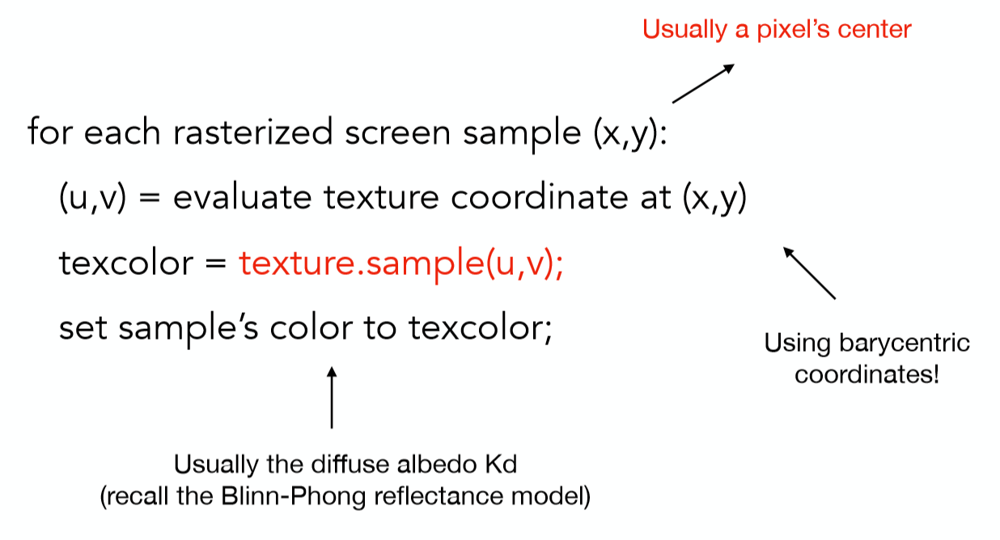
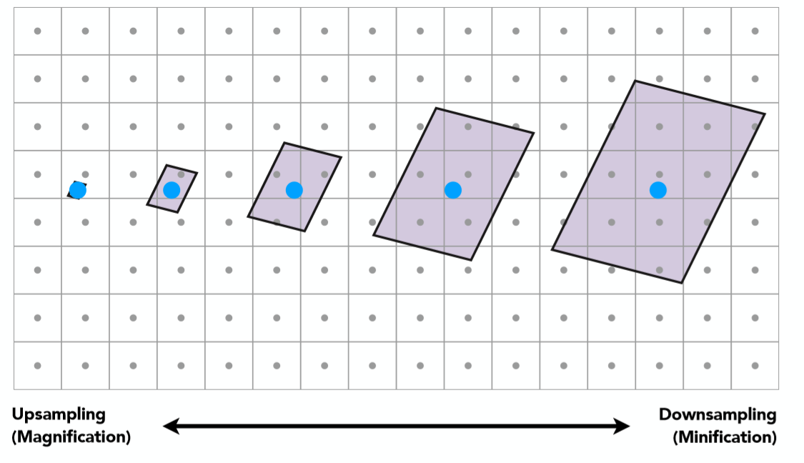
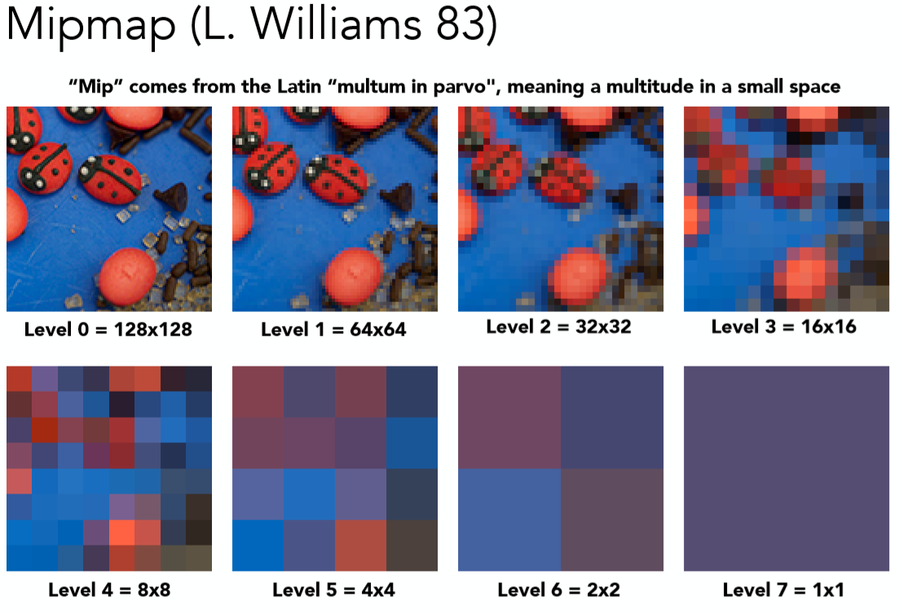
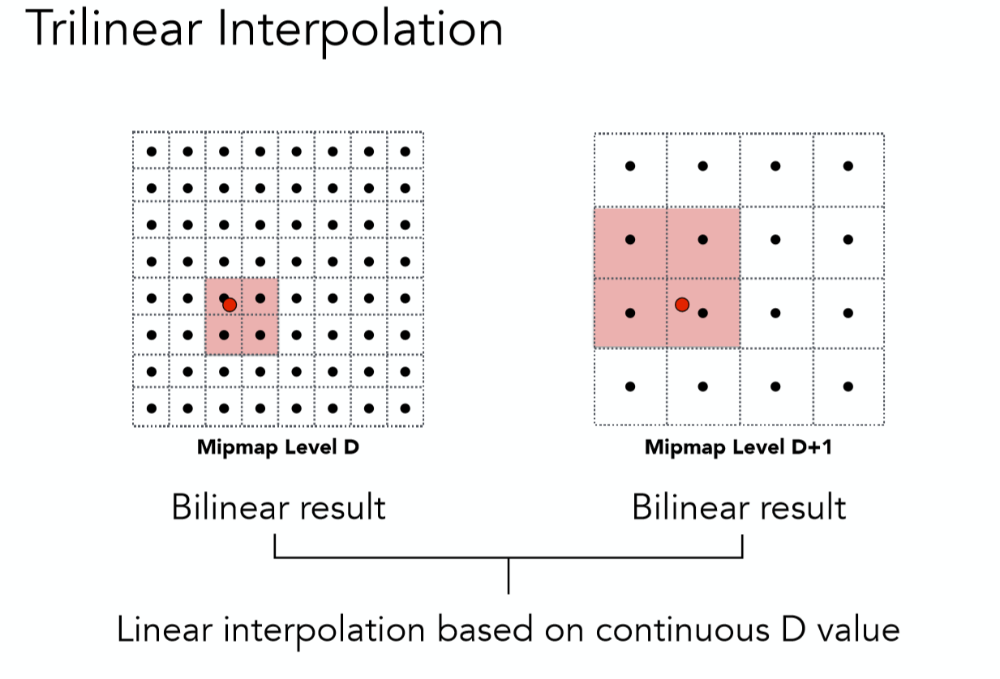
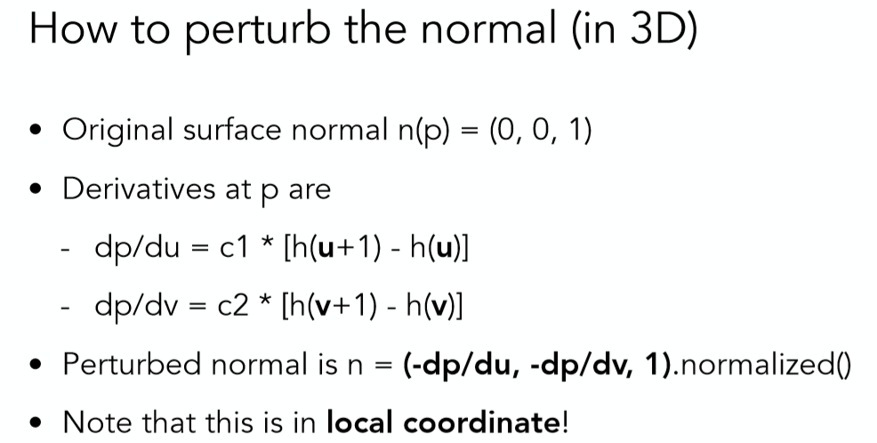
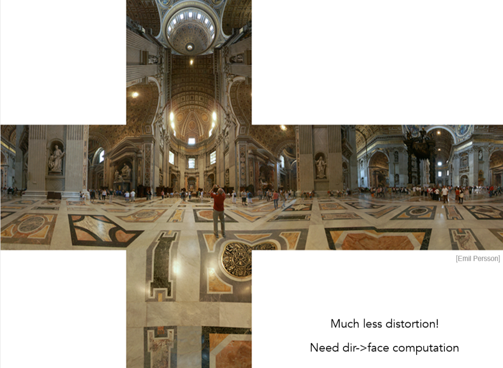
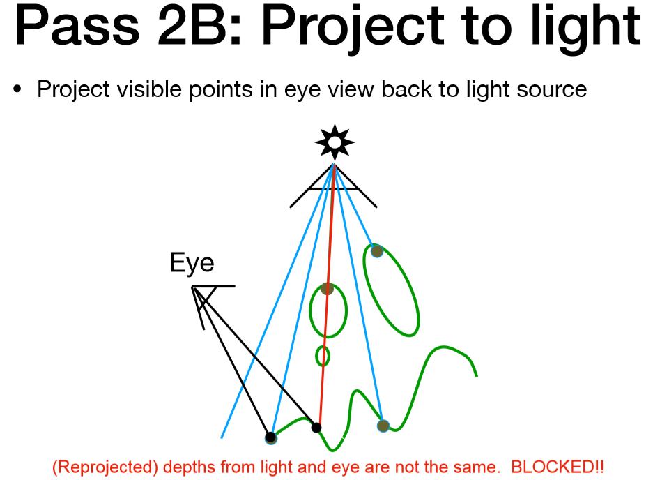

### 纹理映射及Mipmap技术

- [1 纹理映射(Texture Mapping)](https://blog.csdn.net/qq_38065509/article/details/105929046#1_Texture_Mapping_5)
- [2 纹理过小和纹理过大的问题及解决方案](https://blog.csdn.net/qq_38065509/article/details/105929046#2__33)
- - [2.1 纹理过小引发的问题](https://blog.csdn.net/qq_38065509/article/details/105929046#21__34)
    - [2.2 双线性插值(Bilinear Interpolation)](https://blog.csdn.net/qq_38065509/article/details/105929046#22_Bilinear_Interpolation_42)
    - [2.3 纹理过大引发的问题](https://blog.csdn.net/qq_38065509/article/details/105929046#23__59)
    - [2.3 Mipmap](https://blog.csdn.net/qq_38065509/article/details/105929046#23_Mipmap_79)
    - [2.4 各向异性过滤Mipmap](https://blog.csdn.net/qq_38065509/article/details/105929046#24_Mipmap_102)
- [总结](https://blog.csdn.net/qq_38065509/article/details/105929046#_116)
- [Reference](https://blog.csdn.net/qq_38065509/article/details/105929046#Reference_120)

(本篇文章同步发表于知乎专栏：[https://zhuanlan.zhihu.com/p/144332091](https://zhuanlan.zhihu.com/p/144332091) 欢迎三连关注)

在本篇文章中，我们会具体的讨论如何利用纹理映射让场景拥有丰富的颜色信息，以及纹理贴图精度大小所带来的问题，怎么去解决，最后将会介绍Bump Mapping和Displacement Mapping

# 1 纹理映射(Texture Mapping)

首先让我们一起来观察这样一张图：  
  
无论是球上的图案，以及地板的木头纹理都呈现出了不同的颜色信息，那么回想在讲解Blinn-Phong反射模型的时候曾提到，一个点的颜色是由其漫反射系数决定的，反射什么颜色的光，人眼就能看见什么颜色。那么针对上面这幅图，难道要去针对每一个点自己去设定一个颜色吗？还是说有什么更方便的方法呢？那便是**纹理映射**了！

我们可以将三维物体上的任意一个点都映射到一个2维平面之上，举一个简单例子，地球仪：  
  
倘若拥有从3维World space到2维Texture space的一个映射关系，那么只需要将每个点的颜色信息即漫反射系数存储在2维的Texture之上，每次利用光照模型进行计算的时候根据映射关系就能查到这个点的漫反射系数是多少，所有点计算完之后，结果就像最左边的screen space之中，整个Texture被贴在了模型之上。

有了Texture，有了映射关系，对渲染结果会有一个非常大提升，因为很多fancy的效果都可以通过texture的设计得到(当然这属于美术的活儿了，咱们用就行了)。可以看这样一个有点丑的例子。  
  
可以看到在利用texture渲染之后，这个独眼怪物丑的更有特点了。

好了，相信到这大家都对纹理映射了有了一个大概的了解，那么有了一张Texture之后，这种映射关系究竟是如何表示的呢？这就要从纹理坐标（UV）说起了。在纹理空间之内任意一个二维坐标都在\[0,1\]之内。如下图是一个可视化纹理坐标的结果:  
  
横轴和纵轴的最大值都为1，为什么整幅texture图可视化之后是红色和绿色呢？可以将(u,v)坐标的两点想象成red和green就能明白了。一幅Texture上的任意一点都可以用一个(u,v)坐标来表示(0<=u<=1,0<=v<=1),因此只需要在三维world space中每个顶点的信息之中存储下该顶点在texture space的(u,v)坐标信息，自然而然的就直接的得到了这种映射关系。至于一个顶点所对应在纹理空间的坐标是怎么得到的，这就并不是程序员们关心的了，美术大大们会帮我们最好的(当然读者有兴趣也可以自行搜集资料)。

有一种特殊的纹理称为tile，这种纹理的特征是重复拼接之后上下左右都是连续的，因此这种纹理可以复制很多张贴在墙面或地板上。  
  
一个具体的重复利用这种贴图的例子如下:  
  
最后给出一个纹理坐标使用的伪代码供参考:  
  
简而言之就是对每个光栅化的屏幕坐标算出它的uv坐标(利用三角形顶点重心坐标插值)，再利用这个uv坐标去查询texture上的颜色，把这个颜色信息当作漫反射系数Kd。

好了在理解了纹理映射的基础之后，考虑如果纹理精度特别小(reslution低)或者纹理精度特别大(reslution大)会分别引起什么问题呢？

# 2 纹理过小和纹理过大的问题及解决方案

## 2.1 纹理过小引发的问题

纹理过小的问题相对容易理解，想想我们把一张100x100的纹理贴图应用在一500x500的屏幕之上必然会导致走样失真，因为屏幕空间的几个像素点对应在纹理贴图的坐标上都是集中在一个像素大小之内。那么如果仅仅是使用对应(u,v)坐标在texture贴图下最近的那个像素点，往往会造成严重的走样。  
  
如图中红色点是屏幕空间下一像素所对应在texture空间中的点，会去选择离他最近的那个橙色框起来的点。

这种方法是不可取的，接下来会介绍利用双线性插值的方法缓解这种走样现象。

## 2.2 双线性插值(Bilinear Interpolation)

我们依然取上图的点作为例子，解释双线性插值。  
第一步，取出离红色点最近的4个黑色顶点，分别算出，该红色点在水平及竖直方向偏移的比率s,t，图示如下:  
  
接着先利用s，可以线性插值出如下图所示的u0，u1点的颜色值  
  
那么下一步相信读者也能猜到了，利用比例t，颜色值u0，u1插值出红色点的颜色值  
f ( x , y ) = l e r p ( t , u 0 , u 1 ) f(x,y) = lerp(t,u\_0,u\_1) f(x,y)\=lerp(t,u0,u1)  
如此这样利用两次线性插值，考虑到了所有4个点的颜色值，能够很好的缓解走样失真现象，并且计算速度较高。

(tips:还有一种插值方法叫做双三次插值(Bicubic),是利用三次方程来进行两次插值，效果可能更好，但是计算速度很低不在这里具体讨论了)

最后以一张闫老师课上的例子看看这3种方法效果的对比  
可能会看不太清。理解个意思就好

## 2.3 纹理过大引发的问题

可能对于我们的第一直觉来说，纹理小确实会引发问题，但是纹理大那不是更好吗，为什么会引发问题呢？但事实是纹理过大所引发的走样甚至会更加严重。  
想象一张很大的地板，在上面铺满了重复的方格贴图，我们所期望看到的结果应该是这样的：  
  
嗯，非常符合透视关系，不错，当然这只是一个参考。再来看看利用在第一章所提到的计算纹理颜色的伪代码来计算的结果呢：  
  
近处锯齿！远处摩尔纹！非常严重的走样现象，为什么会导致这样的一个现象呢？这里作者尝试给出自己的两种解释:

**1 如开头所说，地板上铺满了重复的方格贴图，根据近大远小，远处的一张完整的贴图可能在屏幕空间中仅仅是几个像素的大小，那么必然屏幕空间的一个像素对应了纹理贴图上的一片范围的点，这其实就是纹理过大所导致的，直观来说想用一个点采样的结果代替纹理空间一片范围的颜色信息，必然会导致严重失真！(从信号的角度来说就是，采样频率过低无法还原信号原貌)**

**2 换一种想法，考虑离相机很远的一个三角形面，假设该三角形面真正在纹理贴图上对应的一片区域有10个像素点。但是由于透视的关系，距离很远的三角形面投影到近平面时可能只有1个或2个像素点的大小(远远小于10个像素的原来大小)，那么这1个或2个像素采样texture的结果就要代表原来这个三角形面10个像素点的颜色信息，自然会导致失真！**

(tips:可能有读者一开始会疑惑(包括我也是)为什么1个屏幕空间像素点覆盖多个纹理空间像素就是纹理过大呢，想象一下纹理贴图大小500x500，屏幕空间100x100，将屏幕空间的像素点均匀分布在纹理空间之中，那么1个屏幕空间像素点所占的平均大小就是5x5=25个纹理空间像素，因此这就是纹理过大所导致的结果)  
  
这种现象被形象的成为屏幕像素在texture空间的footprint。如上图所示一个屏幕空间的蓝色像素点离相机越远，对应在texture空间的范围也就越大。其实也就是越来越欠采样，那么一种直观的解决方法就是Supersampling，如果一个像素点不足以代表一个区域的颜色信息，那么便把一个像素细分为更多个小的采样点不就可以解决这个问题了吗？对，确实是这样，可以看看如下图512x超采样的结果  
效果虽称不上完美但也极大缓解了走样现象，但问题是什么？计算量太大了，一个像素点被分为了512x512个采样点，计算量几乎多出了25万倍！这显然不是所希望看到的，并且随着屏幕空间的点离相机距离更远，更多的texels(纹理空间的像素)会在屏幕像素的一个footprint里面，会要更高的超采样频率。

那么另外一种想法，如果不去超采样，仅仅是求出每个屏幕像素所对应的footprint里所有texels的颜色均值呢？这也就是接下来所要介绍的著名的Mipmap技术了！

## 2.3 Mipmap

回顾一下屏幕像素在Texture空间里的footprint的这张图:  
  
正如上文所提，一个采样点的颜色信息不足以代表 “footprint”里一个区域的颜色信息，如果可以求出这样一个区域里面所有颜色的均值，是不是就是一种可行的方法呢？没错我们的目标就是从点查询Point Query迈向区域查询Range Query。但依然存在一个问题，从上图不难看出，不同的屏幕像素所对应的footprint size是不一样大小的，看下图这样一个例子：  
远处圆圈里的footprint必然比近处的要大，因此必须要准备不同level的区域查询才可以，而这正是Mipmap。  
level 0代表的是原始texture，也是精度最高的纹理，随着level的提升，每提升一级将4个相邻像素点求均值合为一个像素点，因此越高的level也就代表了更大的footprint的区域查询。接下来要做的就是根据屏幕像素的footprint大小选定不同level的texture，再进行点查询即可，而这其实就相当于在原始texture上进行了区域查询！

那么如何去确定使用哪个level的texture呢？利用屏幕像素的相邻像素点估算footprint大小再确定level D！如下图:  
在屏幕空间中取当前像素点的右方和上方的两个相邻像素点(4个全取也可以)，分别查询得到这3个点对应在Texture space的坐标，计算出当前像素点与右方像素点和上方像素点在Texture space的距离，二者取最大值，计算公式如图中所示，那么level D就是这个距离的log2值 (D = log2L) ! 这不难理解，读者可以具体取几个例子比如L = 1，L = 2，L = 4，看看是否符合这样的计算即可。

但是这里D值算出来是一个连续值，并不是一个整数，有两种对应的方法：

**1 四舍五入取得最近的那个level D**  
**2 利用D值在 向下和向上取整的两个不同level进行3线性插值**

第一个方法很容易理解，具体讲述一下第二个方法，如图:  
  
所谓3线性插值，就是在向下取整的D level上进行一次双线性插值(前文提过)，再在D+1 level之上进行一次双线性插值，这二者数据再根据实际的连续D值在向下和向上取整的两个不同level之间的比例，再来一次线性插值，而这整体就是一个三线性插值了。

好了！根据上述的方法算出屏幕上每一个像素点所对应的Mipmap level，再进行三线性插值得到颜色值，是否就能很好的解决走样问题了呢？很遗憾，在本文的那个地板的例子之中，费了这么大力气依然不能完美解决，如下图结果:  
虽然和一开始的point sample有了很大的进步，但是有一个严重的问题是，远处的地板产生一种过曝的现象，完全糊在了一起。该如何解决这个最后的问题呢——各向异性过滤。

## 2.4 各向异性过滤Mipmap

好，接着上文的远处产生过曝的问题继续来谈，产生这种现象的原因是因为，所采用的不同level的Mipmap默认的都是正方形区域的Range Query，然而真实情况并不是如此，见下图:  
  
可以看出不同screen space的像素点所对应的footprint是不同的，有长方形，甚至是不规则图形，那么针对这种情况，有的所需要的是仅仅是水平方向的高level，有的需要的仅仅是竖直方向上的高level，因此这也就启发了各向异性的过滤:  
（个人感觉，应该是要算出水平方向的level D0，再算一个竖直方向的level D1，然后算根据这两个level去各项异性过滤的texture里面找一张最合适的)

利用这样不同的贴图，更加精细的选择后结果就会明显好很多:

  
可以看出，远处过曝的现象已经大大减少了。

(Note:其实各向异性过滤并不能解决 diagonal的footprint，因为各向异性只能解决水平或竖直的不同大小的矩形footprint，所以针对diagonal的footprint,一般是去sample更多的点，或者提前算好diagonal 过滤的texture)

# 总结

纹理映射的一些基础概念和做法个人感觉还是比较容易理解的，难的是后序的纹理过大过小引发的问题，可能相对而言有些抽象，需要自己仔细思考思考，包括解决问题的一些方法Mipmaps，各向异性过滤什么的，希望能对大家的理解产生一点帮助吧！

### 纹理映射的应用

- [1 Normal Maps及切线空间](https://blog.csdn.net/qq_38065509/article/details/106050879#1_Normal_Maps_5)
- [2 Bump Maps](https://blog.csdn.net/qq_38065509/article/details/106050879#2_Bump_Maps_80)
- [3 Displacement Maps](https://blog.csdn.net/qq_38065509/article/details/106050879#3_Displacement_Maps_94)
- [4 Environment Maps](https://blog.csdn.net/qq_38065509/article/details/106050879#4_Environment_Maps_98)
- [5 阴影贴图Shadow Maps](https://blog.csdn.net/qq_38065509/article/details/106050879#5_Shadow_Maps_130)
- - [5.1 阴影贴图的原理及其缺陷](https://blog.csdn.net/qq_38065509/article/details/106050879#51__131)
- [总结](https://blog.csdn.net/qq_38065509/article/details/106050879#_167)
- [Reference](https://blog.csdn.net/qq_38065509/article/details/106050879#Reference_171)

(本篇文章同步发表于知乎专栏：[https://zhuanlan.zhihu.com/p/144357517](https://zhuanlan.zhihu.com/p/144357517) 欢迎三连关注)

在上一节内容中，我们详细介绍了纹理映射的概念，以及纹理贴图过大过小带来的种种问题与解决方案，但纹理映射的应用远不止单单作为diffuse的反射系数来表现出不同颜色。本文会详细介绍一些主要的纹理映射的应用及其原理，首先从法线映射和切线空间开始说起。

# 1 Normal Maps及切线空间

在Blinn-Phong光照模型中，法线向量扮演着重要的一环，不同的法线向量对光照的计算结果有着很大的影响，打个比方，倘若将一个高精度模型法线信息套用在低精度模型之上，会使低精度模型的渲染效果有着巨大的提升。

那么如何做到呢？我们知道Texture上可以存储3维的颜色信息作为漫反射系数，那么自然也就可以存储法线向量的信息！同样利用(u,v)坐标去查询每个点的法线向量，而不使用原来模型法线信息，达到各种不同的效果，这就是Normal Maps。

明白了Normal Maps的原理之后，有一点重要的是，如何在存储这些法线信息呢？一种可选的方法是，存储object space下的法线向量坐标(这会使得法线贴图看起来五颜六色的)，好处是取出来转换到世界坐标就可以直接使用，坏处是一但该法线向量的三角形面发生了变形，那么该法线向量就不再正确。这也就引出了第二种方法，存储切线空间之的法线向量坐标(这会使得法线贴图大部分呈蓝色，原因下文会提)。任何空间坐标系都要由3个互相正交的基底向量构成，切线空间也不例外，如下图所示：  
  
其z轴由原来该面上的几何法线n构成，指向物体表面的外侧。x，y轴分别由该面所对应的贴图上U,V增加的两个方向构成，称之为tangant轴和bitangent轴。这样我们称tangant轴（t）、bitangent轴（b）及法线轴（N）所组成的坐标系，即切线空间（tbn)。

法线向量N可以根据原来的模型信息得到，如何去计算t，b呢？  

如上图所示，记一个三角形的面的三个顶点分别为p0,p1,p2，并且使用(ui,vi)来表示对应顶点的texture坐标，那么根据顶点坐标的差值，纹理坐标的差值，以及t,b两轴，可以得到如下关系  
p i − p j = ( u i − u j ) t + ( v i − v j ) b \\boldsymbol{p}\_{i}-\\boldsymbol{p}\_{j}=\\left(u\_{i}-u\_{j}\\right) \\mathbf{t}+\\left(v\_{i}-v\_{j}\\right) \\mathbf{b} pi−pj\=(ui−uj)t+(vi−vj)b  
为了进一步简化公式，设：  
e 1 = p 1 − p 0 , ( x 1 , y 1 ) = ( u 1 − u 0 , v 1 − v 0 ) e 2 = p 2 − p 0 , ( x 2 , y 2 ) = ( u 2 − u 0 , v 2 − v 0 )

e1\=p1−p0,e2\=p2−p0,(x1,y1)\=(u1−u0,v1−v0)(x2,y2)\=(u2−u0,v2−v0)e1\=p1−p0,(x1,y1)\=(u1−u0,v1−v0)e2\=p2−p0,(x2,y2)\=(u2−u0,v2−v0)

\\begin{array}{ll} \\mathbf{e}\_{1}=\\boldsymbol{p}\_{1}-\\boldsymbol{p}\_{0}, & \\left(x\_{1}, y\_{1}\\right)=\\left(u\_{1}-u\_{0}, v\_{1}-v\_{0}\\right) \\\\ \\mathbf{e}\_{2}=\\boldsymbol{p}\_{2}-\\boldsymbol{p}\_{0}, & \\left(x\_{2}, y\_{2}\\right)=\\left(u\_{2}-u\_{0}, v\_{2}-v\_{0}\\right) \\end{array} e1\=p1−p0,e2\=p2−p0,(x1,y1)\=(u1−u0,v1−v0)(x2,y2)\=(u2−u0,v2−v0)  
那么便可以把第一个公式简化为如下形式：  
e 1 = x 1 t + y 1 b e 2 = x 2 t + y 2 b

e1\=x1t+y1be2\=x2t+y2be1\=x1t+y1be2\=x2t+y2b

\\begin{array}{l} \\mathbf{e}\_{1}=x\_{1} \\mathbf{t}+y\_{1} \\mathbf{b} \\\\ \\mathbf{e}\_{2}=x\_{2} \\mathbf{t}+y\_{2} \\mathbf{b} \\end{array} e1\=x1t+y1be2\=x2t+y2b  
利用线代知识，将其写为矩阵形式:  
\[ ↑ ↑ e 1 e 2 ↓ ↓ \] = \[ ↑ ↑ t b ↓ ↓ \] \[ x 1 x 2 y 1 y 2 \] \\left\[

↑e1↓↑e2↓↑↑e1e2↓↓

\\begin{array}{ll} \\uparrow & \\uparrow \\\\ \\mathbf{e}\_{1} & \\mathbf{e}\_{2} \\\\ \\downarrow & \\downarrow \\end{array}\\right\]=\\left\[

↑t↓↑b↓↑↑tb↓↓

\\begin{array}{ll} \\uparrow & \\uparrow \\\\ \\mathbf{t} & \\mathbf{b} \\\\ \\downarrow & \\downarrow \\end{array}\\right\]\\left\[

x1y1x2y2x1x2y1y2

\\begin{array}{ll} x\_{1} & x\_{2} \\\\ y\_{1} & y\_{2} \\end{array}\\right\] ⎣⎡↑e1↓↑e2↓⎦⎤\=⎣⎡↑t↓↑b↓⎦⎤\[x1y1x2y2\]  
相信熟悉线性方程组的同学，已经知道如何解出t，b向量了，两边同乘系数矩阵的逆即可得到:  
\[ ↑ ↑ t b ↓ ↓ \] = 1 x 1 y 2 − x 2 y 1 \[ ↑ ↑ e 1 e 2 ↓ ↓ \] \[ y 2 − x 2 − y 1 x 1 \] \\left\[

↑t↓↑b↓↑↑tb↓↓

\\begin{array}{ll} \\uparrow & \\uparrow \\\\ \\mathbf{t} & \\mathbf{b} \\\\ \\downarrow & \\downarrow \\end{array}\\right\]=\\frac{1}{x\_{1} y\_{2}-x\_{2} y\_{1}}\\left\[

↑e1↓↑e2↓↑↑e1e2↓↓

\\begin{array}{ll} \\uparrow & \\uparrow \\\\ \\mathbf{e}\_{1} & \\mathbf{e}\_{2} \\\\ \\downarrow & \\downarrow \\end{array}\\right\]\\left\[

y2−y1−x2x1y2−x2−y1x1

\\begin{array}{cc} y\_{2} & -x\_{2} \\\\ -y\_{1} & x\_{1} \\end{array}\\right\] ⎣⎡↑t↓↑b↓⎦⎤\=x1y2−x2y11⎣⎡↑e1↓↑e2↓⎦⎤\[y2−y1−x2x1\]  
其中右边式子中的变量全部已知，自然就已经成功求出t,b两轴向量，再加上原几何法线向量n，至此便已经得出了切线空间(tbn)。法线贴图的数据就存储在空间之下，对于没有变动的法线向量就是(0,0,1)而这恰巧也就解释了为什么法线贴图大部分都是蓝色的(因为大部分法线一般不变动)。

具体实施的时候只需利用\[t b n\]向量组成的矩阵乘以法线贴图上的存储3维信息，即可得到正确的法线向量了，此时正确法线向量所存在的坐标系与用在构建该坐标系的n是同一个坐标系下(当然也就是记录p0,p1,p2的坐标系)。

**以下tips不想深究的可以跳过，不影响之后阅读**

**tips: 1.求出来的t,b两轴并不一定保证垂直，有时候还需再加一步施密特正交化如下：(提一句施密特正交化的几何意义就是减去除了与之垂直的所有分量值，剩下的就只有垂直分量了)**

t ⊥ = normolized ⁡ ( t − ( t ⋅ n ) n ) \\mathbf{t}\_{\\perp}=\\operatorname{normolized}(\\mathbf{t}-(\\mathbf{t} \\cdot \\mathbf{n}) \\mathbf{n}) t⊥\=normolized(t−(t⋅n)n)（t减去t平行于n的分量，得到t与n垂直分量）

b ⊥ = normolized ⁡ ( b − ( b ⋅ n ) n − ( b ⋅ t ⊥ ) t ⊥ ) \\mathbf{b}\_{\\perp}=\\operatorname{normolized}\\left(\\mathbf{b}-(\\mathbf{b} \\cdot \\mathbf{n}) \\mathbf{n}-\\left(\\mathbf{b} \\cdot \\mathbf{t}\_{\\perp}\\right) \\mathbf{t}\_{\\perp}\\right) b⊥\=normolized(b−(b⋅n)n−(b⋅t⊥)t⊥)  
（b减去b平行于 t ⊥ t\_{\\perp} t⊥的分量，再减去与n的平行分量，剩下的就是与n， t ⊥ t\_{\\perp} t⊥垂直的分量，想象将b分为3个沿着基向量方向的向量之和即可）

**tips: 2.真正存储的时候只需要t 和 n即可，第三轴可以直接叉乘得到。并且将t和n作为顶点的属性进行存储，正如顶点n是共享该点的面法线均值，t同样是所有共享该点的三角面分别计算出来t的均值，与法线可以作为定点属性插值一样，t也可以**

# 2 Bump Maps

Bump Maps其实与Normal Maps十分类似，Normal Maps直接存储了法线信息，而Bump Maps存储的是该点逻辑上的相对高度(可为负值)，该高度的变化实际上表现了物体表面凹凸不平的特质，利用该高度信息，再计算出该点法线向量，最后再利用该法线计算光照，这就是Bump Maps的过程，只不过比直接的Normal Maps多了一步从height到normal向量。  
  
那么所需要关心的问题就是，如何从相对高度计算出法线向量呢？

该过程也很容易理解，这里就直接用闫老师课上的Slides作为解答了，2维情况如下：

3维情况可以类推得到：

  
正如最后一点所标注的，所有计算出来的法线都是局部坐标即切线空间之下，因此还需要左乘\[t b n\]矩阵转到(世界)相机坐标系之下得到正确法向！

# 3 Displacement Maps

Displacement Maps其实又与Bump Maps十分类似了，在第二章作者提到了，Bump Maps是逻辑上的高度改变，而Displacement Maps则是物理上的高度改变，二者的区别就在此处，可以通过物体阴影的边缘发现这点：

# 4 [Environment](https://so.csdn.net/so/search?q=Environment&spm=1001.2101.3001.7020) Maps

终于到了最后一点，环境光映射了，顾名思义就是将环境光存储在一个贴图之上。想象这样一个情形，光照离我们的物体的距离十分遥远，因此对于物体上的各个点光照方向几乎没有区别，那么唯一的变量就是人眼所观察的方向了，因此各个方向的光源就可以用一个球体进行存储,即任意一个3D方向，都标志着一个texel：  
  
进一步就像地球仪一样，利用墨卡托投影或是其它类似的方法将球上的信息转换成一个平面上，就得到了环境Texture了:

以下给出分别在光线追踪以及Blinn-Phong模型利用环境映射的伪代码:(不熟悉光线追踪可以掠过该部分伪代码)

可以看到在光线未能撞击物体的时候，会利用光线方向求得展开之后贴图上的(u,v)坐标，再去查询颜色返回。

对于Blinn-Phong模型来说只需增加一项反射的颜色即可，如下:

  
利用观察方向相对于法线的反射方向去查询环境映射的颜色值。

但是用一个球体来存储环境光有一个比较明显的缺点，仔细观察上文当中展开的那副Texture图可以观察看到，上方和下方均有较为严重的扭曲，因此另外一种存储的方法就是Cube Map，也就是天空盒:

一个天空盒有6幅Texture来表示，明显相对球体少了很多扭曲的情况，但是中间多了一步从方向到面上的计算:  
  
简单来说就是利用方向计算出与对应平面上的交点坐标，剔除平面所对应的一维，剩下来的两维坐标转换到(0,1)范围之内即为(u,v)坐标。

举个例子: 一个方向为(1,2,3)则其与z = 1平面的交点为(1/3,2/3,1) （找最近的平面交点），剔除z轴之后剩下为(1/3,2/3), 在进行(1+x)/2的转换(因为方向存在负值，而uv坐标不存在)，则得到z = 1的那一幅Texture上的 uv坐标为(2/3,5/6)。

# 5 阴影贴图Shadow Maps

## 5.1 阴影贴图的原理及其缺陷

从光栅化的过程一路走来会发现阴影这个问题一直没有涉及，今天就可以真正的利用阴影贴图来一定程度上的解决这个问题了！

首先，思考一个问题，为什么会有阴影？

**因为光源照射不到，更具体点，摄像机能看到的地方，光源“看”不见。**

而这正是启发阴影贴图这种做法的动机，接下来我们便来看看详细过程是怎么样的。

**第一步，把光源当做一个摄像机让它去看，去渲染整个场景一遍从而得到从光源视角的深度Buffer，记为 d m a p d\_{map} dmap**  
(注：此时得到的这个 d m a p d\_{map} dmap 即为shadow maps)  
  
**第二步，从设定好的摄像机位置去真正的渲染场景得到摄像机视角的深度Buffer，记为 d d d**  
  
**第三步，将所有摄像机视角可见点，利用光源视角下的那一套投影矩阵，重新投影回光源，找到与之对应的 d m a p d\_{map} dmap上的深度值**

**如果该点在 d m a p d\_{map} dmap上的深度值与 d d d上的深度值相等，则说明此点可被光源与摄像机共同看见，因此不在阴影中，如下图这种情况**  
  
**如果该点在 d m a p d\_{map} dmap上的深度值小于 d d d上的深度值，则说明此点不可被光源看见，但摄像机看得见，即该点前方有物体遮挡，因此在阴影中，如下图这种情况**  
  
如此便能确定每个可见像素点是否在阴影之中了，如果在阴影之中就不去计算Blinn-Phong中的镜面反射项与漫反射项。效果如下图：  
  
对应可视化的shadow maps如下，距离光源越近代表深度越小，所以颜色越黑，反之亦然：  

对于shadow maps还有几点小细节可以谈(可略过)  
**1 浮点数难以判断相等，所以一般会有一个tolerance**

**2 shadow maps查询时不采用双线性插值，只寻找最近的点，因为倘若插值发生在物体边缘时，与邻接点的深度差距很大，会导致插值结果会有很大的误差**

**3 属于硬阴影，只适用于点光源**

软硬阴影示意如下，上方棱角分明为硬阴影，下方为软阴影：  
  
产生这种问题的原因是因为光源具有体积，导致，有的地方完全看不到光源(本影, Umbra), 有的地方能看到一部分光源(半影，Penumbra)。所以阴影的边缘会有过渡的情况，从而产生软阴影现象，就像上图中太阳与地球的示意一样(全日食与半日食)

# 总结

这部分纹理映射的应用内容很多，也有一定的难度，我写的时候也在闫令琪老师课上所讲的内容之上添加了不少东西，参考了不少其它的书籍资料。