### 基于物理渲染的基础知识

- [摘要](https://blog.csdn.net/qq_38065509/article/details/106496354#_4)
- [1 为什么需要辐射度量学？](https://blog.csdn.net/qq_38065509/article/details/106496354#1__6)
- [2 辐射度量学](https://blog.csdn.net/qq_38065509/article/details/106496354#2__15)
- - [2.1 辐射能量(Radiant energy)和辐射通量(Radiant flux)](https://blog.csdn.net/qq_38065509/article/details/106496354#21_Radiant_energyRadiant_flux_21)
    - [2.2 辐射强度(Radiant intensity)](https://blog.csdn.net/qq_38065509/article/details/106496354#22_Radiant_intensity_31)
    - [2.3 irradiance](https://blog.csdn.net/qq_38065509/article/details/106496354#23_irradiance_73)
    - [2.4 radiance](https://blog.csdn.net/qq_38065509/article/details/106496354#24_radiance_89)
- [3 双向反射分布函数(BRDF)](https://blog.csdn.net/qq_38065509/article/details/106496354#3_BRDF_106)
- [4 渲染方程及其物理含义解释](https://blog.csdn.net/qq_38065509/article/details/106496354#4__127)
- [总结](https://blog.csdn.net/qq_38065509/article/details/106496354#_185)
- [Reference](https://blog.csdn.net/qq_38065509/article/details/106496354#Reference_190)

(本篇文章同步发表于知乎专栏：[https://zhuanlan.zhihu.com/p/145410416](https://zhuanlan.zhihu.com/p/145410416) 欢迎三连关注)

# 摘要

本篇文章将会从基于物理渲染(PBR)的动机开始讲起，逐步介绍PBR相关的基础知识，如辐射度量学(怎么用物理量精确的描述光线)，以及通过辐射度量学从而定义出来的BRDF(Bidirectional Reflectance Distribution Function)，最后会给出著名渲染方程，以及它直观的物理解释，帮助理解。

# 1 为什么需要辐射度量学？

首先，想一想到目前为止我们对光线亮度的定义是什么？只是简单的用3维(R,G,B)向量来描述，但却没有任何的单位，如果想要一个完全正确的模型，这显然是不应该的，必须用合适的物理量来描述光线！

其次，考虑在前两篇文章中提到的whited-style光线追踪模型，它真的是一个正确的模型吗？显然不是，原因如下：

**1 whited-style光线追踪并没有对漫反射的光线进行追踪，而是直接返回当前着色点颜色**  
**2 在计算光源直接照射的贡献时，使用了Blinn-Phong模型，而Blinn-Phong模型本身就是一个不准确的经验模型，使用的这种模型的whited-style光线追踪自身自然也是不正确的**

而就以上的各种缺点而言，所有的问题都能在辐射度量学之中得到完美解决！

# 2 辐射度量学

辐射度量学其实是对光照的一套测量系统和单位，它能够准确的描述光线的物理性质。

具体来说，我们需要明白的是其中的几个关于光线概念，分别为：  
**辐射能量(Radiant energy)，辐射通量(Radiant flux)，辐射强度(Radiant intensity)，irradiance，radiance**，(对后两种概念没有合适的中文，所以就直接用英文了)，接下来就对这些概念进行具体解释。

## 2.1 辐射能量(Radiant energy)和辐射通量(Radiant flux)

首先看一看Radiant energy的定义：  
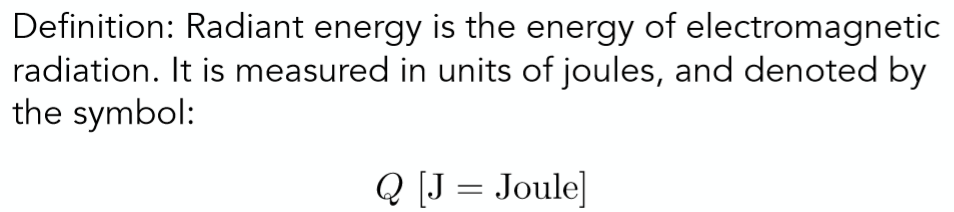  
所谓辐射能量其实非常直观，就是辐射出来的电磁能量，单位为焦耳。可以用物理当中的做功的大小来进行类比。

接下来是Radiant flux(power)：  
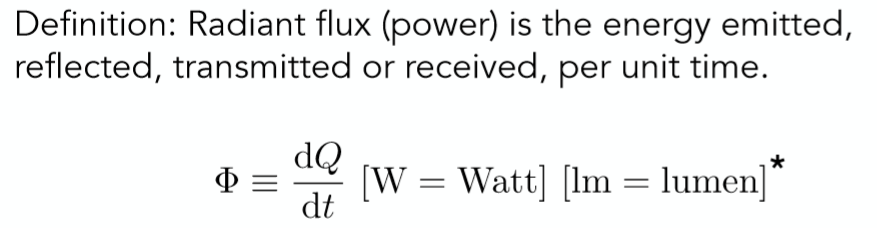  
所谓辐射通量或者说辐射功率，其实就是在辐射能量的基础之上除以时间，也就是单位时间的能量。同样也可以用物理当中的功率来进行类比。  
(tips: 具体来说一般偏向用radiant flux来衡量光线的亮度，因为我们更关心的是单位时间的效果，事实上也是这么做的，想想在说白炽灯泡的时候也是说60W亮度，80W亮度)

## 2.2 辐射强度(Radiant intensity)

在进行具体的数学定义之前，先借助如下一张图建立对剩下3个概念的一些直观的理解：  
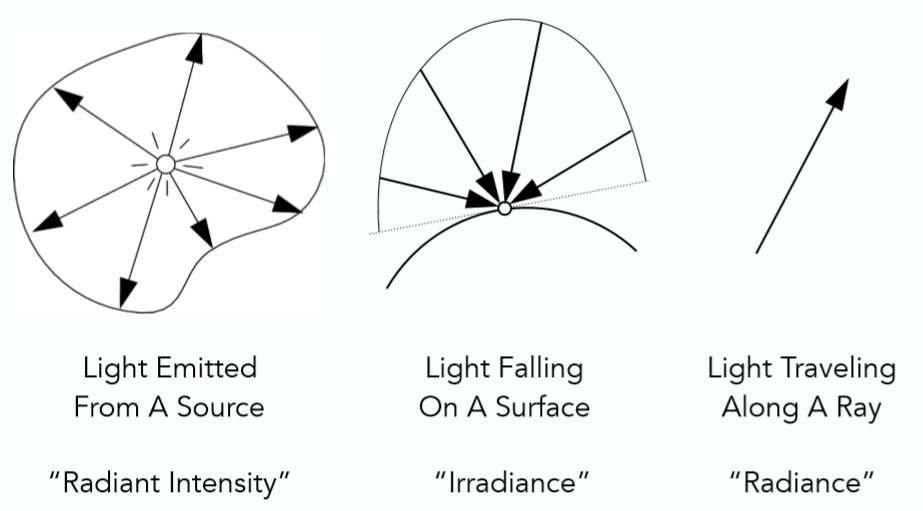  
**1 Radiant itensity其实就是指从一个光源出发某一方向上的亮度**  
**2 Irradiance指某一微小平面所接受到的光线亮度**  
**3 radiance衡量的是一条传播光线所具有的亮度(不受传播方向影响)**  
（这里的亮度也可以理解为radiant flux(power)。)

好了，接下来首先看Radiant intensity的数学定义：  
  
Radiant intensity一句话来说就是从光源发出的**每单位立体角上的功率**，关于辐射功率的定义在上文已经解释，这里唯一还不知道的就是立体角(solid angle)了。

solid angle其实就是对应二维空间中圆的弧度在三维空间中球上的拓展。  
首先看在二维计算弧度公式如下：  
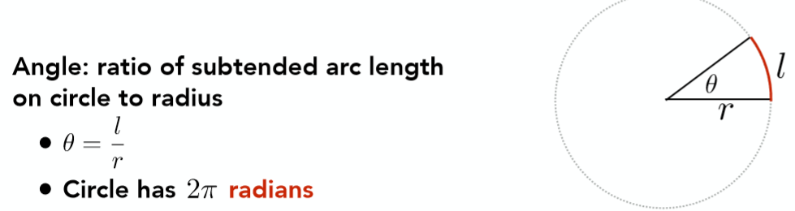  
即 θ = l r \\theta = \\frac{l}{r} θ\=rl(至于为什么这么算，中学知识这里就不展开了。)

那么对应在三维上的球的弧度(立体角)，只需进行一个简单的扩展如下：  
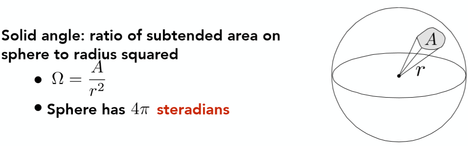  
即立体角度所对应球上的投影面积比上半径的平方，整个球的立体角为 4 π 4\\pi 4π。

那么对于Radiant intensity的定义当中，微分立体角 d ω d\\omega dω计算如下：  
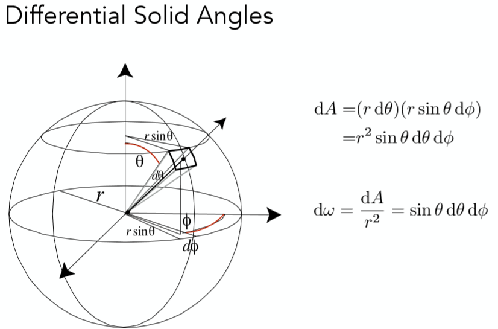  
首先确定空间中一个方向(通过 θ , ϕ \\theta,\\phi θ,ϕ)，在这两个角度上分别增加一个微分值，则可以计算出如图中所示的对应到球上的投影面积。其中 r d θ rd\\theta rdθ就是微分面积元的高， r s i n θ d ϕ rsin\\theta d\\phi rsinθdϕ是微分面积元的宽，二者相乘，自然就是面积了，再根据立体角的定义除以 r 2 r^2 r2 即可得到微分立体角了。

在此还可以验证下，对 d ω d\\omega dω在整个球上积分：  
Ω = ∫ S 2 d ω = ∫ 0 2 π ∫ 0 π sin ⁡ θ d θ d ϕ = 4 π

Ω\=∫S2dω\=∫2π0∫π0sinθdθdϕ\=4πΩ\=∫S2dω\=∫02π∫0πsin⁡θdθdϕ\=4π

\\begin{aligned} \\Omega &=\\int\_{S^{2}} \\mathrm{d} \\omega \\\\ &=\\int\_{0}^{2 \\pi} \\int\_{0}^{\\pi} \\sin \\theta \\mathrm{d} \\theta \\mathrm{d} \\phi \\\\ &=4 \\pi \\end{aligned} Ω\=∫S2dω\=∫02π∫0πsinθdθdϕ\=4π  
与之前所讲的球的立体角为 4 π 4\\pi 4π一致。

**tips：**  
注意在计算微分立体角之前，我们其实选定了空间当中的一个方向（由 θ , ϕ \\theta,\\phi θ,ϕ所确定），称这个方向为 ω \\omega ω，然后才在此基础之上分别对 θ , ϕ \\theta,\\phi θ,ϕ增加 d θ , d ϕ d\\theta,d\\phi dθ,dϕ经计算得到最终的 d ω d\\omega dω，因此Radiant intensity的物理含义此时就很清楚了，为光源向某一方向所发射出的单位立体角的功率，简而言之就是光源在某个方向上的亮度如何！

最后举一个对各向同性点光源计算Radiant intensity的例子：  
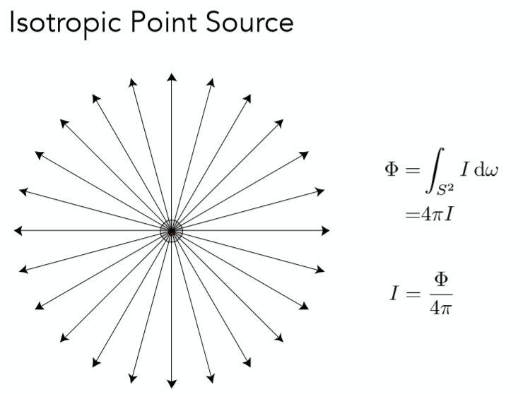  
因为各项同性点光源所有方向上的亮度都与方向无关，因此立体角可以直接积分出来为 4 π 4\\pi 4π，最终计算得 I = Φ 4 π I = \\frac{\\Phi}{4\\pi} I\=4πΦ。  
(如果不是各项同性的话这里的 I ( ω ) I(\\omega) I(ω)应该为一个关于 ω \\omega ω方向的的函数)

**以上就已经详细介绍完了关于Radiant intensity的定义，接下来给出irradiance的数学定义**

## 2.3 irradiance

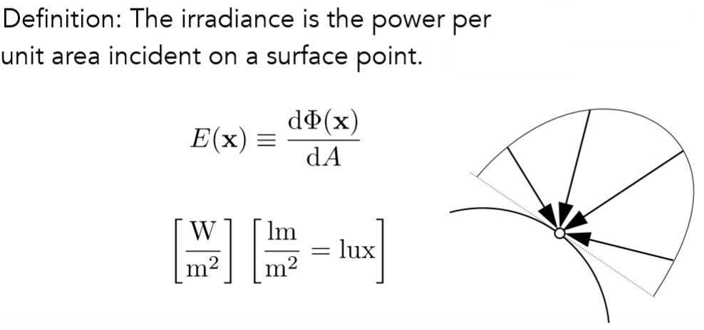  
同样用一句话来说，irradiance是指每单位**照射**面积所接收到的power，单位如图中所示。  
借助于irradiance，可以很轻松的解释在Blinn-Phong所提到的Lambert’s Law,即光线亮度需要乘上一个 c o s θ cos\\theta cosθ，如下图所示：  
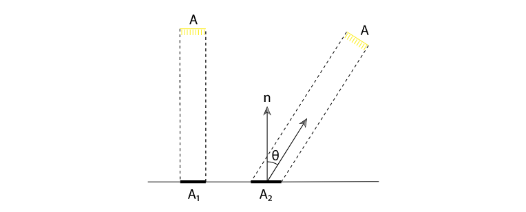  
当光线垂直照射平面时，如上图左边所示，**照射**到平面上的面积与光线本身的“宽度一致”。但当光线斜着照射到平面时，此时的**照射**面积就不再是光线本身的“宽度”了，具体来说此时的照射面积 A 2 = A / c o s θ A\_2 = A/cos\\theta A2\=A/cosθ。

那么针对右边情况的irradiance的计算就应该为：  
E 2 = Φ / A 2 = Φ c o s θ / A E2 = \\Phi/A\_2=\\Phi cos\\theta/A E2\=Φ/A2\=Φcosθ/A，相对于 E 1 = Φ / A E1=\\Phi/A E1\=Φ/A多了一个 c o s θ cos\\theta cosθ。  
而这其实也就解释了Lambert’s Law要乘以一个 c o s θ cos\\theta cosθ的原因了。

此外，回想也是在Blinn-Phong模型所提到的光线越远会越加衰减：  
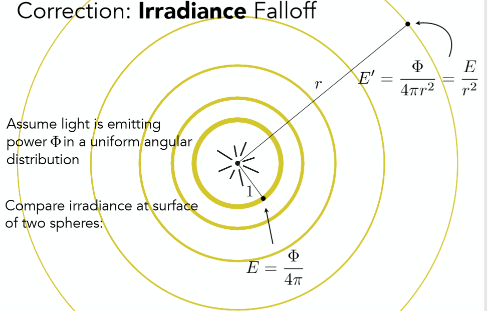  
该现象也完全可以用irradiance解释，因为光的功率始终一致，离点光源所照射到的圆球面积也就越大，因此根据irradiance的式子，分母的面积值也就越大，irradiance也就越小。

## 2.4 radiance

最后，我们终于来到了最后一条概念了，这条概念也是所有辐射度量学的概念当中最为重要的一个，那么首先直接就来看他的数学定义是怎么样的：  
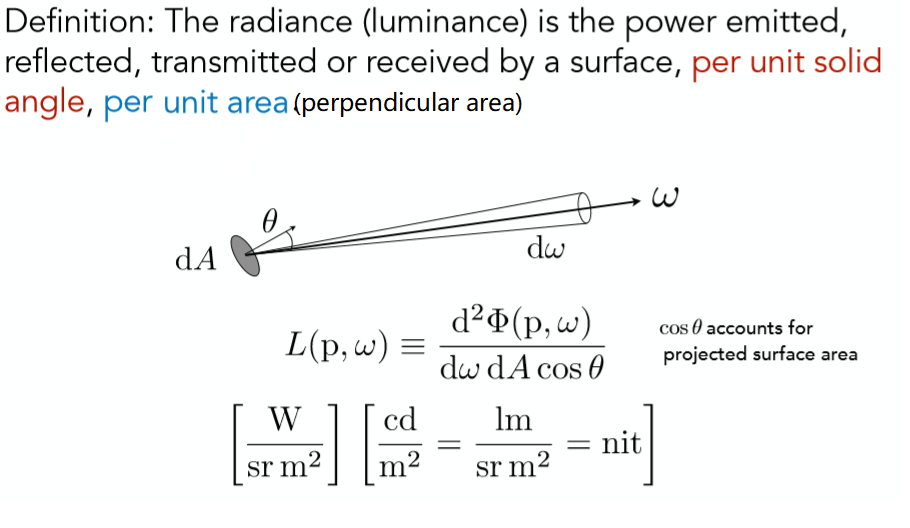  
用一句话概述的话，所谓radiance就是指**每单位立体角，每单位垂直面积的功率**，直观来看的话，很像是Intensity和irradiance的结合。**它同时指定了光的方向与照射到的表面所接受到的亮度**。

但这里有一个细微的区别，在irradiance中定义的**每单位照射面积**，而在radiance当中，为了更好的使其成为描述一条光线传播中的亮度，且在传播过程当中大小不随方向改变，所以在定义中关于接收面积的部分是**每单位垂直面积**，而这一点的不同也正解释了图中式子分母上的 c o s θ cos\\theta cosθ，具体可以观察如下图：  
  
即图中的 d A dA dA是irradiance中定义所对应的，而 d A ⊥ {d} A^{\\perp} dA⊥才是radiance中所定义的面积。二者之间的关系为 d A ⊥ = d A c o s θ {d} A^{\\perp} = dAcos\\theta dA⊥\=dAcosθ。

(以上各项定义确实比较绕，我在闫老师的讲解上又去借鉴了PBR书中的定义，对这些概念加以了自己的解释，希望能对大家有帮助！)

好了，在理解了radiance和irradiance的定义之后，再讨论讨论它们之间的关系，通过二者的定义式子，不难得出如下结果：  
L ( p , ω ) = d E ( p ) d ω cos ⁡ θ L(\\mathrm{p}, \\omega)=\\frac{\\mathrm{d} E(\\mathrm{p})}{\\mathrm{d} \\omega \\cos \\theta} L(p,ω)\=dωcosθdE(p)  
进一步推导得到：  
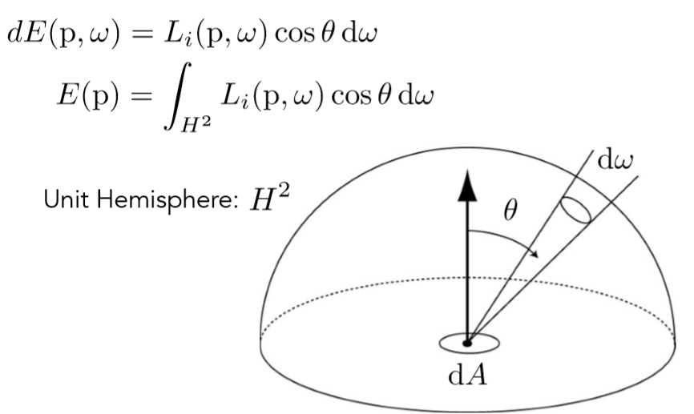  
观察一下积分后的式子， E ( p ) E(p) E(p)就是点p的irradiance，其物理含义是上文所提到过的点p上**每单位照射面积的功率**，而 L i ( p , ω ) L\_i(p,\\omega) Li(p,ω)指入射光**每立体角，每垂直面积的功率**，因此积分式子右边的 c o s θ cos\\theta cosθ解释了面积上定义的差异，而对 d ω d\\omega dω积分，则是相当于对所有不同角度的入射光线做一个求和，那么该积分式子的物理含义便是，一个点(微分面积元)所接收到的亮度(irradiance)，由所有不同方向的入射光线亮度(radiance)共同贡献得到。

# 3 双向反射分布函数(BRDF)

通过上述所有辐射度量学各种概念的定义之后，我们可以从这样一个角度理解光线的反射，如下图所示：  
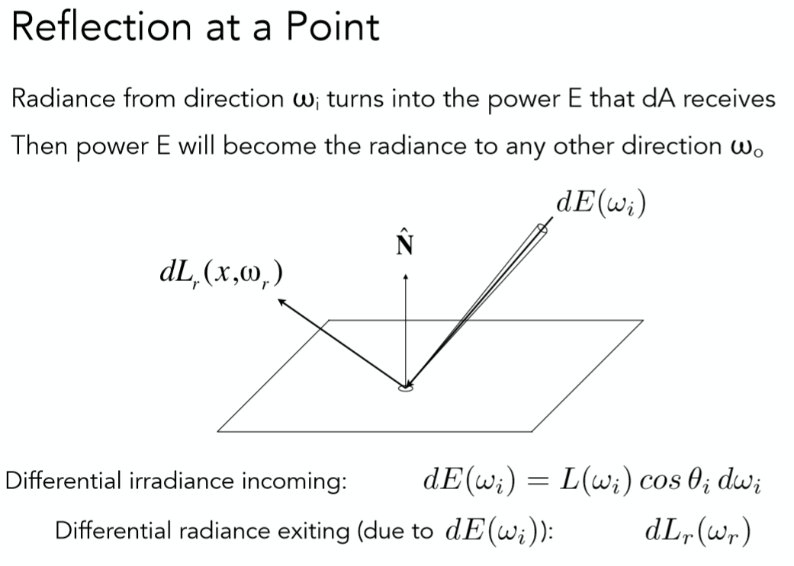  
**一个点(微分面积元)在接受到一定方向上的亮度( d E ( ω i ) dE(\\omega\_i) dE(ωi))之后，再向不同方向把能量辐射出去( d L r ( ω r ) dL\_r(\\omega\_r) dLr(ωr))**

直观的理解，不同物体表面材质自然会把一定方向上的入射亮度( d E ( ω i ) ) dE(\\omega\_i)) dE(ωi))反射到不同的方向的光线上( d L r ( ω r ) dL\_r(\\omega\_r) dLr(ωr))，如理想光滑表面会把入射光线完全反射到镜面反射方向，其它方向则完全没有。如理想粗糙表面会把入射光线均匀的反射到所有方向。因此所谓BRDF就是描述这样一个从不同方向入射之后，反射光线分布情况的函数，定义如下：  
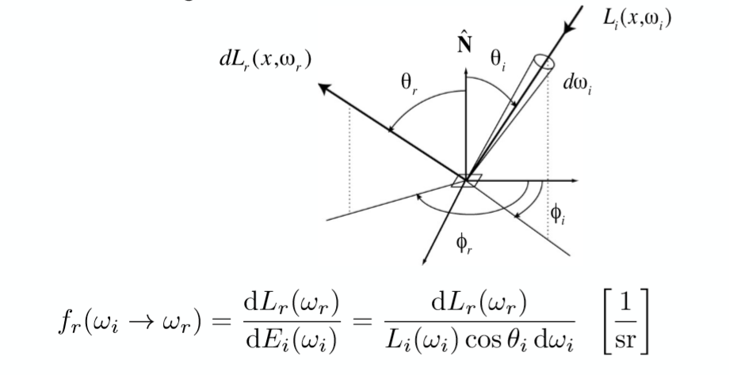  
上图中下方的式子即为BRDF，它就收两个参数入射光方向 ω i \\omega\_i ωi,反射光方向 ω r \\omega\_r ωr，函数值为反射光的radiance与入射光的iiradiance的比值。

借助BRDF，可以定义出**反射方程**如下：  
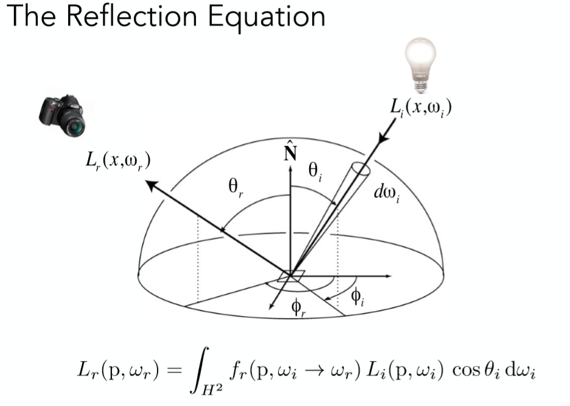  
即摄像机所接受到的 ω r \\omega\_r ωr方向上的反射光，是由所有不同方向上入射光线的irradiance贡献得到的(图中式子的 L i ( p , ω i ) cos ⁡ θ i d ω i L\_{i}\\left(\\mathrm{p}, \\omega\_{i}\\right) \\cos \\theta\_{i} \\mathrm{d} \\omega\_{i} Li(p,ωi)cosθidωi)，而不同方向入射光线的irradiance对反射方向 ω r \\omega\_r ωr的贡献程度则由物体表面材质决定，所以乘上了一个BRDF函数。

到这里，通过辐射度量学，以及BRDF最终得到的反射方程正是一个**完全正确的光照模型了**，解决了在第一章提到的现有模型的所有缺点！（渲染方程只是在反射方程的基础之上加了一个自发光项，关于渲染方程会在下一章仔细去了解)。

在进入到渲染方程之前，再仔细观察一下反射方程：  
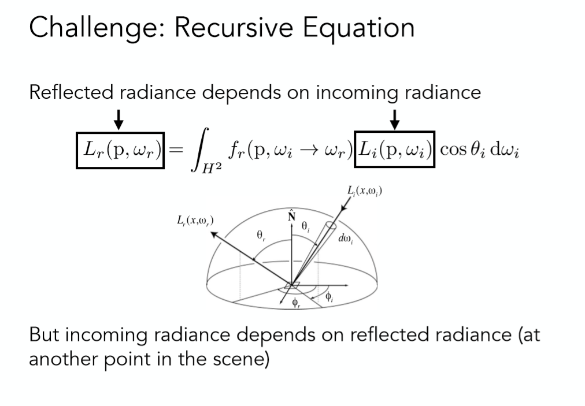  
不难发现正如上图中所说的，入射光线的radiance不仅仅是光源所造成，还有可能是其他物体上着色点的反射光线的radiance，恰好反射到当前的着色点p，而其他物体上的反射光线的radiance依然也是这么个情况，没错！这与whitted-style当中的光线追踪过程十分类似，也是一个递归的过程。所以说想要解这样一个方程还是比较难的。

接下来，在最后一章我们会引入渲染方程，并对渲染方程做一些直观上的物理解释，对于反射方程或者说是渲染方程的具体求解，留在下一篇文章里面去说。

# 4 渲染方程及其物理含义解释

正如在上一节中提到的，渲染方程知识在反射方程的基础之上添加了一个自发光项(Emission term)，从而使得反射方程更加的general：

L o ( p , ω o ) = L e ( p , ω o ) + ∫ Ω + L i ( p , ω i ) f r ( p , ω i , ω o ) ( n ⋅ ω i ) d ω i L\_{o}\\left(p, \\omega\_{o}\\right)=L\_{e}\\left(p, \\omega\_{o}\\right)+\\int\_{\\Omega^{+}} L\_{i}\\left(p, \\omega\_{i}\\right) f\_{r}\\left(p, \\omega\_{i}, \\omega\_{o}\\right)\\left(n \\cdot \\omega\_{i}\\right) \\mathrm{d} \\omega\_{i} Lo(p,ωo)\=Le(p,ωo)+∫Ω+Li(p,ωi)fr(p,ωi,ωo)(n⋅ωi)dωi

其中 L e ( p , ω o ) L\_e(p,\\omega\_o) Le(p,ωo)为自发光项，反射方程中的 c o s θ cos\\theta cosθ用， n ⋅ ω i n\\cdot\\omega\_i n⋅ωi代替。  
(tips：所有光线方向均指向外)

接下来从一个点光源和单个物体的场景开始理解渲染方程：  
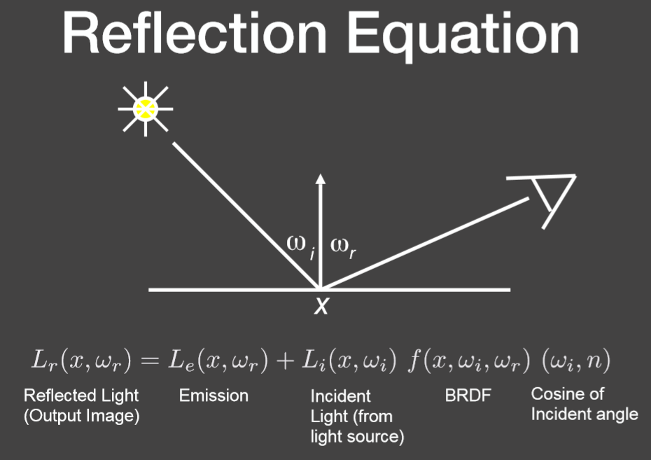  
(点光源对一个点来说自然只有一个方向有入射光，所以这里没有了积分)

多个点光源一个物体的情况：  
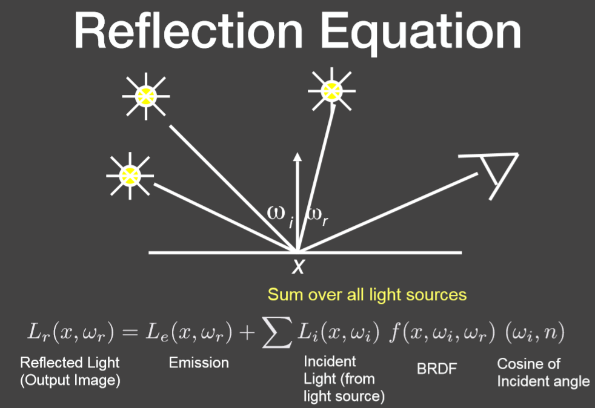  
将这些所有的点光源的贡献全部求和即可，那么如果点光源变成了面光源呢？如下图所示：  
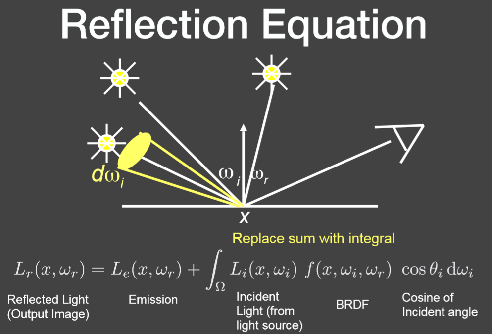  
其实面光源就相当于无穷多个点光源的集合，只需要对 面光源所在的立体角范围进行积分，并且能够确定不同立体角方向的面光源的入射光radiance即可。

那么更进一步的，再在场景当中加入其它物体，使得物体之间发生光线交互之后是什么情况呢：  
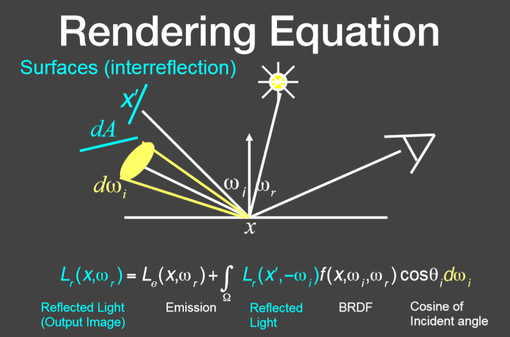  
如上图所示，可以把其它物体同样考虑成面光源，对其所占立体角进行积分即可，只不过对其它物体的立体角积分不像是面光源所有入射方向都有radiance，物体的立体角可能只有个别几个方向有入射的radiance(即多次物体间光线反射之后恰好照射到着色点x)，其它方向没有，但本质上都可以视作是面光源。

观察一下图中的渲染方程可以发现除了两个radiance，其它所有项都是知道的，可以将上式进一步写成如下图下方所示的式子：  
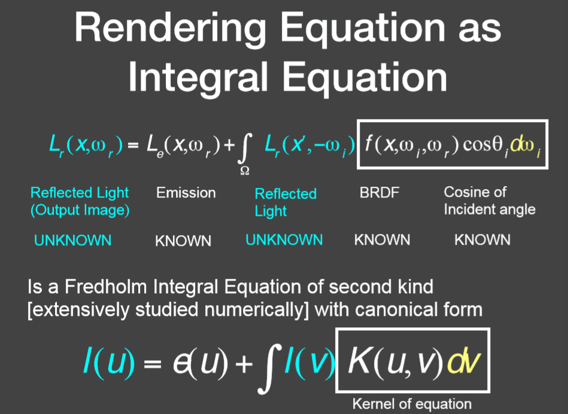  
其中各项与原渲染方程中一一对应，(这里其实是有数学严格推导的，不过我们只是为了接下来构建直观的物理解释，对于这些推导不必在意，默认成立即可)，再接着，可以把该式子离散化写为线性代数的形式：  
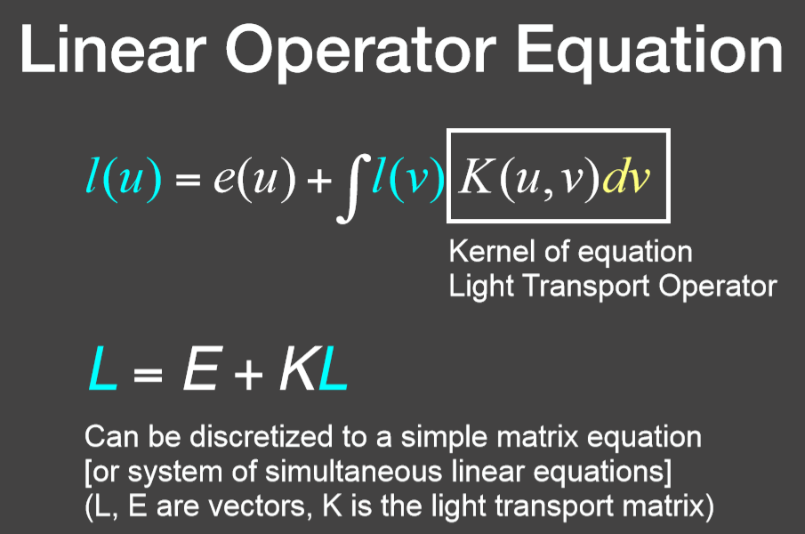  
呼，经过两步我们不是很清楚但其实是正确的数学推导之后(后面不会有让读者直接默认的数学推导了！)，得到了这样一个式子：  
L = E + K L L=E+KL L\=E+KL  
其中L其实就是想要求得的反射光，E是自发光其实就是光源的发光项，K可以理解为对光线进行反射的一种算子操作。那么利用线性代数的知识很容易就可以推导出L的结果如下：  
L = E + K L I L − K L = E ( I − K ) L = E L = ( I − K ) − 1 E

LIL−KL(I−K)LL\=E+KL\=E\=E\=(I−K)−1EL\=E+KLIL−KL\=E(I−K)L\=EL\=(I−K)−1E

\\begin{aligned} L &=E+K L \\\\ IL-K L &=E \\\\ (I-K) L &=E \\\\ L &=(I-K)^{-1} E \\end{aligned} LIL−KL(I−K)LL\=E+KL\=E\=E\=(I−K)−1E  
其中 I I I为单位矩阵，再接着对 ( I − K ) − 1 (I-K)^{-1} (I−K)−1使用广义二项式定理得到：  
L = ( I + K + K 2 + K 3 + … ) E L = E + K E + K 2 E + K 3 E + … .

L\=(I+K+K2+K3+…)EL\=E+KE+K2E+K3E+….L\=(I+K+K2+K3+…)EL\=E+KE+K2E+K3E+….

\\begin{array}{l} L=\\left(I+K+K^{2}+K^{3}+\\ldots\\right) E \\\\ L=E+K E+K^{2} E+K^{3} E+\\ldots . \\end{array} L\=(I+K+K2+K3+…)EL\=E+KE+K2E+K3E+….

仔细观察这个式子，注意E是光源所发出的光，K为反射算子，这样一个式子的物理含义如下图所示：  
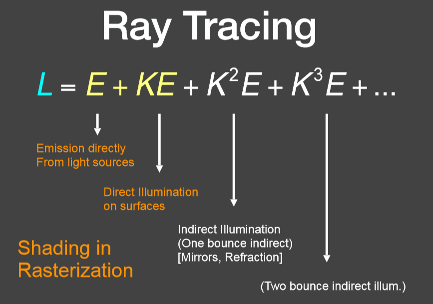  
E为光源发出的光，KE则代表对光源反射一次的结果，即直接光照，那么前两项之和就是光栅化当中着色所考虑的结果，对于全局光照来说，还考虑了 K 2 E K^2E K2E，即一次弹射的间接照明， K 3 E K^3E K3E就是两次弹射的间接照明，依次类推。

这样来看整个结果是不是就很清晰了，就是光源发光加上直接光照与多次间接光照的结果！而这一切都是从渲染方程推导而来的，因此这也正是渲染方程的物理意义！

最后以几张基于物理渲染的图片作为本篇文章的结束  
一次反射直接光照：  
  
两次反射，考虑到一次弹射的间接光照：  
  
3次反射，考虑到两次弹射的间接光照：  
  
(考虑次数越多越接近真实图片效果,趋近收敛)

# 总结

以上就是所有的关于PBR的一些相关基础知识了，我们从辐射度量学入手，掌握了正确衡量光线属性的方法，由此定义出了BRDF，来表示物体的材质，即它对于光线的反射能量分布，最后结合辐射度量学与BRDF得到渲染方程，一个个真正完全正确的光照模型！