### 照相机与透镜

- [摘要](https://blog.csdn.net/qq_38065509/article/details/106714036#_4)
- [一 照相机主要部分](https://blog.csdn.net/qq_38065509/article/details/106714036#__6)
- [二 小孔成像与视场(FOV)](https://blog.csdn.net/qq_38065509/article/details/106714036#_FOV_19)
- [三 曝光(Exposure)](https://blog.csdn.net/qq_38065509/article/details/106714036#_Exposure_39)
- [四 景深(Depth of Field)](https://blog.csdn.net/qq_38065509/article/details/106714036#_Depth_of_Field_73)
- [Note：](https://blog.csdn.net/qq_38065509/article/details/106714036#Note_106)
- [总结](https://blog.csdn.net/qq_38065509/article/details/106714036#_111)
- [Reference](https://blog.csdn.net/qq_38065509/article/details/106714036#Reference_115)

(本篇文章同步发表于知乎专栏：[https://zhuanlan.zhihu.com/p/147862678](https://zhuanlan.zhihu.com/p/147862678) 欢迎三连关注)

# 摘要

虽说照相机与透镜属于相对独立的话题，但它们的确是[计算机图形学](https://so.csdn.net/so/search?q=%E8%AE%A1%E7%AE%97%E6%9C%BA%E5%9B%BE%E5%BD%A2%E5%AD%A6&spm=1001.2101.3001.7020)当中的一部分知识。在过往的十多篇笔记中，我们学习的都是如何渲染出一张**虚拟**的图片，因此在本节当中会去介绍照相机与透镜的相关知识，了解**现实**图像生成的一些内容。

# 一 照相机主要部分

对于一个照相机来说，最重要的组成部分之一便是透镜，它是成像的关键，无论是小孔成像还是透镜成像，如下图所示：  
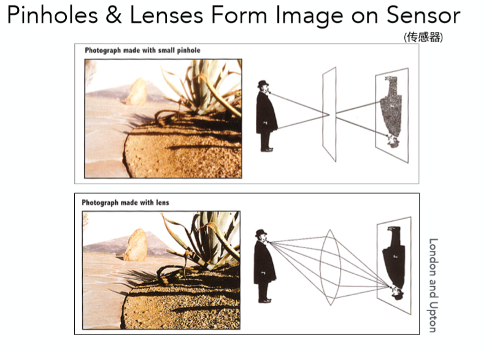  
其次我们知道照相机的快门一般一直处于关闭状态，直到按下拍照的瞬间才会打开，允许光线信息进入到透镜：  
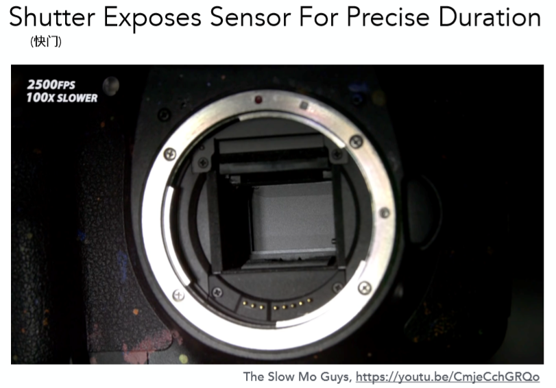  
最后，当快门打开光线成功通过透镜之后，所有光线信息都会照射到传感器上(相当于胶片)来进行存储，通过传感器上的信息得到最终图像：  
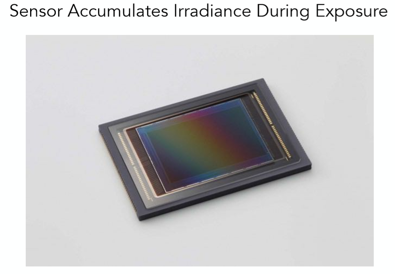  
那么回想一下在讲辐射度量学的时候，我们介绍了种种关于光线物理性质的一些描述概念，对应于这里传感器，其存储的应该是什么呢？观察下图：  
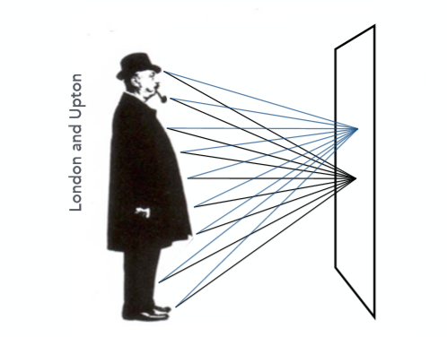  
右边相当于传感器平面，**传感器的每一点记录了来自物体所有方向的光**，因此每一点存储的也就是**irradiance**(如果读者不清楚辐射度量学可以略过，并不影响本文阅读)。

以上就是对照相机成像的最重要几部分的简略介绍，接下来会一一详述解释。

# 二 小孔成像与视场(FOV)

相信读者一定都了解或听说过小孔成像，该项技术的起源十分悠久，通过小孔只允许一定方向的光线通过，从而得到一个倒立的成像：  
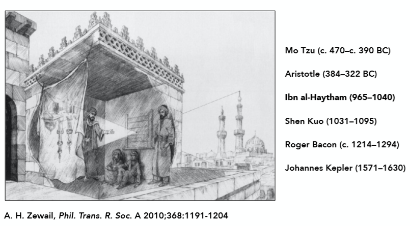  
对于小孔成像不多做解释，主要是希望通过它从而引出视场的概念，如下图：  
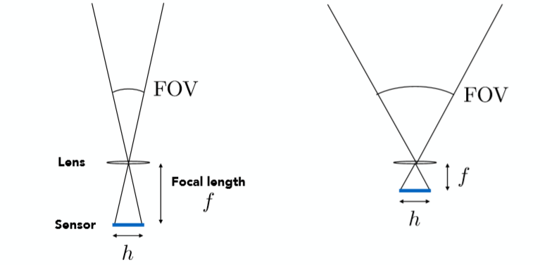  
最终所能成像的角度范围就被称为视场(Field of View)，图中 h h h指传感器的长度， f f f指透镜的焦距(虽然小孔成像没有焦距，这里可以当做传感器到小孔的垂直距离)，通过这两项参数，很容易可以计算出FOV：  
F O V = 2 arctan ⁡ ( h 2 f ) \\mathrm{FOV}=2 \\arctan \\left(\\frac{h}{2 f}\\right) FOV\=2arctan(2fh)  
当焦距 f f f越小的时候FOV的角度也就越大，自然可以成像出更大的范围，而这其实也是就现在经常提到的广角相机的原理。

一般情况下，我们规定底片传感器长度为35mm时，则：  
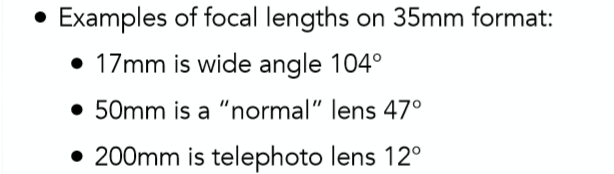  
举一个具体的例子：  
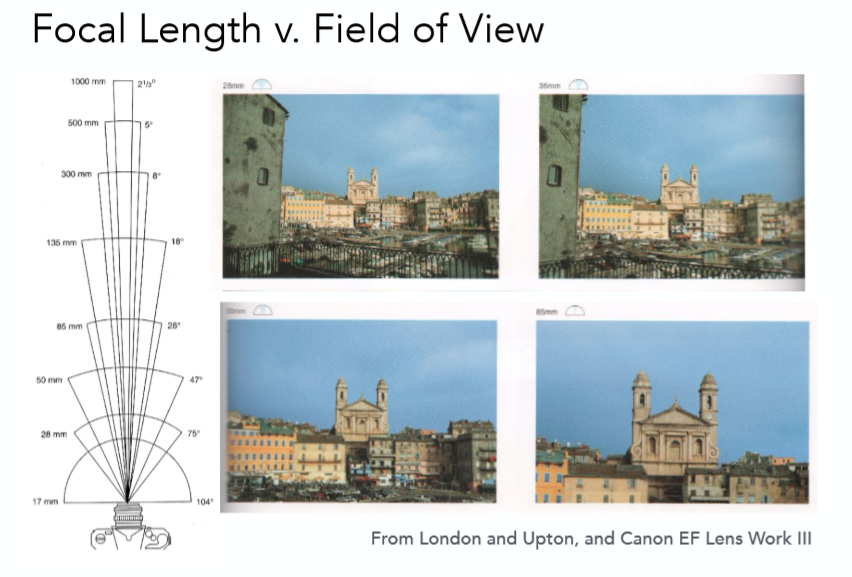  
从图中可以看出，当焦距越大的时候，成像的角度就越小集中在一小部分，类似于我们拿手机不停的放大拍摄倍数一样。

当然除了焦距，传感器的长度也有着很明显的影响，底片长度越大，自然FOV也就越大：  
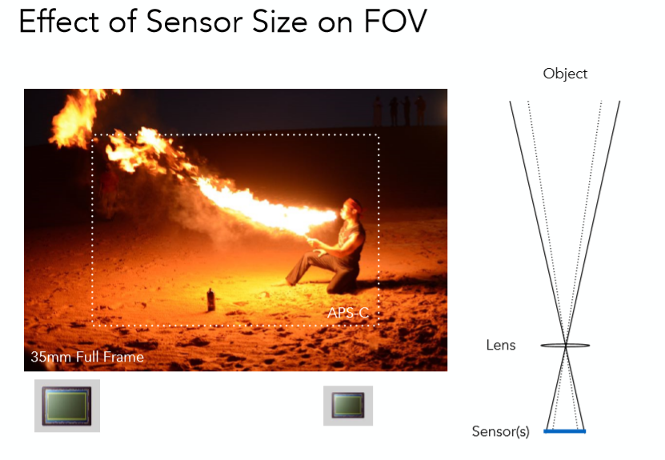  
tips：  
对于不同的设备，传感器长度不一，想要保持同样的FOV的话，就需要同比缩小焦距。

# 三 曝光(Exposure)

在第一章中我们提到传感器上接受到的是irradiance，也就是每单位面积所接受到的光线**功率**，而曝光就是用时间乘上了这个irradiance

Exposure \= = \= time x irradiance

从物理意以上来说就是真正的所接受到的能量(Energy)。那么这个时间由什么控制呢？

没错正是快门速度！除此之外，曝光总共还会被其他2个值来控制，即一共3个：

**1\. 快门速度(Shutter speed)，快门打开时间越长，进光时间越长，进光量自然越多。**  
**2\. 光圈大小(Aperture size)，描述此项的数值称为f-stop，直观理解如果光圈越大，即遮挡的光越少那么曝光的程度就会越高。**  
**3\. 感光度(ISO gain)，对于感光度可以简单理解为对最终的图像值乘上了一个倍数。**

以下给出一张图，构建对这三项的直观理解：  
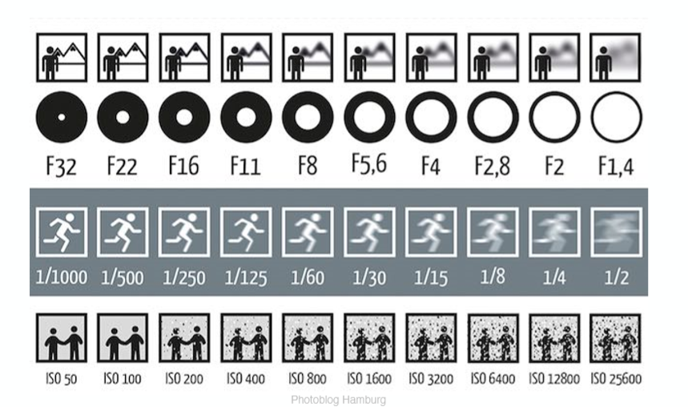  
首先观察最下方的ISO变化对照片的影响，之前提到ISO就是一个简单的线性变化，对图像的结果乘上了一个倍数，随着ISO的值显著增大之后，虽然画面整体亮度会提升，但同时也会观察到画面有很多的噪点。这其实很容易解释，照片本质所记录的无非就是信号，那么对于光线的信息自然也会有些很小的noise进入，如果对图像进行整体进行亮度放大的话，noise自然也会变的更加明显形成了噪点。

接着是中间一行的快门速度，图片下方的值越大代表速度越慢，快门打开时间越长，透镜的进光量越大，图片也就会越亮，但同时**运动的物体**也会变的模糊起来。  
**原因如下: 快门打开后照相机会记录一段时间内的所有物体的光线信息，如果快门打开时间足够长，就能通过最终的照片捕捉到物体的移动，而这也就是动态模糊**：  
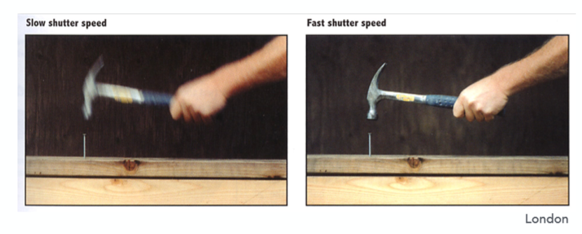  
但这种模糊也不一定不是坏事，正如上图例子所示，左边快门速度慢看到了锤子有落下的趋势，获得到了更多的图片信息，而右边的快门速度快，看上去更像是静止的画面，没有动态的效果。

这也是为什么一般的电影拍摄只用24FPS却不会觉得卡顿，因为动态模糊的存在使得人眼接受到的信息更多。但对于游戏来说往往需要60FPS以上，因为游戏内每一帧都是静止画面并不存在动态模糊(有的游戏可以打开动态模糊)，所以需要更多的图片数量才会使人觉得不卡顿。

但对于快门速度有一点需要额外关注，无论快门打开的速度有多快，它一定有一个打开关闭的过程，所以整幅照片上不同的部分往往记录的时间间隔有着微小差距，当拍摄高速物体时，这种效果更加明显：  
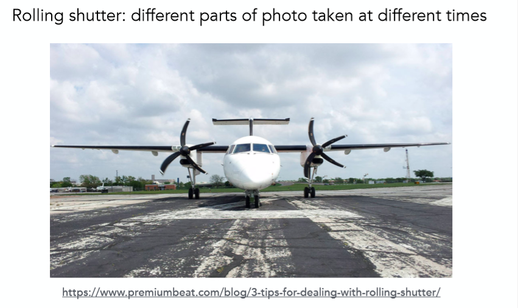  
最后对于一开始那幅图的最上面一行，也就是光圈大小 F-stop 或者F-Number值(图中的逗号就是小数点的意思)，该值大小可以简单的理解为与光圈直径的倒数成正比，因此FN值越小，代表光圈越大，进光量越大，画面亮度越高，但同时也会带来景深模糊的影响(对于该点留在下一节去解释)：  

以上就是关于曝光一些基础内容，对于曝光有两点主要的应用：**高速摄影和低速摄影**：  
对于高速摄影来说，物体运动速度极快，因此需要非常小的快门速度来不找到它，但同时为了补偿进光时间不够，还需要使用大光圈或提高ISO来保证曝光正常：  
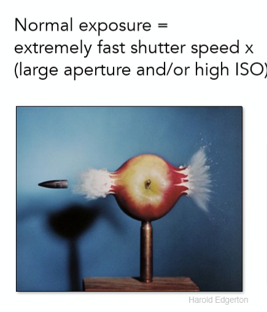  
对于低速摄影来说则相反，一般采用较长的快门时间来捕捉物体运动的轨迹，如下图飞机降落轨迹：  
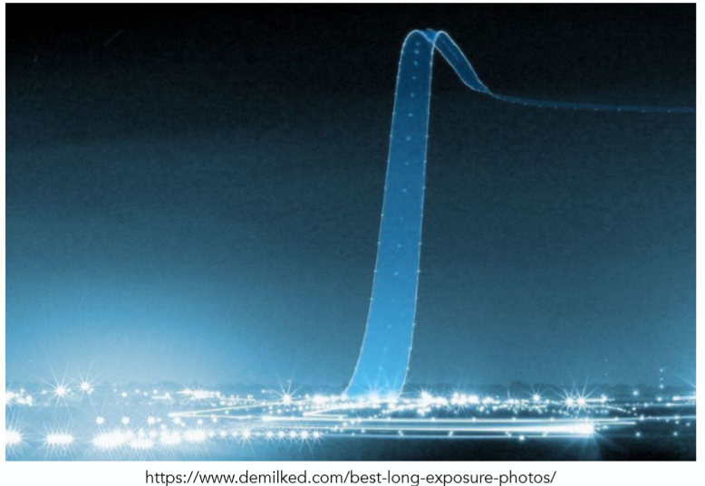

# 四 景深(Depth of Field)

在讨论到景深之前，我们先给出本章中所采用的理想透镜的性质：  
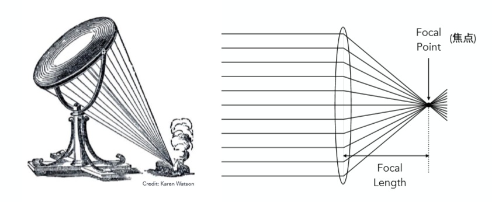  
(1) 所有平行射入透镜的光都会集中于一点，称该点为焦点  
(2) 所有从焦点射入透镜的光都会平行射出(光路可逆性)  
(3) 焦距可以被随意改变(这里单个透镜当然不行，但在现实中大部分的照相机都是一个透镜组，可以做到焦距随意改变)

利用这些性质可以得到理想透镜的成像规律，对于一个通过透镜的成像物体来说，其物距 z o z\_o zo，像距 z i z\_i zi和焦距 f f f之间存在如下图的关系：  
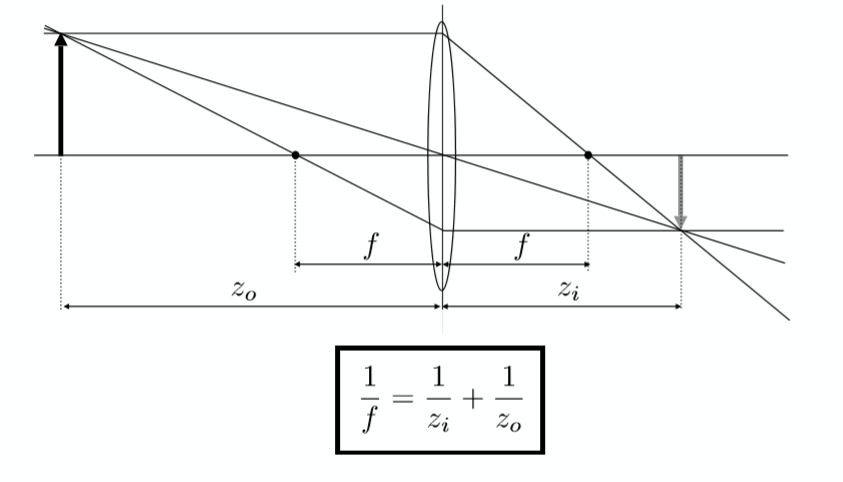  
其推导过程可以简单的从两对相似三角形入手：  
  
过程如下：  
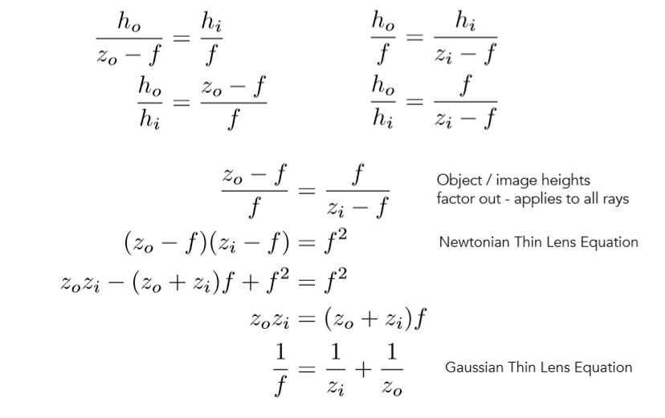  
了解了上述的透镜成像规律之后，让我们一起观察一下景深模糊所产生的的原因：  
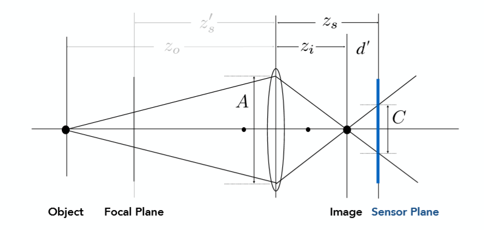  
当一个传感器平面不在一个物体真正精确的成像平面之上时(即之前所提到到像距 z i z\_i zi的平面)，便会出现模糊。如上图所示，当传感器平面在根据透镜成像规律所计算出的成像平面 I m a g e Image Image之后时，一个点经过透镜到传感器上变成了一条线(从三维去看就是一个圆)，因此就出现了模糊，把上图中模糊之后的长度 C C C称为 Circle of Confusion，同样利用三角形相似推导如下：  
C A = d ′ z i = ∣ z s − z i ∣ z i \\frac{C}{A}=\\frac{d^{\\prime}}{z\_{i}}=\\frac{\\left|z\_{s}-z\_{i}\\right|}{z\_{i}} AC\=zid′\=zi∣zs−zi∣  
不难看出，C与棱镜长度A成正比，而棱镜长度也与光圈的直径成正比，因此当光圈越大，C也就越大，此时出现的景深模糊也就越明显：  
  
(左图大光圈，右图小光圈)  
明显看出右图要更加的清晰。

回顾一下在之前曾提到，光圈大小F-Number值与光圈直径的倒数成正比，更具体来说， N = f / D N=f/D N\=f/D，即焦距比上直径，因此换算Circle of Confusion当中的光圈直径 A = f / N A = f/N A\=f/N（这里A与上式当中的D相等），得到如下图当中的式子：  
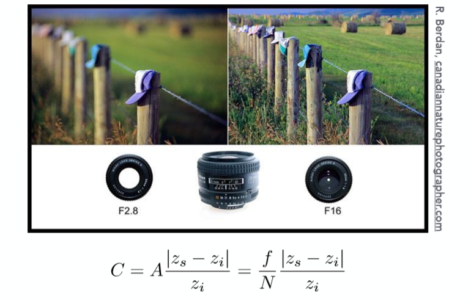  
同时这里也给出了不同光圈大小拍照的例子，小光圈锐利，景深模糊不明显，大光圈则有明显的景深模糊

那么回归到本章的主题，Depth of Field，它与景深模糊并不是同一个东西，景深模糊是一种情形，而景深则是一个具体的数值，其具体指  
**当我们固定一个可以接受的Circle of Confusion C值之后，可以逆向推导出小于该C值的对应的一段距离是多少，这个距离就是景深，如下图所示：**

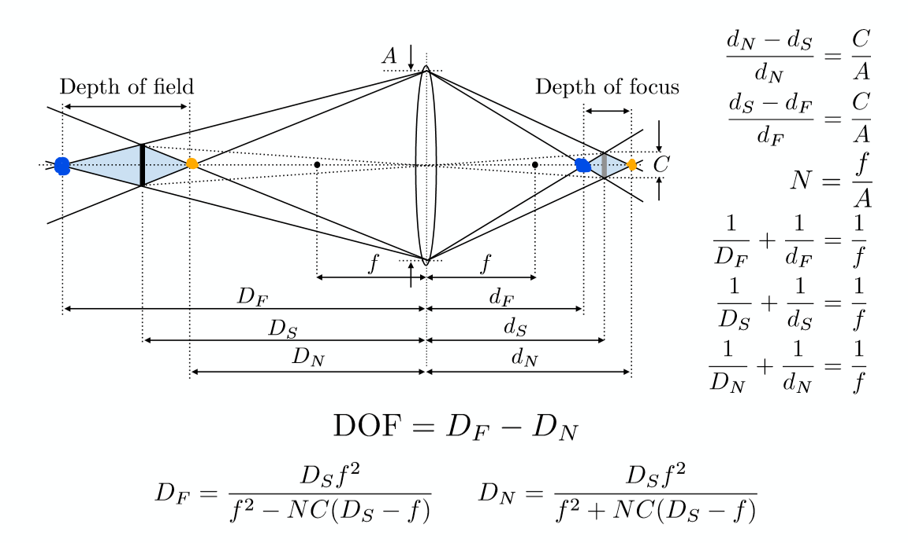  
图中蓝色阴影区域的C值小于提前确定的值，该区域的长度即为景深，对应推导过程也已经在闫老师课上的这个Slides中给出。

# Note：

关于如何在光线追踪当中实现景深模糊的效果，只需要简单的模拟透镜的光线传播即可，如下图当中的步骤所示：  
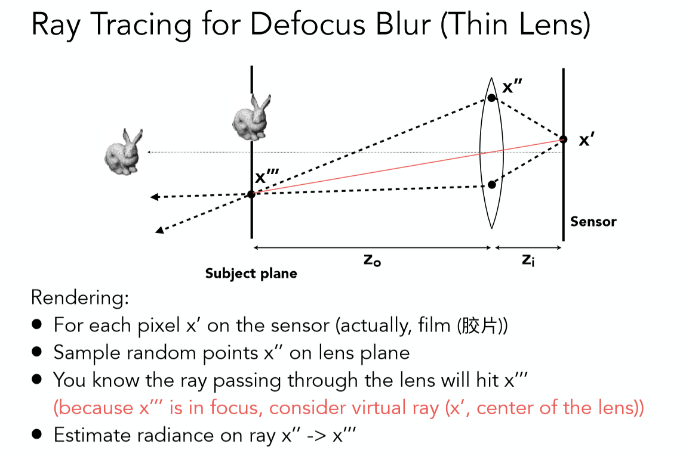  
实际渲染效果图：  

# 总结

以上就是本次笔记的全部内容了，我们从小孔成像和FOV出发，主要介绍了照相机的一些相关参数，及其作用影响，如光圈大小F-Number，及其所造成的景深效果，快门时间和动态模糊，感光度和噪点等等，来帮助理解真实图片时如何产生的。

最后如果本文对你有帮助的话求点赞求收藏求一个大大的关注 😃 ,后序会持续更新，感谢阅读！