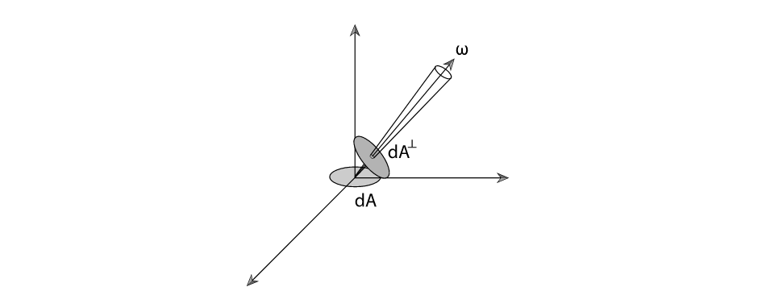
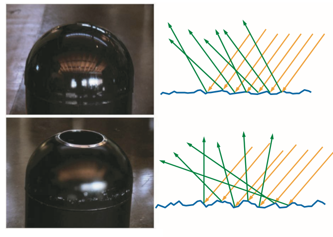
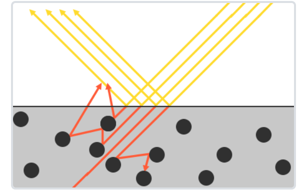
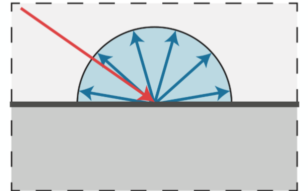
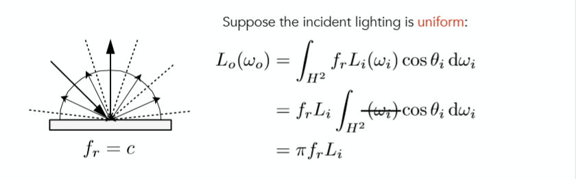
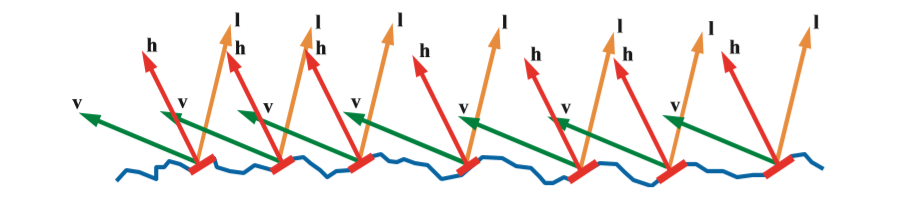
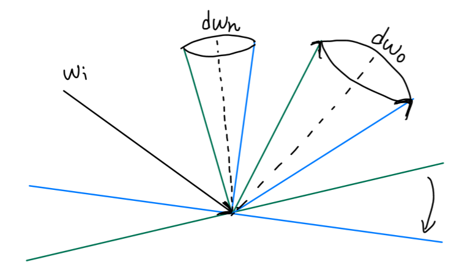
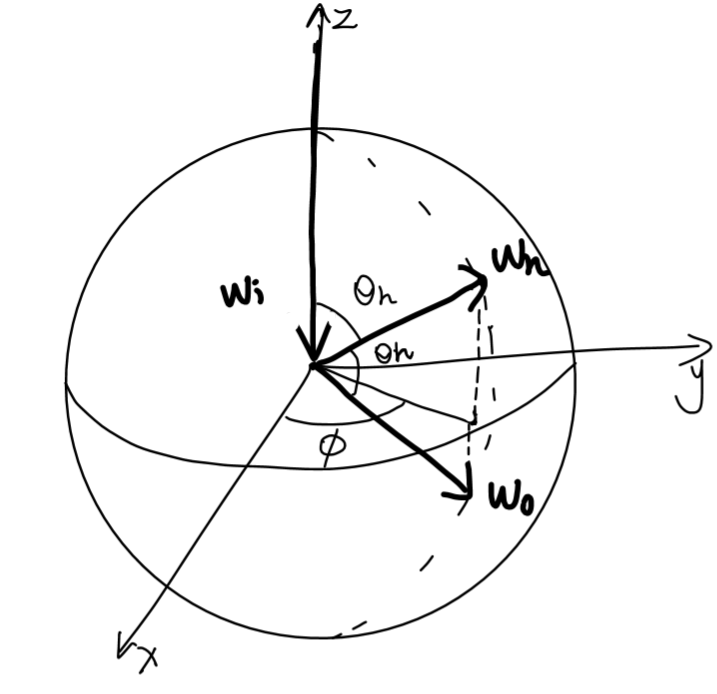
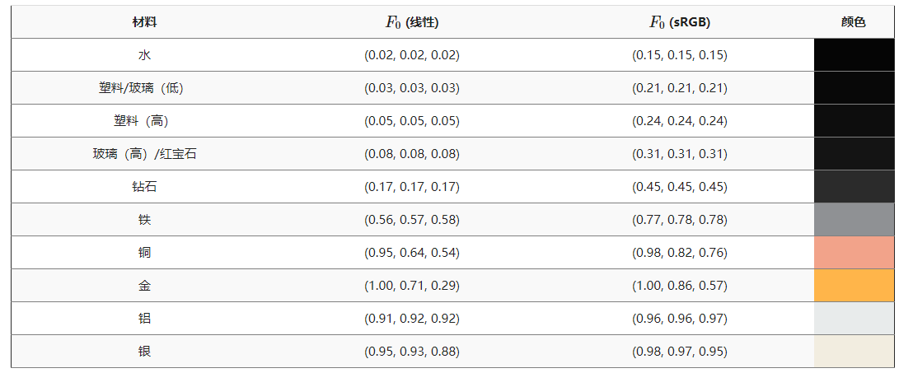
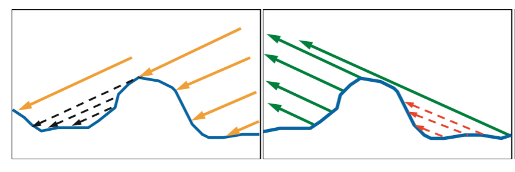

### 微平面理论与Cook-Torrance BRDF推导

- [1 基础概念](https://blog.csdn.net/qq_38065509/article/details/107042250#1__5)
- - [1.1 辐射能量与辐射功率](https://blog.csdn.net/qq_38065509/article/details/107042250#11__8)
    - [1.2 辐照度与辐出度](https://blog.csdn.net/qq_38065509/article/details/107042250#12__12)
    - [1.3 双向反射分布函数](https://blog.csdn.net/qq_38065509/article/details/107042250#13__19)
- [2 微平面理论](https://blog.csdn.net/qq_38065509/article/details/107042250#2__26)
- [3 Cook-Torrance BRDF推导](https://blog.csdn.net/qq_38065509/article/details/107042250#3_CookTorrance_BRDF_43)
- - [3.1 漫反射项推导](https://blog.csdn.net/qq_38065509/article/details/107042250#31__47)
    - [3.2 镜面反射项推导](https://blog.csdn.net/qq_38065509/article/details/107042250#32__58)
    - [3.3 菲涅尔方程与几何函数的补充](https://blog.csdn.net/qq_38065509/article/details/107042250#33__158)
    - - [3.3.1 菲涅尔方程](https://blog.csdn.net/qq_38065509/article/details/107042250#331__161)
        - [3.3.2几何函数](https://blog.csdn.net/qq_38065509/article/details/107042250#332_170)
- [4 总结](https://blog.csdn.net/qq_38065509/article/details/107042250#4__181)
- [Reference](https://blog.csdn.net/qq_38065509/article/details/107042250#Reference_184)

(本篇文章同步发表于知乎专栏：[https://zhuanlan.zhihu.com/p/152226698](https://zhuanlan.zhihu.com/p/152226698) 欢迎三连关注)

在前面两篇关于PBR的笔记中，介绍了辐射度量学的一些物理概念及通过这些物理项从而定义出的BRDF与渲染方程，并且通过蒙特卡洛路径追踪的方式成功解出了渲染方程近似解，得到了相当不错的渲染效果。但是对于其中对物体材质起着至关重要作用的BRDF并没有作过多讲解，本次笔记会从微平面理论出发，去推导出广泛使用的Cook-Torrance BRDF。

# 1 基础概念

在第一章中，先简单得回顾一下辐射度量学的基础概念，以及BRDF的定义，关于这些概念的详细介绍可参考：  
[基于物理渲染的基础知识(辐射度量学，BRDF和渲染方程)](https://zhuanlan.zhihu.com/p/145410416)

## 1.1 辐射能量与辐射功率

辐射能量(Radiant energy), 指电磁辐射的能量，单位为焦耳( J J J)，用符号 Q Q Q表示。  
辐射功率(Radiant power)，或者称之为辐射通量(Radiant flux)，指每单位时间辐射而出的能量。  
Φ ≡ d Q d t \\Phi \\equiv \\frac{\\mathrm{d} Q}{\\mathrm{d} t} Φ≡dtdQ

## 1.2 辐照度与辐出度

辐照度(Irradiance)，指每单位面积，单位时间所接收到的能量。  
E = d Φ d A E=\\frac{d \\Phi}{d A} E\=dAdΦ  
辐出度(Radiance)，指每单位垂直面积，单位立体角，单位时间接受到的能量。  
L = d Φ d ω d A ⊥ L=\\frac{d \\Phi}{d \\omega d A^{\\perp}} L\=dωdA⊥dΦ  
辐照度与辐出度定义上单位面积的差异如下：  

## 1.3 双向[反射](https://so.csdn.net/so/search?q=%E5%8F%8D%E5%B0%84&spm=1001.2101.3001.7020)分布函数

确定入射方向与出射方向，BRDF定义为出射的Radiance与入射的Irradiance的比值，其衡量了物体表面与光线进行反射的特性，表示出物体的材质效果。  
f ( l , v ) = d L o ( v ) d E ( l ) f(l, v)=\\frac{d L\_{o}(v)}{d E(l)} f(l,v)\=dE(l)dLo(v)  
其中 l l l是入射光方向， v v v是观察方向，也就是反射光方向。  
d L o ( v ) dL\_o(v) dLo(v)表示物体表面反射到方向 v v v的微分辐出度，与 L o ( v ) L\_o(v) Lo(v)的区别在于， L o ( v ) L\_o(v) Lo(v)计算了物体表面上来自所有方向的入射光的贡献，而 d L o ( v ) dL\_o(v) dLo(v)仅计算物体表面来自入射方向 l l l上的贡献。  
与之相对的 d E ( l ) dE(l) dE(l)也是指来自入射方向 l l l的辐照度，而 E ( l ) E(l) E(l)则指物体表面接受到所有方向的辐照度。

# 2 微平面理论

微平面理论(Microfacets Theory)顾名思义，就是从微观的角度去分析，其认为任意物体的表面在到达微观的尺度之后，都是由许许多多的更小的**镜面**所组成的：  
  
当这些微小的镜面的法线方向较为集中一致的时候，从宏观角度来看，物体的镜面反射会比较明显，反之，当这些微小镜面的法线方向较为杂乱，分布均匀的时候，物体表面则会相对粗糙。如下图所示：  
  
（上方图中，微平面的镜面法线方向比较集中，下方图中微平面的镜面法线方向比较分散)

但对于此，我们仅仅解释了微观角度的镜面反射现象，另外一个比较重要的部分则是漫反射。

对于微观尺度的漫反射可以作如下解释，当光线照射到物体表面时，一部分光线会与表面的许许多多的微小镜面发生镜面反射，另一部分光线则会折射进入物体内部，如下图：  
  
当光线折射进入内部的时候会与物体的微小粒子不断发生碰撞并散射到随机方向，同时才碰撞的过程中一部分光线的能量会被吸收转换为热能，有些光线在多次碰撞之后能量消耗殆尽，则表示该光线完全被物体吸收。还有一部分折射到物体内部的光线会因为散射方向的随机性重新离开表面，而这部分光线就形成了漫反射。  
(tips:光线折射进入物体内部之后再被散射出来，离开表面的点可能并不是进入表面的点，但这里并不考虑这种情形，次表面散射(Subsurface Scattering)技术则将这种现象考虑了进去。)

以上，我们从微观的尺度去理解了物体表面镜面反射与漫反射的现象，Cook-Torrance BRDF正是考虑了这两种情形的BRDF，定义如下：  
f r = k d f l a m b e r t + k s f c o o k − t o r r a n c e f\_{r}=k\_{d} f\_{lambert}+k\_{s} f\_{cook-torrance} fr\=kdflambert+ksfcook−torrance  
其中 k d , k s k\_d,k\_s kd,ks分别指入射光线中被折射部分的能量所占的比率与被反射部分的比率(一般由菲涅尔项决定，下一章会细讲)，而 f l a m b e r t f\_{lambert} flambert指漫反射的BRDF， f c o o k − t o r r a n c e f\_{cook-torrance} fcook−torrance指镜面反射的BRDF。两部分结合得到最终的BRDF。

# 3 Cook-Torrance BRDF推导

在第二章中得到了Cook-Torrance BRDF的定义:  
f r = k d f l a m b e r t + k s f c o o k − t o r r a n c e f\_{r}=k\_{d} f\_{lambert}+k\_{s} f\_{cook-torrance} fr\=kdflambert+ksfcook−torrance  
首先让我们先看看如何计算出 f l a m b e r t f\_{lambert} flambert。

## 3.1 漫反射项推导

在很久之前谈光栅化的时候就提及过，漫反射会均匀的向每个方向反射  
  
因此，漫反射的BRDF一定是一个常数。假设入射光是均匀且遍布整个半球方向，可以得到如下方程：  
  
（根据定义 d w = s i n θ d θ d ϕ dw =sin\\theta d\\theta d\\phi dw\=sinθdθdϕ， 积分过程省略)  
由于假设入射光是均匀且遍布整个半球方向，所以 L i L\_i Li与方向无关，且等于 L o L\_o Lo，最终约去两边 L L L，得到结果：  
f r = 1 π f\_{r}=\\frac{1}{\\pi} fr\=π1  
但有一点要注意的是，这里并没有考虑能量被吸收，将反射率考虑进来之后，得到最终的漫反射BRDF：  
f l a m b e r t = ρ π f\_{lambert}=\\frac{\\rho}{\\pi} flambert\=πρ  
这里的 ρ \\rho ρ可以类比光栅化当中的漫反射系数去理解，本质就是一个3维向量，含有物体表面的颜色信息。

## 3.2 镜面反射项推导

漫反射项的形式简单且比较容易理解，但是对于镜面反射项，其形式则要更加高级一点：  
f c o o k − t o r r a n c e = F ( l , h ) G ( l , v ) D ( h ) 4 ( n ⋅ l ) ( n ⋅ v ) f\_{cook-torrance}=\\frac{F(l, h) G(l, v) D(h)}{4(n \\cdot l)(n \\cdot v)} fcook−torrance\=4(n⋅l)(n⋅v)F(l,h)G(l,v)D(h)  
看起来确实有些唬人，但是不要急，让我们先简单的解释一下式子当中各项参数，之和再一步步的进行详细阐述：  
其中 v v v为反射方向(观察方向)， l l l为入射方向， n n n为**宏观表面法向**， h h h为**微平面法向**

分子上的 D , F , G D,F,G D,F,G为3个不同的函数：  
**函数D：法线分布函数(Normal Distribution Function)，其代表了所有微观角度下微小镜面法线的分布情况，粗糙表面法线分布相对均匀，光滑表面法线分布相对集中 (这种解释可能会有些抽象，后面会给出更加直观的物理上的解释)**

**函数G：几何函数(Geometry Function)，描述了微平面自遮挡的属性。当一个平面相对比较粗糙的时候，平面表面上的微平面有可能挡住其他的微平面从而减少表面所反射的光线。**

**函数F：菲涅尔方程(Fresnel Rquation)，描述了物体表面在不同观察角度下反射光线所占的比率**

可以看出无论是几何函数G，还是菲涅尔方程F，都是由于观察方向，入射方向的不同所导致的只有部分光线能够被反射  
0 < = G ( l , v ) < = 1 0 < = F ( l , h ) < = 1 0<=G(l, v)<=1 \\\\0<=F(l, h)<=1 0<\=G(l,v)<\=10<\=F(l,h)<\=1  
因此先假设没有光线会为上述两个函数产生损失（即二者都=1），方便我们进行BRDF推导。

在上文中，函数 D D D即法线分布函数，被解释为微观角度下微小镜面法线的分布函数，其函数接受一个参数为 h h h，即微平面的法线向量，**更直观的来说，D(h)的物理含义为所有法向为 h h h的微平面的面积**，没错就是面积，你没有看错，只不过我们要说明的是哪个范围里面的法线方向为 h h h的微平面面积，需要加上限制：  
(1) 第一，我们所关注的区域仅仅是一个着色点，或者说一个微分面积元，因此 D ( h ) D(h) D(h)所指的应该是单位面积下，所有法向为 h h h的微平面的面积。  
(2) 第二， 微平面的法线 h h h是一个离散数值，而微平面法线分布是连续的，因此是几乎不可能精确的找到法线为某个固定值的微平面的，因此为 D ( h ) D(h) D(h)完善第二个限制，即加上每单位立体角，使其变成一个范围，此时 D ( h ) D(h) D(h)则变成了每单位立体角所有法向为 h h h的微平面的面积。  
(关于第二点限制可能有些不太好理解，其实这可以类比连续型随机变量取一点概率为0，道理是一样的)

好了，加上这两点限制之后，便得到了 D ( h ) D(h) D(h)的真正的物理含义，**即每单位面积,每单位立体角所有法向为 h h h的微平面的面积**。接下来当确定了观察方向 v v v和入射方向 l l l之后，我们所真正在乎的能对镜面反射做出贡献的只有法线为 h = ( l + v ) / ∣ ∣ l + v ∣ ∣ h = (l+v)/||l+v|| h\=(l+v)/∣∣l+v∣∣的微平面，如下图所示：  
  
只有图中红色的微平面才能对镜面反射做出贡献，利用刚刚得到的关于 D ( h ) D(h) D(h)的物理含义，不难计算得到，所有红色微平面面积 d A ( ω h ) = D ( ω h ) d ω h d A d A\\left(\\omega\_{h}\\right)=D\\left(\\omega\_{h}\\right) d \\omega\_{h} d A dA(ωh)\=D(ωh)dωhdA  
(本文以下用 ω i \\omega\_i ωi代替入射方向 l l l， ω o \\omega\_o ωo代替观察方向 v v v， ω h \\omega\_h ωh代替微平面法向 h h h)

那么根据该面积可以计算出入射的辐射通量

d Φ i = L i ( ω i ) d ω i d A ⊥ ( ω h ) = L i ( ω i ) d ω i cos ⁡ θ h d A ( ω h ) = L i ( ω i ) d ω i cos ⁡ θ h D ( ω h ) d ω h d A

dΦi\=Li(ωi)dωidA⊥(ωh)\=Li(ωi)dωicosθhdA(ωh)\=Li(ωi)dωicosθhD(ωh)dωhdAdΦi\=Li(ωi)dωidA⊥(ωh)\=Li(ωi)dωicos⁡θhdA(ωh)\=Li(ωi)dωicos⁡θhD(ωh)dωhdA

\\begin{aligned} d \\Phi\_{i}&=L\_{i}\\left(\\omega\_{i}\\right) d \\omega\_{i} d A^{\\perp}\\left(\\omega\_{h}\\right)\\\\&=L\_{i}\\left(\\omega\_{i}\\right) d \\omega\_{i} \\cos \\theta\_{h} d A\\left(\\omega\_{h}\\right) \\\\&=L\_{i}\\left(\\omega\_{i}\\right) d \\omega\_{i} \\cos \\theta\_{h} D\\left(\\omega\_{h}\\right) d \\omega\_{h} d A \\end{aligned} dΦi\=Li(ωi)dωidA⊥(ωh)\=Li(ωi)dωicosθhdA(ωh)\=Li(ωi)dωicosθhD(ωh)dωhdA  
( d A ⊥ ( ω h ) d A^{\\perp}(\\omega\_{h}) dA⊥(ωh)是 d A ( ω h ) dA(\\omega\_h) dA(ωh)在入射光线方向的投影垂直面积， θ h \\theta\_h θh为入射光线 ω i \\omega\_i ωi与微平面法线 ω h \\omega\_h ωh的夹角)

因为此时不考虑菲涅尔项以及几何函数所带来的光线损失，所以

d Φ o = d Φ i d \\Phi\_{o}=d \\Phi\_{i} dΦo\=dΦi

进一步，根据辐出度radiance定义，计算得

d L o ( ω o ) = d Φ o d ω o cos ⁡ θ o d A = L i ( ω i ) d ω i cos ⁡ θ h D ( ω h ) d ω h d A d ω o cos ⁡ θ o d A d L\_{o}\\left(\\omega\_{o}\\right)=\\frac{d \\Phi\_{o}}{d \\omega\_{o} \\cos \\theta\_{o} d A}=\\frac{ L\_{i}\\left(\\omega\_{i}\\right) d \\omega\_{i} \\cos \\theta\_{h} D\\left(\\omega\_{h}\\right) d \\omega\_{h} d A}{d \\omega\_{o} \\cos \\theta\_{o} d A} dLo(ωo)\=dωocosθodAdΦo\=dωocosθodALi(ωi)dωicosθhD(ωh)dωhdA

最后由BRDF定易得  
f c o o k − t o r r a n c e ( ω i , ω o ) = d L o ( ω o ) d E i ( ω i ) = d L o ( ω o ) L i ( ω i ) cos ⁡ θ i d ω i = cos ⁡ θ h D ( ω h ) d ω h cos ⁡ θ o cos ⁡ θ i d ω o f\_{cook-torrance}\\left(\\omega\_{i}, \\omega\_{o}\\right)=\\frac{d L\_{o}\\left(\\omega\_{o}\\right)}{d E\_{i}\\left(\\omega\_{i}\\right)}=\\frac{d L\_{o}\\left(\\omega\_{o}\\right)}{L\_{i}\\left(\\omega\_{i}\\right) \\cos \\theta\_{i} d \\omega\_{i}}=\\frac{\\cos \\theta\_{h} D\\left(\\omega\_{h}\\right) d \\omega\_{h}}{\\cos \\theta\_{o} \\cos \\theta\_{i} d \\omega\_{o}} fcook−torrance(ωi,ωo)\=dEi(ωi)dLo(ωo)\=Li(ωi)cosθidωidLo(ωo)\=cosθocosθidωocosθhD(ωh)dωh  
其中， θ i \\theta\_i θi是入射光线 ω i \\omega\_i ωi与宏观法线方向 n n n的夹角， θ o \\theta\_o θo是出射光线 ω o \\omega\_o ωo与宏观法线方向 n n n的夹角， θ h \\theta\_h θh是入射光线 ω i \\omega\_i ωi与微平面法线方向 ω h \\omega\_h ωh的夹角。

最后一步，只需要找到 d ω h / d ω o d\\omega\_h/d\\omega\_o dωh/dωo的比值，就可以成功推导出镜面反射的BRDF了。那么 d ω h / d ω o d\\omega\_h/d\\omega\_o dωh/dωo的从直观角度去看到底是指什么呢？很简单，如下图所示：  
  
首先固定入射方向 ω i \\omega\_i ωi，微分立体角 d ω h d\\omega\_h dωh是一个很小的范围，那么这样一个很小的范围所对应的反射角自然也是一个很小的范围 d ω o d\\omega\_o dωo，形象的来看，就是转动平面得到所有微观法线在 d ω h d\\omega\_h dωh范围之内的平面，通过这些微平面，所得到的反射范围。那么如何求得这样一个比值呢，以入射方向 ω i \\omega\_i ωi为 z z z轴负方向，建立球面坐标系如下：  
  
(嗨呀，画的真丑，凑合看看吧)

根据图中的**单位**球面坐标系以及标注的角度，不难得出 ω h \\omega\_h ωh的球面坐标为(1， θ h \\theta\_h θh， ϕ \\phi ϕ)，则不难计算出微分立体角

d ω h = s i n θ h d θ h d ϕ d\\omega\_h=sin \\theta\_{\\mathrm{h}} \\mathrm{d} \\theta\_{\\mathrm{h}} \\mathrm{d} \\phi dωh\=sinθhdθhdϕ

同时 ω o \\omega\_o ωo的球面坐标为(1，2 θ h \\theta\_h θh， ϕ \\phi ϕ)，因为 θ \\theta θ角变为两倍，那么对于 ω o \\omega\_o ωo来说 θ \\theta θ角度的微分变化应该也为两倍，因此计算得到

d ω o = s i n 2 θ h ∗ 2 d θ h ∗ d ϕ = 4 s i n θ h c o s θ h d θ h d ϕ d\\omega\_o=sin2\\theta\_h \*2d\\theta\_h\*d\\phi=4sin\\theta\_hcos\\theta\_hd\\theta\_hd\\phi dωo\=sin2θh∗2dθh∗dϕ\=4sinθhcosθhdθhdϕ

此时已经知道了 d ω h d\\omega\_h dωh与 d ω o d\\omega\_o dωo，那么

d ω h d ω o = 1 4 c o s θ h \\frac{d\\omega\_h}{d\\omega\_o} = \\frac{1}{4cos\\theta\_h} dωodωh\=4cosθh1

将此关系代入上面的镜面BRDF得到：  
f c o o k − t o r r a n c e ( ω i , ω o ) = D ( ω h ) 4 cos ⁡ θ o cos ⁡ θ i f\_{cook-torrance}\\left(\\omega\_{i}, \\omega\_{o}\\right)=\\frac{ D\\left(\\omega\_{h}\\right)}{4 \\cos \\theta\_{o} \\cos \\theta\_{i}} fcook−torrance(ωi,ωo)\=4cosθocosθiD(ωh)

最后将我们一开始忽略掉的菲涅尔项与几何函数重新加入  
f c o o k − t o r r a n c e ( ω i , ω o ) = F r ( ω o , ω h ) D ( ω h ) G ( ω i , ω o ) 4 cos ⁡ θ o cos ⁡ θ i f\_{cook-torrance}\\left(\\omega\_{i},\\omega\_{o}\\right)=\\frac{F\_{r}\\left(\\omega\_{o},\\omega\_h \\right) D\\left(\\omega\_{h}\\right) G\\left(\\omega\_{i}, \\omega\_{o}\\right)}{4 \\cos \\theta\_{o} \\cos \\theta\_{i}} fcook−torrance(ωi,ωo)\=4cosθocosθiFr(ωo,ωh)D(ωh)G(ωi,ωo)

至此就已经完成了Cook-Torrance BRDF的所有推导了。

**tips:**  
还有一点有关 D ( h ) D(h) D(h)可以注意的是，对于法线分布函数的设计应该满足  
∫ H 2 cos ⁡ θ D ( ω h ) d ω h d A = d A \\int\_{\\mathcal{H}^{2}} \\cos \\theta D\\left(\\boldsymbol{\\omega}\_{h}\\right) \\mathrm{d} \\boldsymbol{\\omega}\_{h}dA=dA ∫H2cosθD(ωh)dωhdA\=dA  
（ θ \\theta θ为微平面法向 ω h \\omega\_h ωh与宏观法向 n n n的夹角）  
从几何角度很容易解释，因为 D ( ω h ) d ω h d A D(\\omega\_h)d\\omega\_h dA D(ωh)dωhdA着色点(微分面积元)内所有法向为 h h h的微平面的面积，乘上 c o s θ cos\\theta cosθ则代表将其投影至宏观平面上，将所有的法线方向 ω h \\omega\_h ωh的投影面积都加起来，自然还是原来的微分面积元 d A dA dA保持不变，同时将上式子进一步化简可得：  
∫ H 2 cos ⁡ θ h D ( ω h ) d ω h = 1 \\int\_{\\mathcal{H}^{2}} \\cos \\theta\_{h} D\\left(\\boldsymbol{\\omega}\_{h}\\right) \\mathrm{d} \\boldsymbol{\\omega}\_{h}=1 ∫H2cosθhD(ωh)dωh\=1

可以验证一下广泛使用的GGX (Trowbridge-Reitz)法线分布函数：  
α =  Roughness  2 D ( ω h ) = α 2 π ( ( n ⋅ ω h ) 2 ( α 2 − 1 ) + 1 ) 2 \\alpha=\\text { Roughness }^{2} \\\\ D\\left(\\omega\_{h}\\right)=\\frac{\\alpha^{2}}{\\pi\\left(\\left(\\mathbf{n} \\cdot \\boldsymbol{\\omega}\_{h}\\right)^{2}\\left(\\alpha^{2}-1\\right)+1\\right)^{2}} α\= Roughness 2D(ωh)\=π((n⋅ωh)2(α2−1)+1)2α2  
验证如下：

∫ H 2 cos ⁡ θ D ( ω h ) d ω h = ∫ 0 2 π d ϕ ∫ 0 π 2 α 2 cos ⁡ θ sin ⁡ θ π ( ( α 2 − 1 ) cos ⁡ 2 θ + 1 ) 2 d θ = ∫ 0 π 2 2 α 2 cos ⁡ θ sin ⁡ θ ( ( α 2 − 1 ) cos ⁡ 2 θ + 1 ) 2 d θ = − α 2 ∫ 0 π 2 1 ( ( α 2 − 1 ) cos ⁡ 2 θ + 1 ) 2 d cos ⁡ 2 θ = α 2 ∫ 0 1 1 ( ( α 2 − 1 ) t + 1 ) 2 d t = α 2 1 − α 2 1 ( α 2 − 1 ) t + 1 ∣ 0 1 = 1

∫H2cosθD(ωh)dωh\=∫2π0dϕ∫π20α2cosθsinθπ((α2−1)cos2θ+1)2dθ\=∫π202α2cosθsinθ((α2−1)cos2θ+1)2dθ\=−α2∫π201((α2−1)cos2θ+1)2dcos2θ\=α2∫101((α2−1)t+1)2dt\=α21−α21(α2−1)t+1∣∣∣10\=1∫H2cos⁡θD(ωh)dωh\=∫02πdϕ∫0π2α2cos⁡θsin⁡θπ((α2−1)cos2⁡θ+1)2dθ\=∫0π22α2cos⁡θsin⁡θ((α2−1)cos2⁡θ+1)2dθ\=−α2∫0π21((α2−1)cos2⁡θ+1)2dcos2⁡θ\=α2∫011((α2−1)t+1)2dt\=α21−α21(α2−1)t+1|01\=1

\\begin{aligned} \\int\_{\\mathcal{H}^{2}} \\cos \\theta D\\left(\\boldsymbol{\\omega}\_{h}\\right) \\mathrm{d} \\boldsymbol{\\omega}\_{h} &=\\int\_{0}^{2 \\pi} \\mathrm{d} \\phi \\int\_{0}^{\\frac{\\pi}{2}} \\frac{\\alpha^{2} \\cos \\theta \\sin \\theta}{\\pi\\left(\\left(\\alpha^{2}-1\\right) \\cos ^{2} \\theta+1\\right)^{2}} \\mathrm{d} \\theta \\\\ &=\\int\_{0}^{\\frac{\\pi}{2}} \\frac{2 \\alpha^{2} \\cos \\theta \\sin \\theta}{\\left(\\left(\\alpha^{2}-1\\right) \\cos ^{2} \\theta+1\\right)^{2}} \\mathrm{d} \\theta \\\\ &=-\\alpha^{2} \\int\_{0}^{\\frac{\\pi}{2}} \\frac{1}{\\left(\\left(\\alpha^{2}-1\\right) \\cos ^{2} \\theta+1\\right)^{2}} \\mathrm{d} \\cos ^{2} \\theta \\\\ &=\\alpha^{2} \\int\_{0}^{1} \\frac{1}{\\left(\\left(\\alpha^{2}-1\\right) t+1\\right)^{2}} \\mathrm{d} t \\\\ &=\\left.\\frac{\\alpha^{2}}{1-\\alpha^{2}} \\frac{1}{\\left(\\alpha^{2}-1\\right) t+1}\\right|\_{0} ^{1} \\\\ &=1 \\end{aligned} ∫H2cosθD(ωh)dωh\=∫02πdϕ∫02ππ((α2−1)cos2θ+1)2α2cosθsinθdθ\=∫02π((α2−1)cos2θ+1)22α2cosθsinθdθ\=−α2∫02π((α2−1)cos2θ+1)21dcos2θ\=α2∫01((α2−1)t+1)21dt\=1−α2α2(α2−1)t+11∣∣∣∣01\=1

## 3.3 菲涅尔方程与几何函数的补充

最后再简略的讲一下菲尼尔方程和几何函数对光线损失的影响吧。

### 3.3.1 菲涅尔方程

菲涅尔方程是为了描述物理世界当中，观察角度与法线夹角越大反射程度一般越大的一种情形，但是精确计算计算消耗较大，一般用Fresnel-Schlick近似法求得近似解  
F Schlick ( h , v , F 0 ) = F 0 + ( 1 − F 0 ) ( 1 − ( h ⋅ v ) ) 5 F\_{\\text {Schlick}}\\left(h, v, F\_{0}\\right)=F\_{0}+\\left(1-F\_{0}\\right)(1-(h \\cdot v))^{5} FSchlick(h,v,F0)\=F0+(1−F0)(1−(h⋅v))5  
F 0 F\_0 F0表示平面的基础反射率，它是利用所谓折射系数(Indices of Refraction)计算得出的。越是朝球面掠角的方向上看（此时视线和表面法线的夹角接近90度）菲涅尔现象就越明显，反光就越强。但是根据折射系数只能算出电介质(非导体)的 F 0 F\_0 F0为了兼容导体，一般会将 F 0 F\_0 F0提前计算出来，再代入方程：  
  
关于菲涅尔方程的详细介绍，我在光线追踪笔记中的4.2，4.3节中由详细提及，这里就不再重复了。  
[计算机图形学十二：Whitted-Style光线追踪原理详解及实现细节](https://zhuanlan.zhihu.com/p/144403005)

### 3.3.2几何函数

几何函数G是为了表示微平面的自遮挡从而引起的光线损失，一般会出现如下两种的遮挡情况  
  
左边一幅图中是入射光线无法照射到一些微平面，这种情况称为Shadowing，右边图中是反射光线无法正常到达人眼，称为Masking，而几何函数 G G G正是为了模拟出这两种情况所导致的光线所示，在UE4中采用了Schlick-GGX来进行建模：  
k = (  Roughness  + 1 ) 2 8 G 1 ( v ) = n ⋅ v ( n ⋅ v ) ( 1 − k ) + k G ( 1 , v , h ) = G 1 ( 1 ) G 1 ( v ) k=\\frac{(\\text { Roughness }+1)^{2}}{8} \\\\ G\_{1}(\\mathbf{v})=\\frac{\\mathbf{n} \\cdot \\mathbf{v}}{(\\mathbf{n} \\cdot \\mathbf{v})(1-k)+k} \\\\ G(1, \\mathbf{v}, \\mathbf{h})=G\_{1}(1) G\_{1}(\\mathbf{v}) k\=8( Roughness +1)2G1(v)\=(n⋅v)(1−k)+kn⋅vG(1,v,h)\=G1(1)G1(v)  
(一般来说表面粗糙程度Roughness越大，遮挡程度越大)

# 4 总结

一开始只看了闫令琪老师的图形课，对于cook-torrance微表面模型确实了解很少，对PBR理解也不是很深刻，这几天趁着有空，找了不少资料看了看，对Cook-Torrance BRDF大概了解了一些，如果有错误希望各位大佬指正。最后列出一些我参考的资料，推荐第4个视频。