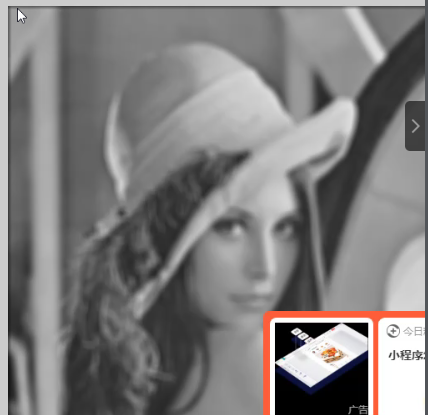

1. 导入图像

   1. ```matlab
      x = imread('lena.png'); //input image
      imshow(x);//show image
      ```

   2. 图像的地址为单引号

2. 创建滤波器

   1. ```
      h=fspecial(‘gaussian’);
      ```

      1. fspecial()：生成滤波器，参数为滤波器种类

   2. 滤波器分类：

      1. gaussian  高斯滤波器

         1. 创建滤波器：h=fspecial("gaussian" 10，15);

            1. 第一个参数为种类，使用单引号
            2. 第二个参数为其尺寸
            3. 第三个参数为方差

         2. 显示滤波器: 

            1. surf（h）：图像形式
            2. mesh（h）网格图像形式

         3. 将滤波器与图像进行绑定：

            ```
            y = imfilter(imageobj,fileter)
            ```

            1. 第一个参数为图像对象，第二个参数为滤波器对象，返回值为一个图像

         4. 

            1. ​	其有黑边

   3. 