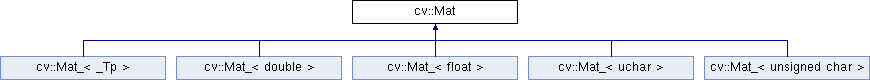

## Mat

1. Mat

    1. 用处：Mat类用来保存矩阵类型的数据信息，包括向量、矩阵、灰度或彩色图像等数据。

    2. 组成

        1. 矩阵头：矩阵的尺寸、存储方法、地址和引用次数等
            1. 矩阵头的大小是一个常数，不会随着矩阵尺寸大小而改变。
            2. 只有当矩阵的引用次数为0时才进行真正的析构
        2. 指向数据的指针
            1. 图像复制和传递过程中主要的开销是存放矩阵数据。为了解决这个问题，在OpenCV中复制和传递图像时，只是复制了矩阵头和指向存储数据的指针，因此在创建Mat类时可以先创建矩阵头后赋值数据
            2. 维护一个数据域，当进行引用时可以快速进行

    3. 成员数据类型

        1. double、float、uchar、unsigned char以及自定义的模板

        2. 

        3. **表2-1 OpenCV中的数据类型与取值范围**

            <table><tbody><tr><td><p><span style="font-size: 15px;"><strong>数据类型</strong></span></p></td><td><p><span style="font-size: 15px;"><strong>具体类型</strong></span></p></td><td><p><span style="font-size: 15px;"><strong>取值范围</strong></span></p></td></tr><tr><td><p><span style="font-size: 15px;">CV_8U</span></p></td><td><p><span style="font-size: 15px;">8位无符号整数</span></p></td><td><p><span style="font-size: 15px;">0—255</span></p></td></tr><tr><td><p><span style="font-size: 15px;">CV_8S</span></p></td><td><p><span style="font-size: 15px;">8位符号整数</span></p></td><td><p><span style="font-size: 15px;">-128—127</span></p></td></tr><tr><td><p><span style="font-size: 15px;">CV_16U</span></p></td><td><p><span style="font-size: 15px;">16位无符号整数</span></p></td><td><p><span style="font-size: 15px;">0-65535</span></p></td></tr><tr><td><p><span style="font-size: 15px;">CV_16S</span></p></td><td><p><span style="font-size: 15px;">16位符号整数</span></p></td><td><p><span style="font-size: 15px;">-32768—32767</span></p></td></tr><tr><td><p><span style="font-size: 15px;">CV_32S</span></p></td><td><p><span style="font-size: 15px;">32位符号整数</span></p></td><td><p><span style="font-size: 15px;">-2147483648—2147483647</span></p></td></tr><tr><td><p><span style="font-size: 15px;">CV_32F</span></p></td><td><p><span style="font-size: 15px;">32位浮点整数</span></p></td><td><p><span style="font-size: 15px;">-FLT_MAX—FLT_MAX, INF, NAN</span></p></td></tr><tr><td><p>CV_64F</p></td><td><p>64位浮点整数</p></td><td><p>-DBL_MAX—DBL_MAX, INF, NAN</p></td></tr></tbody></table>

    4.  图像数据的通道（Channel）：灰度图像数据是单通道数据，彩色图像数据是3通道或者4通道数据

        1. C1、C2、C3、C4分别表示单通道、双通道、3通道和4通道

        2. 数据通道即每一个像素由几部分组成，如灰度仅一部分，0-255，而彩色图像由三部分，如rgb，甚至有保护度和亮度

        3. 当通道数小于像素组成，则赋值时仅对其通道数的像素组成赋值

        4. eg：

            1. ```
                cv::Mat a(640,480,CV_8UC3) //创建一个640*480的3通道矩阵用于存放彩色图像
                cv::Mat a(3,3,CV_8UC1) //创建一个3*3的8位无符号整数的单通道矩阵
                cv::Mat a(3,3,CV_8U) //创建单通道矩阵C1标识可以省略
                ```

                

    5. 创建

        1. ```
            cv::Mat a; //创建一个名为a的矩阵头
            a = cv::imread(“test.jpg”); //向a中赋值图像数据，矩阵指针指向像素数据
            cv::Mat b=a; //复制矩阵头，并命名为b
            ```

        2. 上面这段代码首先创建了一个名为a的矩阵头，之后读入一张图像并将a中的矩阵指针指向该图像的像素数据，最后将a矩阵头中的内容复制到b矩阵头中。虽然a、b有各自的矩阵头，但是其矩阵指针指向的是同一个矩阵数据，通过任意一个矩阵头修改矩阵中的数据，另一个矩阵头指向的数据也会跟着发生改变。但是当删除a变量时，b变量并不会指向一个空数据，只有当两个变量都删除后，才会释放矩阵数据。因为矩阵头中引用次数标记了引用某个矩阵数据的次数，只有当矩阵数据引用次数为0的时候才会释放矩阵数据。

2. Mat创建

    1. 构造

        1. 默认构造函数

            1. cv::Mat::Mat();

        2. **根据输入矩阵尺寸和类型构造**

            ```
            cv::Mat::Mat( int  rows,
            
                       int  cols,
            
                       int  type
            
                      )
            ```

            1. 
                rows：构造矩阵的行数

                cols：矩阵的列数

                type：矩阵中存储的数据类型。此处除了CV_8UC1、CV_64FC4等从1到4通道以外，还提供了更多通道的参数，通过CV_8UC(n)中的n来构建多通道矩阵，其中n最大可以取到512.

            2. 利用size

                1. ```
                    cv::Mat::Mat(Size size(),
                    
                                   int  type
                    
                                   )
                    ```

                2. 二维图为Size(cols, rows)，行列颠倒

        3. **利用已有矩阵构造**

            1. ```
                cv::Mat::Mat( const Mat & m);
                ```

            2. ```
                cv::Mat::Mat(const Mat & m,
                
                               const Range & rowRange,
                
                               const Range & colRange = Range::all()
                
                               )
                ```

                1. m：已经构建完成的Mat类矩阵数据。
                2. rowRange：在已有矩阵中需要截取的行数范围，是一个Range变量，例如从第2行到第5行可以表示为Range(2,5)。

                3. colRange：在已有矩阵中需要截取的列数范围，是一个Range变量，例如从第2列到第5列可以表示为Range(2,5)，当不输入任何值时表示所有列都会被截取。

    2. 赋值

        1. 构造时进行赋值

            1. ```
                cv::Mat::Mat(int  rows,
                
                               int  cols,
                
                               int  type,
                
                               const Scalar & s
                
                               )
                ```

                

                1. rows：矩阵的行数

                2. cols：矩阵的列数

                3. type：存储数据的类型

                4. s：给矩阵中每个像素赋值的参数变量，例如Scalar(0, 0, 255)。

                5. eg：

                    1. ```
                        cv::Mat a(2, 2, CV_8UC3, cv::Scalar(0,0,255));//创建一个3通道矩阵，每个像素都是0，0，255
                        
                        cv::Mat b(2, 2, CV_8UC2, cv::Scalar(0,255));//创建一个2通道矩阵，每个像素都是0，255
                        
                        cv::Mat c(2, 2, CV_8UC1, cv::Scalar(255)); //创建一个单通道矩阵，每个像素都是255
                        ```

                        

            2. Scalar结构中变量的个数一定要与定义中的通道数相对应，如果Scalar结构中变量个数大于通道数，则位置大于通道数之后的数值将不会被读取，例如执行a(2, 2, CV_8UC2, Scalar(0,0,255))后，每个像素值都将是（0,0），而255不会被读取。如果Scalar结构中变量数小于通道数，则会以0补充。

                ## Mat类读取

                1. 常用属性

                    1. **Mat类矩阵的常用属性**

                        <table><tbody><tr><td><p style="text-align: left;"><span style="font-size: 15px;"><strong>属性</strong></span></p></td><td><p style="text-align: left;"><span style="font-size: 15px;"><strong>作用</strong></span></p></td></tr><tr><td><p style="text-align: left;"><span style="font-size: 15px;">cols</span></p></td><td><p style="text-align: left;"><span style="font-size: 15px;">矩阵的列数</span></p></td></tr><tr><td><p style="text-align: left;"><span style="font-size: 15px;">rows</span></p></td><td><p style="text-align: left;"><span style="font-size: 15px;">矩阵的行数</span></p></td></tr><tr><td><p style="text-align: left;"><span style="font-size: 15px;">step</span></p></td><td><p style="text-align: left;"><span style="font-size: 15px;">以字节为单位的矩阵的有效宽度（矩阵一行的字节数）</span></p></td></tr><tr><td><p style="text-align: left;"><span style="font-size: 15px;">elemSize()</span></p></td><td><p style="text-align: left;"><span style="font-size: 15px;">每个元素的字节数</span></p></td></tr><tr><td><p style="text-align: left;"><span style="font-size: 15px;">total()</span></p></td><td><p style="text-align: left;"><span style="font-size: 15px;">矩阵中元素的个数</span></p></td></tr><tr><td><p style="text-align: left;"><span style="font-size: 15px;">channels()</span></p></td><td><p style="text-align: left;"><span style="font-size: 15px;">矩阵的通道数</span></p></td></tr></tbody></table>

                        1. step：由于字节会进行补全，每一个行的大小可能大于实际数据的大小，防止访问到补全的位，使用step

                2. 读取

                    1. at

                        1. ```
                            cv::Mat a = (cv::Mat_<uchar>(3, 3) << 1, 2, 3, 4, 5, 6, 7, 8, 9);
                            int value = (int)a.at<uchar>(0, 0);
                            ```

                        2. 过at方法读取元素需要在后面跟上“<数据类型>”

                    2. 通过指针ptr读取Mat类矩阵中的元素

                        1. ```
                            cv::Mat b(3, 4, CV_8UC3, cv::Scalar(0, 0, 1));
                            for (int i = 0; i < b.rows; i++)
                            {
                            uchar* ptr = b.ptr<uchar>(i);
                            for (int j = 0; j < b.cols*b.channels(); j++)
                            {
                            cout << (int)ptr[j] << endl;
                            }
                            }
                            ```

                    3. 通过迭代器访问Mat类矩阵中的元素

                        1. ```
                            cv::MatIterator_<uchar> it = a.begin<uchar>();
                            cv::MatIterator_<uchar> it_end = a.end<uchar>();
                            for (int i = 0; it != it_end; it++)
                            {
                            cout << (int)(*it) << " ";
                            if ((++i% a.cols) == 0)
                            {
                            cout << endl;
                            }
                            }
                            ```

                    4. 通过矩阵元素地址定位方式访问元素

                        1. ```
                            (int)(*(b.data + b.step[0] * row + b.step[1] * col + channel));
                            ```

                        

                        