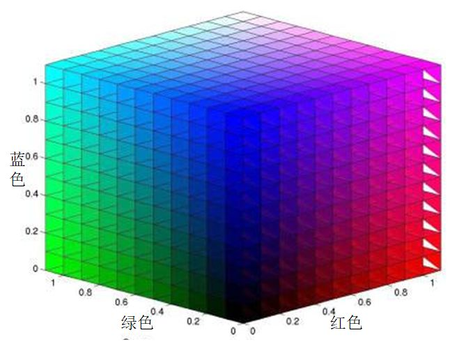
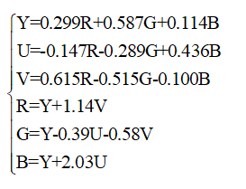
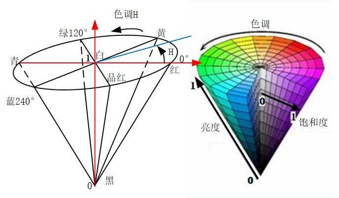
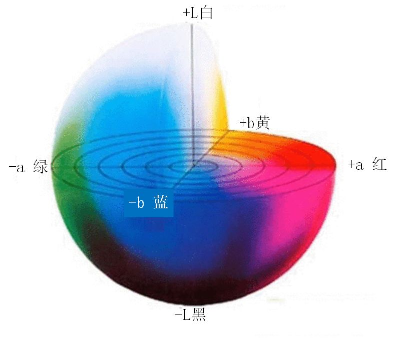
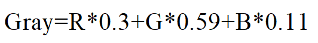
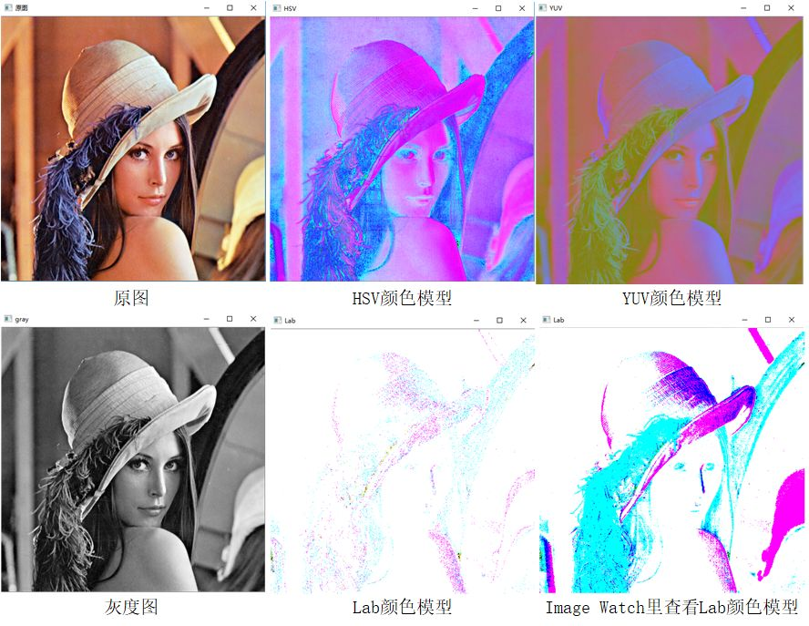
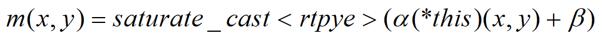

# 【从零学习OpenCV 4】颜色模型与转换

原创 小白 [小白学视觉](javascript:void(0);) *2019-11-17 10:05*

收录于合集#学习OpenCV 464个

点击上方“**小白学视觉**”，选择“**星标**”公众号

重磅干货，第一时间送达

' fill='%23FFFFFF'%3E%3Crect x='249' y='126' width='1' height='1'%3E%3C/rect%3E%3C/g%3E%3C/g%3E%3C/svg%3E)

经过几个月的努力，小白终于完成了市面上第一本OpenCV 4入门书籍《从零学习OpenCV 4》。为了更让小伙伴更早的了解最新版的OpenCV 4，小白与出版社沟通，提前在公众号上连载部分内容，请持续关注小白。


本小节中将介绍几种OpenCV 4中能够互相转换的常见的颜色模型，例如RGB模型、HSV模型、Lab模型、YUV模型以及GRAY模型，并介绍这几种模型之间的数学转换关系，以及OpenCV 4中提供的这几种模型之间的变换函数。


1


01


RGB颜色模型

前面对于RGB颜色模型已经有所介绍，该模型的命名方式是采用三种颜色的英文首字母组成，分别是红色（Red）、绿色（Green）和蓝色（Blue）。虽然该颜色模型的命名方式是红色在前，但是在OpenCV中却是相反的顺序，第一个通道时蓝色（B）分量，第二个通道时绿色（G）分量，第三个通道时红色（R）分量。根据存储顺序的不同，OpenCV 4中提供了这种顺序的反序格式，用于存储第一个通道是红色分量的图像，但是这两种格式的图像的颜色空间是相同的，颜色空间如图3-1所示。三个通道对于颜色描述的范围是相同的，因此RGB颜色模型的空间构成是一个立方体。在RGB颜色模型中，所有的颜色都是由这三种颜色通过不同比例的混合得到，如果三种颜色分量都为0，则表示为黑色，如果三种颜色的分量相同且都为最大值，则表示为白色。每个通道都表示某一种颜色由0到1的过程，不同位数的图像表示将这个颜色变化过程细分成不同的层级，例如8U3C格式的图像每个通道将这个过程量化成256个等级，分别由0到255表示。在这个模型的基础上增加第四个通道即为RGBA模型，第四个通道表示颜色的透明度，当没有透明度需求的时候，RGBA模型就会退化成RGB模型。



' fill='%23FFFFFF'%3E%3Crect x='249' y='126' width='1' height='1'%3E%3C/rect%3E%3C/g%3E%3C/g%3E%3C/svg%3E)

图3-1 RGB颜色空间模型

1


02


 YUV颜色模型

YUV模型是电视信号系统所采用的颜色编码方式。这三个变量分别表示是像素的亮度（Y）以及红色分量与亮度的信号差值（U）和蓝色与亮度的差值（V）。这种颜色模型主要用于视频和图像的传输，该模型的产生与电视机的发展历程密切相关。由于彩色电视机在黑白电视机发明之后才产生，因此用于彩色电视机的视频信号需要能够兼容黑白电视机。彩色电视机需要三个通道的数据才能显示彩色，而黑白电视机只需要一个通道的数据即可，因此为了使视频信号能够兼容彩色电视与黑白电视，将RGB编码方式转变成YUV的编码方式，其Y通道是图像的亮度，黑白电视只需要使用该通道就可以显示黑白视频图像，而彩色相机通过将YUV编码转成RGB编码方式，便可以在彩色电视种显示彩色图像，较好的解决了同一个视频信号兼容不同类型电视的问题。RGB模型与YUV模型之间的转换关系如式所示，其中RGB取值范围均为0-255。



1


03


HSV颜色模型

HSV是色度（Hue）、饱和度（Saturation）和亮度（Value）的简写，通过名字也可以看出来该模型通过这三个特性对颜色进行描述。色度是色彩的基本属性，就是平时常说的颜色，例如红色，蓝色等；饱和度是指颜色的纯度，饱和度越高色彩越纯越艳，饱和度越低色彩则逐渐地变灰变暗，饱和度的取值范围是由0到100%；亮度是颜色的明亮程度，其取值范围由0到计算机中允许的最大值。由于色度、饱和度和亮度的取值范围不同，因此其颜色空间模型用锥形表示，其形状如图3-2所示。相比于RGB模型三个颜色分量与最终颜色联系不直观的缺点，HSV模型更加符合人类感知颜色的方式：颜色、深浅以及亮暗。




图3-2 HSV颜色空间模型

1


04


Lab颜色模型

Lab颜色模型弥补了RGB模型的不足，是一种设备无关的颜色模型，是一种基于生理特征的颜色模型。在模型中L表示亮度（Luminosity），a和b是两个颜色通道，两者的取值区间都是由-128到+127，其中a通道数值由小到大对应的颜色是从绿色变成红色，b通道数值由小到大对应的颜色是由蓝色变成黄色。其构成的颜色空间是一个球形，形式如图3-3所示。


图3-3 Lab颜色空间模型

1


05 


GRAY颜色模型

GRAY模型并不是一个彩色模型，他是一个灰度图像的模型，其命名使用的是英文单词gray的全字母大写。灰度图像只有单通道，灰度值根据图像位数不同由0到最大依次表示由黑到白，例如8UC1格式中，由黑到白被量化成了256个等级，通过0-255表示，其中255表示白色。彩色图像具有颜色丰富、信息含量大的特性，但是灰度图在图像处理中依然具有一定的优势。例如，灰度图像具有相同尺寸相同压缩格式所占容量小，易于采集，便于传输等优点。常用的RGB模型转成灰度图的方式如式中所示。



1


06 


不同颜色模型间的互相转换

针对图像不同颜色模型之间的相互转换，OpenCV 4提供了cvtColor()函数用于实现转换功能，该函数的函数原型在代码清单3-1中给出。


```
代码清单3-1 cvtColor()函数原型
void cv::cvtColor(InputArray src,
                     OutputArray dst,
                     int code,
                     int dstCn = 0
                     )
```


- src：待转换颜色模型的原始图像。

- dst：转换颜色模型后的目标图像。

- code：颜色空间转换的标志，如由RGB空间到HSV空间。常用标志及含义在表3-1中给出。

- dstCn：目标图像中的通道数，如果参数为0，则从src和代码中自动导出通道数。

    

函数用于将图像从一个颜色模型转换为另一个颜色模型，前两个参数用于输入待转换图像和转换颜色空间后目标图像，第三个参数用于声明该函数具体的转换模型空间，常用的标志在表3-1中给出，读者可以自行查阅OpenCV 4的教程了解详细的标志。第四个参数在一般情况下不需要特殊设置，使用默认参数即可。需要注意的是该函数变换前后的图像取值范围，由于8位无符号图像的像素由0到255，16位无符号图像的像素由0-65535，而32位浮点图像的像素是由0到1，因此一定要注意目标图像的像素范围。在线性变换的情况下，范围问题不需要考虑，目标图像的像素不会超出范围。如果在非线性变换的情况下，应将输入RGB图像归一化到适当的范围以内获得正确的结果，例如将8位无符号图像转成32位浮点图像，需要先将图像像素通过除以255缩放到0到1范围内，以防止产生错误结果。


**注意**

如果转换过程中添加了alpha通道（RGB模型中第四个通道，表示透明度），则其值将设置为相应通道范围的最大值：CV_8U为255，CV_16U为65535，CV_32F为1


**表3-1 cvtColor()函数颜色模型转换常用标志参数**

| **标志参数**   | **简记** | **作用**                       |
| -------------- | -------- | ------------------------------ |
| COLOR_BGR2BGRA | 0        | 对RGB图像添加alpha通道         |
| COLOR_BGR2RGB  | 4        | 彩色图像通道颜色顺序的更改     |
| COLOR_BGR2GRAY | 10       | 彩色图像转成灰度图像           |
| COLOR_GRAY2BGR | 8        | 灰度图像转成彩色图像（伪彩色） |
| COLOR_BGR2YUV  | 82       | RGB颜色模型转成YUV颜色模型     |
| COLOR_YUV2BGR  | 84       | YUV颜色模型转成RGB颜色模型     |
| COLOR_BGR2HSV  | 40       | RGB颜色模型转成HSV颜色模型     |
| COLOR_HSV2BGR  | 54       | HSV颜色模型转成RGB颜色模型     |
| COLOR_BGR2Lab  | 44       | RGB颜色模型转成Lab颜色模型     |
| COLOR_Lab2BGR  | 56       | Lab颜色模型转成RGB颜色模型     |


为了直观的感受同一张图像在不同颜色空间中的样子，在代码清单3-2中给出了前面几种颜色模型互相转换的程序，运行结果如图3-4所示。需要说明的是Lab颜色模型具有负数，而通过imshow()函数显示的图像无法显示负数，因此在结果中给出了Image Watch插件显示图像在Lab模型中的样子。在程序中，我们为了防止转换后出现数值越界的情况，先将CV_8U类型转成CV_32F类型后再进行颜色模型的转换。


```
代码清单3-2 myCvColor.cpp图像颜色模型互相转换
1.  #include <opencv2\opencv.hpp>
2.  #include <iostream>
3.  #include <vector>
4.  
5.  using namespace std;
6.  using namespace cv;
7.  
8.  int main()
9. {
10.    Mat img = imread("lena.png");
11.    if (img.empty())
12.    {
13.      cout << "请确认图像文件名称是否正确" << endl;
14.      return -1;
15.    }
16.    Mat gray, HSV, YUV, Lab, img32;
17.    img.convertTo(img32, CV_32F, 1.0 / 255); //将CV_8U类型转换成CV_32F类型
18.    //img32.convertTo(img, CV_8U, 255); //将CV_32F类型转换成CV_8U类型
19.    cvtColor(img32, HSV, COLOR_BGR2HSV);
20.    cvtColor(img32, YUV, COLOR_BGR2YUV);
21.    cvtColor(img32, Lab, COLOR_BGR2Lab);
22.    cvtColor(img32, gray, COLOR_BGR2GRAY);
23.    imshow("原图", img32);
24.    imshow("HSV", HSV);
25.    imshow("YUV", YUV);
26.    imshow("Lab", Lab);
27.    imshow("gray", gray);
28.    waitKey(0);
29.    return 0;
30.  }
```




图3-4 RGB彩色图像向不同颜色模型转换结果


程序中我们利用了OpenCV 4中Mat类自带的数据类型转换函数convertTo()，在平时使用图像数据时也会经常遇到不同数据类型转换的问题，因此接下来将详细介绍该转换函数的使用方式，在代码清单3-3中给出了该函数的函数原型。


```
代码清单3-3 convertTo()函数原型
void cv::Mat::convertTo(OutputArry m,
                            int rtype,
                            double alpha = 1,
                            double beta = 0
                            )
```


- m：转换类型后输出的图像。
- rtype：转换图像的数据类型。
- alpha：转换过程中的缩放因子。
- beta：转换过程中的偏置因子。


该函数用来实现将已有图像转换成指定数据类型的图像，第一个参数用于输出转换数据类型后的图像，第二个参数用于声明转换后图像的数据类型。第三个与第四个参数用于声明两个数据类型间的转换关系，具体转换形式如式所示。



通过转换公式可以知道该转换方式就是将原有数据进行线性转换，并按照指定的数据类型输出。根据其转换规则可以知道，该函数不仅能够实现不同数据类型之间的转换，还能实现在同一种数据类型中的线性变换。我们在代码清单3-2中给出了CV_8U类型和CV_32F类型之间互相转换的示例，其他类型之间的互相转换与此类似，这里不再赘述，读者可以自行探索，通过实践体会该函数的使用方法。


 