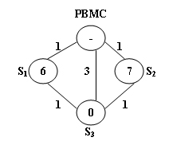

### Public Bike Management (30)

时间限制 1000 ms 内存限制 65536 KB 代码长度限制 100 KB 判断程序 Standard (来自 [小小](https://www.nowcoder.com/profile/59))

### **题目描述**

There is a public bike service in Hangzhou City which provides great convenience to the tourists from all over the world.  One may rent a bike at any station and return it to any other stations in the city.  
 The Public Bike Management Center (PBMC) keeps monitoring the real-time capacity of all the stations.  A station is said to be in _perfect_ condition if it is exactly half-full.  If a station is full or empty, PBMC will collect or send bikes to adjust the condition of that station to perfect.  And more, all the stations on the way will be adjusted as well.   
 When a problem station is reported, PBMC will always choose the shortest path to reach that station.  If there are more than one shortest path, the one that requires the least number of bikes sent from PBMC will be chosen.  
    
 Figure 1  
 Figure 1 illustrates an example.  The stations are represented by vertices and the roads correspond to the edges.  The number on an edge is the time taken to reach one end station from another.  The number written inside a vertex S is the current number of bikes stored at S. Given that the maximum capacity of each station is 10.  To solve the problem at S3 , we have 2 different shortest paths:  
 1. PBMC -> S1 -> S3 .  In this case, 4 bikes must be sent from PBMC, because we can collect 1 bike from S1 and then take 5 bikes to S3 , so that both stations will be in perfect conditions.  
 2. PBMC -> S2 -> S3 .  This path requires the same time as path 1, but only 3 bikes sent from PBMC and hence is the one that will be chosen.

  

### **输入描述:**

Each input file contains one test case.  For each case, the first line contains 4 numbers: Cmax (<= 100), always an even number, is the maximum capacity of each station; N (<= 500), the total number of stations; Sp, the index of the problem station (the stations are numbered from 1 to N, and PBMC is represented by the vertex 0); and M, the number of roads.  The second line contains N non-negative numbers Ci (i=1,...N) where each  Ci is the current number of bikes at Si respectively.  Then M lines follow, each contains 3 numbers: Si, Sj, and Tij which describe the time Tij taken to move betwen stations Si and Sj.  All the numbers in a line are separated by a space.

  

### **输出描述:**

For each test case, print your results in one line.  First output the number of bikes that PBMC must send.  Then after one space, output the path in the format: 0->S1\->...->Sp.  Finally after another space, output the number of bikes that we must take back to PBMC after the condition of Sp is adjusted to perfect.  
Note that if such a path is not unique, output the one that requires minimum number of bikes that we must take back to PBMC.  The judge's data guarantee that such a path is unique.

  

### **输入例子:**

10 3 3 5
6 7 0
0 1 1
0 2 1
0 3 3
1 3 1
2 3 1

  

### **输出例子:**

3 0->2->3 0