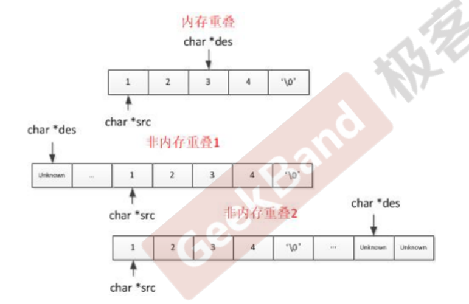

1. 根据输入规模判断算法复杂度
   1. 若n<1000，则 O (n^2), O(n^2 log n)
   2. n<=50000, O (n log n), O(n log^2^ n),O( n)  

2. c语言常见坑

   1. 内存重叠的处理 

      1. 内存重叠情况

      2. 仅当目的初始地址在源数组中间时出现内存重叠，此时需要从后往前进行复制

      3. 错误代码：

         1. ```
            void *memmove(void *dest, const void *src, 
            size_t n) 
            { 
             char *p1 = dest; 
             char *p2 = src; 
             
             while (*p2 != \0) 
             *p1++ = *p2++;
             return p1; 
            }
            C语⾔的陷
            ```

            

      4. 正确代码：

         1. ```
            void *memmove(void *dest, const void *src, size_t n) 
            { 
             char *p1 = dest; 
             const char *p2 = src; 
             
             if (p2 < p1) { 
             p2 += n; 
             p1 += n; 
             while (n-- != 0) 
             *--p1 = *--p2; 
             } else { 
             while (n-- != 0) 
             *p1++ = *p2++; 
             } 
             return p1; 
            }
            
            ```

            

   2.  临时变量太多或者没安全释放 

   3. 没有测试内存越界 

   4. 指针操作不熟悉

3. 面试考察的编程基本功

   1. 程序⻛格（缩进，括号，变量名）
      1. 使用tab键缩进
      2. 括号的位置
      3. 变量的命名规范

   2.  编码习惯（异常检查，边界处理）
      1. 边界检查

   3.  沟通（让⾯试官时刻明⽩你的意图） 
      1. 编码时告知自己的意图

   4. 测试（主动写出合理的Testcase）
      1. 工作中自动化测试

4. 代码⻛格 

   1. 代码块可为三⼤块：异常处理（空串和边界处理），主体，返回 
   2. 代码⻛格(可参考Google的编程语⾔规范)  
      1. • 变量名的命名(有意义的变量名)  
      2. • 缩进(语句块) 
      3.  • 空格(运算符两边)  
      4. • 代码可读性(即使if语句只有⼀句也要加花括号)

5. 基本代码素养

   1. 关于空格 ：⽤空⾏把⼤块代码分成逻辑上的“段落 
   2. 关于括号 ：C 指针中的指针符靠近类型名，如写成int* p，⽽不写成int *p  ⼀个函数只专注做⼀件事 关于命名

6. 实战算法策略 

   1. 总结归类相似题
   2.  找出适合同⼀类题
   3. 的模板程序 
   4. 对基础题熟练掌握


