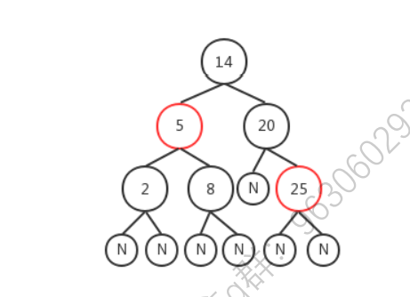
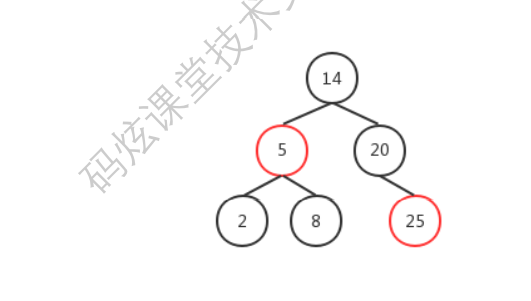

1. 红黑树是一种结点带有颜色属性的二叉查找树，但它在二叉查找树之外，还有以下5大性质： 
    1. 节点是红色或黑色。
    2.  根是黑色。 
    3. 所有叶子都是黑色（叶子是NIL节点，这类节点不可以忽视，否则代码会看不懂）。
    4.  每个红色节点必须有两个黑色的子节点。（从每个叶子到根的所有路径上不能有两个连续的红色节 点。） 
    5. 从任一节点到其每个叶子的所有简单路径都包含相同数目的黑色节点（黑色平衡）。 下图就是一个典型的红黑树：
    6. 
    7. 但实现上我省略了其中的 Nil 结点，一般如下图，大家理解时也可以忽略它们。
    8. 
    9. 