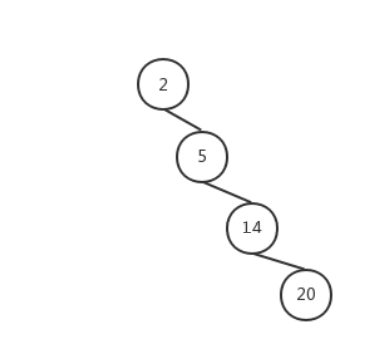

1. 我们知道二叉查找树在不停地添加或删除结点后，可能会导致结点情况如下：
1. 这种情况下，二叉查找树的查找效率最坏会降低为 O(n) 。 而红黑树由于在插入和删除结点时都会进行变色旋转等操作，在符合红黑树条件的情况下，即使一边子 树全是黑色结点，另一边子树全是红黑相间，两子树的高度差也不会超过一半。一棵有 n 个结点的红黑 树高度至多为 2log(n+1) ，查找效率最坏为 O(log(n)) 。 所以红黑树常被用于需求查找效率稳定的场景，如 Linux 中内核使用它管理内存区域对象、Java8 中 HashMap ，TreeMap的实现等，所以了解红黑树也很有意义。
1. 相关问题
    1. 为什么要加上颜色？
        加上颜色是为了分出谁是代表，因为2-3-4节点的键值包括有1、2、3三种，我们要把1、2、3都转换成1个键值的二叉树节点只能是当存在2个或者3个键值的时候选一个键值作为代表，这个代表我们给染成黑色，其他的键值染成红色节点，表示一种附属关系。
    1. 根节点为啥必须是红色？
        你说的不对，根节点必须是黑色。因为2-3-4树是一层一层的，我们选取的这个黑色代表还有一个特性就是一个黑色标识节点处于某一层中，正好和2-3-4树中的某一层对应起来了。
    1. 为啥黑色必须在上面？
        因为4节点的存在，会导致出现1黑2红的问题，这样黑节点只有在父节点的位置才能链接到2个红节点上。
        那么你想强行把红色作为父节点，黑色作为左或者右节点来处理（所有的节点都遵循这一约定），又会因为根节点是黑色的，导致这一约定不可行。那如果你又把根节点做特殊情况处理，也就是说 你把根节点做特殊情况处理，其他非根节点一旦遇到黑节点，那么黑节点放在红节点的左子树上，做出这一些列约定之后，应该是可以的。但是这样做太繁琐了，并且由于特殊情况的存在编码的时候非常的繁琐。而把黑节点作为红节点的父节点就非常的自然。