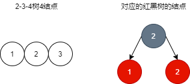
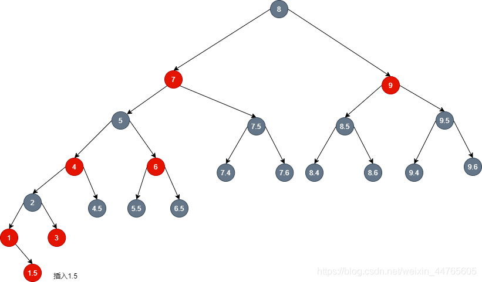
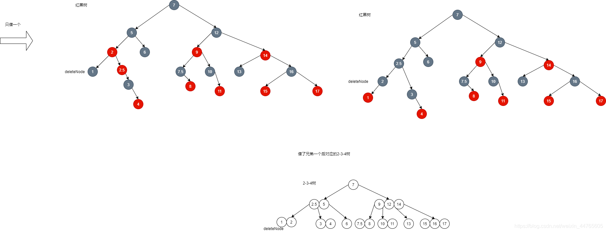
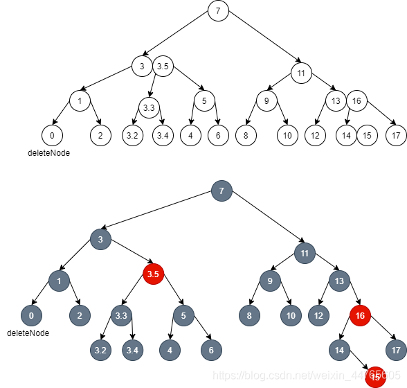
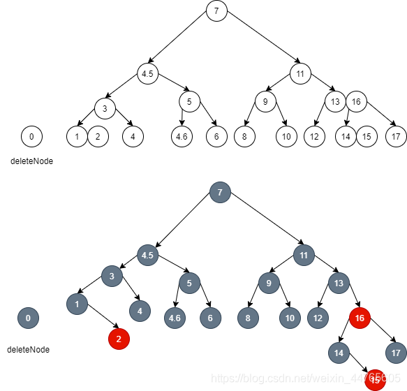

## 1.红黑树简介

- 红黑树是一种二叉搜索树，是一种黑色结点平衡的树。它是一种特化的AVL树，不需要整棵树都像AVL树一样严格平衡，只需要黑色结点平衡即可。这里的黑色结点平衡的意思是从树上任意结点，它到它的所有叶子结点路径上的黑色结点数目都相同。
- 红黑树其实是2-3-4树（b树的一种）的一种对应形式。
- **2-3-4 树**在[计算机科学](https://baike.baidu.com/item/%E8%AE%A1%E7%AE%97%E6%9C%BA%E7%A7%91%E5%AD%A6)中是阶为 4 的[B树](https://baike.baidu.com/item/B%E6%A0%91)。大体上同[B树](https://baike.baidu.com/item/B%E6%A0%91)一样，2-3-4 树是可以用做[字典](https://baike.baidu.com/item/%E5%AD%97%E5%85%B8)的一种自平衡[数据结构](https://baike.baidu.com/item/%E6%95%B0%E6%8D%AE%E7%BB%93%E6%9E%84)。它可以在[O](https://baike.baidu.com/item/O)（log _n_）时间内查找、插入和删除，这里的 _n_ 是树中元素的数目。（来源百度百科）

## 2.红黑树对应2-3-4树

### 2.1.对应2结点


- 一个2-3-4树的2结点对应到红黑树只是一个黑色结点。

### 2.2.对应3结点


- 2-3-4树的3结点对应到红黑树上有两种结构，由此可以看出，一棵2-3-4的b树对应多棵不同结构的红黑树，一棵红黑树只对应一棵b树。

### 2.3.对应4结点



- 2-3-4树的4结点对应到红黑树上是一种结构。

### 2.4.对应一棵较为完整的2-3-4树

- 随意画的一棵2-3-4树。对于一棵2-3-4树来说，2结点有一个元素与两个儿子结点，3结点有两个元素与三个儿子结点，4结点有三个元素与4个儿子结点。除了叶子结点以外的所有非叶子结点的儿子都是满的，而叶子结点都是没儿子的。这样保证了整棵树都是满的，同时每个结点的子树都是等高的，也就是从任意结点开始，往下任意路径搜索，到叶子的距离都是相等的。


- 将红黑树折叠一下：


- 可以看到折叠后就是一棵2-3-4树。

## 3.红黑树的性质以及解释

### 3.1.五个性质

1. 结点是红色或黑色。
2. 根是黑色。
3. 所有叶子都是黑色（叶子是NULL结点，这类结点不能忽略）。
4. 每个红结点必须有两个黑色的子结点（从每个叶子到根的所有路径上不能有两个连续的红色结点）。
5. 从任一结点到其每个叶子的所有简单路径都包含相同数目的黑色结点（黑色平衡）。

接下来从红黑树与2-3-4树的对照中解释性质。

### 3.2.第一个性质

- 对应到2-3-4树中，对于每个结点，它里面有1到3个元素，每个元素对应到红黑树中就是一个结点。为了让红黑树能对应2-3-4树，于是就有了红色结点和黑色结点的概念。
- 红黑树里的黑结点和它的红儿子结点一起对应了2-3-4树里的一个**结点a**。黑结点的父亲，在2-3-4树里是是属于**结点a**的父亲结点的元素。红黑树里黑结点存在的意义就是让上面的结点知道下面是一个儿子（2-3-4树里的儿子）。而红结点的意义就是在红黑树里作为黑结点的儿子，对应到2-3-4树里就是和它的黑结点父亲一起作为一个2-3-4树的结点。


- 如图，这是一棵2-3-4树，如果对应到红黑树，要怎么让上面的结点知道下面的结点a是儿子呢？


- 如图：红黑树里的黑结点3，往左，遇到红结点2，于是就知道它和这个红结点2作为两个元素组成2-3-4树里的结点b了；
- 红黑树里红结点2往左遇到黑结点儿子，于是红结点2就知道了黑结点1是对应到2-3-4树里是属于它的儿子了。
- 因此，如果红黑树里一个结点x的一个儿子是红色结点，那么这个红色结点在2-3-4树里不是结点x的儿子。如果红黑树里一个结点x的儿子是黑结点，那么这个黑结点对应到2-3-4树里，是结点x的儿子。

### 3.3.第二个性质

- 对于根结点，它的父亲是null，如果根结点是红结点，它不可能和null组成一个2-3-4树里的结点。因此根结点为黑色，黑色的结点是能作为单独的一个对应于2-3-4树的结点，但是红色结点不行。

### 3.4.第三个性质

- 所有的null都看成黑结点，如果看成红结点，对于叶子结点为红色的结点来说，可以看成null要和红结点组成一个2-3-4树的结点，但这是不可能的，因为红色结点只会找自己的父亲黑结点组成一个对应到2-3-4树里的结点。所以null看成黑结点。黑结点即使儿子都没有红，那么自己也能直接对应到2-3-4树里的结点。

### 3.5.第四个性质

- 如果红结点父亲为红结点，也即出现连续的红色结点，那么下面的红色结点不知道找谁组成一个对应到2-3-4树里的结点，毕竟红结点只找父亲黑结点组成对应的2-3-4树里的结点。

### 3.6.第五个性质

- 对于2-3-4树，每一层都是满的，从叶子到根的距离都一样，而此时对于2-3-4树每一层的结点转为红黑树后都有一个与之对应的黑结点，所以对于红黑树的任意结点到叶子结点的简单路径有相同黑色结点个数就是对应2-3-4树当前层到叶子结点那层的任意叶子结点的距离相同的意思。

## 4.红黑树的插入

### 4.1.红黑树的结点以及结构

```java
public class RBTree<K extends Comparable<K>, V> {

    /**
     * 黑
     */
    private static final boolean BLACK = true;

    /**
     * 红
     */
    private static final boolean RED = false;

    /**
     * 根结点
     */
    private RBNode<K, V> root;

    static class RBNode<K extends Comparable<K>, V> {

        /**
         * key
         */
        private final K key;

        /**
         * value
         */
        private V value;

        /**
         * 父结点
         */
        private RBNode<K, V> parent;

        /**
         * 左结点
         */
        private RBNode<K, V> left;

        /**
         * 右结点
         */
        private RBNode<K, V> right;

        /**
         * 颜色: 默认红色
         */
        private boolean color;

        /**
         * 构造器
         * @param key    key
         * @param value  value
         * @param parent 父结点, null代表为根
         */
        public RBNode(K key, V value, RBNode<K, V> parent) {
            this.key = key;
            this.value = value;
            this.parent = parent;
        }

        /**
         * 获取结点的value
         * @return value
         */
        public V getValue() {
            return value;
        }

        /**
         * 获取结点的颜色
         * @return color
         */
        public boolean isColor() {
            return color;
        }

        /**
         * 获取结点的左儿子
         * @return left
         */
        public RBNode<K, V> getLeft() {
            return left;
        }

        /**
         * 获取结点的右儿子
         * @return right
         */
        public RBNode<K, V> getRight() {
            return right;
        }
    }

    /**
     * 获取根结点
     * @return 返回根
     */
    public RBNode<K, V> getRoot() {
        return this.root;
    }
    
}
```

### 4.2.右旋

- 如图：


- 代码实现：

```java
    /**
     * 右旋操作, 围绕结点node右旋
     * @param node 要右旋的结点
     */
    private void rightRotate(RBNode<K, V> node) {
        if (node != null) {
            // 1.新的代替node位置的结点
            RBNode<K, V> nl = node.left;
            node.left = nl.right;
            if (nl.right != null) {
                // 挂到node左边的结点要修改自己的父亲
                nl.right.parent = node;
            }
            // 2.修改新结点nl的父亲为旧结点node的父亲
            nl.parent = node.parent;
            if (node.parent == null) {
                // 如果旧结点的父亲为null, 说明原来的旧结点时根结点
                this.root = nl;
            } else if (node.parent.left == node) {
                // 修改父结点的左结点为新结点
                node.parent.left = nl;
            } else {
                // 修改父结点的右结点为新结点
                node.parent.right = nl;
            }
            // 3.旧结点node下沉为新结点nl的儿子结点
            nl.right = node;
            node.parent = nl;
        }
    }
```

- 左旋操作相反。

### 4.3.插入步骤

#### 4.3.1.找到插入位置

- 因为红黑树是一棵二叉排序树，所以可以通过二叉查找的方式找到插入位置，插入位置都是对应到2-3-4树的叶子结点。

```java
    /**
     * 新增操作
     * @param key   key
     * @param value value
     */
    public void put(K key, V value) {
        if (key == null) {
            // 异常判断
            throw new NullPointerException();
        }
        // 1.构建新结点并判断是否是根结点
        RBNode<K, V> curNode = this.root;
        if (curNode == null) {
            // 如果插入的位置是根结点, 直接赋值即可(根结点需要染黑)
            this.root = new RBNode<>(key, value, null);
            this.root.color = BLACK;
            return;
        }

        // 2.如果插入的位置不是根结点, 则寻找插入位置
        RBNode<K, V> parent;
        int compareResult;
        do {
            // 沿着根结点寻找插入位置
            parent = curNode;
            compareResult = key.compareTo(curNode.key);
            if (compareResult < 0) {
                // 如果大于0, 则要插入的结点key大, 小于0则要插入的结点key更小
                curNode = curNode.left;
            } else if (compareResult > 0) {
                curNode = curNode.right;
            } else {
                // 如果要插入的结点的key早已存在, 则只替换value
                curNode.value = value;
                return;
            }
        } while (curNode != null);
        // 找到要插入的位置, 构建一个红结点并插入
        RBNode<K, V> node = new RBNode<>(key, value, parent);
        // 插入到parent的哪个位置
        if (compareResult < 0) {
            parent.left = node;
        } else {
            parent.right = node;
        }

        // 3.结点挂到树上后, 判断是否要调整(调整: 旋转+变色)
        fixAfterPut(node);
    }
```

- 插入结束后要调整。

#### 4.3.2.插入后调整

- 插入后可以分以下几种情况：


- 对于除了情况f以外的插入，都是插入到2结点、3结点中，可以通过旋转，变色后，变成一棵合法的红黑树，同时能够对应3结点或4结点，而且对应的2-3-4树里的层数（高）是不变的。
- 对于情况f，插入后需要对插入结点的父亲和叔叔染黑，然后祖父染红，这里对应到2-3-4树就相当于分裂。这一种情况是可能导致整棵2-3-4树变高的。如下图：


- 插入1.5，插入的位置就在叶子结点的1和2之间，再看对应的红黑树：



- 此时2-3-4树：


- 此时右下的叶子结点是一个5结点，不满足2-3-4树，因此需要裂开了，对应到红黑树，就是结点1和结点3染黑，结点2染红（相当于2-3-4树的往上插入）：


- 此时结点2染红往上插入，于是在红黑树中出现连续的红，而且祖父的两个儿子都是红，对应到2-3-4树里就是一个5结点了，但是很明显5结点不合法，于是再根据情况f那样，染黑结点2的父亲和叔叔，染红结点5，结点5相当于往上插入：


- 此时依然不合法，而且还是情况f，于是继续按照情况f的解决方法去解决。


- 此时因为结点8无法往上插入了，那么自己就作为根结点，染黑自己，同时对应的2-3-4树也长高了。


- 如果在往上插入过程中，遇到的不是4结点，而是3结点，同时对应红黑树里遇到的不是黑结点（遇到黑结点就能停止插入了），而是红结点的话，在红黑树中通过旋转和染色即可将连续的红结点改变，同时2-3-4树中没有变化，如图：


- 此时结点2染红后往上插入，因为插入后是5结点，因此需要往上插入结点5：


- 插入后，发现上一层能够容纳结点5，于是结束往上插入，同时2-3-4树层数不变，但如果遇到下面一种情况：


- 继续往上插入结点2，发现是5结点，于是裂开中间那个结点5上去，在2-3-4树中看来，元素8元素9组成的结点是能接纳上来的元素5的，但是在红黑树中则遇到了连续的红了，违背了红黑树的性质：


- 因此我们要做的是，将结点8转为对应2-3-4树里的中间元素，通过右旋和染色（其实这个就是情况b的解决方式）：


- 插入成功，红黑树也符合性质。
  
- 综上，红黑树的插入归类为三种情况（对于左和右的当成一种）：
  
    - 第一种：插入结点插入后，父结点为黑色，不需要再做其它动作。
    - 第二种，插入结点插入后，父结点为红色，但叔叔结点不为红，出现连续的两个红结点（因为插入结点初始为红），因此需要通过旋转使得父结点作为对应的2-3-4树里的中间结点。
        - 如果不是同一个方向的连续，则需要对父结点进行旋转，旋转后父结点在下面，插入结点在上面，此时将插入结点改为旧的父结点，然后就能继续转为情况二了。
    - 第三种，插入结点插入后，父结点、叔叔结点为红色，则需要染黑父亲和叔叔，染红爷爷；对应到2-3-4树里就是裂开原先由父、叔、祖父三个元素组成的结点，然后爷爷往上插入，具体过程可以参考前面的图。
- 调整代码：
  

```java
    /**
     * 插入后调整node
     * @param node node
     */
    private void adjustAfterPut(RBNode<K, V> node) {
        while (node != this.root && colorOf(node.parent) == RED) {
            if (colorOf(node.parent.parent.left) == RED && colorOf(node.parent.parent.right) == RED) {
                // 插入4结点的情况
                node.parent.parent.left.color = BLACK;
                node.parent.parent.right.color = BLACK;
                node.parent.parent.color = RED;
                node = node.parent.parent;
            } else {
                // 插入3结点的情况
                if (node.parent == node.parent.parent.left) {
                    // npp一定为黑, 否则np和npp连续为红, 不可能之前put没调整
                    if (node.parent.right == node) {
                        node = node.parent;
                        leftRotate(node);
                    }
                    node.parent.color = BLACK;
                    node.parent.parent.color = RED;
                    rightRotate(node.parent.parent);
                } else {
                    if (node.parent.left == node) {
                        node = node.parent;
                        rightRotate(node);
                    }
                    node.parent.color = BLACK;
                    node.parent.parent.color = RED;
                    leftRotate(node.parent.parent);
                }
                node = this.root;
            }
        }
        // 如果不断往上插入, 最后一个红结点找不到还能插入的地方, 那么自己就变为一个新的2结点, 增加一层
        this.root.color = BLACK;
    }
```

## 5.红黑树的删除

接下来是最麻烦的删除了。

### 5.1.删除结点的情况

删除分为三种情况：

- 第一种，删除叶子结点；（这种最麻烦）
- 第二种，删除只有一个孩子的结点；
- 第三种，删除有两个孩子的结点。

### 5.2.删除结点的解决方法

#### 5.2.1.情况1

- 删除叶子结点，如果是红色结点，那么对应到2-3-4树里，就是叶子结点里的一个元素，直接删除即可。
- 但是如果是黑色结点，那么对应到2-3-4树里，就是一个2结点叶子结点，删除后整棵2-3-4树就不满足2-3-4树的性质了，因为叶子不是满的了，对应到红黑树上，相当于从根结点出发，到所有的叶子，有一条路径上黑色结点数比其它路径上黑色结点数少1个，不满足红黑树的第5个性质，因此需要调整。
- 调整的情况后面单独说。

#### 5.2.2.情况2

- 此时情况2要删除的结点只有一个儿子，这个儿子结点一定为红色结点，因此只需要将这个红色结点替换这个要被删除的结点即可。

#### 5.2.3.情况3

- 如果删除的结点有两个儿子，那么可以通过找前驱或后继的方式从对应的2-3-4树的叶子上找到一个结点来替换它，然后删除替换的结点，这样就能转为情况1和情况2了。（颜色也要替换）
  
- 替换结点要么没有儿子，要么只有一个。
  
- 如图：
  


- 如果删除结点7，那么只需要找前驱结点6.5替换即可，替换后，删除6.5位置的结点，这种是情况2。
- 如果找后继结点替换，此时找的是结点8，替换后，删除8位置的结点即可，这种是情况1。

#### 5.2.4.删除代码

```java
    /**
     * 根据key移除结点
     * @param key key
     * @return    返回被移除的结点的value
     */
    public V remove(K key) {
        RBNode<K, V> deleteNode = getNode(key);
        if (deleteNode == null) {
            return null;
        }
        V deleteValue = deleteNode.value;
        removeNode(deleteNode);
        return deleteValue;
    }

    /**
     * 删除deleteNode, 不考虑健壮性
     * @param deleteNode 删除deleteNode
     */
    private void removeNode(RBNode<K, V> deleteNode) {
        if (deleteNode.left != null && deleteNode.right != null) {
            // 找前驱
            RBNode<K, V> replaceNode = predecessorForRemove(deleteNode);
            // 早知道就逻辑替换了, 实际的替换实在是太麻烦了
            exchange(deleteNode, replaceNode);
        }
        if (deleteNode.left != null) {
            if (deleteNode == this.root) {
                // 此时如果被删除的是根(说明树只有两个结点)
                deleteNode.left.parent = null;
                this.root = deleteNode.left;
                this.root.color = BLACK;
            } else {
                // 往下找如果找到的前驱有左结点(目前已经替换), 这个左结点一定是红色结点
                if (deleteNode.parent.left == deleteNode) {
                    deleteNode.parent.left = deleteNode.left;
                } else {
                    deleteNode.parent.right = deleteNode.left;
                }
                deleteNode.left.color = BLACK;
                // 释放
                deleteNode.left = deleteNode.parent = null;
            }
        } else if (deleteNode.right != null) {
            if (deleteNode == this.root) {
                deleteNode.right.parent = null;
                this.root = deleteNode.right;
                this.root.color = BLACK;
            } else {
                if (deleteNode.parent.left == deleteNode) {
                    deleteNode.parent.left = deleteNode.right;
                } else {
                    deleteNode.parent.right = deleteNode.right;
                }
                deleteNode.right.color = BLACK;
                deleteNode.right = deleteNode.parent = null;
            }
        } else {
            if (deleteNode == this.root) {
                this.root = null;
                return;
            }
            if (colorOf(deleteNode) == BLACK) {
                // 如果替换后被删除的结点替换到2结点上去, 那么需要调整
                adjustBeforeRemove(deleteNode);
            }
            if (deleteNode.parent.left == deleteNode) {
                deleteNode.parent.left = null;
            } else {
                deleteNode.parent.right = null;
            }
            deleteNode.parent = null;
        }
    }
```

### 5.3.辅助代码

#### 5.3.1.查找前驱

```java
    /**
     * 找到node的前驱结点去删除, 调用这个方法传入的结点一定有两个孩子
     * @param node node
     * @return     返回node的前驱
     */
    private RBNode<K, V> predecessorForRemove(RBNode<K, V> node) {
        RBNode<K, V> cur = node.left;
        while (cur.right != null) {
            cur = cur.right;
        }
        return cur;
    }
```

#### 5.3.2.结点替换

- 如果不物理替换结点，可以逻辑上替换，通过替换key和value即可。

```java
    /**
     * 调换两个结点的位置
     * @param up   在上面的结点
     * @param down 在下面的结点
     */
    private void exchange(RBNode<K, V> up, RBNode<K, V> down) {
        RBNode<K, V> temp = up.left;
        up.left = down.left;
        if (up.left != null) {
            up.left.parent = up;
        }
        down.left = temp;
        down.left.parent = down;
        temp = up.right;
        up.right = down.right;
        if (up.right != null) {
            up.right.parent = up;
        }
        down.right = temp;
        down.right.parent = down;
        temp = down.parent;
        down.parent = up.parent;
        if (up == this.root) {
            this.root = down;
        } else {
            if (up.parent.left == up) {
                up.parent.left = down;
            } else {
                up.parent.right = down;
            }
        }
        if (temp.left == down) {
            temp.left = up;
        } else {
            temp.right = up;
        }
        up.parent = temp;
        // 换色
        boolean tempColor = up.color;
        up.color = down.color;
        down.color = tempColor;
    }
```

### 5.4.删除黑色叶子结点前的调整

#### 5.4.1.调整的情况

- 删除黑色叶子结点x有两种情况。
    - 第一种情况：结点x的兄弟结点（这里的兄弟不止是红黑树是兄弟，对应到2-3-4树上也是兄弟）对应到2-3-4树的时候是一个3结点或4结点，此时能够借一个结点代替父亲结点（位置代替与颜色代替），父亲结点下来代替被删除的结点x（位置代替与颜色代替）。
    - 第二种情况：结点x的兄弟结点对应到2-3-4树上的时候是一个2结点，无法借，而且父亲结点是黑结点（说明父亲也借不了），于是将兄弟结点染红（相当于2-3-4树里将兄弟2结点和父亲2结点合并），这样对于2-3-4树里父结点就平衡了，红黑树里对于父结点也黑色平衡了，但是祖父结点就不平衡了；因此要解决祖父结点的不平衡问题。

#### 5.4.2.情况1: 兄弟结点能借

- 如图，删除结点1：


- 可以看到，结点1的兄弟结点是有多余的结点的，因此是能够借出去的。


- 对应到2-3-4树里，此时兄弟结点借了一个元素3给父亲结点替代元素2的位置，然后元素2下来替代要删除元素的位置。最后直接删除deleteNode即可。
  
- 注意：这里有个null结点，是兄弟结点那边借过去的，这一种做法是为了减少旋转次数，以上的一次“借”只需要一次旋转即可。为什么借两个（4结点借两个，3结点借一个+一个null，也称作两个）在后面再讲。
  
- 注意以下这种情况：
  


- 假如兄弟是4结点：


- 如果只借一个（父节点）：



- 需要旋转两次，但是如果借两个（一个父节点，一个兄弟子节点）的话：


- 可以发现只需要旋转一次即可，效果实际上差不过，因此借兄弟我采取借两个的方法。

#### 5.4.3.找兄弟结点

- 这里的找兄弟结点不单止是红黑树上的兄弟，同样也必须要是2-3-4树上的兄弟，如下图：


- 如果我要删除结点1，在红黑树中找结点1的兄弟，找到的结点5对应到2-3-4树上是它父亲，不满足我们想要找的兄弟结点的要求，因此我们需要做一些旋转操作，将结点2左旋：


- 此时结点1的兄弟结点，不仅是红黑树里的兄弟，也是2-3-4树里的兄弟了。

#### 5.4.3.情况4: 兄弟结点借不了

- 如图，删除结点1：


- 此时借不了结点3借不了了，如果删除了结点1，2-3-4树不平衡，红黑树也不再黑色平衡了。因此我们可以通过染红结点3的方式，相当于先让局部平衡，再逐渐扩展到全局平衡。
- 染红结点3，此时对于红黑树的红结点2来讲，从它开始到所有的叶子的路径上黑色结点数目都是相同的。


- 对于结点2来说是局部平衡了，同时对于结点5来讲，它左边和右边就不能保持黑色平衡了，但因为结点2是红色，如果讲它染黑，那么结点5也黑色平衡了，结点7同样也黑色平衡了。


- 对应到2-3-4树里，就相当于元素2下沉成一个新的结点补充被删的部分。
- 但是如果在红黑树上遇到的父结点都是2结点，兄弟结点也都是2结点的话，那么就要不断染红兄弟，让局部的2-3-4树层数下降，最终到全局：


- 如上图，我要删除结点0。


- 因为不能借不了，为了暂时保持局部平衡（结点1两边平衡），于是将结点2这个兄弟染红合并上去：


- 可以看出对于2-3-4树，元素1和元素2组成的一个3结点是平衡的，红黑树中结点1也是黑色平衡的。但是对于结点1的父亲结点3，它是不平衡的，因此需要继续尝试往结点1的兄弟结点5去借，但是无法借，所以为了让结点3也能局部平衡，将结点5染红，这样对于2-3-4树，结点3的右子树树高下降1层，和左子树树高相同，局部平衡；红黑树里结点3也黑色平衡了：


- 但此时对于2-3-4树里结点7左右子树又不平衡了，红黑树里结点7也不再红黑平衡了，而且红黑树结点3的兄弟节点11也借不了，因此需要继续染红兄弟：


- 此时红黑树的结点7黑色平衡了，而且对应的2-3-4树全局平衡了；通过不断局部平衡，达到红黑平衡。

> 其它情况1

- 那如果在往上寻求局部平衡以扩展到全局平衡的过程中，对于2-3-4树来说，如果父亲结点是3或4结点，但兄弟结点借不了：



- 首先先删除结点0，因为无法向兄弟借，然后为了让结点0的父亲结点1平衡（局部平衡），然后染红结点1的兄弟结点结点2：


- 继续往上，此时发现，对应的2-3-4树的父结点是一个3结点，这里需要通过左旋，将2-3-4树里元素1和元素2组成的结点的兄弟结点也变成红黑树里的兄弟结点：


- 此时红黑树里结点1的父亲是红色结点，但先不管，我先将结点1的兄弟结点3.3染红，让结点3的左右黑色平衡：


- 此时不需要再继续往上维持局部平衡了，因为结点3是一个红色结点，只需要将其染黑，那么就是全局平衡了，同时2-3-4树中，相当于让父结点中的3元素下降一层，维持整棵2-3-4树的所有叶子的高相同：


- 整棵2-3-4树高度没变，在往上局部降低高度的时候，发现能够通过其它结点补偿使得高度变高，局部高度变高后，就平衡了，因为本来就是局部高度降低了才导致不平衡，然后要不断降低其它部分的高度使得更大的局部平衡，而此刻因为局部的变高而导致全局的平衡，因此就不需要再降低高度了。

> 其它情况2

- 那如果在往上维持局部平衡的时候，遇到能借兄弟结点的情况的话：


- 先删除结点0，然后维持结点1局部平衡，染红结点0的兄弟结点结点2：


- 此时结点1的兄弟结点结点5是3结点，能够借，但是对于这一个兄弟3结点，它需要旋转后才能借，结点4可以对应null结点：


- 此时通过对结点3左旋，将父结点借下去补充缺失的层数，然后兄弟结点4.5代替父亲结点3成为新父亲，而且注意，结点3左旋后，结点4.5给出去的左子树，它是能和结点3的左子树组成平衡的，因为局部调整后2-3-4树里的结点3的左子树层数是比右子树层数少一层的，那么结点3的随便一棵孙子子树的层数（高度）就和结点3的左子树的层数一样了。同时在旋转染色后，结点4.5代替了结点3，然后结点4.5的左子树因为多了一个结点3，因此高度和结点4.5右边的高度一样了，所以也就不需要再保持局部平衡了，因为全局平衡了。



- 借完后就平衡了，不需要再去维持局部平衡了，因此调整结束。

#### 5.4.4.调整代码

```java
    /**
     * deleteNode作为2叶子结点要被删除了, 因此要调整整棵树
     * @param deleteNode deleteNode
     */
    private void adjustBeforeRemove(RBNode<K, V> deleteNode) {
        while (deleteNode != this.root && colorOf(deleteNode) == BLACK) {
            // 找兄弟结点
            RBNode<K, V> brotherNode;
            if (deleteNode == deleteNode.parent.left) {
                brotherNode = deleteNode.parent.right;
                if (colorOf(brotherNode) == RED) {
                    // 虽然在红黑树上是兄弟, 但是在2-3-4树上不是, 因此需要旋转后找真正的兄弟
                    brotherNode.color = BLACK;
                    deleteNode.parent.color = RED;
                    leftRotate(deleteNode.parent);
                    brotherNode = deleteNode.parent.right;
                }
                if (colorOf(brotherNode.left) == BLACK && colorOf(brotherNode.right) == BLACK) {
                    // 如果兄弟借不了, 那么就损兄弟
                    brotherNode.color = RED;
                    deleteNode = deleteNode.parent;
                } else {
                    // 如果兄弟能借, 有两个就借两个, 只有一个就借一个顺便给个null
                    // 需要注意的是: 如果兄弟是3结点, 那么需要特定结构才能借, 否则借出的就不是null而是红结点
                    // 这里是手写的时候忘记的
                    if (colorOf(brotherNode.right) == BLACK) {
                        brotherNode.color = RED;
                        brotherNode.left.color = BLACK;
                        rightRotate(brotherNode);
                        brotherNode = deleteNode.parent.right;
                    }
                    brotherNode.color = deleteNode.parent.color;
                    // 借了两个/一个+1一个null的4/3结点, 剩下那个红要染黑
                    brotherNode.right.color = BLACK;
                    deleteNode.parent.color = BLACK;
                    leftRotate(deleteNode.parent);
                    deleteNode = this.root;
                }
            } else {
                brotherNode = deleteNode.parent.left;
                if (colorOf(brotherNode) == RED) {
                    brotherNode.color = BLACK;
                    deleteNode.parent.color = RED;
                    rightRotate(deleteNode.parent);
                    brotherNode = deleteNode.parent.left;
                }
                if (colorOf(brotherNode.left) == BLACK && colorOf(brotherNode.right) == BLACK) {
                    // 如果兄弟借不了, 那么就损兄弟
                    brotherNode.color = RED;
                    deleteNode = deleteNode.parent;
                } else {
                    if (colorOf(brotherNode.left) == BLACK) {
                        brotherNode.color = RED;
                        brotherNode.right.color = BLACK;
                        leftRotate(brotherNode);
                        brotherNode = deleteNode.parent.left;
                    }
                    // 如果兄弟能借, 有两个就借两个, 只有一个就借一个顺便给个null
                    brotherNode.color = deleteNode.parent.color;
                    brotherNode.left.color = BLACK;
                    deleteNode.parent.color = BLACK;
                    rightRotate(deleteNode.parent);
                    deleteNode = this.root;
                }
            }
        }
        // 补偿
        deleteNode.color = BLACK;
    }
```

## 6.红黑树的完整代码

### 6.1.参考视频写的

- 参考b站视频写的：

```java
public class RBTree<K extends Comparable<K>, V> {

    /**
     * 将黑定义为true
     */
    private static final boolean BLACK = true;

    /**
     * 将红定义为false
     */
    private static final boolean RED = false;

    /**
     * 根结点
     */
    private RBNode<K, V> root;

    /**
     * 静态内部类, 用于作为RBTree的结点的数据结构(这里就不用getter/setter方法了, 因为外部类能直接
     * 用数据结构里的私有属性, 但是我不希望别的地方的类直接修改结点的值)
     * @param <K> key, 需要实现Comparable接口, 因为需要比较
     * @param <V> value
     */
    static class RBNode<K extends Comparable<K>, V> {

        /**
         * 父结点
         */
        private RBNode<K, V> parent;

        /**
         * 左结点
         */
        private RBNode<K, V> left;

        /**
         * 右结点
         */
        private RBNode<K, V> right;

        /**
         * 结点颜色, 初始化后是红, 因为false代表红色
         */
        private boolean color;

        /**
         * key
         */
        private K key;

        /**
         * value
         */
        private V value;

        /**
         * 构造方法
         * @param key    key
         * @param value  value
         * @param parent 父亲结点
         */
        private RBNode(K key, V value, RBNode<K, V> parent) {
            this.key = key;
            this.value = value;
            this.parent = parent;
        }

        public RBNode<K, V> getLeft() {
            return left;
        }

        public RBNode<K, V> getRight() {
            return right;
        }

        public V getValue() {
            return value;
        }

        public boolean isColor() {
            return color;
        }
    }

    /**
     * 左旋操作, 围绕结点node左旋
     * @param node 要左旋的结点
     */
    private void leftRotate(RBNode<K, V> node) {
        if (node != null) {
            // 1.新的代替node位置的结点
            RBNode<K, V> nr = node.right;
            node.right = nr.left;
            if (nr.left != null) {
                // 修改nr.left的父结点
                nr.left.parent = node;
            }
            // 2.修改新结点nr的父亲为旧结点node的父亲
            // 让新的代替node结点位置的结点的父亲改为node的父亲
            nr.parent = node.parent;
            // 让node的父结点的指针指向新的儿子
            if (node.parent == null) {
                // 如果node为根结点, 那么左旋后node的左儿子nr变为新的根结点
                this.root = nr;
            } else if (node.parent.left == node) {
                // 如果node为node父结点的左儿子
                node.parent.left = nr;
            } else {
                // 如果node为node父结点的右儿子
                node.parent.right = nr;
            }
            // 3.旧结点node下沉为新结点nr的儿子结点
            // node要下沉为儿子了
            nr.left = node;
            // 此时node的父结点处理完了, 因此node的新的父结点要更新了
            node.parent = nr;
        }
    }

    /**
     * 右旋操作, 围绕结点node右旋
     * @param node 要右旋的结点
     */
    private void rightRotate(RBNode<K, V> node) {
        if (node != null) {
            // 1.新的代替node位置的结点
            RBNode<K, V> nl = node.left;
            node.left = nl.right;
            if (nl.right != null) {
                // 挂到node左边的结点要修改自己的父亲
                nl.right.parent = node;
            }
            // 2.修改新结点nl的父亲为旧结点node的父亲
            nl.parent = node.parent;
            if (node.parent == null) {
                // 如果旧结点的父亲为null, 说明原来的旧结点时根结点
                this.root = nl;
            } else if (node.parent.left == node) {
                // 修改父结点的左结点为新结点
                node.parent.left = nl;
            } else {
                // 修改父结点的右结点为新结点
                node.parent.right = nl;
            }
            // 3.旧结点node下沉为新结点nl的儿子结点
            nl.right = node;
            node.parent = nl;
        }
    }

    /**
     * 新增操作
     * @param key   key
     * @param value value
     */
    public void put(K key, V value) {
        if (key == null) {
            // 异常判断
            throw new NullPointerException();
        }
        // 1.构建新结点并判断是否是根结点
        RBNode<K, V> curNode = this.root;
        if (curNode == null) {
            // 如果插入的位置是根结点, 直接赋值即可(根结点需要染黑)
            this.root = new RBNode<>(key, value, null);
            this.root.color = BLACK;
            return;
        }

        // 2.如果插入的位置不是根结点, 则寻找插入位置
        RBNode<K, V> parent;
        int compareResult;
        do {
            // 沿着根结点寻找插入位置
            parent = curNode;
            compareResult = key.compareTo(curNode.key);
            if (compareResult < 0) {
                // 如果大于0, 则要插入的结点key大, 小于0则要插入的结点key更小
                curNode = curNode.left;
            } else if (compareResult > 0) {
                curNode = curNode.right;
            } else {
                // 如果要插入的结点的key早已存在, 则只替换value
                curNode.value = value;
                return;
            }
        } while (curNode != null);
        // 找到要插入的位置, 构建一个红结点并插入
        RBNode<K, V> node = new RBNode<>(key, value, parent);
        // 插入到parent的哪个位置
        if (compareResult < 0) {
            parent.left = node;
        } else {
            parent.right = node;
        }

        // 3.结点挂到树上后, 判断是否要调整(调整: 旋转+变色)
        fixAfterPut(node);
    }

    /**
     * 调整刚插入的结点(红色的), 旋转+变色
     * 1. 2-3-4树:
     *            新增元素+2结点 合并: 直接合并成为一个3结点即可
     *     红黑树:
     *            新增的一个红色结点+黑色父亲结点=上黑下红, 不需要调整
     * 2. 2-3-4树:
     *            新增元素+3结点 合并: 合并成一个4结点
     *     红黑树:
     *            情况1:插+红黑(下中上) 情况2:黑红+插(上中下) 插+黑红(中上中) 红黑+插(中上中) 前两个需要调整, 后面两个不需要调整
     *            红黑树对应的3结点的最终形态是 中上中(红黑红) 因此通过旋转和染色转为 中上中(红黑红)的情况
     * 3. 2-3-4树:
     *            新增元素+4结点 裂开: 2结点+2结点(父, 从原先的4结点中间元素裂出)+3结点
     *     红黑树:
     *            情况3:叔祖父(红黑红)+插 插入结点的祖父变黑, 祖父的两个儿子变红(裂开), 如果祖结点为根, 继续变黑
     * @param node 刚插入的结点
     */
    private void fixAfterPut(RBNode<K, V> node) {
        // 插入结点插入在黑结点下不需要调整, 否则就要调整, 以下是要调整的
        while (node.parent != null && node.parent.color == RED) {
            // 插入左边+3结点(插+红黑(下中上))的情况
            if (node.parent == node.parent.parent.left) {
                // 不需要判断node的祖父是否为空, 因为node的父亲为红, 则node的父亲一定有父亲
                if (colorOf(node.parent.parent.right) == RED) {
                    // 情况3 分裂出来的红结点相当于往上挤, 如果上面是黑, 则直接加入, 否则需要继续分裂
                    // 如果叔叔结点是红色, 则说明插入的是一个4结点, 因此需要裂开
                    // 父 叔设置为黑, 祖父设置为红
                    node.parent.color = BLACK;
                    node.parent.parent.right.color = BLACK;
                    node.parent.parent.color = RED;
                    // 因为祖父结点变为红, 所以可能出现祖父结点的父结点为红的情况, 需要继续调整
                    // 调整会在while中的时候遇到node的父亲为黑或者node的父亲为根的时候结束
                    node = node.parent.parent;
                } else {
                    // 情况1
                    if (node.parent.right == node) {
                        // 如果node插入的是父结点的右边, 则需要左旋后变为情况1
                        // 旋转后node的parent在下面了
                        node = node.parent;
                        leftRotate(node);
                    }
                    // 如果叔叔为黑色, 则说明插入的是一个3结点, 因此需要旋转
                    node.parent.color = BLACK;
                    node.parent.parent.color = RED;
                    // 右旋
                    rightRotate(node.parent.parent);
                }
            } else {
                // 3结点+插入右边(黑红插(上中下))的情况
                if (colorOf(node.parent.parent.left) == RED) {
                    // 情况3
                    // 如果叔叔结点是红色, 则说明插入的是一个4结点, 因此需要裂开
                    // 父 叔设置为黑, 祖父设置为红
                    node.parent.color = BLACK;
                    node.parent.parent.left.color = BLACK;
                    node.parent.parent.color = RED;
                    // 因为祖父结点变为红, 所以可能出现祖父结点的父结点为红的情况, 需要继续调整
                    node = node.parent.parent;
                } else {
                    // 情况2
                    if (node.parent.left == node) {
                        // 如果node插入的是父结点的右边, 则需要右后变为情况2
                        // 旋转后node的parent在下面了
                        node = node.parent;
                        rightRotate(node);
                    }
                    // 如果叔叔为黑色, 则说明插入的是一个3结点, 因此需要旋转
                    node.parent.color = BLACK;
                    node.parent.parent.color = RED;
                    // 左旋
                    leftRotate(node.parent.parent);
                }
            }
        }
        this.root.color = BLACK;
    }

    /**
     * 获取结点颜色
     * @param node 结点
     * @return     返回结点颜色
     */
    private boolean colorOf(RBNode<K, V> node) {
        // 空结点是黑色
        return node == null ? BLACK : node.color;
    }

    /**
     * 根据key删除结点
     * @param key key
     * @return    返回删除的结点对应的value
     */
    public V remove(K key) {
        RBNode<K, V> node = getNode(key);
        if (node == null) {
            return null;
        }
        V removeValue = node.value;
        deleteNode(node);
        return removeValue;
    }

    /**
     * 删除node
     * 情况1. 删除叶子结点, 直接删除
     * 情况2. 删除结点只有一个子结点, 那么用子结点来代替(对于红黑树, 化成2-3-4树后, 结点只有一个子结点的情况只出现
     *                                           在对应的2-3-4树的叶子中, 即使是2-3-4树中非叶子的2结点, 它
     *                                           也有两个儿子, 否则就不满足2-3-4树了, 那么对应到红黑树中, 这
     *                                           个在2-3-4树中的非叶子结点, 在红黑树中是一个黑色结点, 它有两
     *                                           个孩子. 红黑树中红色非叶子结点也是有两个孩子的. 因此对于情况1
     *                                           和情况2对应的要删除结点, 都是对应到2-3-4树的叶子上
     *                                           总结: 删除的红黑树的情况1和情况2的结点, 都对应到2-3-4树的叶子上)
     * 情况3. 如果删除的结点有两个子结点, 此时需要找到前驱结点或后继结点来替代
     * @param deleteNode 要删除的node
     */
    private void deleteNode(RBNode<K, V> deleteNode) {
        // 情况3: node结点有两个孩子, 转为情况2或1后按情况2或1处理
        if (deleteNode.left != null && deleteNode.right != null) {
            // 用后继结点来替代
            RBNode<K, V> replaceNode = successor(deleteNode);
            // 逻辑替代, 这样子不需要修改很多个指针(6个左右)
            deleteNode.key = replaceNode.key;
            deleteNode.value = replaceNode.value;
            // 此时新的deleteNode结点一定没有两个儿子, 否则这个replaceNode不是当前的replaceNode
            deleteNode = replaceNode;
        }
        // 此时要删除的结点可能是新的删除结点
        RBNode<K, V> replaceNode = deleteNode.left != null ? deleteNode.left : deleteNode.right;
        if (replaceNode != null) {
            // 情况2
            // 要删除的结点如果有子树(也只能有一棵子树, 因为如果有两棵的话, 在情况3的处理那里就变成一棵了)
            // 替代者的父指针指向被删除结点的父亲
            replaceNode.parent = deleteNode.parent;
            if (deleteNode.parent == null) {
                // 如果要删除的结点为根结点
                this.root = replaceNode;
            } else if (deleteNode == deleteNode.parent.left){
                // 否则, 如果deleteNode有父亲, 则判断往哪边挂替代的子树
                deleteNode.parent.left = replaceNode;
            } else {
                deleteNode.parent.right = replaceNode;
            }
            // 释放掉deleteNode的所有指针(虽然感觉这一步没什么必要)
            deleteNode.left = deleteNode.right = deleteNode.parent = null;
            // 替换结束后需要调整平衡(红结点不需要调整, 因为红黑树的平衡是黑色结点的平衡)
            if (deleteNode.color == BLACK) {
                // 对于情况2, 如果删的是对应2-3-4树中的叶子结点中的一个, 且它对应到红黑树上是黑的
                // 那么此时这个替代结点一定是红的
                // 让这个替代结点作为对应的2-3-4树的叶子结点, 对应的红黑树的黑结点
                replaceNode.color = BLACK;
            }
        } else {
            // 情况1: 如果删除结点是叶子结点
            if (deleteNode.parent == null) {
                // 如果要删除的结点是根结点
                this.root = null;
            } else {
                if (deleteNode.color == BLACK) {
                    // 如果是deleteNode黑叶子结点, 删除前需要调整
                    fixBeforeRemove(deleteNode);
                }
                // 再删除
                if (deleteNode.parent.left == deleteNode) {
                    deleteNode.parent.left = null;
                } else if (deleteNode.parent.right == deleteNode) {
                    deleteNode.parent.right = null;
                }
                deleteNode.parent = null;
            }
        }
    }

    /**
     * 当删除的结点对应到2-3-4树上是一个2结点的时候, 需要调整
     * 注意: 该方法处理的是非根的2结点
     * 分三种情况:
     * 情况1: 删的是3结点, 只需要染色, 该操作不在这里完成
     * 情况2: 找兄弟借, 兄弟能借
     * 情况3: 找兄弟借, 兄弟不能借
     * @param deleteNode 被删除的结点
     */
    private void fixBeforeRemove(RBNode<K, V> deleteNode) {
        // 找兄弟结点
        while (deleteNode != this.root && colorOf(deleteNode) == BLACK) {
            if (deleteNode == deleteNode.parent.left) {
                // deleteNode是左孩子的情况
                // 找对应的2-3-4树上的兄弟结点
                RBNode<K, V> deleteNodeBrother = deleteNode.parent.right;
                // 判断此时兄弟结点是否是对应的2-3-4树上的兄弟结点
                if (colorOf(deleteNodeBrother) == RED) {
                    // 如果是红色, 那么对应到2-3-4树上, 这个红结点其实是父结点
                    deleteNodeBrother.parent.color = RED;
                    deleteNodeBrother.color = BLACK;
                    leftRotate(deleteNode.parent);
                    deleteNodeBrother = deleteNode.parent.right;
                }
                // 找到真正的兄弟结点后
                if (colorOf(deleteNodeBrother.left) == BLACK && colorOf(deleteNodeBrother.right) == BLACK) {
                    // 情况3: 找兄弟借, 兄弟不能借(这里null为BLACK)
                    // 用红黑树的性质去删, 此时当前路径上少了一个黑结点, 根据红黑树性质, 那么我们可以尝试将
                    // 兄弟结点变红, 这样对于parent来说它的两个子树都是黑色平衡了, 但是如果parent是黑色的话, 那么对于
                    // parent的parent来说是有一边少了个黑的, 于是再损parent的parent另外一边的黑为红, 直到parent为红
                    // 后就停止, 最后把这个红的parent染黑, 那么就能继续维持左右黑色平衡了
                    // 这个brother会是黑的, 因为上面找到了
                    // 先损掉兄弟, 然后再补回来
                    deleteNodeBrother.color = RED;
                    deleteNode = deleteNode.parent;
                } else {
                    // 情况2: 找兄弟借, 兄弟能借
                    // 情况a: 兄弟结点是3结点 情况b: 兄弟结点是4结点
                    if (colorOf(deleteNodeBrother.right) == BLACK) {
                        // 兄弟右孩子为空, 那么左孩子不为空(这里只有3结点的一种情况才会旋, 4结点和3结点的另外一种情况不用旋)
                        deleteNodeBrother.left.color = BLACK;
                        deleteNodeBrother.color = RED;
                        rightRotate(deleteNodeBrother);
                        deleteNodeBrother = deleteNode.parent.right;
                    }
                    // 这个兄弟要去顶替父亲, 所以先变成父亲的颜色
                    deleteNodeBrother.color = deleteNodeBrother.parent.color;
                    deleteNodeBrother.parent.color = BLACK;
                    deleteNodeBrother.right.color = BLACK;
                    leftRotate(deleteNodeBrother.parent);
                    // 调整结束, 跳出循环
                    deleteNode = this.root;
                }
            } else {
                // deleteNode是右孩子的情况
                // 找对应的2-3-4树上的兄弟结点
                RBNode<K, V> deleteNodeBrother = deleteNode.parent.left;
                // 判断此时兄弟结点是否是对应的2-3-4树上的兄弟结点
                if (colorOf(deleteNodeBrother) == RED) {
                    // 如果是红色, 那么对应到2-3-4树上, 这个红结点其实是父结点
                    deleteNodeBrother.parent.color = RED;
                    deleteNodeBrother.color = BLACK;
                    rightRotate(deleteNode.parent);
                    deleteNodeBrother = deleteNode.parent.left;
                }
                // 找到真正的兄弟结点后
                if (colorOf(deleteNodeBrother.left) == BLACK && colorOf(deleteNodeBrother.right) == BLACK) {
                    // 情况3: 找兄弟借, 兄弟不能借(这里null为BLACK)
                    // 用红黑树的性质去删, 此时当前路径上少了一个黑结点, 根据红黑树性质, 那么我们可以尝试将
                    // 兄弟结点变红, 这样对于parent来说它的两个子树都是黑色平衡了, 但是如果parent是黑色的话, 那么对于
                    // parent的parent来说是有一边少了个黑的, 于是再损parent的parent另外一边的黑为红, 直到parent为红
                    // 后就停止, 最后把这个红的parent染黑, 那么就能继续维持左右黑色平衡了
                    // 这个brother会是黑的, 因为上面找到了
                    // 先损掉兄弟, 然后再补回来
                    deleteNodeBrother.color = RED;
                    deleteNode = deleteNode.parent;
                } else {
                    // 情况2: 找兄弟借, 兄弟能借
                    // 情况a: 兄弟结点是3结点 情况b: 兄弟结点是4结点
                    if (colorOf(deleteNodeBrother.left) == BLACK) {
                        // 兄弟右孩子为空, 那么左孩子不为空(这里只有3结点的一种情况才会旋, 4结点和3结点的另外一种情况不用旋)
                        deleteNodeBrother.right.color = BLACK;
                        deleteNodeBrother.color = RED;
                        leftRotate(deleteNodeBrother);
                        deleteNodeBrother = deleteNode.parent.left;
                    }
                    // 这个兄弟要去顶替父亲, 所以先变成父亲的颜色
                    deleteNodeBrother.color = deleteNodeBrother.parent.color;
                    deleteNodeBrother.parent.color = BLACK;
                    deleteNodeBrother.left.color = BLACK;
                    rightRotate(deleteNodeBrother.parent);
                    // 调整结束, 跳出循环
                    deleteNode = this.root;
                }
            }
        }
        deleteNode.color = BLACK;
    }

    /**
     * 获取node的前驱结点
     * @param node node
     * @return     node的前驱结点
     */
    private RBNode<K, V> predecessor(RBNode<K, V> node) {
        if (node == null) {
            return null;
        } else if (node.left != null) {
            RBNode<K, V> cur = node.left;
            while (cur.right != null) {
                cur = cur.right;
            }
            return cur;
        }
        // 左子树为空, 此时如果还要找前驱, 则需要往上找, 找到第一个转弯的地方就是node的前驱
        // 但是这里的代码在删除中用不到, 删除的时候不会运行这段代码
        RBNode<K, V> cur = node.parent;
        RBNode<K, V> parent = node.parent;
        while (parent != null && cur == parent.left) {
            cur = parent;
            parent = parent.parent;
        }
        // parent如果为null则说明没有前驱
        return parent;
    }

    /**
     * 获取node的后继结点
     * @param node node
     * @return     node的后继结点
     */
    private RBNode<K, V> successor(RBNode<K, V> node) {
        if (node == null) {
            return null;
        } else if (node.right != null) {
            RBNode<K, V> cur = node.right;
            while (cur.left != null) {
                cur = cur.left;
            }
            return cur;
        }
        // 右子树为空, 此时如果还要找后继, 则需要往上找, 找到第一个转弯的地方就是node的后继
        // 但是这里的代码在删除中用不到, 删除的时候不会运行这段代码
        RBNode<K, V> cur = node.parent;
        RBNode<K, V> parent = node.parent;
        while (parent != null && cur == parent.right) {
            cur = parent;
            parent = parent.parent;
        }
        // parent如果为null则说明没有后继
        return parent;
    }

    /**
     * 根据key获取结点
     * @param key key
     * @return    key对应的结点
     */
    private RBNode<K, V> getNode(K key) {
        if (key == null) {
            return null;
        }
        RBNode<K, V> cur = this.root;
        int cmp;
        while (cur != null) {
            cmp = key.compareTo(cur.key);
            if (cmp < 0) {
                cur = cur.left;
            } else if (cmp > 0) {
                cur = cur.right;
            } else {
                return cur;
            }
        }
        // 找不到返回null
        return null;
    }

    /**
     * 根据key获取值
     * @param key key
     * @return    key对应的值
     */
    public V getValue(K key) {
        RBNode<K, V> node = this.root;
        int cmp;
        while (node != null && node.key != key) {
            cmp = key.compareTo(node.key);
            if (cmp < 0) {
                node = node.left;
            } else if (cmp > 0) {
                node = node.right;
            }
        }
        return node == null ? null : node.value;
    }

    public RBNode<K, V> getRoot() {
        return root;
    }
}
```

### 6.2.自己写的

- 自己写的：

```java
public class RBTree<K extends Comparable<K>, V> {

    /**
     * 黑
     */
    private static final boolean BLACK = true;

    /**
     * 红
     */
    private static final boolean RED = false;

    /**
     * 根结点
     */
    private RBNode<K, V> root;

    static class RBNode<K extends Comparable<K>, V> {

        /**
         * key
         */
        private final K key;

        /**
         * value
         */
        private V value;

        /**
         * 父结点
         */
        private RBNode<K, V> parent;

        /**
         * 左结点
         */
        private RBNode<K, V> left;

        /**
         * 右结点
         */
        private RBNode<K, V> right;

        /**
         * 颜色: 默认红色
         */
        private boolean color;

        /**
         * 构造器
         * @param key    key
         * @param value  value
         * @param parent 父结点, null代表为根
         */
        public RBNode(K key, V value, RBNode<K, V> parent) {
            this.key = key;
            this.value = value;
            this.parent = parent;
        }

        /**
         * 获取结点的value
         * @return value
         */
        public V getValue() {
            return value;
        }

        /**
         * 获取结点的颜色
         * @return color
         */
        public boolean isColor() {
            return color;
        }

        /**
         * 获取结点的左儿子
         * @return left
         */
        public RBNode<K, V> getLeft() {
            return left;
        }

        /**
         * 获取结点的右儿子
         * @return right
         */
        public RBNode<K, V> getRight() {
            return right;
        }
    }

    /**
     * 获取根结点
     * @return 返回根
     */
    public RBNode<K, V> getRoot() {
        return this.root;
    }

    /**
     * 左旋node, 暂时不考虑健壮性, 因为是自己调用而不用外界调用
     * @param node node
     */
    private void leftRotate(RBNode<K, V> node) {
        RBNode<K, V> replaceNode = node.right;
        node.right = replaceNode.left;
        if (replaceNode.left != null) {
            replaceNode.left.parent = node;
        }
        if (node.parent == null) {
            this.root = replaceNode;
        } else if (node.parent.left == node) {
            node.parent.left = replaceNode;
        } else {
            node.parent.right = replaceNode;
        }
        replaceNode.parent = node.parent;
        node.parent = replaceNode;
        replaceNode.left = node;
    }

    /**
     * 右旋node
     * @param node node
     */
    private void rightRotate(RBNode<K, V> node) {
        RBNode<K, V> replaceNode = node.left;
        node.left = replaceNode.right;
        if (replaceNode.right != null) {
            replaceNode.right.parent = node;
        }
        if (node.parent == null) {
            this.root = replaceNode;
        } else if (node.parent.right == node) {
            node.parent.right = replaceNode;
        } else {
            node.parent.left = replaceNode;
        }
        replaceNode.parent = node.parent;
        node.parent = replaceNode;
        replaceNode.right = node;
    }

    /**
     * 获取node的颜色
     * @param node node
     * @return     如果node为null, 则为黑; 否则为node的颜色color
     */
    private boolean colorOf(RBNode<K, V> node) {
        return node == null ? BLACK : node.color;
    }

    /**
     * 新增结点
     * @param key   key
     * @param value value
     */
    public void put(K key, V value) {
        if (this.root == null) {
            this.root = new RBNode<>(key, value, null);
            this.root.color = BLACK;
            return;
        }
        RBNode<K, V> cur = this.root;
        RBNode<K, V> curParent;
        int cmp;
        do {
            curParent = cur;
            cmp = key.compareTo(cur.key);
            if (cmp < 0) {
                cur = cur.left;
            } else if (cmp > 0) {
                cur = cur.right;
            } else {
                cur.value = value;
                return;
            }
        } while (cur != null);
        if (cmp < 0) {
            curParent.left = new RBNode<>(key, value, curParent);
        } else {
            curParent.right = new RBNode<>(key, value, curParent);
        }
        // 插入后调整
        adjustAfterPut(cmp < 0 ? curParent.left : curParent.right);
    }

    /**
     * 插入后调整node
     * @param node node
     */
    private void adjustAfterPut(RBNode<K, V> node) {
        while (node != this.root && colorOf(node.parent) == RED) {
            if (colorOf(node.parent.parent.left) == RED && colorOf(node.parent.parent.right) == RED) {
                // 插入4结点的情况
                node.parent.parent.left.color = BLACK;
                node.parent.parent.right.color = BLACK;
                node.parent.parent.color = RED;
                node = node.parent.parent;
            } else {
                // 插入3结点的情况
                if (node.parent == node.parent.parent.left) {
                    // npp一定为黑, 否则np和npp连续为红, 不可能之前put没调整
                    if (node.parent.right == node) {
                        node = node.parent;
                        leftRotate(node);
                    }
                    node.parent.color = BLACK;
                    node.parent.parent.color = RED;
                    rightRotate(node.parent.parent);
                } else {
                    if (node.parent.left == node) {
                        node = node.parent;
                        rightRotate(node);
                    }
                    node.parent.color = BLACK;
                    node.parent.parent.color = RED;
                    leftRotate(node.parent.parent);
                }
                node = this.root;
            }
        }
        // 如果不断往上插入, 最后一个红结点找不到还能插入的地方, 那么自己就变为一个新的2结点, 增加一层
        this.root.color = BLACK;
    }

    /**
     * 根据key获取值
     * @param key key
     * @return    返回key对应的值
     */
    public V get(K key) {
        RBNode<K, V> node = getNode(key);
        return node == null ? null : node.value;
    }

    /**
     * 根据key获取结点
     * @param key key
     * @return    返回根据key获取到的结点
     */
    private RBNode<K, V> getNode(K key) {
        RBNode<K, V> cur = this.root;
        int cmp;
        while (cur != null) {
            cmp = key.compareTo(cur.key);
            if (cmp < 0) {
                cur = cur.left;
            } else if (cmp > 0) {
                cur = cur.right;
            } else {
                break;
            }
        }
        return cur;
    }

    /**
     * 根据key移除结点
     * @param key key
     * @return    返回被移除的结点的value
     */
    public V remove(K key) {
        RBNode<K, V> deleteNode = getNode(key);
        if (deleteNode == null) {
            return null;
        }
        V deleteValue = deleteNode.value;
        removeNode(deleteNode);
        return deleteValue;
    }

    /**
     * 删除deleteNode, 不考虑健壮性
     * @param deleteNode 删除deleteNode
     */
    private void removeNode(RBNode<K, V> deleteNode) {
        if (deleteNode.left != null && deleteNode.right != null) {
            // 找前驱
            RBNode<K, V> replaceNode = predecessorForRemove(deleteNode);
            // 早知道就逻辑替换了, 实际的替换实在是太麻烦了
            exchange(deleteNode, replaceNode);
        }
        if (deleteNode.left != null) {
            if (deleteNode == this.root) {
                // 此时如果被删除的是根(说明树只有两个结点)
                deleteNode.left.parent = null;
                this.root = deleteNode.left;
                this.root.color = BLACK;
            } else {
                // 往下找如果找到的前驱有左结点(目前已经替换), 这个左结点一定是红色结点
                if (deleteNode.parent.left == deleteNode) {
                    deleteNode.parent.left = deleteNode.left;
                } else {
                    deleteNode.parent.right = deleteNode.left;
                }
                deleteNode.left.color = BLACK;
                deleteNode.left.parent = deleteNode.parent;
                // 释放
                deleteNode.left = deleteNode.parent = null;
            }
        } else if (deleteNode.right != null) {
            if (deleteNode == this.root) {
                deleteNode.right.parent = null;
                this.root = deleteNode.right;
                this.root.color = BLACK;
            } else {
                if (deleteNode.parent.left == deleteNode) {
                    deleteNode.parent.left = deleteNode.right;
                } else {
                    deleteNode.parent.right = deleteNode.right;
                }
                deleteNode.right.color = BLACK;
                deleteNode.right.parent = deleteNode.parent;
                deleteNode.right = deleteNode.parent = null;
            }
        } else {
            if (deleteNode == this.root) {
                this.root = null;
                return;
            }
            if (colorOf(deleteNode) == BLACK) {
                // 如果替换后被删除的结点替换到2结点上去, 那么需要调整
                adjustBeforeRemove(deleteNode);
            }
            if (deleteNode.parent.left == deleteNode) {
                deleteNode.parent.left = null;
            } else {
                deleteNode.parent.right = null;
            }
            deleteNode.parent = null;
        }
    }

    /**
     * deleteNode作为2叶子结点要被删除了, 因此要调整整棵树
     * @param deleteNode deleteNode
     */
    private void adjustBeforeRemove(RBNode<K, V> deleteNode) {
        while (deleteNode != this.root && colorOf(deleteNode) == BLACK) {
            // 找兄弟结点
            RBNode<K, V> brotherNode;
            if (deleteNode == deleteNode.parent.left) {
                brotherNode = deleteNode.parent.right;
                if (colorOf(brotherNode) == RED) {
                    // 虽然在红黑树上是兄弟, 但是在2-3-4树上不是, 因此需要旋转后找真正的兄弟
                    brotherNode.color = BLACK;
                    deleteNode.parent.color = RED;
                    leftRotate(deleteNode.parent);
                    brotherNode = deleteNode.parent.right;
                }
                if (colorOf(brotherNode.left) == BLACK && colorOf(brotherNode.right) == BLACK) {
                    // 如果兄弟借不了, 那么就损兄弟
                    brotherNode.color = RED;
                    deleteNode = deleteNode.parent;
                } else {
                    // 如果兄弟能借, 有两个就借两个, 只有一个就借一个顺便给个null
                    // 需要注意的是: 如果兄弟是3结点, 那么需要特定结构才能借, 否则借出的就不是null而是红结点
                    // 这里是手写的时候忘记的
                    if (colorOf(brotherNode.right) == BLACK) {
                        brotherNode.color = RED;
                        brotherNode.left.color = BLACK;
                        rightRotate(brotherNode);
                        brotherNode = deleteNode.parent.right;
                    }
                    brotherNode.color = deleteNode.parent.color;
                    // 借了两个/一个+1一个null的4/3结点, 剩下那个红要染黑
                    brotherNode.right.color = BLACK;
                    deleteNode.parent.color = BLACK;
                    leftRotate(deleteNode.parent);
                    deleteNode = this.root;
                }
            } else {
                brotherNode = deleteNode.parent.left;
                if (colorOf(brotherNode) == RED) {
                    brotherNode.color = BLACK;
                    deleteNode.parent.color = RED;
                    rightRotate(deleteNode.parent);
                    brotherNode = deleteNode.parent.left;
                }
                if (colorOf(brotherNode.left) == BLACK && colorOf(brotherNode.right) == BLACK) {
                    // 如果兄弟借不了, 那么就损兄弟
                    brotherNode.color = RED;
                    deleteNode = deleteNode.parent;
                } else {
                    if (colorOf(brotherNode.left) == BLACK) {
                        brotherNode.color = RED;
                        brotherNode.right.color = BLACK;
                        leftRotate(brotherNode);
                        brotherNode = deleteNode.parent.left;
                    }
                    // 如果兄弟能借, 有两个就借两个, 只有一个就借一个顺便给个null
                    brotherNode.color = deleteNode.parent.color;
                    brotherNode.left.color = BLACK;
                    deleteNode.parent.color = BLACK;
                    rightRotate(deleteNode.parent);
                    deleteNode = this.root;
                }
            }
        }
        // 补偿
        deleteNode.color = BLACK;
    }

    /**
     * 调换两个结点的位置
     * @param up   在上面的结点
     * @param down 在下面的结点
     */
    private void exchange(RBNode<K, V> up, RBNode<K, V> down) {
        RBNode<K, V> temp = up.left;
        up.left = down.left;
        if (up.left != null) {
            up.left.parent = up;
        }
        down.left = temp;
        down.left.parent = down;
        temp = up.right;
        up.right = down.right;
        if (up.right != null) {
            up.right.parent = up;
        }
        down.right = temp;
        down.right.parent = down;
        temp = down.parent;
        down.parent = up.parent;
        if (up == this.root) {
            this.root = down;
        } else {
            if (up.parent.left == up) {
                up.parent.left = down;
            } else {
                up.parent.right = down;
            }
        }
        if (temp.left == down) {
            temp.left = up;
        } else {
            temp.right = up;
        }
        up.parent = temp;
        // 换色
        boolean tempColor = up.color;
        up.color = down.color;
        down.color = tempColor;
    }

    /**
     * 找到node的前驱结点去删除, 调用这个方法传入的结点一定有两个孩子
     * @param node node
     * @return     返回node的前驱
     */
    private RBNode<K, V> predecessorForRemove(RBNode<K, V> node) {
        RBNode<K, V> cur = node.left;
        while (cur.right != null) {
            cur = cur.right;
        }
        return cur;
    }

}
```