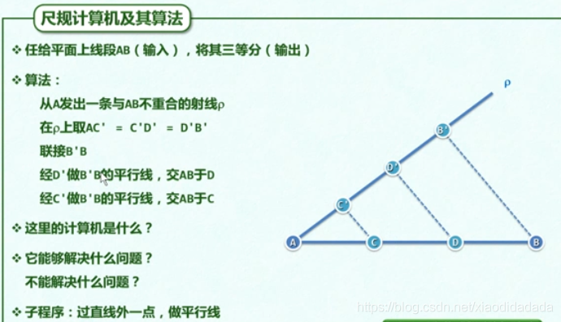
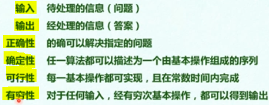
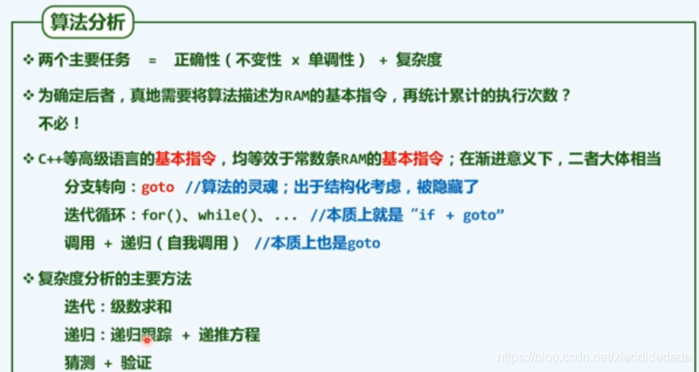
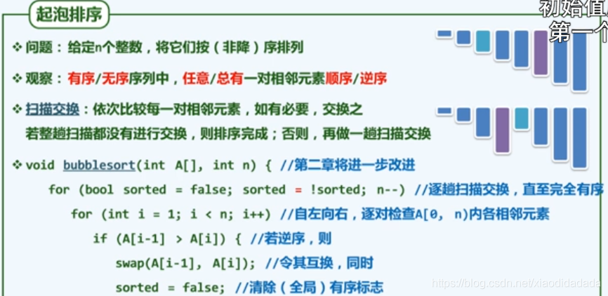
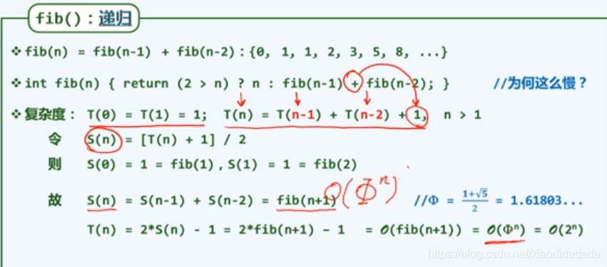
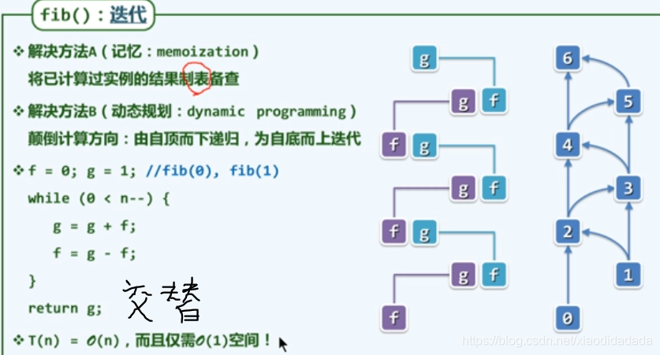
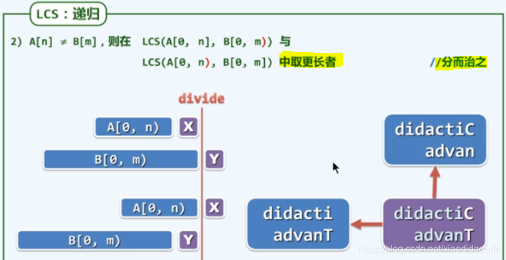

- [1.绪论](https://blog.csdn.net/xiaodidadada/article/details/107722037#1_1)
- - [a](https://blog.csdn.net/xiaodidadada/article/details/107722037#a_2)
    - - [a1.计算](https://blog.csdn.net/xiaodidadada/article/details/107722037#a1_3)
        - [a2.算法](https://blog.csdn.net/xiaodidadada/article/details/107722037#a2_11)
    - [b](https://blog.csdn.net/xiaodidadada/article/details/107722037#b_20)
    - - [b1. 计算模型](https://blog.csdn.net/xiaodidadada/article/details/107722037#b1__21)
        - [b2.图灵机](https://blog.csdn.net/xiaodidadada/article/details/107722037#b2_27)
        - [b3. RAM(random access machine)](https://blog.csdn.net/xiaodidadada/article/details/107722037#b3_RAMrandom_access_machine_29)
    - [c](https://blog.csdn.net/xiaodidadada/article/details/107722037#c_32)
    - - [c1. 大O记号](https://blog.csdn.net/xiaodidadada/article/details/107722037#c1_O_33)
        - [c2. big Ω，big Θ](https://blog.csdn.net/xiaodidadada/article/details/107722037#c2_big_big__38)
        - [c3.复杂度总结](https://blog.csdn.net/xiaodidadada/article/details/107722037#c3_40)
    - [d](https://blog.csdn.net/xiaodidadada/article/details/107722037#d_44)
    - - [d1.算法分析](https://blog.csdn.net/xiaodidadada/article/details/107722037#d1_45)
        - [d2.级数](https://blog.csdn.net/xiaodidadada/article/details/107722037#d2_47)
        - [d3.循环与级数](https://blog.csdn.net/xiaodidadada/article/details/107722037#d3_49)
        - [d4 取非极端元素、冒泡排序](https://blog.csdn.net/xiaodidadada/article/details/107722037#d4__52)
        - [d5 起泡排序的分析](https://blog.csdn.net/xiaodidadada/article/details/107722037#d5__54)
        - [d6 封底估算](https://blog.csdn.net/xiaodidadada/article/details/107722037#d6__56)
        - [d7封底估算实例](https://blog.csdn.net/xiaodidadada/article/details/107722037#d7_59)
    - [e 迭代与递归](https://blog.csdn.net/xiaodidadada/article/details/107722037#e__63)
    - - [e1 迭代和递归](https://blog.csdn.net/xiaodidadada/article/details/107722037#e1__64)
        - [e2 减而治之](https://blog.csdn.net/xiaodidadada/article/details/107722037#e2__66)
        - [e3 递归跟踪、递推方程](https://blog.csdn.net/xiaodidadada/article/details/107722037#e3__68)
        - [e4数组倒置](https://blog.csdn.net/xiaodidadada/article/details/107722037#e4_70)
        - [e5 分而治之](https://blog.csdn.net/xiaodidadada/article/details/107722037#e5__72)
        - [e6 例 数组求和--二分递归](https://blog.csdn.net/xiaodidadada/article/details/107722037#e6___74)
        - [e7 例 MAX2](https://blog.csdn.net/xiaodidadada/article/details/107722037#e7__MAX2_79)
    - [f 动态规划](https://blog.csdn.net/xiaodidadada/article/details/107722037#f__81)
    - - [f1 动态规划](https://blog.csdn.net/xiaodidadada/article/details/107722037#f1__82)
        - [f2 fib递推方程](https://blog.csdn.net/xiaodidadada/article/details/107722037#f2_fib_84)
        - [f3 封底估算](https://blog.csdn.net/xiaodidadada/article/details/107722037#f3__86)
        - [f4 fib()递归跟踪](https://blog.csdn.net/xiaodidadada/article/details/107722037#f4_fib_88)
        - [f5 fib()回归迭代](https://blog.csdn.net/xiaodidadada/article/details/107722037#f5_fib_90)
        - [f6 最长公共子序列](https://blog.csdn.net/xiaodidadada/article/details/107722037#f6__92)
        - [f7 递归LCS](https://blog.csdn.net/xiaodidadada/article/details/107722037#f7_LCS_94)
        - [f8 理解LCS](https://blog.csdn.net/xiaodidadada/article/details/107722037#f8_LCS_96)
        - [f9 动态规划LCS](https://blog.csdn.net/xiaodidadada/article/details/107722037#f9_LCS_98)

# 1.绪论

## a

### a1.计算

day1  
对象：规律、技巧  
目标：高效、低耗  
计算机是工具和手段，而计算才是目标  
绳索计算机及其算法（勾股定理）  
尺规计算及其算法（相似三角形）  

### a2.算法

●计算 = 信息处理  
借助某种工具，遵照一定规则，以明确而机械的形式进行  
●算法，特定计算模型下，旨在解决特定问题的指令序列  
  
●算法：有穷性  
程序未必是算法：比如程序死循环  
●好算法  

## b

### b1. 计算模型

to **measure** is to know  
●算法分析  
两个主要方面：正确性（数学证明）和**成本**（时间和空间成本）  
●成本  

### b2.图灵机

### b3. RAM(random access machine)

  
图灵机模型和RAM模型都是尺子

## c

### c1. 大O记号

渐进分析：在问题规模足够大后，计算成本如何增长（更关心足够大的问题）  
需执行的基本操作次数：T(n)  
需占用的存储单元数：S(n)  

### c2. big Ω，big Θ

### c3.复杂度总结

  
day4  

## d

### d1.算法分析

day9

### d2.级数

 将一个循环程序等效为不断的投硬币，直到第一次出现反面朝上。（正面朝上概率为 λ）需要投掷的次数可能是1次、2次、3次，…,符合几何分布，可以求解需要投掷次数的期望为1/（1 - λ)

### d3.循环与级数

思考题  
day10

### d4 取非极端元素、冒泡排序

### d5 起泡排序的分析

### d6 封底估算

案例：估算地球的赤道的周长  

### d7封底估算实例

在“三生三世”中的“1天”，相当于“1天”中的“1秒”  
在“整个宇宙生命中”的“三生三世”，相当于在“三生三世”中的“0.1秒”（比例运算）  

## e 迭代与递归

### e1 迭代和递归

### e2 减而治之

### e3 递归跟踪、递推方程

### e4数组倒置

### e5 分而治之

### e6 例 数组求和–二分递归

上图复杂度分析：画图分析  
上图O(n)的复杂度结果，可以直接套用前面几何级数的结果得出，从渐进的角度来说，最后一层的计算复杂度可以代表整体的复杂度。  
上图复杂度分析：基于递归方程分析  

### e7 例 MAX2

## f 动态规划

### f1 动态规划

由递归得到算法的本质，再将其转化为迭代

### f2 fib递推方程

假设演绎法可以得出S(n) = fib(n+1)

### f3 封底估算

10^9 flo:为一台普通计算机1秒可以做的运算次数。

### f4 fib()递归跟踪

上台阶问题：每次只能上一级或两级台阶，问到第n级台阶一共有多少种上去的方法，当n＞2时，fib(n) = fib(n-1) + fib(n-2);(最近一次是上一级台阶 or 最近一次是上两级台阶)，且f\[1\]=1,f\[2\]=2;

### f5 fib()回归迭代

### f6 最长公共子序列

### f7 递归LCS

代码实现上述思想

### f8 理解LCS

### f9 动态规划LCS

