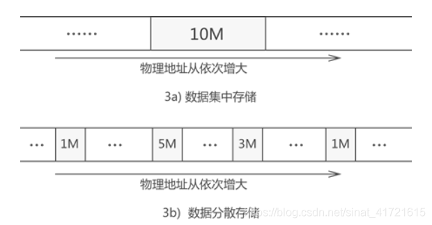

1. **数据结构**

    1. 线性：一拖一
        1. 线性表
        2. 链式表
    2. 树：一拖n
    3. 图：n拖一的同时一拖n，即n对n
    4. 集合：包含

2. **物理结构(存储结构）**：侧重存储形式

    1. 指的是数据在物理存储空间上选择集中存放还是分散存放。假设要存储大小为 10G 的数据，则集中存放就如图 3a) 所示，分散存放就如图 3b）所示。

        ​                               

    2. 线性：数据进行集中存储有利于后期对数据进行遍历操作

    3. 链式：分散存储更有利于后期增加或删除数据

3. **逻辑结构**：侧重元素关系

    1. 线性
    2. 树
    3. 图
    4. 集合

    ## 相关问题

    逻辑结构与物理结构这两者并不冲突，一个指的是数据之间的关系，而另一个指这种关系在计算机中的表现形式。比如，线性表中的栈，数据元素之间的关系是一对一的，除头和尾结点之外的每个结点都有唯一的前驱和唯一的后继，这体现的是逻辑结构；而对于栈中的结点来说，它们可以顺序存储（也就是顺序栈），取一段连续的存储空间，将栈结点按顺序存入，每个结点和其前驱和后继在物理上都是相邻的。同时，栈结点也可以链式存储（链栈），每个结点中包括数据域和指针域，而指针域就是用来指向其后继的，在访问时就可以通过指针来找到其后继进行访问，每个结点之间物理上可以相邻也可以不相邻。
    