- [第三章 列表](https://blog.csdn.net/xiaodidadada/article/details/108411172#__1)
- - [a](https://blog.csdn.net/xiaodidadada/article/details/108411172#a_3)
    - - [a1 从静态到动态](https://blog.csdn.net/xiaodidadada/article/details/108411172#a1__4)
        - [a2 从向量到列表](https://blog.csdn.net/xiaodidadada/article/details/108411172#a2__6)
        - [a3 从秩到位置](https://blog.csdn.net/xiaodidadada/article/details/108411172#a3__8)
        - [a4 实现](https://blog.csdn.net/xiaodidadada/article/details/108411172#a4__10)
    - [b](https://blog.csdn.net/xiaodidadada/article/details/108411172#b_13)
    - - [b1循秩访问](https://blog.csdn.net/xiaodidadada/article/details/108411172#b1_14)
        - [b2 查找](https://blog.csdn.net/xiaodidadada/article/details/108411172#b2__16)
        - [b3 插入和复制](https://blog.csdn.net/xiaodidadada/article/details/108411172#b3__18)
        - [b4 删除与析构](https://blog.csdn.net/xiaodidadada/article/details/108411172#b4__20)
        - [b5 唯一化](https://blog.csdn.net/xiaodidadada/article/details/108411172#b5__22)
    - [c 有序列表](https://blog.csdn.net/xiaodidadada/article/details/108411172#c__24)
    - - [c1 有序列表唯一化构思](https://blog.csdn.net/xiaodidadada/article/details/108411172#c1__25)
        - [c2 唯一化实现](https://blog.csdn.net/xiaodidadada/article/details/108411172#c2__27)
        - [c3 查找](https://blog.csdn.net/xiaodidadada/article/details/108411172#c3__29)
    - [d 选择排序](https://blog.csdn.net/xiaodidadada/article/details/108411172#d__31)
    - - [d1 选择排序](https://blog.csdn.net/xiaodidadada/article/details/108411172#d1__32)
        - [d2 实例](https://blog.csdn.net/xiaodidadada/article/details/108411172#d2__34)
        - [d3 实现](https://blog.csdn.net/xiaodidadada/article/details/108411172#d3__36)
        - [d4 推敲](https://blog.csdn.net/xiaodidadada/article/details/108411172#d4__38)
        - [d5 selectMax](https://blog.csdn.net/xiaodidadada/article/details/108411172#d5_selectMax_40)
        - [d6 性能](https://blog.csdn.net/xiaodidadada/article/details/108411172#d6__42)
    - [e 插入排序](https://blog.csdn.net/xiaodidadada/article/details/108411172#e__44)
    - - [e1 插入排序](https://blog.csdn.net/xiaodidadada/article/details/108411172#e1__45)
        - [e2 构思](https://blog.csdn.net/xiaodidadada/article/details/108411172#e2__47)
        - [e3 对比](https://blog.csdn.net/xiaodidadada/article/details/108411172#e3__49)
        - [e4 实例](https://blog.csdn.net/xiaodidadada/article/details/108411172#e4__51)
        - [e5 实现](https://blog.csdn.net/xiaodidadada/article/details/108411172#e5__53)
        - [e6 性能分析](https://blog.csdn.net/xiaodidadada/article/details/108411172#e6__55)
        - [e7 平均性能](https://blog.csdn.net/xiaodidadada/article/details/108411172#e7__58)
        - [e8 逆序对](https://blog.csdn.net/xiaodidadada/article/details/108411172#e8__60)

# 第三章 列表

day14

## a

### a1 从静态到动态

### a2 从向量到列表

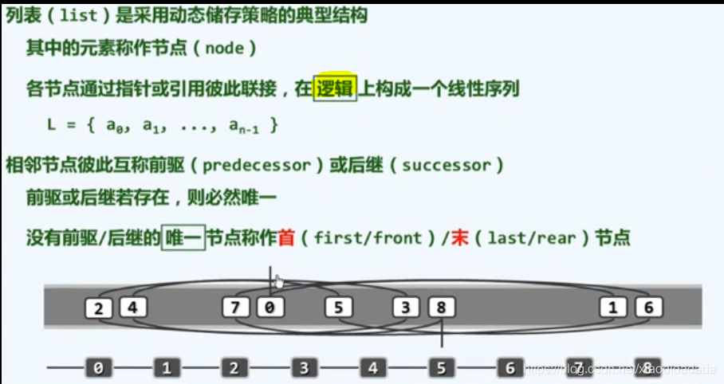

### a3 从秩到位置

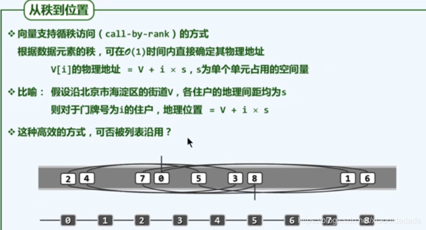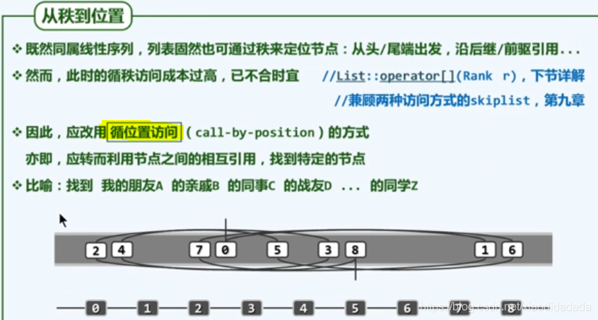

### a4 实现

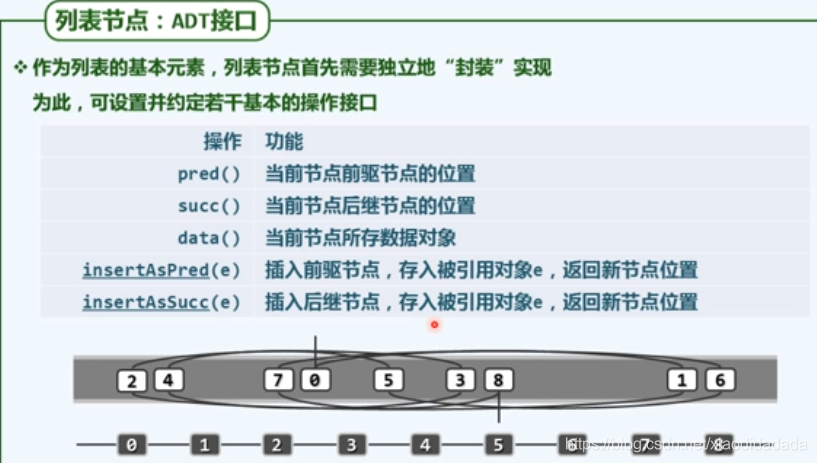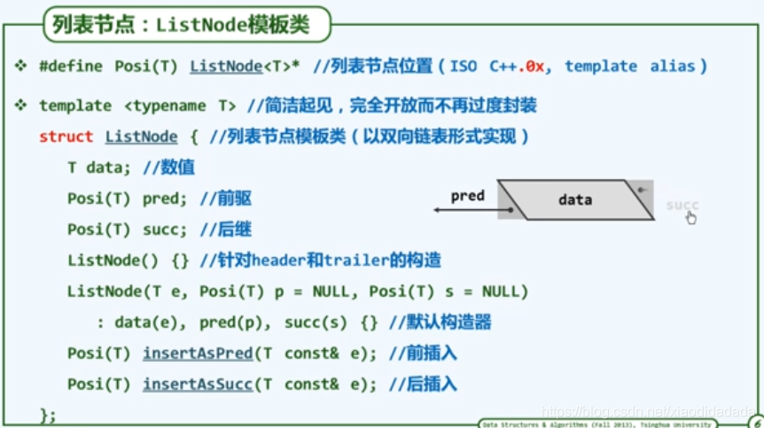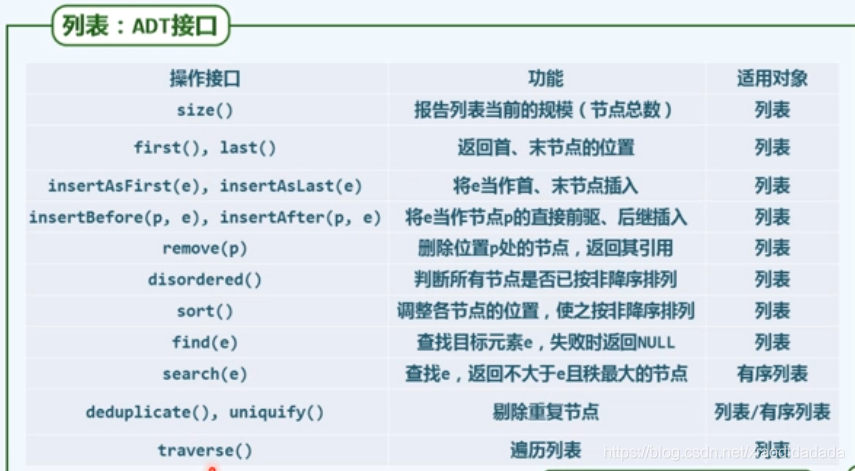其中header和trailer对外部不可见  
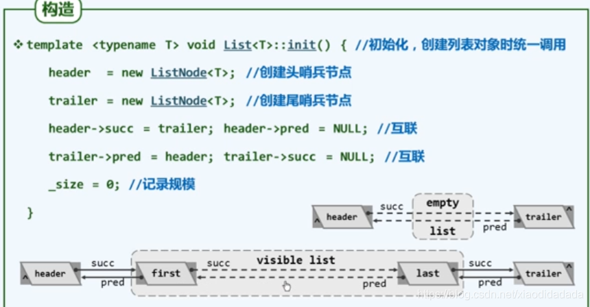

## b

### b1循秩访问

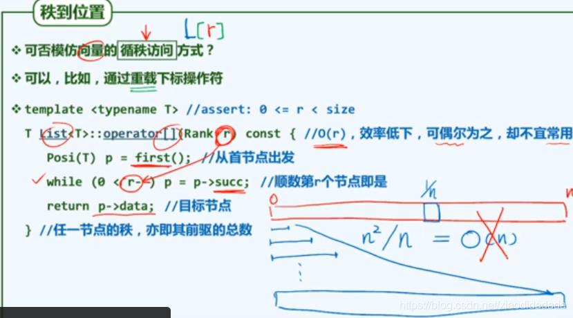

### b2 查找

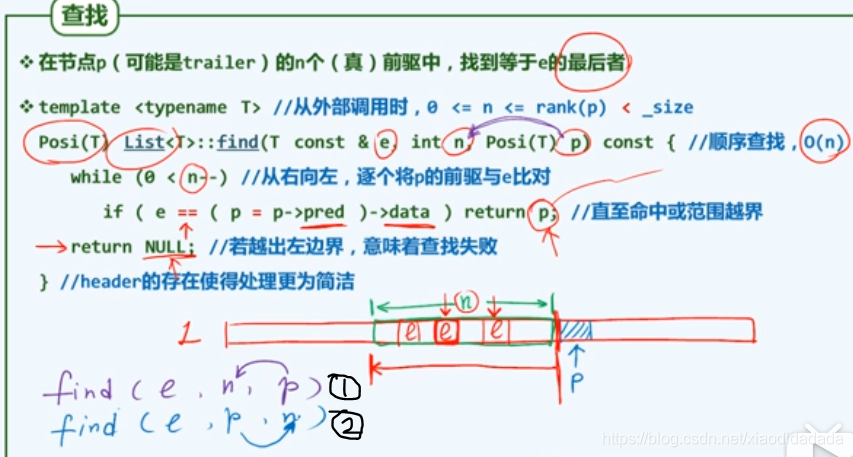上图中①和②参数位置的不同，代表一个是向前查找，而另一个是向后查找

### b3 插入和复制

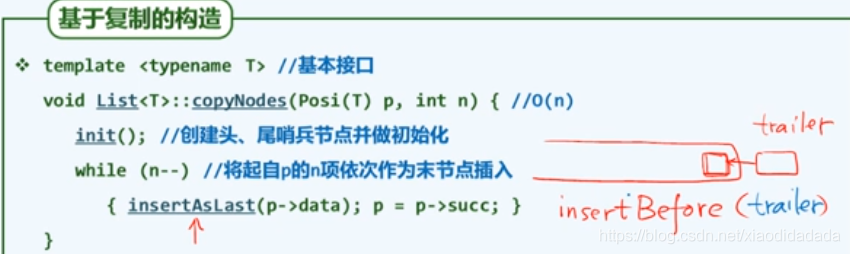上图从已有的列表复制来创建新的列表

### b4 删除与析构

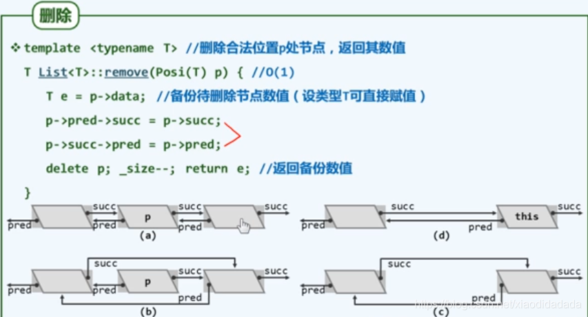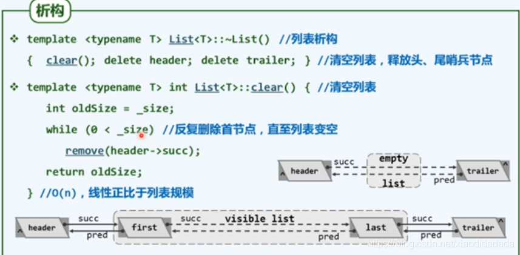

### b5 唯一化

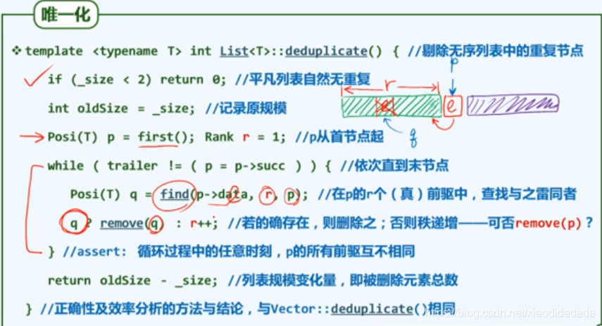

## c 有序列表

### c1 有序列表唯一化构思

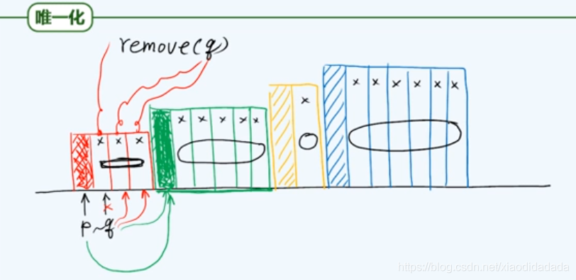

### c2 唯一化实现

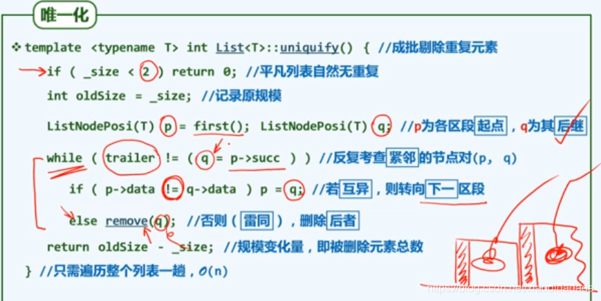

### c3 查找

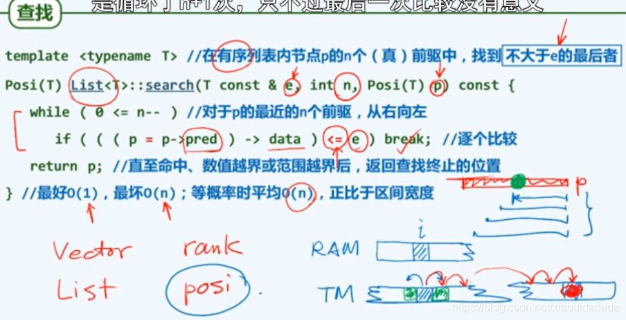

## d [选择排序](https://so.csdn.net/so/search?q=%E9%80%89%E6%8B%A9%E6%8E%92%E5%BA%8F&spm=1001.2101.3001.7020)

### d1 选择排序

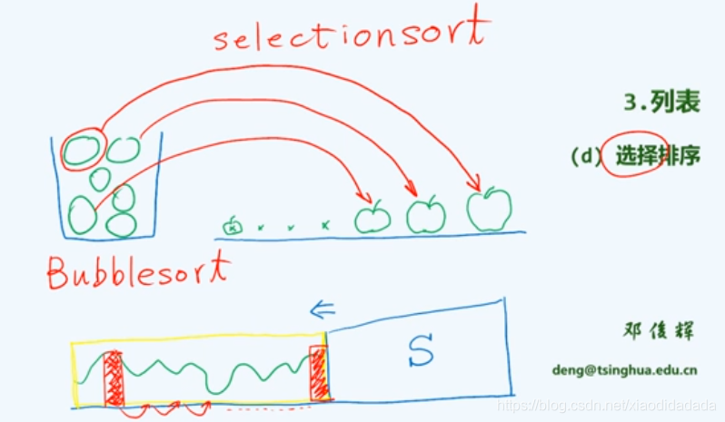冒泡排序思路上与选择排序类似，都是每次选择出最大的。但是冒泡排序效率更低，因为是一步一步向后交换，而选择排序是选出最大的，直接一步将其转移到后端。

### d2 实例

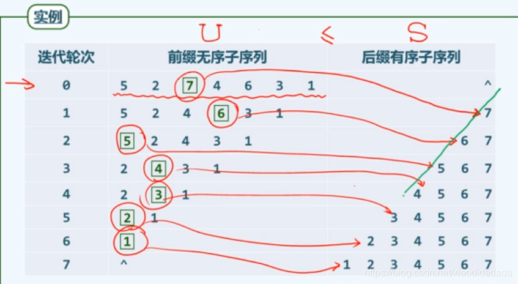

### d3 实现

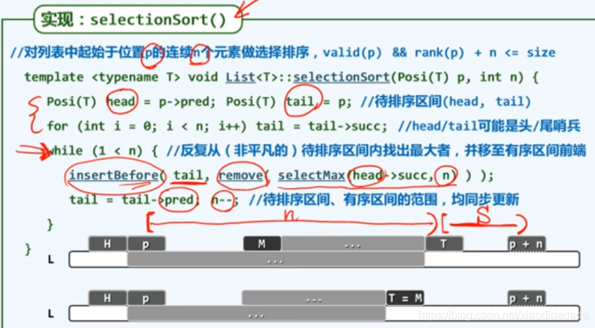

### d4 推敲

上图中直接调用inserBefore和remove接口，其中涉及到new和delete操作，其复杂度是普通操作的100倍左右，可以考虑直接交换数据域；修改前驱和后继的指向等来完成。

### d5 selectMax

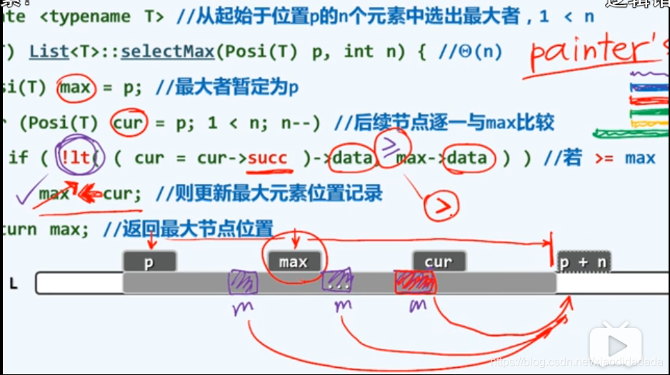

### d6 性能

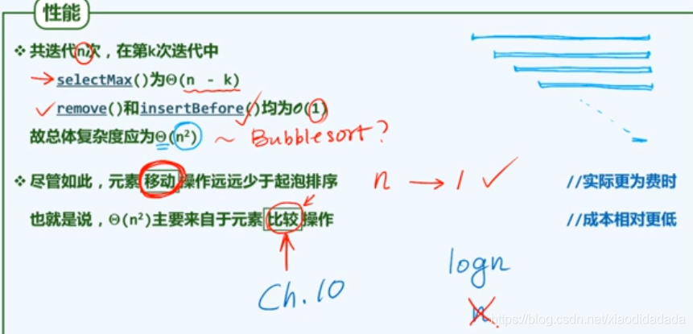

## e [插入排序](https://so.csdn.net/so/search?q=%E6%8F%92%E5%85%A5%E6%8E%92%E5%BA%8F&spm=1001.2101.3001.7020)

### e1 插入排序

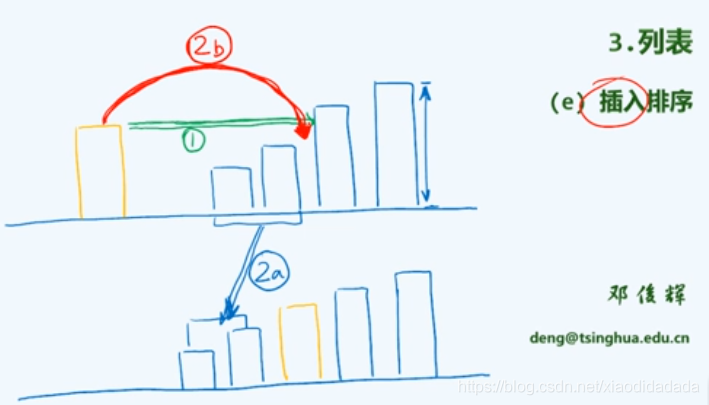扑克牌码牌的场景

### e2 构思

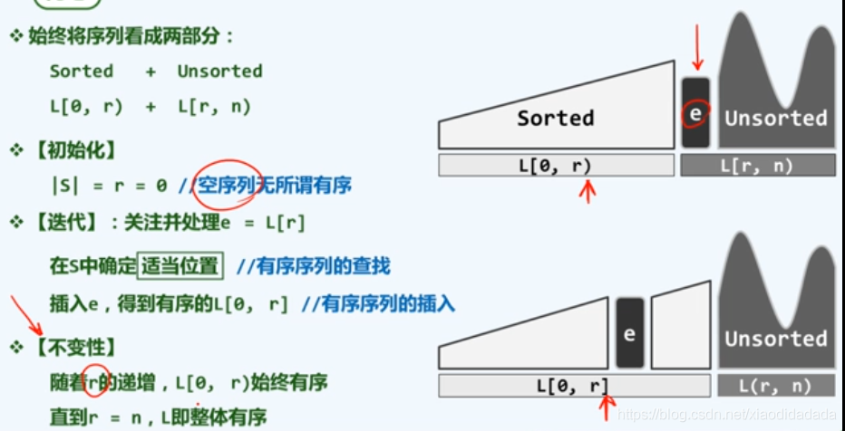

### e3 对比

选择排序 vs 插入排序

### e4 实例

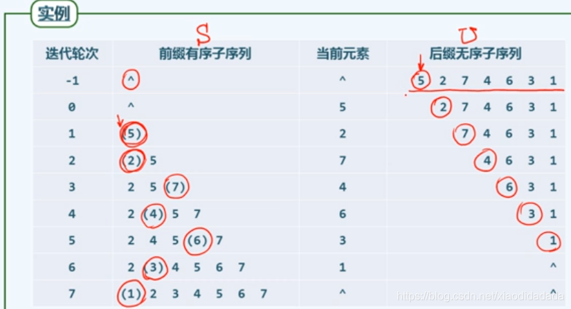减而治之

### e5 实现

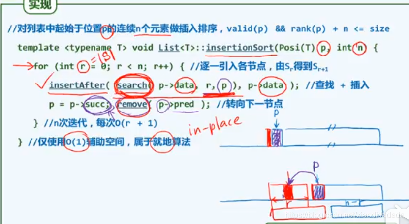

### e6 性能分析

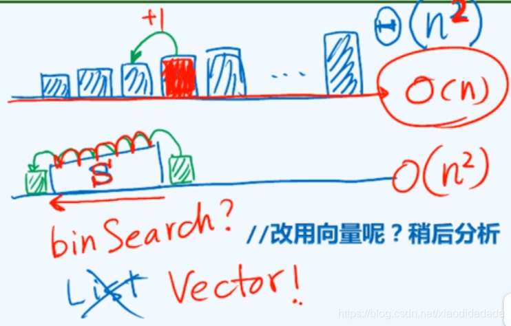最好：O（n）,已经有序  
最坏：O（n^2)

### e7 平均性能

### e8 逆序对

其中I代表有序对的数目。