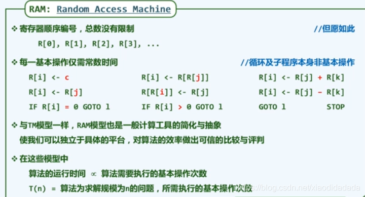
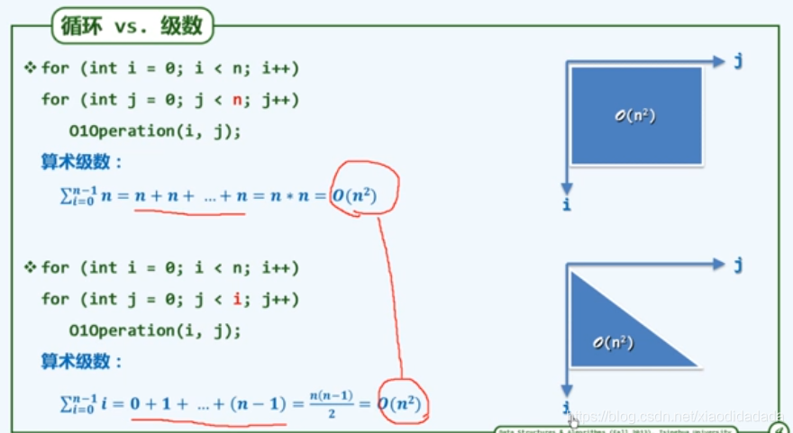
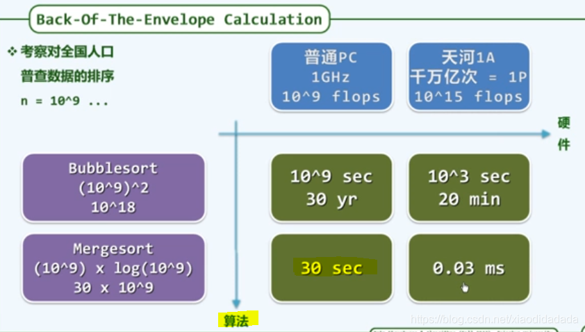
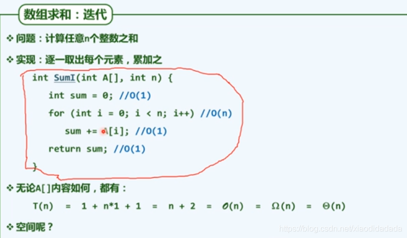
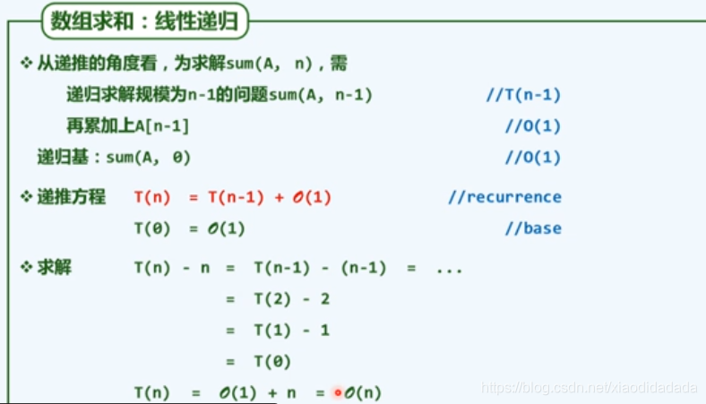
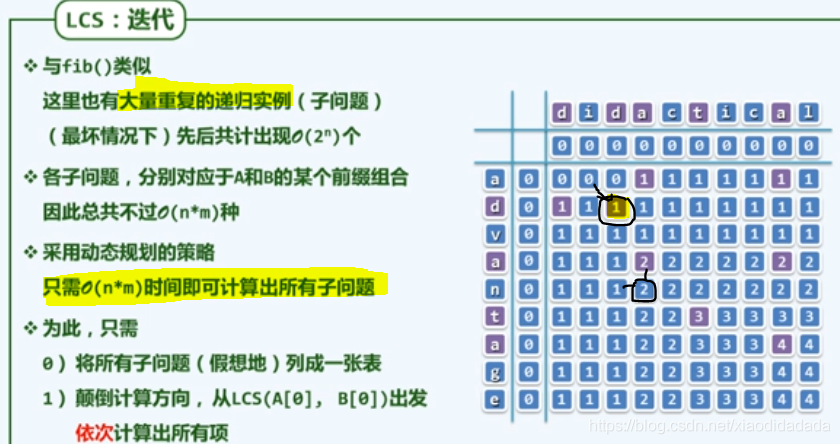

# 1.绪论

## a

### a1.计算

day1  
对象：规律、技巧  
目标：高效、低耗  
计算机是工具和手段，而计算才是目标  
绳索计算机及其算法（勾股定理）  

尺规计算及其算法（相似三角形）  

### a2.算法

●计算 = 信息处理  
借助某种工具，遵照一定规则，以明确而机械的形式进行  
●算法，特定计算模型下，旨在解决特定问题的指令序列  
  
●算法：有穷性  

该程序无法确定其是否又穷，第二个式子降低，第三个式子增加，反复升降

程序未必是算法：比如程序死循环  
●好算法  	

## b

### b1. 计算模型

to **measure** is to know  
●算法分析  
两个主要方面：正确性（数学证明）和**成本**（时间和空间成本）  
●成本  

### b2.图灵机

### b3. RAM(random access machine)

  
图灵机模型和RAM模型都是尺子

## c

### c1. 大O记号 —操作次数最坏结果（上限）

渐进分析：在问题规模足够大后，计算成本如何增长（更关心足够大的问题）  
需执行的基本操作次数：T(n)  更加关心
需占用的存储单元数：S(n)  存储单元对于现代计算机来说可看做无限的，不需要更多关心

### c2. big Ω—操作次数最好结果（下限），big Θ—操作次数一般次数（渐近线）

### c3.复杂度总结

  

**常数级时间**

含有循环，分支，和递归等函数其复杂度依旧可能是常数级的，前提是这些函数执行次数足够少

## d

### d1.算法分析

day9

### d2.级数

 将一个循环程序等效为不断的投硬币，直到第一次出现反面朝上。（正面朝上概率为 λ）需要投掷的次数可能是1次、2次、3次，…,符合几何分布，可以求解需要投掷次数的期望为1/（1 - λ)

### d3.循环与级数

可以将进行循环的个数等价为面积的求解

思考题  
day10

### d4 取非极端元素、冒泡排序

### d5 起泡排序的分析

### d6 封底估算

案例：估算地球的赤道的周长  

### d7封底估算实例

在“三生三世”中的“1天”，相当于“1天”中的“1秒”  
在“整个宇宙生命中”的“三生三世”，相当于在“三生三世”中的“0.1秒”（比例运算）  

## e 迭代与递归

### e1 迭代和递归

### e2 减而治之

### e3 递归跟踪、递推方程

### e4数组倒置

### e5 分而治之

### e6 例 数组求和–二分递归

上图复杂度分析：画图分析  
上图O(n)的复杂度结果，可以直接套用前面几何级数的结果得出，从渐进的角度来说，最后一层的计算复杂度可以代表整体的复杂度。  
上图复杂度分析：基于递归方程分析  

### e7 例 MAX2

## f 动态规划

### f1 动态规划

由递归得到算法的本质，再将其转化为迭代

### f2 fib递推方程

假设演绎法可以得出S(n) = fib(n+1)

### f3 封底估算

10^9 flo:为一台普通计算机1秒可以做的运算次数。

### f4 fib()递归跟踪

上台阶问题：每次只能上一级或两级台阶，问到第n级台阶一共有多少种上去的方法，当n＞2时，fib(n) = fib(n-1) + fib(n-2);(最近一次是上一级台阶 or 最近一次是上两级台阶)，且f\[1\]=1,f\[2\]=2;

### f5 fib()回归迭代

### f6 最长公共子序列

### f7 递归LCS

代码实现

### f8 理解LCS

从后往前面考虑，使用减而治之的思想，如果其最后一个元素相等则将其加到公共子序列，如果不等，则进行分而治之，第一个序列删除最后一个元素与第二个序列比较，第二个序列删除一个元素与第一个序列比较

如果成功则加一，不成功则继续执行。

这种方法会造成大量的重复计算，因此可以选择动态规划

### f9 动态规划LCS

逆思维：可以从开头进行比较，将其绘制成图可以看出，如果其行和列对应元素不相等，则取其左边和上面元素的最大值，如果相等，则取最大值再加一，因此可以使用迭代，按行来进行计算，极大减少所消耗时间
