- [11.串](https://blog.csdn.net/xiaodidadada/article/details/111375771#11_2)
- - [11.a ADT](https://blog.csdn.net/xiaodidadada/article/details/111375771#11a_ADT_3)
    - [11.b 串匹配](https://blog.csdn.net/xiaodidadada/article/details/111375771#11b__6)
    - - [11.b1 串匹配](https://blog.csdn.net/xiaodidadada/article/details/111375771#11b1__7)
        - [11.b2 蛮力匹配](https://blog.csdn.net/xiaodidadada/article/details/111375771#11b2__9)
    - [11.c KMP算法](https://blog.csdn.net/xiaodidadada/article/details/111375771#11c_KMP_11)
    - - [11.c1 KMP算法：从记忆力到预知力](https://blog.csdn.net/xiaodidadada/article/details/111375771#11c1_KMP_12)
        - [11.c2 KMP算法查表](https://blog.csdn.net/xiaodidadada/article/details/111375771#11c2_KMP_16)
        - [11.c3 KMP算法理解next表](https://blog.csdn.net/xiaodidadada/article/details/111375771#11c3_KMPnext_18)
        - [11.c4 KMP算法构造next表](https://blog.csdn.net/xiaodidadada/article/details/111375771#11c4_KMPnext_22)
        - [11.c5 KMP算法分摊分析](https://blog.csdn.net/xiaodidadada/article/details/111375771#11c5_KMP_24)
        - [11.c6 KMP算法再改进](https://blog.csdn.net/xiaodidadada/article/details/111375771#11c6_KMP_26)
    - [11.d BM\_BC算法](https://blog.csdn.net/xiaodidadada/article/details/111375771#11d_BM_BC_31)
    - - [11.d1 BM\_BC算法 以终为始](https://blog.csdn.net/xiaodidadada/article/details/111375771#11d1_BM_BC__32)
        - [11.d2 BM\_BC算法 坏字符](https://blog.csdn.net/xiaodidadada/article/details/111375771#11d2_BM_BC__37)
        - [11.d3 BM\_BC算法 构造BC表](https://blog.csdn.net/xiaodidadada/article/details/111375771#11d3_BM_BC_BC_41)
        - [11.d3 BM\_BC算法 算法性能分析](https://blog.csdn.net/xiaodidadada/article/details/111375771#11d3_BM_BC__43)
        - [11.e1 BM\_GS算法 好后缀](https://blog.csdn.net/xiaodidadada/article/details/111375771#11e1_BM_GS__47)
        - [11.e2 BM\_GS算法：构造GS表](https://blog.csdn.net/xiaodidadada/article/details/111375771#11e2_BM_GSGS_51)
        - [11.e3 BM\_GS算法：综合性能](https://blog.csdn.net/xiaodidadada/article/details/111375771#11e3_BM_GS_53)
        - [11.f1 Karp-Rabin算法：串即是数（整数）](https://blog.csdn.net/xiaodidadada/article/details/111375771#11f1_KarpRabin_56)
        - [11.f2 Karp-Rabin算法：散列](https://blog.csdn.net/xiaodidadada/article/details/111375771#11f2_KarpRabin_60)

  

day65

# 11.串

## 11.a ADT

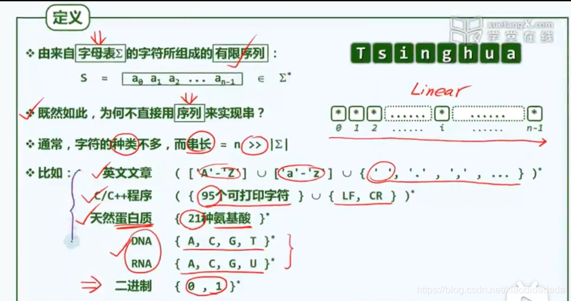真子串，真前缀，真后缀  

## 11.b 串匹配

### 11.b1 串匹配

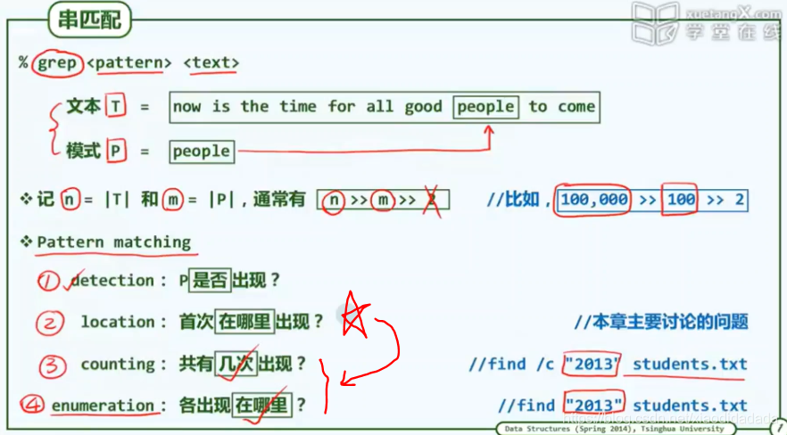因为如果采用随机算法，匹配成功的概率非常低，所以在测评算法复杂度时，将匹配失败和匹配成功分开考虑，分别计算算法复杂度。

### 11.b2 蛮力匹配

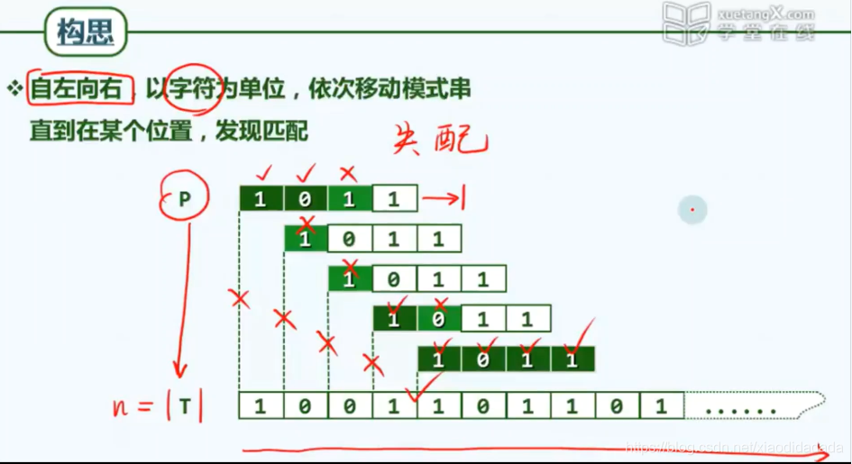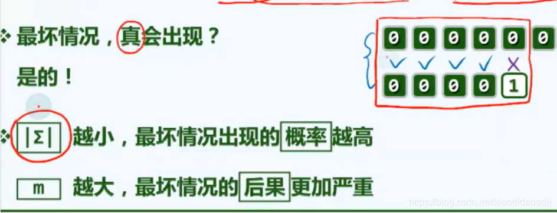蛮力算法的效率之所以很低，是因为他不足以处理这种大量的局部匹配（前面都匹配成功，到最后匹配失败），字母表越小，最坏情况出现的概率越高，随着字母表的增大，最坏情况出现的概率降低（一般在匹配初期就会发现匹配失败），可以达到期望的的O(n)复杂度。

## 11.c [KMP算法](https://so.csdn.net/so/search?q=KMP%E7%AE%97%E6%B3%95&spm=1001.2101.3001.7020)

### 11.c1 KMP算法：从记忆力到预知力

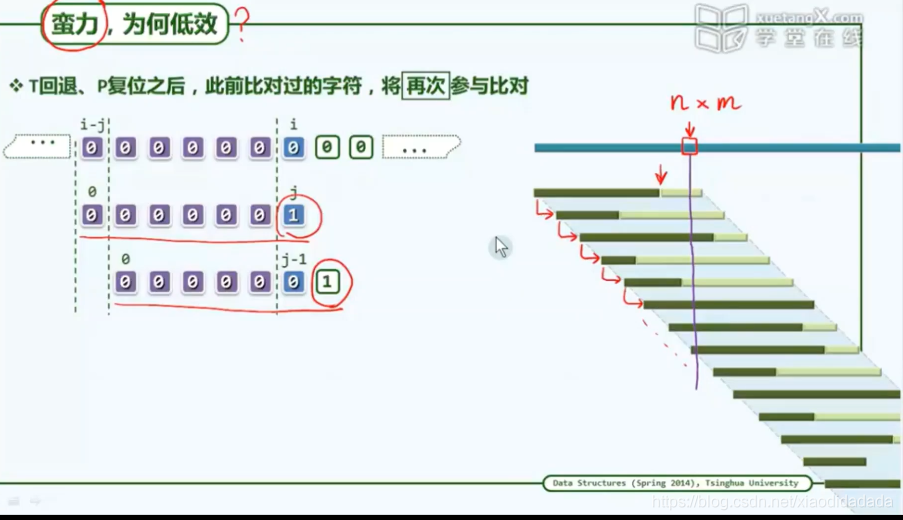存在大量局部匹配的前缀  
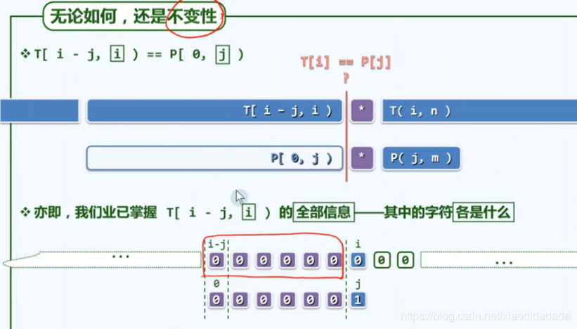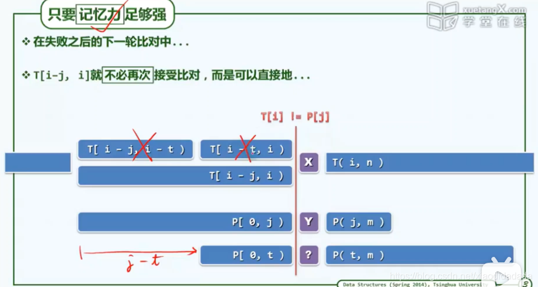两个优点：①大幅度的向后滑动模式串，而不是每次只滑动一个字符②可以避免大量重复的比对  
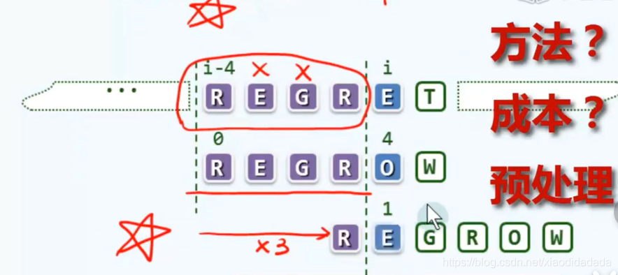匹配失败后，要如何确定下一次匹配的起始位置？

### 11.c2 KMP算法查表

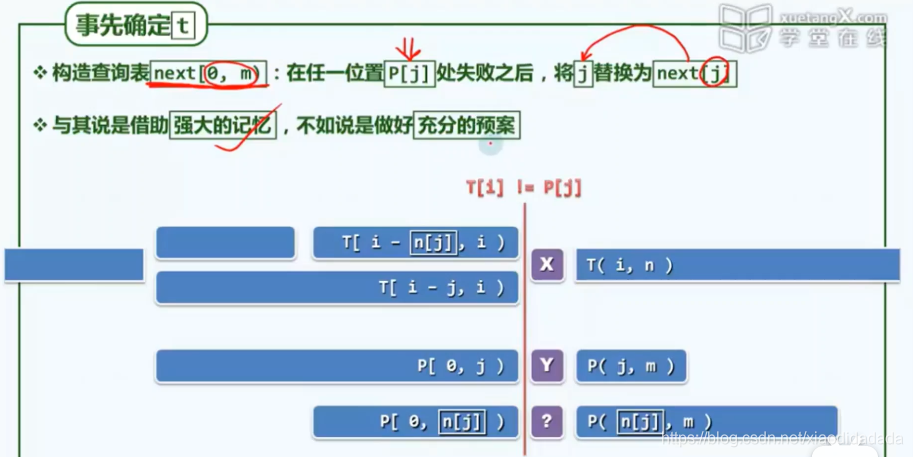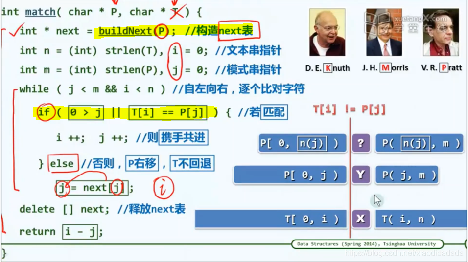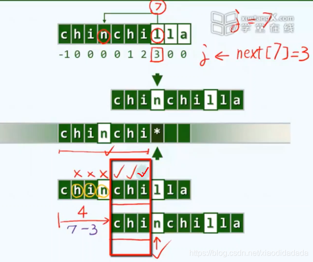可以排除不必要的对其位置

### 11.c3 KMP算法理解next表

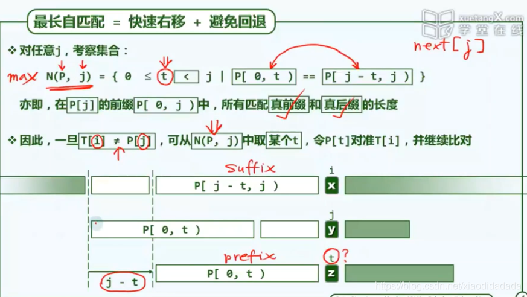t的取值很多，选择最大的t,KMP算法舍弃的那些t，都是不值得对其的位置。  
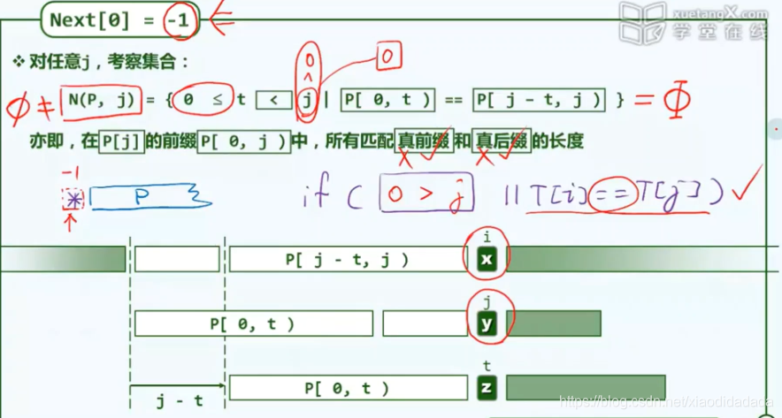匹配失败的问题：在P串前面放置一个哨兵（通配符)，通过设置哨兵可以：简化代码，统一理解。  
虚拟实验：既是物理学的有效研究方法，也是计算机科学的重要技巧

### 11.c4 KMP算法构造next表

### 11.c5 KMP算法分摊分析

上面为KMP算法的复杂度，相应的next的构造算法与KMP算法别无二致，只不过是模式串与模式串本身之间的比较，所以其复杂度为O(m),m为模式串的额长度。

### 11.c6 KMP算法再改进

后续的三次比对都是多余的；目前的KMP算法只是吸取了经验，未接收教训  
避免一错再错  
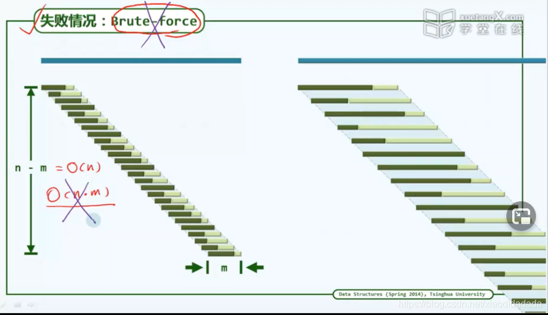除了在端点处之外，没有任何重合；复杂度为O(2n)  
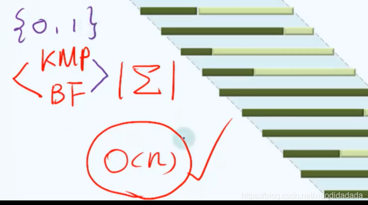对于蛮力算法，在最好情况下，可能只需要经过一次比对，就可以排除掉一个对齐位置，此时他的复杂度为O(n),在实际生活中，随着字符集规模的增大，这种最好情况发生的概率会逐渐增大，KMP算法相比于蛮力算法的优势会越来越小。

## 11.d BM\_BC算法

### 11.d1 BM\_BC算法 以终为始

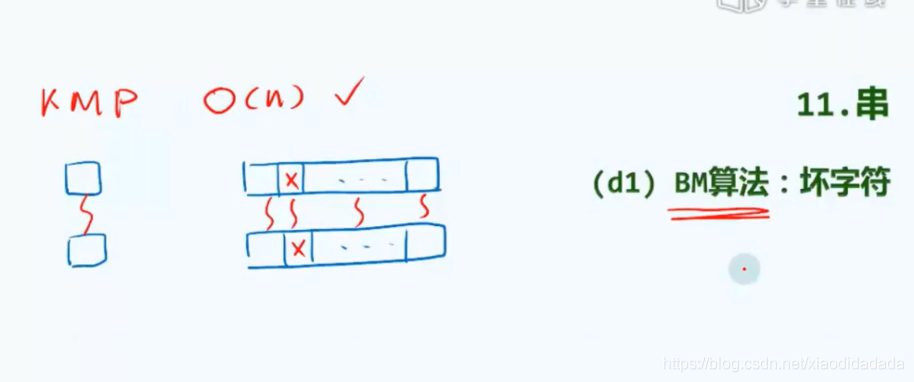判断两个字符串是否相等与判断其是否不等，效率是不一样的。  
如何高效排除无效的对齐位置？更多的关注靠后的教训（失败比对），价值更高，如下图，靠后的教训可以帮助排除更多的无效对齐位置。  
图中红色字符意思：当字符集数目足够大，串匹配成功的概率远小于失败的概率  
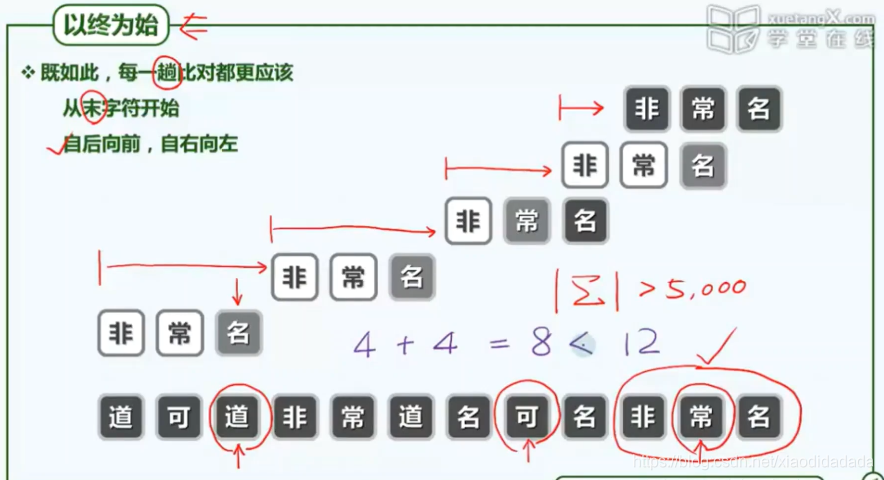灰色为失败的比对，黑色为成功的比对

### 11.d2 BM\_BC算法 坏字符

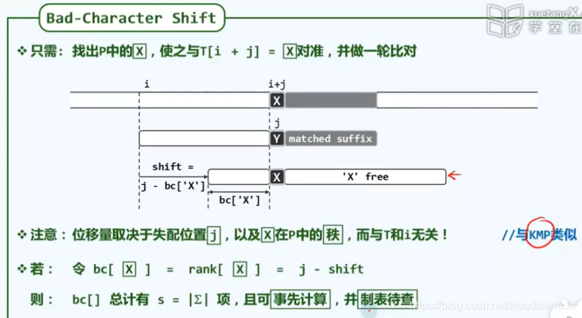和KMP算法一样，因为与文本串无关，只与模式串有关，所以位移量可以预先计算出来，生成BC表  
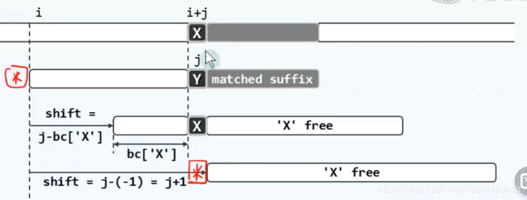特殊情况要考虑：①模式串中有多个X，选择秩最大的②模式串中无X，在串开头增设通配符哨兵  
③秩过大，超过了j,只需要将整个模式串右移一个位置

### 11.d3 BM\_BC算法 构造BC表

### 11.d3 BM\_BC算法 算法性能分析

  
上图为BM\_BC算法在最坏情况下的复杂度O(n\*m)，最坏时退化为蛮力算法，究其原因还是目前BM\_BC算法只是利用了教训（BC-坏字符策略），没能很好的利用经验（GS-好后缀)。

### 11.e1 BM\_GS算法 好后缀

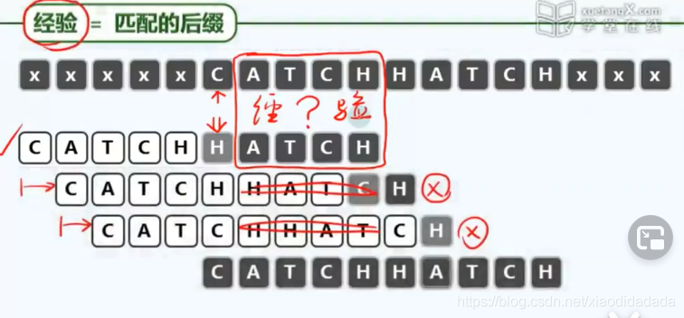上述是BM\_BC算法匹配的过程，由于只关注教训，没利用经验，导致前两次匹配，每次只能挪动一步。  
如果模式串中有多个于V(k)匹配的，应当选最靠右且串的前置字符不为Y（X与Y已经不匹配了，至少不能在选一个Y），使得位移量尽可能地小。当然有可能不存在与V(k)匹配的子串，此时应当去模式串前缀与V(k)的后缀匹配最长者。下图为一个实例：  

### 11.e2 BM\_GS算法：构造GS表

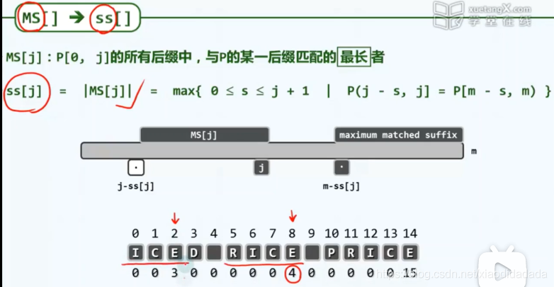怎么构造没看懂，查一下

### 11.e3 BM\_GS算法：综合性能

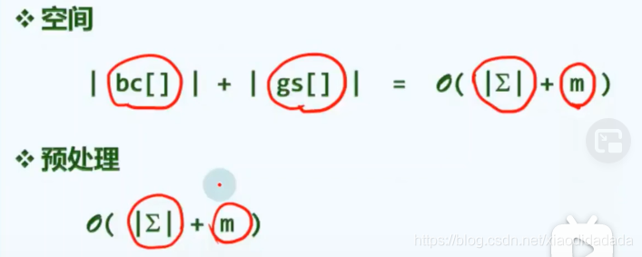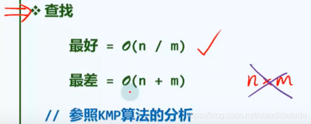综合复杂度分析如下图，其中|Σ|代表字母表的大小，字母表越大，单词匹配成功的概率（Pr）越低，蛮力算法效果越好。  
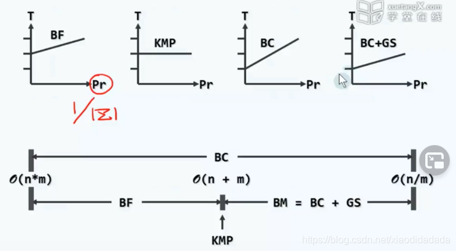

### 11.f1 Karp-Rabin算法：串即是数（整数）

凡物皆数  
自然数向量和自然数之间可以彼此转化  

### 11.f2 Karp-Rabin算法：散列

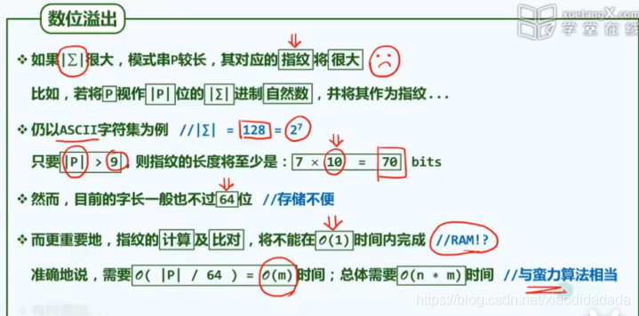问题：散列冲突；解决–哈希只用来筛选，还要进行进一步的精确匹配  
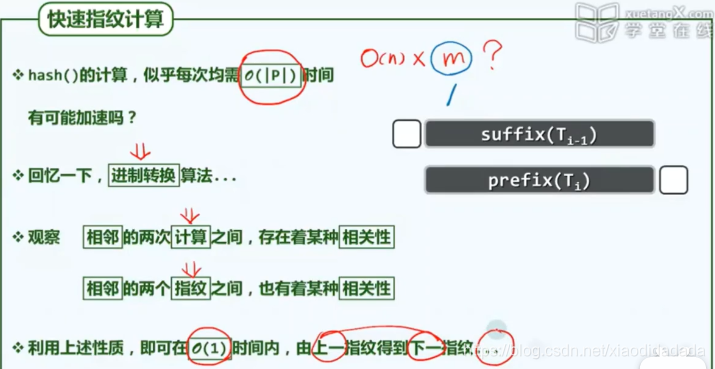