- [树](https://blog.csdn.net/xiaodidadada/article/details/108550907#_2)
- - [a](https://blog.csdn.net/xiaodidadada/article/details/108550907#a_3)
    - - [a1 树](https://blog.csdn.net/xiaodidadada/article/details/108550907#a1__4)
        - [a2 应用](https://blog.csdn.net/xiaodidadada/article/details/108550907#a2__6)
        - [a3 有根树](https://blog.csdn.net/xiaodidadada/article/details/108550907#a3__8)
        - [a4 有序树](https://blog.csdn.net/xiaodidadada/article/details/108550907#a4__10)
        - [a5 路径](https://blog.csdn.net/xiaodidadada/article/details/108550907#a5__12)
        - [a6 连通图无环图](https://blog.csdn.net/xiaodidadada/article/details/108550907#a6__14)
        - [a7 深度层次](https://blog.csdn.net/xiaodidadada/article/details/108550907#a7__16)
    - [b 在计算机中表示](https://blog.csdn.net/xiaodidadada/article/details/108550907#b__19)
    - - [b1 树的表示](https://blog.csdn.net/xiaodidadada/article/details/108550907#b1__20)
        - [b2 父节点](https://blog.csdn.net/xiaodidadada/article/details/108550907#b2__22)
        - [b3 孩子节点](https://blog.csdn.net/xiaodidadada/article/details/108550907#b3__24)
        - [b4 父亲孩子表示法](https://blog.csdn.net/xiaodidadada/article/details/108550907#b4__26)
        - [b5 长子兄弟表示法](https://blog.csdn.net/xiaodidadada/article/details/108550907#b5__28)
    - [c 二叉树](https://blog.csdn.net/xiaodidadada/article/details/108550907#c__30)
    - - [c1 二叉树概述](https://blog.csdn.net/xiaodidadada/article/details/108550907#c1__31)
        - [c2 真二叉树](https://blog.csdn.net/xiaodidadada/article/details/108550907#c2__34)
        - [c3 描述多叉树](https://blog.csdn.net/xiaodidadada/article/details/108550907#c3__36)
    - [d 二叉树](https://blog.csdn.net/xiaodidadada/article/details/108550907#d__38)
    - - [d1 BinNode 类](https://blog.csdn.net/xiaodidadada/article/details/108550907#d1_BinNode__39)
        - [d2 BinNode 接口](https://blog.csdn.net/xiaodidadada/article/details/108550907#d2_BinNode__41)
        - [d3 BinTree类](https://blog.csdn.net/xiaodidadada/article/details/108550907#d3_BinTree_43)
        - [d4 高度更新](https://blog.csdn.net/xiaodidadada/article/details/108550907#d4__45)
        - [d5 节点插入](https://blog.csdn.net/xiaodidadada/article/details/108550907#d5__47)
    - [e 相关算法](https://blog.csdn.net/xiaodidadada/article/details/108550907#e__49)
    - - [e1-1 先序遍历转化策略](https://blog.csdn.net/xiaodidadada/article/details/108550907#e11__50)
        - [e1-2 遍历规则](https://blog.csdn.net/xiaodidadada/article/details/108550907#e12__52)
        - [e1-3 递归实现](https://blog.csdn.net/xiaodidadada/article/details/108550907#e13__54)
        - [e1-4 迭代实现](https://blog.csdn.net/xiaodidadada/article/details/108550907#e14__56)
        - [e1-5 实例](https://blog.csdn.net/xiaodidadada/article/details/108550907#e15__58)
        - [e1-6 新思路](https://blog.csdn.net/xiaodidadada/article/details/108550907#e16__60)
        - [e1-7 新构思](https://blog.csdn.net/xiaodidadada/article/details/108550907#e17__62)
        - [e1-8 迭代实现2](https://blog.csdn.net/xiaodidadada/article/details/108550907#e18_2_64)
        - [e1-9 实例](https://blog.csdn.net/xiaodidadada/article/details/108550907#e19__66)
        - [e2-1 中序遍历递归](https://blog.csdn.net/xiaodidadada/article/details/108550907#e21__68)
        - [e2-2 观察](https://blog.csdn.net/xiaodidadada/article/details/108550907#e22__70)
        - [e2-3 思路](https://blog.csdn.net/xiaodidadada/article/details/108550907#e23__72)
        - [e2-4 构思](https://blog.csdn.net/xiaodidadada/article/details/108550907#e24__74)
        - [e2-5 实现](https://blog.csdn.net/xiaodidadada/article/details/108550907#e25__76)
        - [e2-6 实例](https://blog.csdn.net/xiaodidadada/article/details/108550907#e26__78)
        - [e2-7 分摊分析](https://blog.csdn.net/xiaodidadada/article/details/108550907#e27__80)
        - [e4-1 层次遍历次序](https://blog.csdn.net/xiaodidadada/article/details/108550907#e41__83)
        - [e4-2 实现](https://blog.csdn.net/xiaodidadada/article/details/108550907#e42__85)
        - [e4-3 实例](https://blog.csdn.net/xiaodidadada/article/details/108550907#e43__87)
        - [e5-1 重构之遍历序列](https://blog.csdn.net/xiaodidadada/article/details/108550907#e51__89)
        - [e5-2(先序或后序)与中序](https://blog.csdn.net/xiaodidadada/article/details/108550907#e52_91)
        - [e5-3 (先序+后序列)真二叉树重建](https://blog.csdn.net/xiaodidadada/article/details/108550907#e53__93)

  

day21

# 树

## a

### a1 树

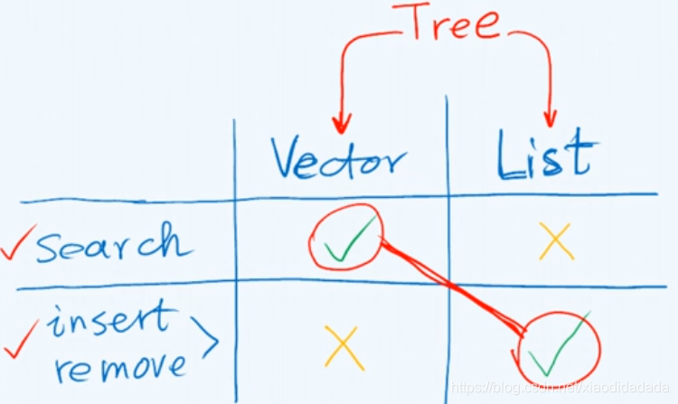tree将二者的优点结合起来，树是列表的列表List< List>

### a2 应用

层次关系的表示：表达式（如RPN），文件系统，URL，…

### a3 有根树

### a4 有序树

### a5 路径

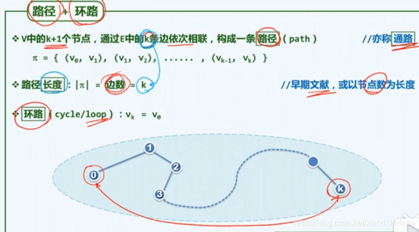

### a6 连通图无环图

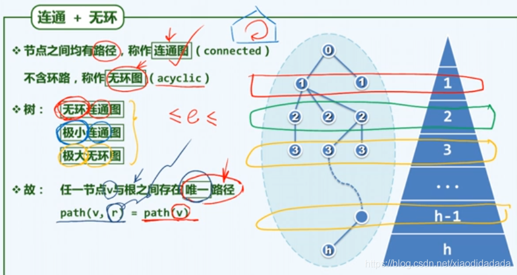根据上图右半部分，可以给每个节点划分指标，指标相同的节点称之为等价类。

### a7 深度层次

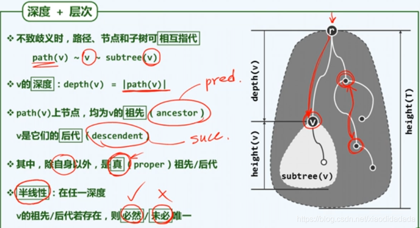前驱（祖先）唯一，后继（后代）不唯一，所以说他是半线性结构。  

## b 在计算机中表示

### b1 树的表示

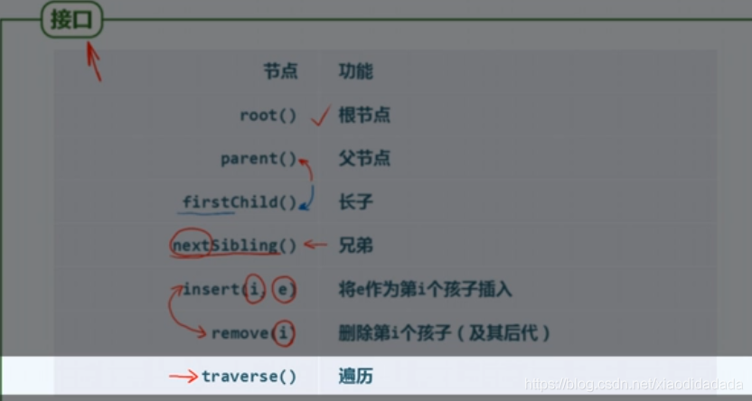

### b2 父节点

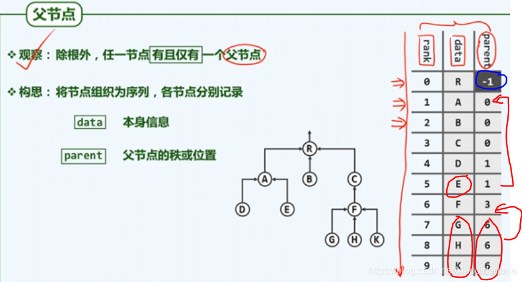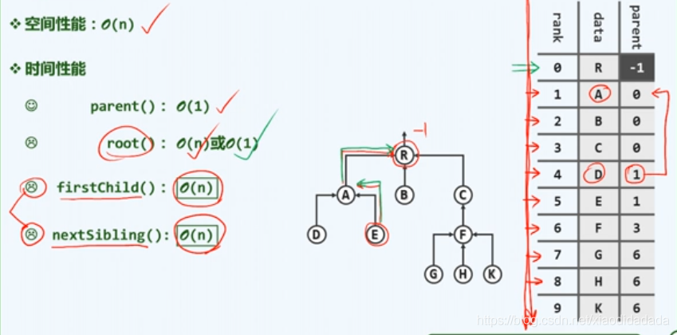可以很容易的找到父亲

### b3 孩子节点

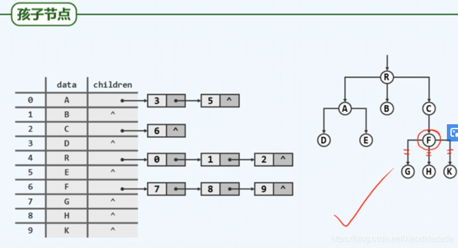可以很容易的找到孩子

### b4 父亲孩子表示法

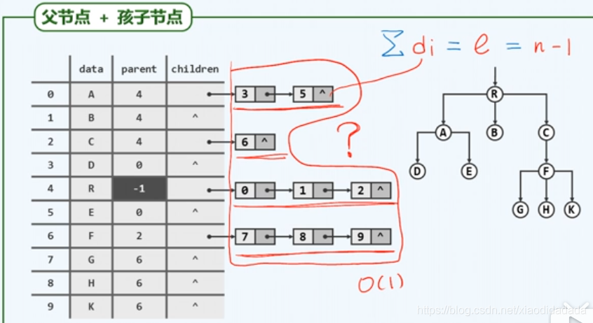上图对于孩子节点的存储，平均来说只有O（1）的规模，而采取上图的组织方式，有的时候需要长达O（n)的数据集。

### b5 长子兄弟表示法

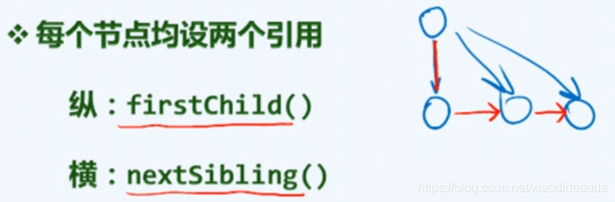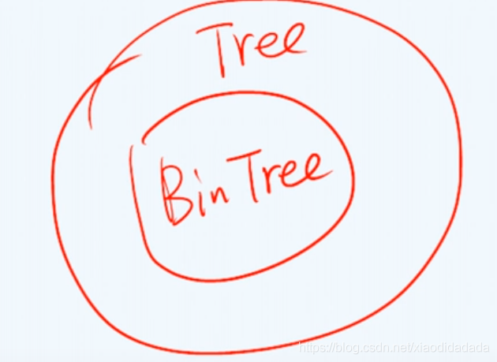在施加某种条件之后，二叉树可以用来表示所有的树（基于长子-兄弟法)

## c 二叉树

### c1 二叉树概述

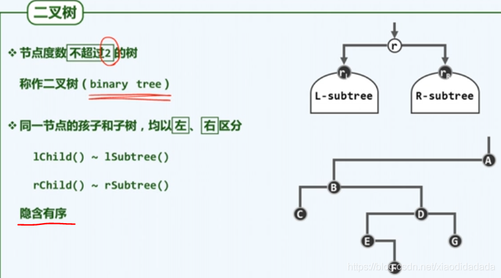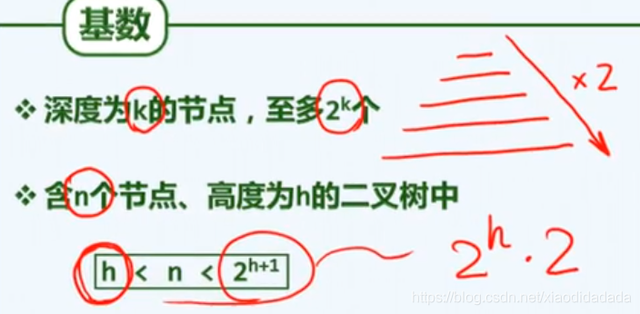当n = h+1,退化成一条单链；当n = 2^(h+1)-1时，为满二叉树  
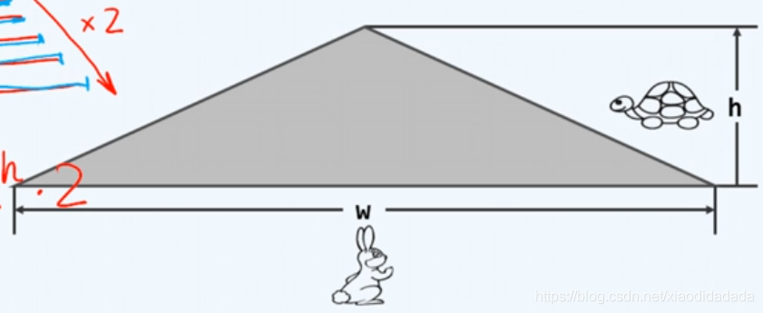对于一棵二叉树而言，他倾向于长宽（兔子快），高度增长缓慢（乌龟慢)

### c2 真二叉树

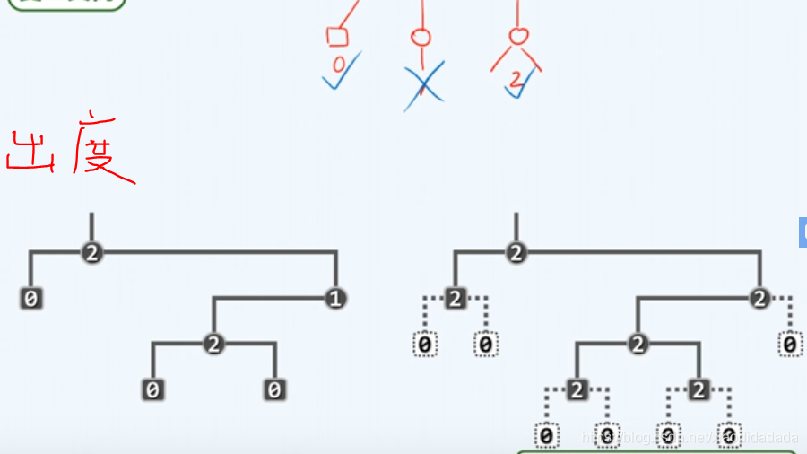day22

### c3 描述多叉树

## d 二叉树

### d1 BinNode 类

### d2 BinNode 接口

### d3 BinTree类

### d4 高度更新

### d5 节点插入

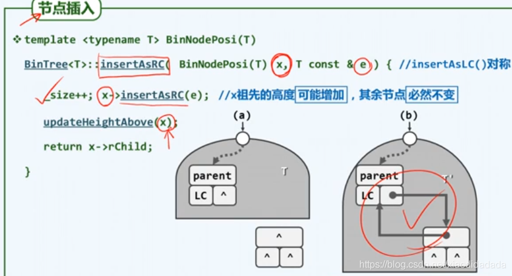

## e 相关算法

### e1-1 先序遍历转化策略

如何将【半线性结构】转换成【线性结构】，以利用之前造好的轮子

### e1-2 遍历规则

### e1-3 递归实现

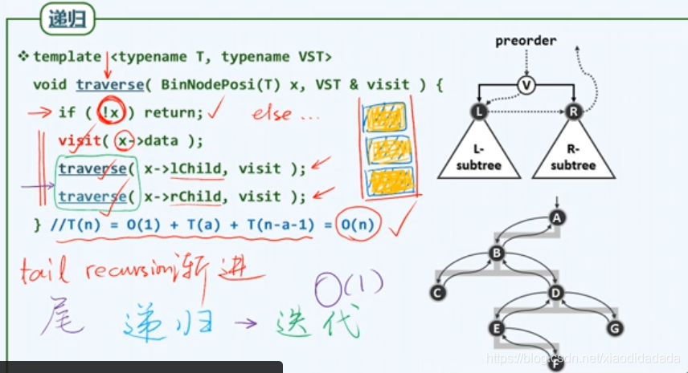递归的写法，系统栈为了保证递归的通用性，占用空间较大，基于自己定义的栈完成递归，更精确，占用空间小。

### e1-4 迭代实现

### e1-5 实例

上图中的思路，不易推广到中序、后序遍历，所以需要寻找新的思路。

### e1-6 新思路

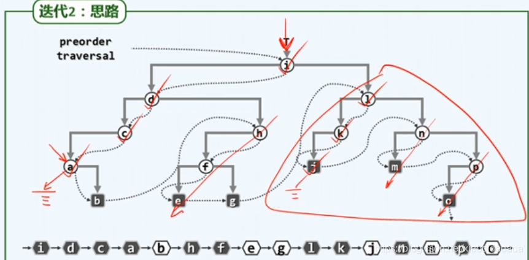左侧链

### e1-7 新构思

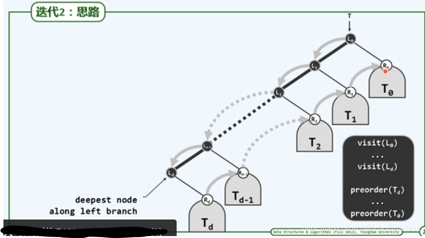

### e1-8 迭代实现2

### e1-9 实例

### e2-1 中序遍历递归

对于中序遍历，上图可以看到，对于右子树的遍历是【尾递归】，而左子树的遍历不再是【尾递归】，改写起来难度更大。

### e2-2 观察

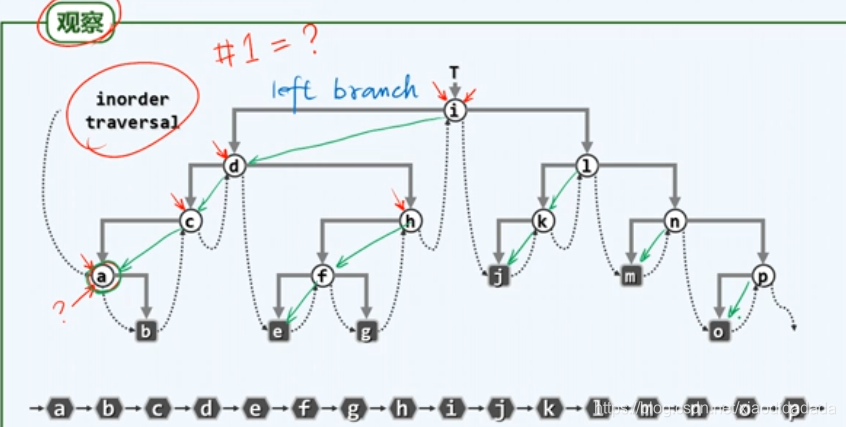

### e2-3 思路

### e2-4 构思

### e2-5 实现

### e2-6 实例

### e2-7 分摊分析

后序遍历：中序遍历中，弹出的x(根)先不直接执行访问，先执行右子树操作（猜测，见书，可以去学堂在线看看有无）  
参考博客：https://www.jianshu.com/p/eb6f4de6efbd

### e4-1 层次遍历次序

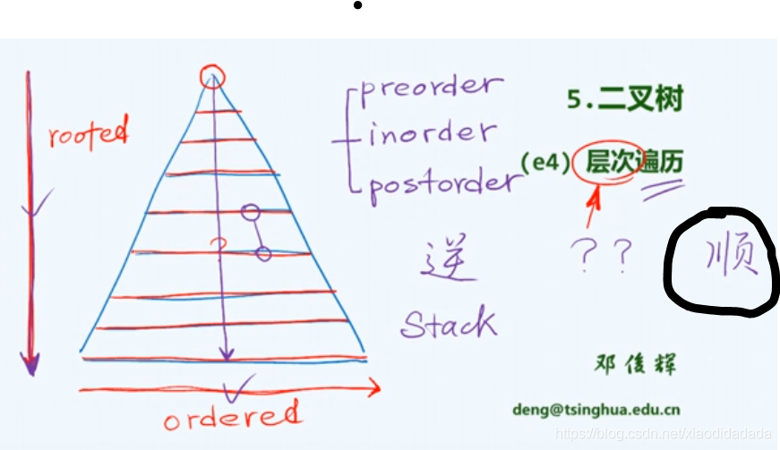

### e4-2 实现

### e4-3 实例

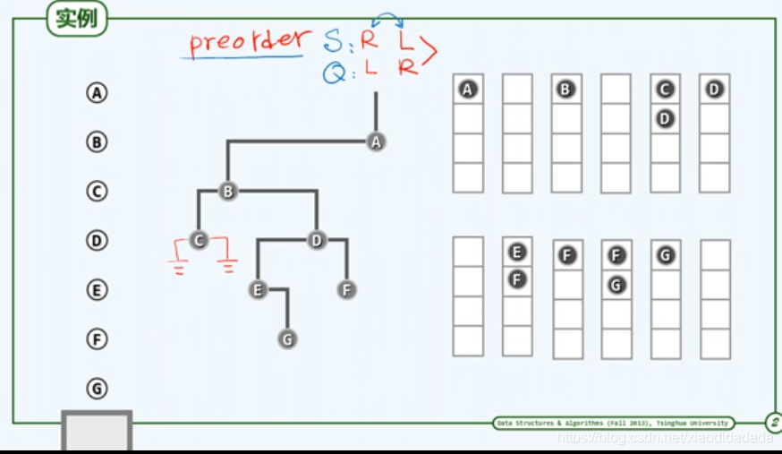

### e5-1 重构之遍历序列

### e5-2(先序或后序)与中序

不能基于前序遍历序列和后续遍历序列来完成重建，因为有可能出现左或右子树为空的情况（如上图右），会出现歧义，当去除根节点，不知道是左子树还是右子树。

### e5-3 (先序+后序列)真二叉树重建

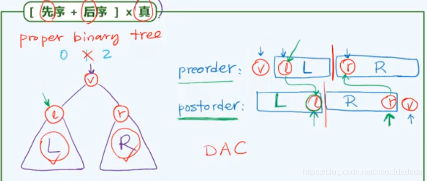