- [图](https://blog.csdn.net/xiaodidadada/article/details/108679104#_2)
- - [a 图](https://blog.csdn.net/xiaodidadada/article/details/108679104#a__3)
    - - [a1 概述：邻接，相关](https://blog.csdn.net/xiaodidadada/article/details/108679104#a1__4)
        - [a2 有向/无向图](https://blog.csdn.net/xiaodidadada/article/details/108679104#a2__6)
        - [a3 路径 环路](https://blog.csdn.net/xiaodidadada/article/details/108679104#a3___8)
    - [b](https://blog.csdn.net/xiaodidadada/article/details/108679104#b_11)
    - - [b1-1 邻接矩阵-接口](https://blog.csdn.net/xiaodidadada/article/details/108679104#b11__12)
        - [b1-2 邻接矩阵与关联矩阵](https://blog.csdn.net/xiaodidadada/article/details/108679104#b12__14)
        - [b1-3 实例](https://blog.csdn.net/xiaodidadada/article/details/108679104#b13__16)
        - [b1-4 顶点和边](https://blog.csdn.net/xiaodidadada/article/details/108679104#b14__18)
        - [b1-5 邻接矩阵](https://blog.csdn.net/xiaodidadada/article/details/108679104#b15__20)
        - [b1-6 顶点静态操作](https://blog.csdn.net/xiaodidadada/article/details/108679104#b16__22)
        - [b1-7 边操作](https://blog.csdn.net/xiaodidadada/article/details/108679104#b17__24)
        - [b1-8 顶点动态操作](https://blog.csdn.net/xiaodidadada/article/details/108679104#b18__26)
        - [b1-9 综合评价](https://blog.csdn.net/xiaodidadada/article/details/108679104#b19__28)
    - [c搜索](https://blog.csdn.net/xiaodidadada/article/details/108679104#c_31)
    - - [c1 BFS化繁为简](https://blog.csdn.net/xiaodidadada/article/details/108679104#c1_BFS_32)
        - [c2 策略](https://blog.csdn.net/xiaodidadada/article/details/108679104#c2__34)
        - [c3 实现](https://blog.csdn.net/xiaodidadada/article/details/108679104#c3__36)
        - [c4 可能情况](https://blog.csdn.net/xiaodidadada/article/details/108679104#c4__38)
        - [c5 实例](https://blog.csdn.net/xiaodidadada/article/details/108679104#c5__40)
        - [c6 多连通](https://blog.csdn.net/xiaodidadada/article/details/108679104#c6__42)
        - [c7 复杂度](https://blog.csdn.net/xiaodidadada/article/details/108679104#c7__44)
        - [c8 最短路径](https://blog.csdn.net/xiaodidadada/article/details/108679104#c8__46)
    - [d 深度优先搜索](https://blog.csdn.net/xiaodidadada/article/details/108679104#d__48)
    - - [d1 DFS算法](https://blog.csdn.net/xiaodidadada/article/details/108679104#d1_DFS_49)
        - [d2 DFS框架](https://blog.csdn.net/xiaodidadada/article/details/108679104#d2_DFS_51)
        - [d3 细节](https://blog.csdn.net/xiaodidadada/article/details/108679104#d3__53)
        - [d4 无向图](https://blog.csdn.net/xiaodidadada/article/details/108679104#d4__59)
        - [d5 有向图](https://blog.csdn.net/xiaodidadada/article/details/108679104#d5__61)
        - [d6 多可达域](https://blog.csdn.net/xiaodidadada/article/details/108679104#d6__63)
        - [d7 嵌套引理](https://blog.csdn.net/xiaodidadada/article/details/108679104#d7__65)

  

day25

# 图

## a 图

### a1 概述：邻接，相关

之前学习到vector，tree都是图的特例；

### a2 有向/无向图

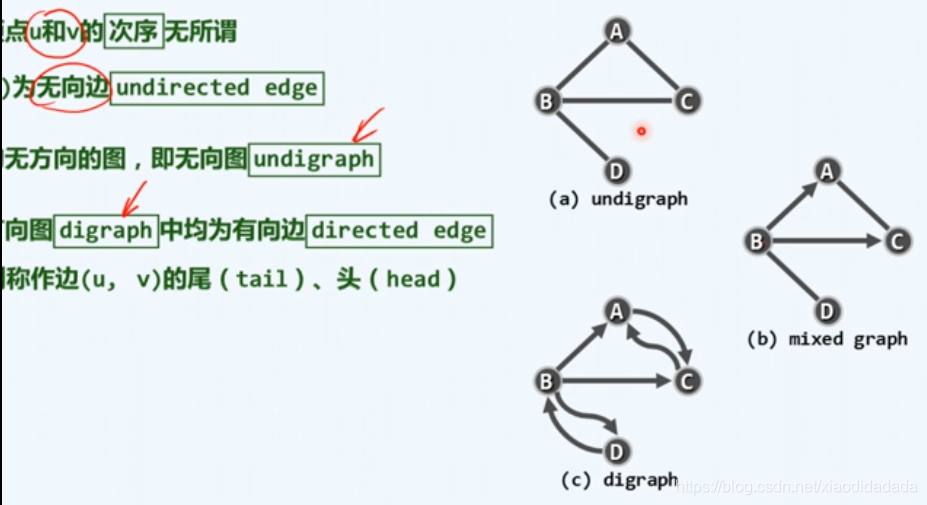可以通过有向图表示无向图或混合图，技巧是将无向边转化为彼此对称的一对有向边。

### a3 路径 环路

所有的环路中比较有意思的两种：如图（i）经过所有的边一次且恰好一次，（ii）经过每个顶点一次且恰好一次  
有向无环图（DAG）不包含有向环的有向图就是有向无环图

## b

### b1-1 [邻接矩阵](https://so.csdn.net/so/search?q=%E9%82%BB%E6%8E%A5%E7%9F%A9%E9%98%B5&spm=1001.2101.3001.7020)\-接口

### b1-2 邻接矩阵与关联[矩阵](https://so.csdn.net/so/search?q=%E7%9F%A9%E9%98%B5&spm=1001.2101.3001.7020)

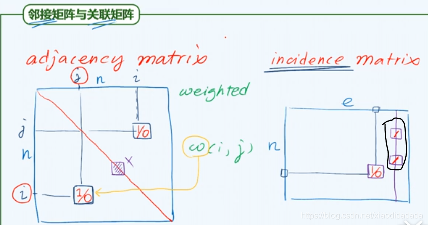关联矩阵行为顶点，列为边，每一列只有两个位置是1，其余位置都是0

### b1-3 实例

### b1-4 顶点和边

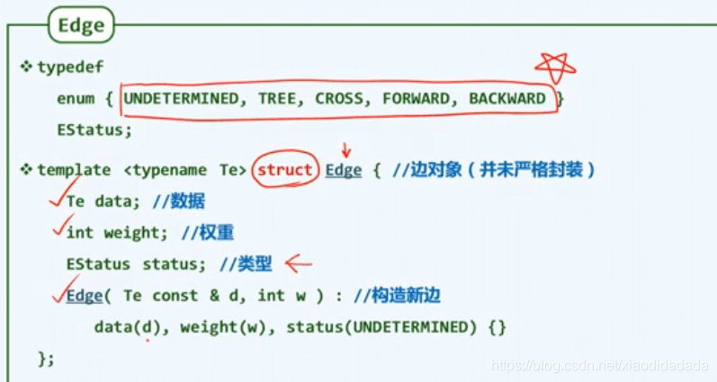

### b1-5 邻接矩阵

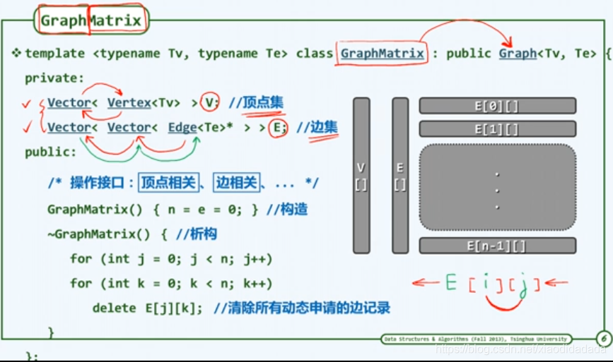顶点集，边集（即邻接矩阵)

### b1-6 顶点静态操作

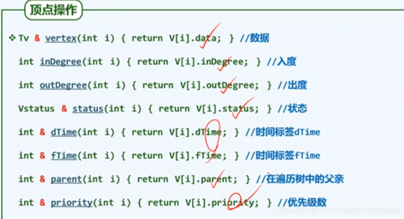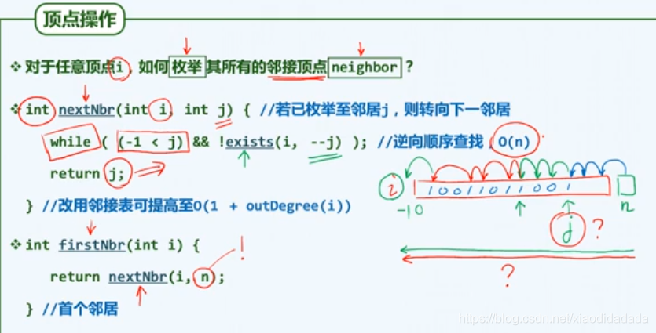

### b1-7 边操作

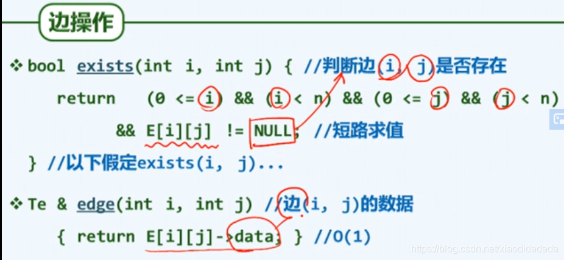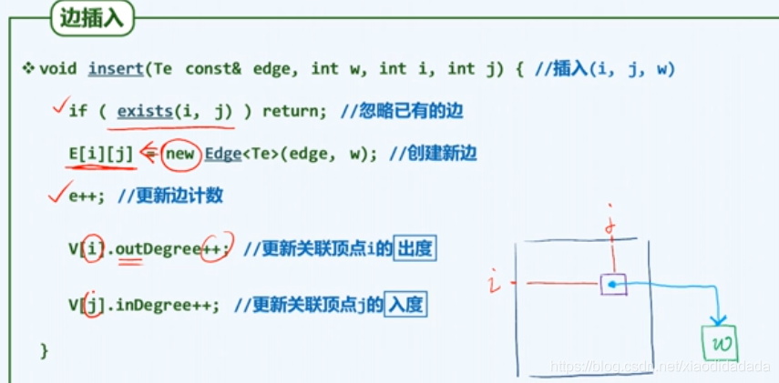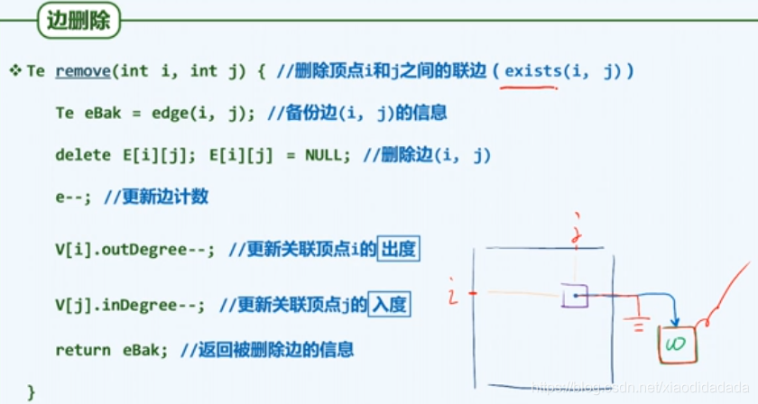

### b1-8 顶点动态操作

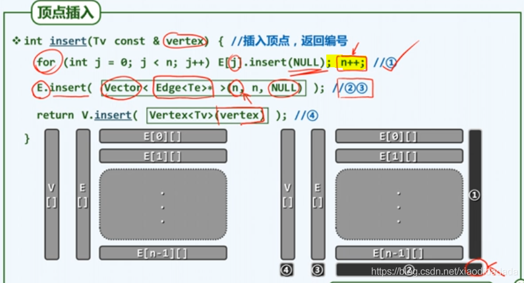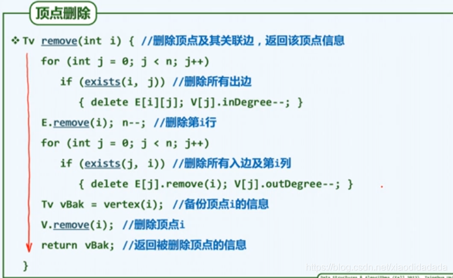上述代码有误，需要在第4、8行加上代码e–(边数减一)

### b1-9 综合评价

对邻接矩阵表示法的综合评价  
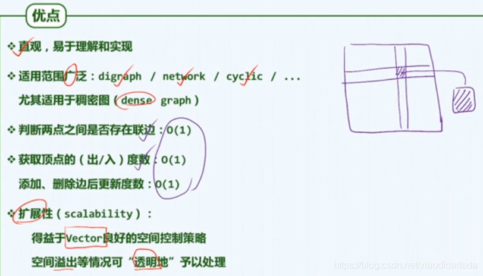具体证明方法参考教材练习中的6-3题

## c搜索

### c1 BFS化繁为简

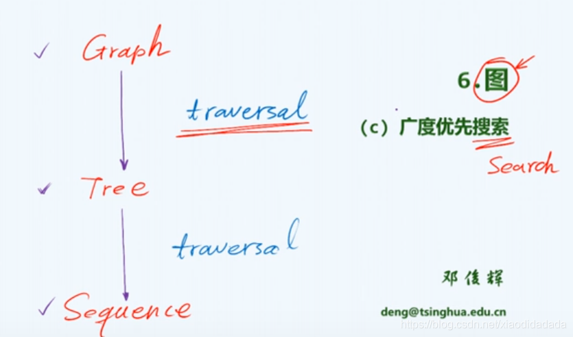

### c2 策略

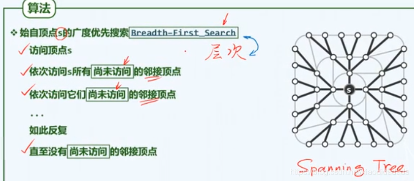树的层次遍历是图的广度优先搜索的特例

### c3 实现

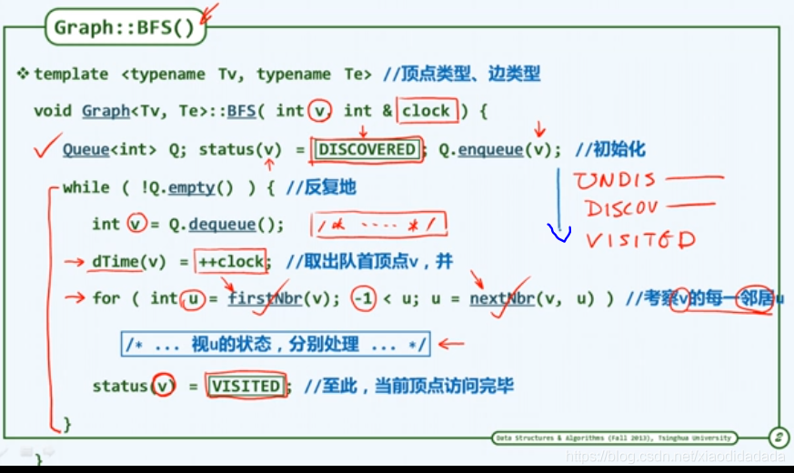分别处理见下一节

### c4 可能情况

### c5 实例

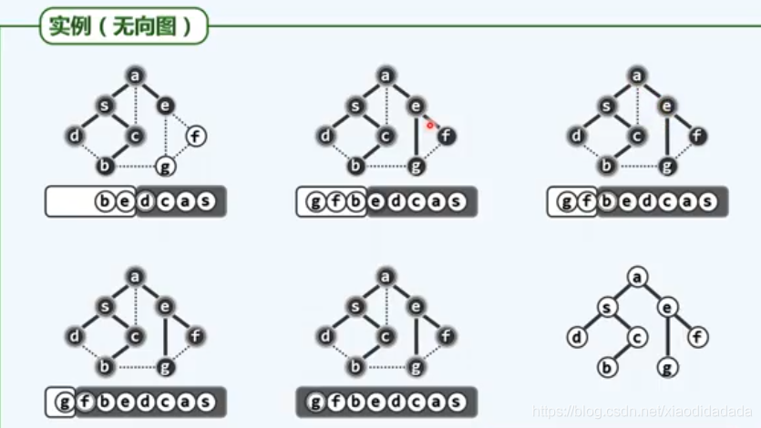最后去掉cross edge，可以得到一棵树（右下图)

### c6 多连通

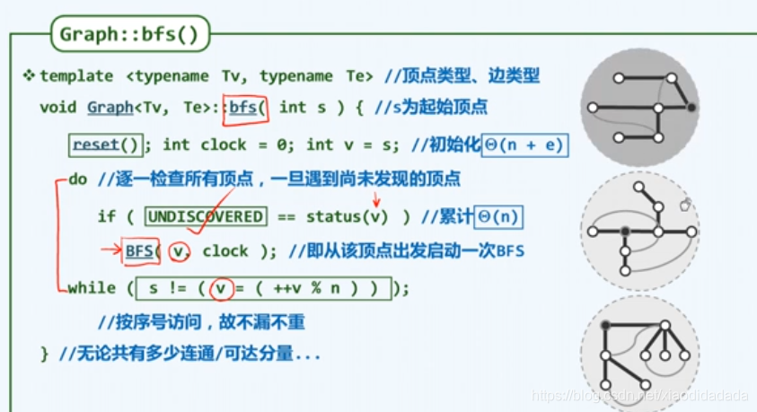如何实现对多个连通域的统一遍历，每一个连通域启动且只启动一次广度优先搜索

### c7 复杂度

对前面BFS代码的复杂度分析

### c8 [最短路径](https://so.csdn.net/so/search?q=%E6%9C%80%E7%9F%AD%E8%B7%AF%E5%BE%84&spm=1001.2101.3001.7020)

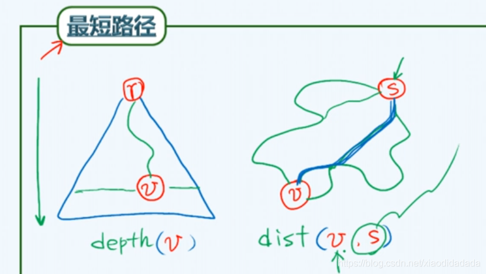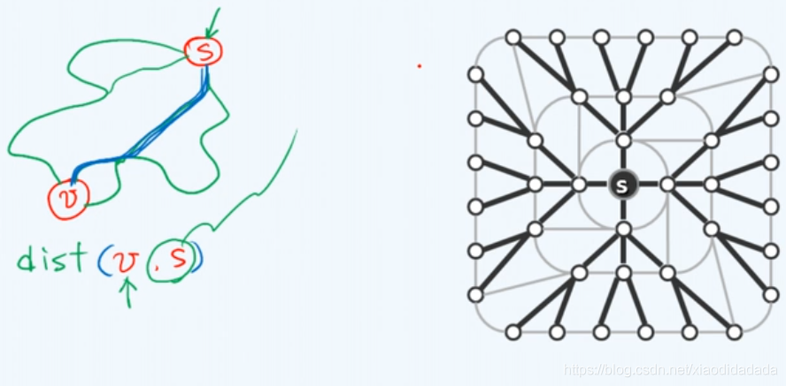对于无权图的BFS遍历，如上图右，每个节点与S节点的那一条通路，恰好对应于原图中这两个节点间的最短通路。证明见习题6-7

## d [深度优先搜索](https://so.csdn.net/so/search?q=%E6%B7%B1%E5%BA%A6%E4%BC%98%E5%85%88%E6%90%9C%E7%B4%A2&spm=1001.2101.3001.7020)

### d1 [DFS](https://so.csdn.net/so/search?q=DFS&spm=1001.2101.3001.7020)算法

### d2 DFS框架

### d3 细节

有向图的深度优先搜索树中有四类边。设(v,u)是图中一条边。  
在explore(v)中如果u是第一次被访问，则(v,u)是树边(Tree edge);  
若v是u在搜索树中的祖先，且在explore(v)前u已经被访问过，则(v,u)是前向边(Forward edge);  
若v是u在搜索树中的后裔，且在explore(v)前u已经被发现，则(v,u)是回边(Back edge);  
若v和u没有祖先-后裔（后裔-祖先）关系，且在explore(v)前u已经被访问过，则(v,u)是横跨边(Cross edge).

### d4 无向图

见视频

### d5 有向图

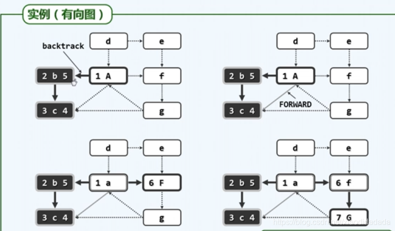详见视频

### d6 多可达域

### d7 [嵌套](https://so.csdn.net/so/search?q=%E5%B5%8C%E5%A5%97&spm=1001.2101.3001.7020)引理

