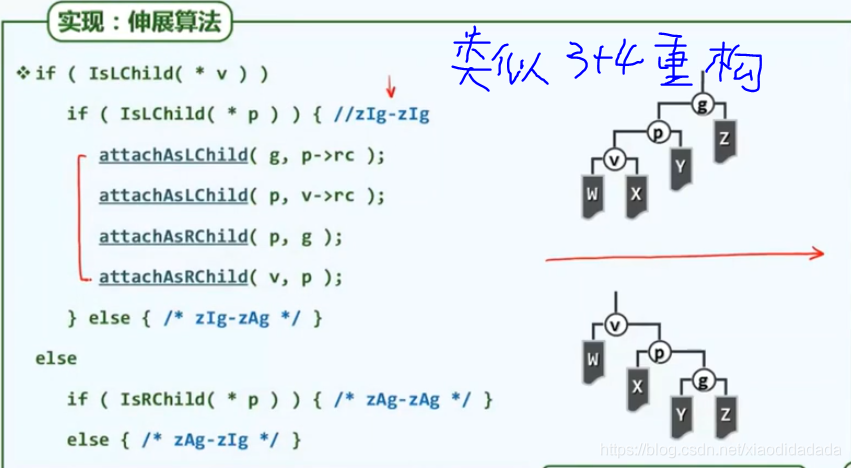
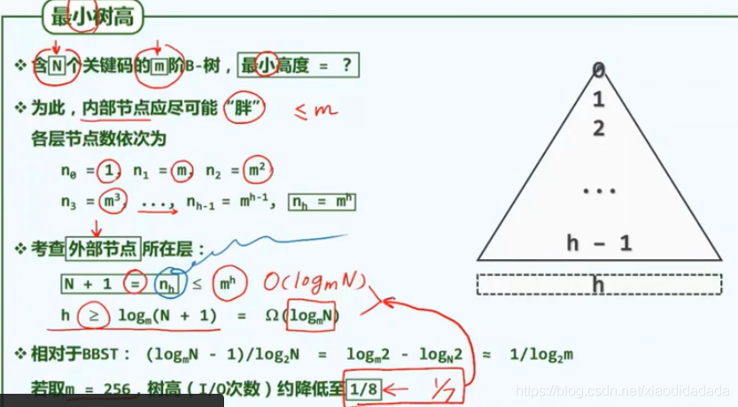
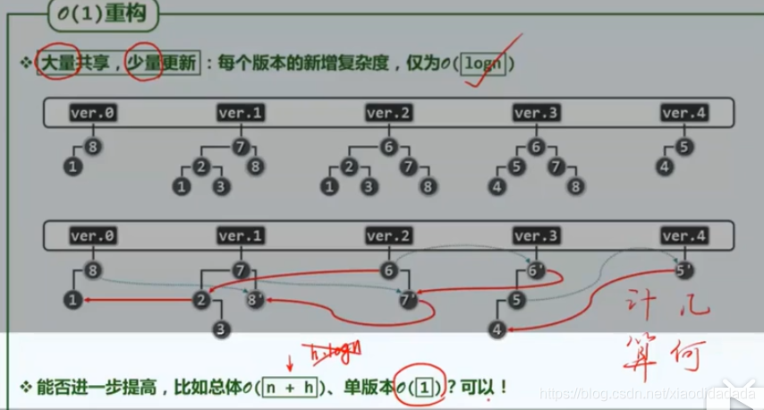
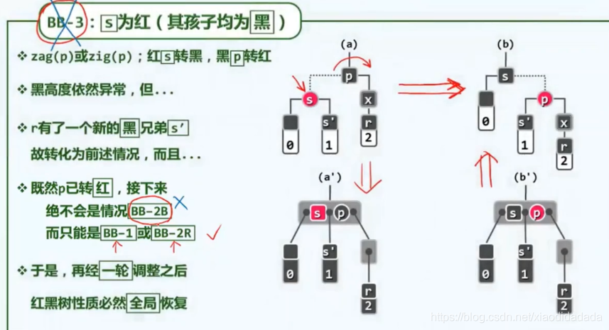

- [8 高级搜索树](https://blog.csdn.net/xiaodidadada/article/details/109197882#8__2)
- - [8.a 伸展树](https://blog.csdn.net/xiaodidadada/article/details/109197882#8a__4)
    - - [8.a1 伸展树逐层伸展](https://blog.csdn.net/xiaodidadada/article/details/109197882#8a1__5)
        - [8.a2 伸展树双层伸展](https://blog.csdn.net/xiaodidadada/article/details/109197882#8a2__9)
        - [8.a3 伸展树算法实现](https://blog.csdn.net/xiaodidadada/article/details/109197882#8a3__12)
    - [8.b B树](https://blog.csdn.net/xiaodidadada/article/details/109197882#8b_B_16)
    - - [8.b1 B树动机](https://blog.csdn.net/xiaodidadada/article/details/109197882#8b1_B_17)
        - [8.b2 B树结构](https://blog.csdn.net/xiaodidadada/article/details/109197882#8b2_B_20)
        - [8.b3 B树查找](https://blog.csdn.net/xiaodidadada/article/details/109197882#8b3_B_23)
        - [8.b4 B树插入](https://blog.csdn.net/xiaodidadada/article/details/109197882#8b4_B_28)
        - [8.b5 B树的删除](https://blog.csdn.net/xiaodidadada/article/details/109197882#8b5_B_33)
    - [8.xa 红黑树](https://blog.csdn.net/xiaodidadada/article/details/109197882#8xa__39)
    - - [8.xa1 红黑树动机](https://blog.csdn.net/xiaodidadada/article/details/109197882#8xa1__40)
        - [8.xa2 红黑树结构](https://blog.csdn.net/xiaodidadada/article/details/109197882#8xa2__46)
        - [8.xa3 红黑树插入](https://blog.csdn.net/xiaodidadada/article/details/109197882#8xa3__51)
        - [8.xa4 红黑树删除](https://blog.csdn.net/xiaodidadada/article/details/109197882#8xa4__57)

  

第八章 高级搜索树

# 8 高级搜索树

day48

## 8.a 伸展树

### 8.a1 伸展树逐层伸展

列表前端访问效率更高，树根位置访问效率更高  
反复使用等价变换（zig/zag）,是的v的高度逐层上升，最终转移至树根，具体示例如下图  
最坏情况时，与AVL树的log(n)度相比，差很多，甚至退化成了List/Vector,主要原因还是splay(伸展)的策略不对，而不是伸展本身

### 8.a2 伸展树双层伸展

二者局部结构有微妙的差异，但是这种差异是颠覆性的  

### 8.a3 伸展树算法实现

图中m节点是右子树中的最小的节点  
图中的nlogn项，是在达到这种状态之前需要的时间复杂度。复杂度的严格证明，参考习题8-2  
day49

## 8.b B树

### 8.b1 B树动机

B树主要运用与外存存储的原因：每个对外存的IO次数较少（等价于树的高度小）

其本质还是二叉搜索树，因此，相等于把二叉树高度变小，节点变大，节点的大小与每次IO最大取出的大小相似。高度变小，则每次查找次数变小

之所以不在节点内部也按照二叉树查找而按顺序查找的原因：在小范围内，顺序查找快于二叉树的查找速度

动机：高效I/O  
边际时间成本

### 8.b2 B树结构

（2，4）树在B树中有比较特殊的地位，其与红黑树有不解的渊源  

### 8.b3 B树查找

假设根节点已经在内存中  

实际是顺序查找与IO操作（通过IO操作将待查询节点送入内存，实际情况，由于B树较大，一般只在内存存放B树的根节点）

利用外部节点可以将位于不同存储级别的B树串接起来，构成更大的B树。  

关键码的数目大概是几百，对于如此规模的查找，二分查找的效率不如顺序查找  
可以看出，当B树的关键码总数 N 固定时，B树的高度浮动是非常有限的，几乎不发生变化。

### 8.b4 B树插入

注意，这里的第一个search函数，是前面二叉树的search函数，如果找不到，就返回NULL，并且更新\_hot，而第二种search函数向量的查找算法，会返回一个恰当的 r,便于后续的插入。  
节点关键码数不超过m-1，分支数不超过m;  
分裂后左右孩子的关键码数目也不会低于下限  
当上溢传播到根的时候，整个树会长高一层（B树长高的唯一原因)，这个时候根节点只有一个关键码，其分支只有两个，这也就是前面对根节点的关键码数下限单独定义的原因。

### 8.b5 B树的删除

同理，当右孩子节点关键码数目充足时，而左孩子节点关键码数目下溢时，也可以向右孩子“借”关键码，这样右孩子以后也不容易上溢。(左顾右盼)  
由于这个合并是向父节点借了一个关键码，所以父节点可能会继续发生下溢，最坏的情况是下溢传播的树根，整个的复杂度不超过O(h)。可能会导致树的高度减一。  
光线的折射，来实现速度的最优，B-Tree通过改变形态来适应内存外存读取速度的不同，也是在模仿这一种自然法则。  
https://zhidao.baidu.com/question/1993560025571237907.html  
day53

## 8.xa 红黑树

### 8.xa1 红黑树动机

累计的时间复杂度是指，为了生成和记录所有的快照累计的时间复杂度  
挑战：除了生成元素需要O(n),能否将每一个版本控制在O(h\*logn)范围内？  
可以，但需要利用相邻版本之间的关联性  
红线表示共享，蓝线表示更新。  
所以需要引入一种树结构，他的任何一次动态操作引发的结构变化量不致超过O(1)

### 8.xa2 红黑树结构

假象的外部节点（真二叉树）  
提升变换（lifting）  
其中H为黑高度，将红黑树进行提升变换，变成（2，4）树，其高度恰好就是黑高度H，再由前面B-Tree部分证明的高度的范伟可进一步推至红黑树高度h的范围。  
这里的高度是指黑高度H

### 8.xa3 红黑树插入

以B-Tree为引子  
对于(a’)只需要交换p和g的颜色即可，对于(b’)只需要交换x和g的颜色即可  
全树拓扑连接关系变化量不超过O(1)，因为只进行了局部拓扑结构调整。  
此过程，双红缺陷可能会进一步向上转移，但不外乎还是前面的提到的两种情况，在此过程中虽然重染色的复杂度可能高达log(n)，但是树的拓扑结构的变化还是O(1)  
重构次数为常量，拓扑结构变换为常量。AVL树的插入操作也是满足这个的，但是其删除操作不满足，存在多次重构。

### 8.xa4 红黑树删除

上图中s是继承p的颜色  
虽然下溢会向上传播，但是重构操作的次数仍然控制在O(1)  
红黑树的特性，对于持久性结构的实现至关重要