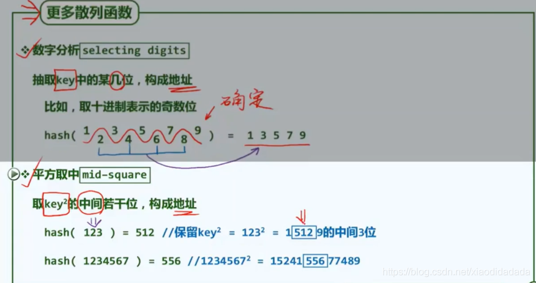
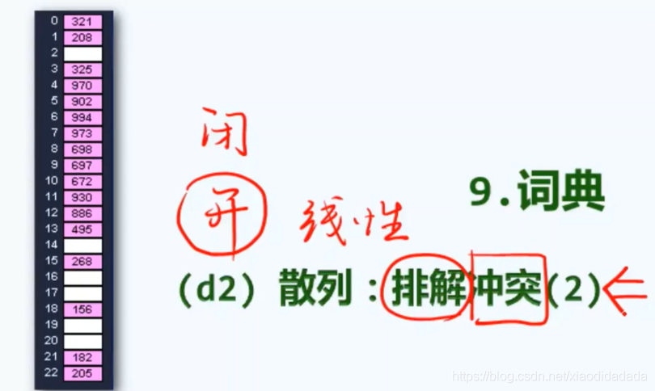

- [9.词典](https://blog.csdn.net/xiaodidadada/article/details/109534120#9_3)
- - [9.b 散列原理](https://blog.csdn.net/xiaodidadada/article/details/109534120#9b__4)
    - [9.c 散列函数](https://blog.csdn.net/xiaodidadada/article/details/109534120#9c__9)
    - [9.d 冲突](https://blog.csdn.net/xiaodidadada/article/details/109534120#9d__16)
    - - [9.d1 散列排解冲突1](https://blog.csdn.net/xiaodidadada/article/details/109534120#9d1_1_17)
        - [9.d2 散列排解冲突2](https://blog.csdn.net/xiaodidadada/article/details/109534120#9d2_2_19)
    - [9.e 桶/计数排序](https://blog.csdn.net/xiaodidadada/article/details/109534120#9e__26)

  

day58  
第九章 词典

# 9.词典

## 9.b [散列](https://so.csdn.net/so/search?q=%E6%95%A3%E5%88%97&spm=1001.2101.3001.7020)原理

Hashing-散列  
数据来源于一个相当大的空间，但是实际要存储和组织的数据是其中很小的子集，空间效率极低  
压缩空间  
鸽巢问题，将x从比较大的定义域，映射到更小的值域，可以采取一定的手段减少冲突（设计更好的散列函数或者增大散列表长M），但是无法避免（如何解决？)

## 9.c 散列函数

gcd:最大公因子为1  
取中间的若干位，可以使原关键码的各数位对地址的影响彼此更为接近，如下图，平方运算可以分解成加法运算  
散列函数越是随机，越是没有规律，越好。  
key可能不是整数，需要先将其转换为hashcode,再做处理，如下图  
有必要，如果使用简单的计算方法，很容易出现哈希冲突  

## 9.d 冲突

### 9.d1 散列排解冲突1

查找时跳过，插入时直接插入。

### 9.d2 散列排解冲突2

封闭定址 vs 开放定址  
上面介绍的线性试探，试探位置间距太近，会造成很多不必要的冲突。可以适当的拉开间距  
假设一次缓存的大小是1KB，桶中只存储指针（4字节），那么除非发生16次散列冲突，才会使得缓存失效，需要额外的I/O。  
b+a≥2，是M的非平凡因子，这与M为素数相矛盾。  
对于有些素数（例如7，11）的表长，双向查找链行之有效，有些素数（例如5，13）的表长效果不好.  

## 9.e 桶/计数排序

其中n为元素个数，\[0,M)为元素范围  
其中红线是蓝线的积分  
线性扫描一遍得到count\[\],再扫描一遍count\[\]得到accum\[\],就可以在线性时间完成排序