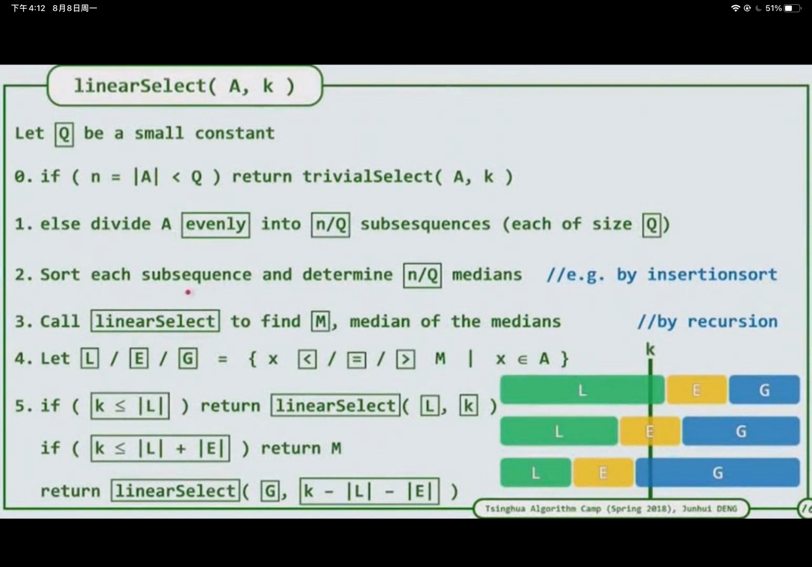
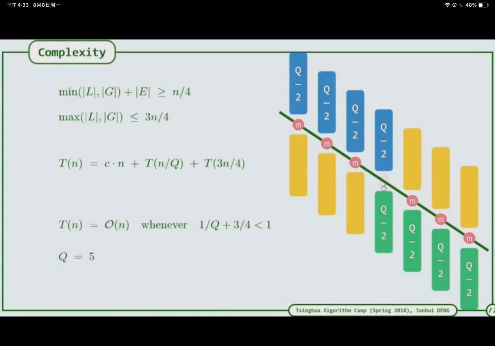

1. 由于求的是第k大的元素，其之前和之后的元素不要求进行排序，若排序的话相当于增加要求，复杂度增加，因此可选择快排，每次排序后看该主元与k的关系，可舍弃相当大一部分
2. 
3. 快慢取决于主元选取
4. 由于快排是按某种规律选择的主元，如第一个元素，主元的好坏直接影响其效率
5. 可以按每组q人，划分为n/q个组，每组排序，找到中间元素，再将中间元素排序，将每组中间元素的中间值作为主元，进行快排，每次可减少1/4的规模（k一定是在主元左或右或等于，若其在主元左侧，则严格比该主元大的元素，恰好占1/4（主元为每组中间值的中间值，因此有一半组的中间值都比该主元大，则其后面的元素也大，因此可减少1/4）