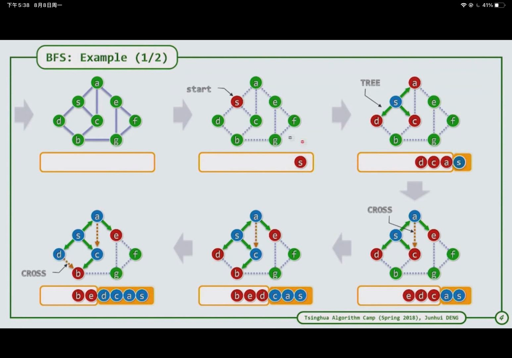
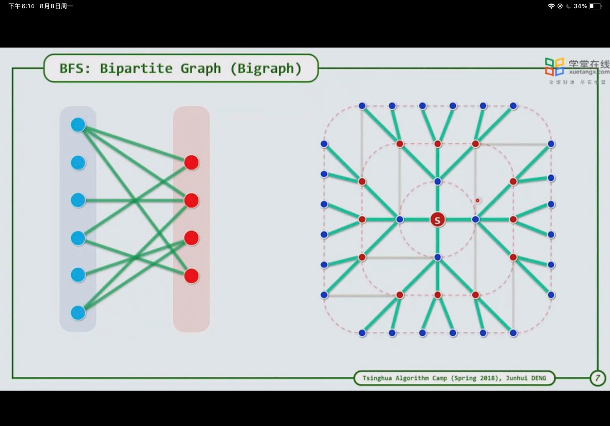
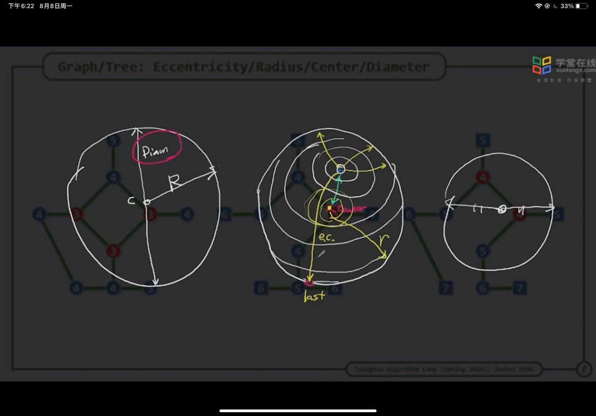
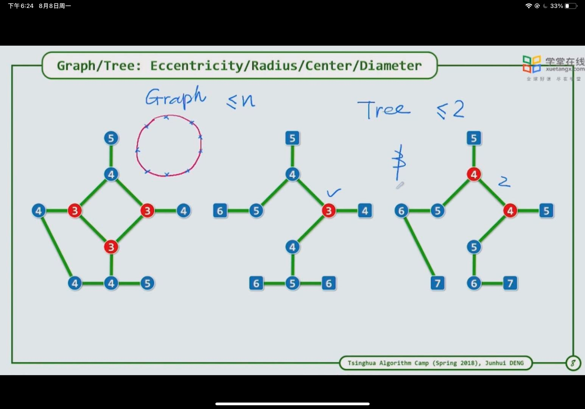

1. 按层遍历，每次遍历一层，可给每个元素设置一个层数，然后其子元素依次加一

2. 特点

   1. 
   2. 若待遍历元素A访问一个遍历过的元素B则其为一条cros边，他们层数只有两种可能，A和B同层，A比B更靠近内层，不可能B比A更靠近内层（若B比A更靠近内层，则此时B一定访问过，而B和A之间的路径应当已经标记，不可能还是未标记状态）
   3. 其可以划分为两部分
   4. TREE边相连的两个节点所属不同集合，CROSS边相连的所属相同集合；每隔一层的元素所属相同集合

3. 相关变形：

   1. 求该图中的最长距离
      1. 首先，一个图也可以抽象为一个圆，其有半径和直接，一个点可以用距圆心的距离描述（在图中一般用其到图边界最长的路径表示，若其距边界最短，则其越靠近圆心，否则最远离圆心）
      2. 求图中最长距离时，可等价为一个圆，在一个圆中，最长距离为直径，也就是两点必须位于圆上。因此，求图中最长距离时，可以先找到图边界上最长一点，再根据该点为直径一点，求直径另一点，直径上两点距离则为最长距离。
      3. 因此具体求解步骤：随便找一点，BRS求最外层点，再以最外层点做BFS，求其最外层点，两点之间的距离便为最长距离
   2. 求圆心时，依次做BFS，最小层数的点便为圆心点，每个点都可能是center（此时各个点都在圆的边上）。对于树而言，其center不会超过两个，假设为三个，则其到各边距离最短，其必然互相相连，此时构成了一个环路，不符合树的定义
   3. 

   