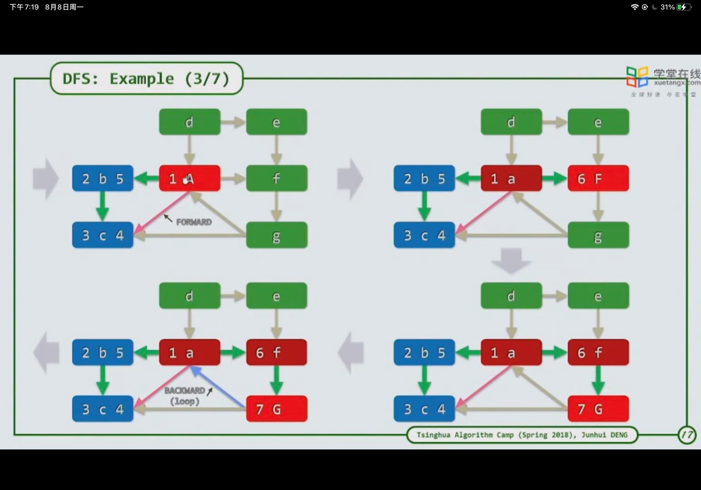
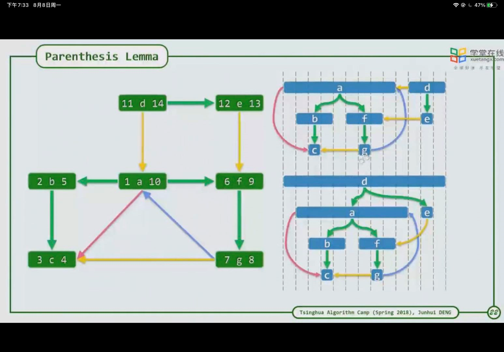

1. 深度优先：任选一个节点，进行深度遍历。
2. 特点关系（有向图）：
   1. 祖先先进行遍历但不完成遍历，后代后进行遍历但早完成遍历
   2. 
   3. 图中共有三种边，
      1. 一种是tree边，直接相连，表示在生成的树中有父子关系
      2. 一种是FORWARD边，待搜寻元素遍历已完成搜寻元素，表示已完成搜寻元素是其后代
      3. 一种是BACKWORD边，表示形成一条环路，待搜寻元素遍历已搜寻但未完成搜寻元素（表示孩子指向其祖先）
   4. 不同节点的选择，其生成的树也不一样
      1. 
      2. 每个后代均是在其祖先的生存时间内，可给每个元素设置开始遍历时间和完成遍历时间。
      3. 由于每遍历一次祖先时间要加一，因此，开头和结束是必不可少的，若有多个孩子，完成孩子遍历之后还要返回该节点，也消耗一个时间，即：父亲生存时间=1+孩子生存总时间+孩子总数