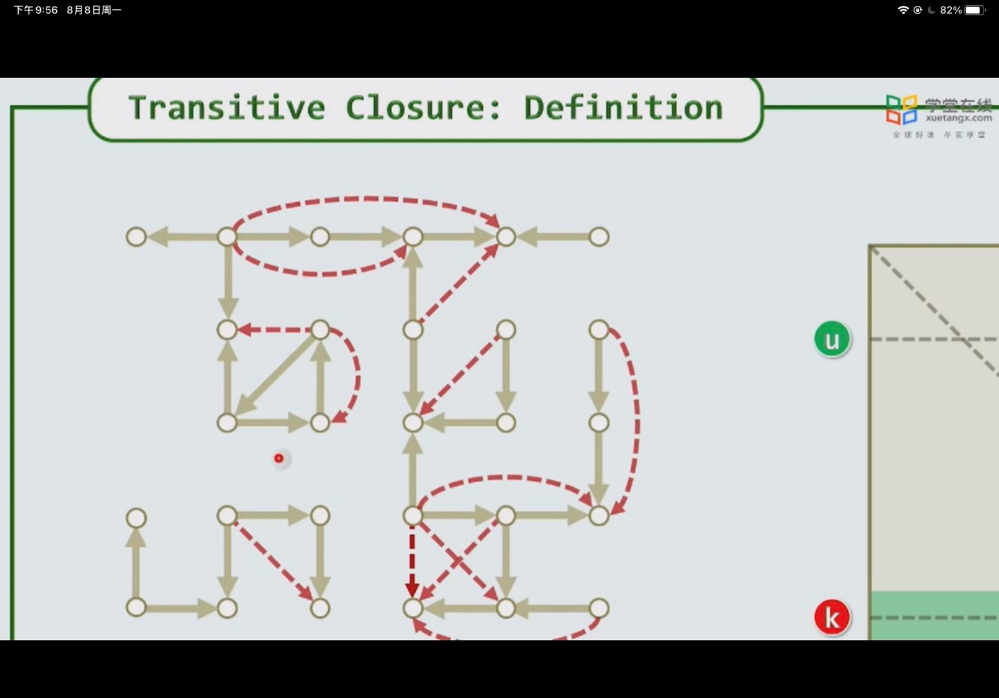
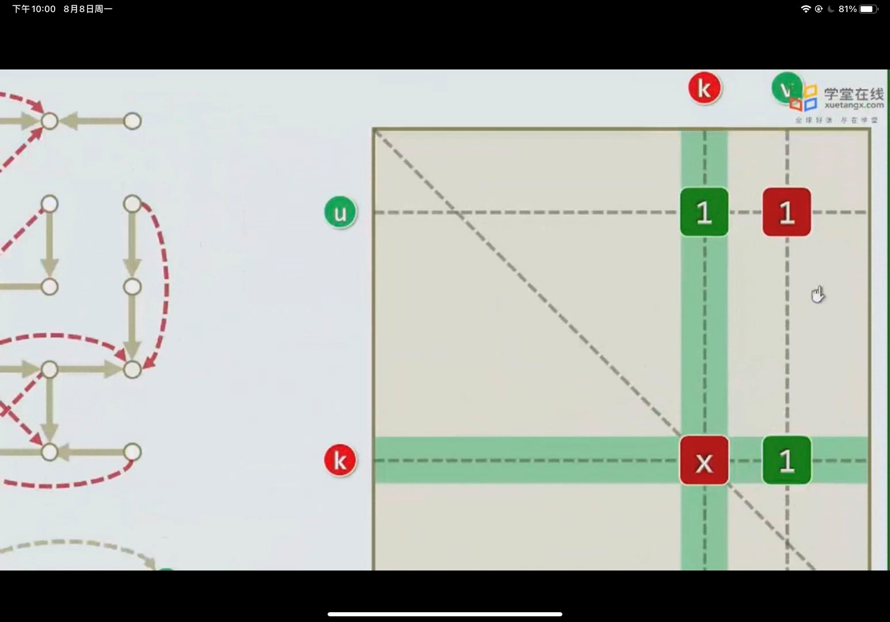

1. 在一个有向图中，以邻接矩阵的形式将图进行存储。连通为1，不连通为0
   1. 求其是否连通，若a可到达b，b可到达c，则称a可到达c
   2. 描述
   3. 方法：
   4. 观察可知，其可以从最左侧开始，进行遍历，每次都选择k行k列的，k列表示所有可以到达k的元素，k行表示所有k到达的元素，则将其分别遍历，若a[i] [k]=1,a[k] [j]=1,则若a[i] [j]=0,则进行更新，使其等于一，依次进行。
2. 其也可以拓展为两点之间的最小距离，将默认值1变为权重即可，而更新时，相加并找到较小值更新

