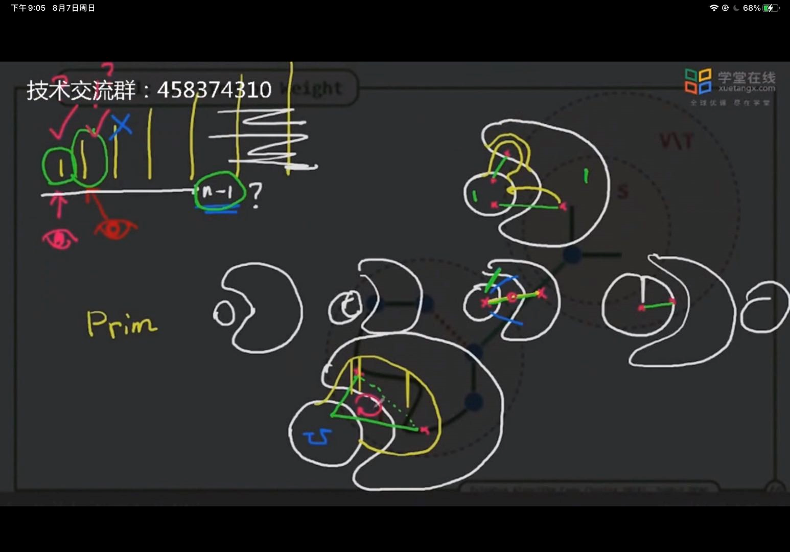

1. 最小生成树有两种算法，一种是prim还有一种kruskal，均是从最局部最优使最终结果最优
2. ==最短路径和最小生成树，本质上是一样的，都是求最小，但是主体不一样，最小生成树的主体为树，因此是以树中的所有元素作为主体，而最短路劲是相对于一个节点而言的最短路劲，因此只能以该节点作为主体，求其他元素相对该元素的最短路径==
3. prim
   1. 创立一个==主==树，每次在待解决图节点中，寻找相对==本树==最短路径的点，并以此将其添加进去
   2. 主树和待排序图节点集合中，若图节点中存在两个节点分别为第一短和第二短的节点，则这两个节点均一定可以添加主树中，但是第三个最短路径节点不一定，由于这三个点可能形成以一个三角形
4. kruskal
   1. 每次选取最短路径连接两个不在同一棵树的节点，可形成多个树，最后由于树之间会存在路径，最终会合并为一棵树