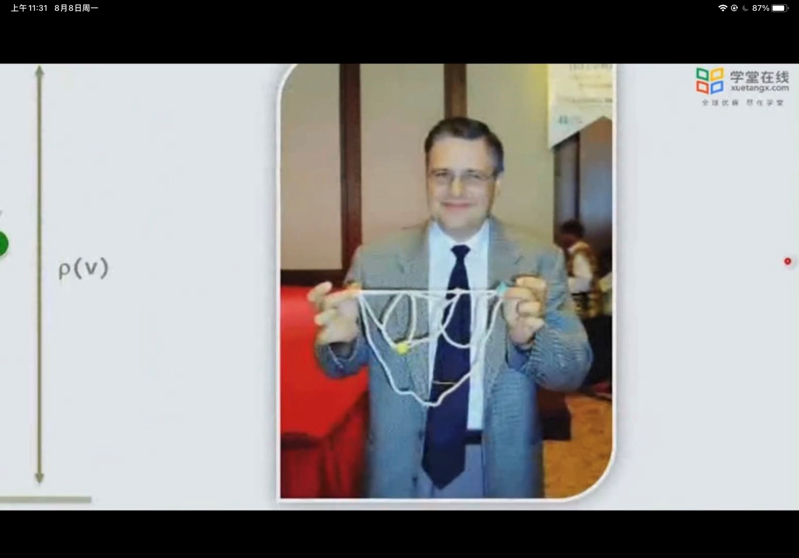
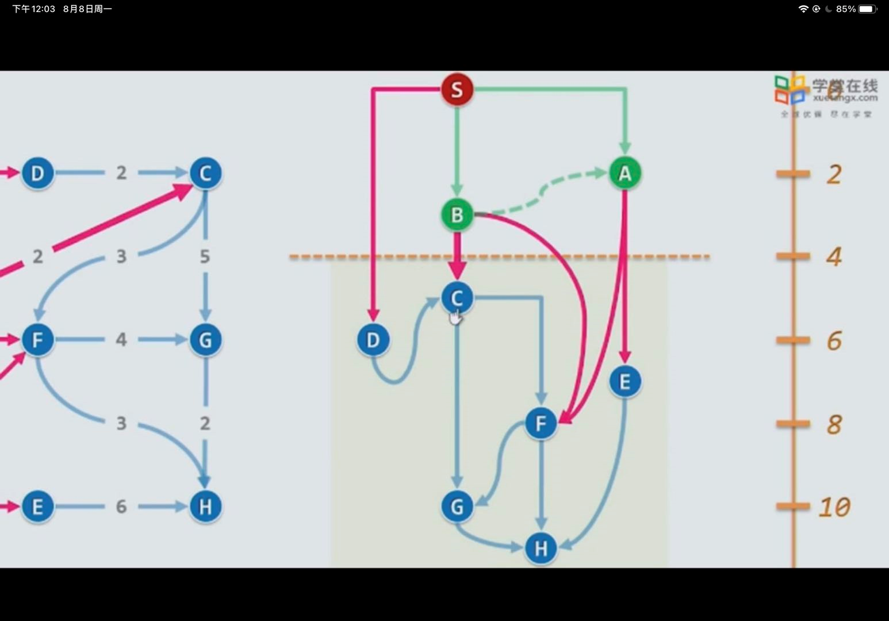

1. 一般是以待求节点为主体，逐渐的将相对该节点最短的路劲加入到该节点附近，形成一棵树
2. ==最短路径和最小生成树，本质上是一样的，都是求最小，但是主体不一样，最小生成树的主体为树，因此是以树中的所有元素作为主体，而最短路劲是相对于一个节点而言的最短路劲，因此只能以该节点作为主体，求其他元素相对该元素的最短路径==
3. 若后一个节点不是直接与该节点相连，则在这条路径上存在一个直接与后一个节点相连的节点，后一个节点到主节点的距离为前一个节点到后一个节点到主节点的距离加前后两节点路径之间的权重。eg：d[i]=d[i-1]+w[i-1,i]
4. 一开始将离主节点最近的元素添加进去，然后更新刚加入节点的距离，再寻找相对主节点最短的距离
5. 自然界中，若直接求两点之间的最短路劲，将每个节点用钢珠表示，而路径用一条绳子连接，将这两点拉成一条直线，则直接可看到最短路径，若求每个节点对该节点的最短路径，则需要将该主节点提起来，其他节点的到主节点绷紧的路径即为最短路径
6. 