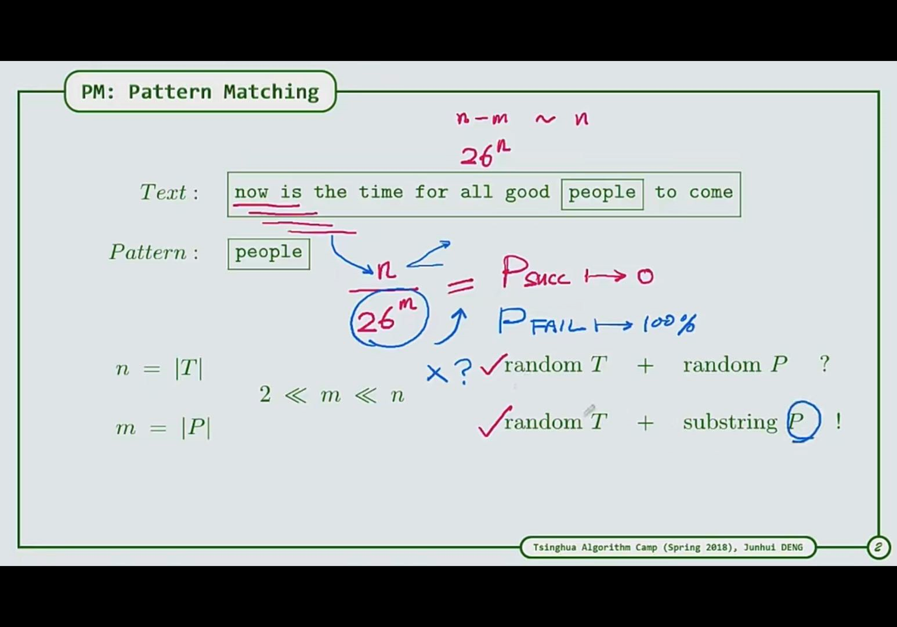
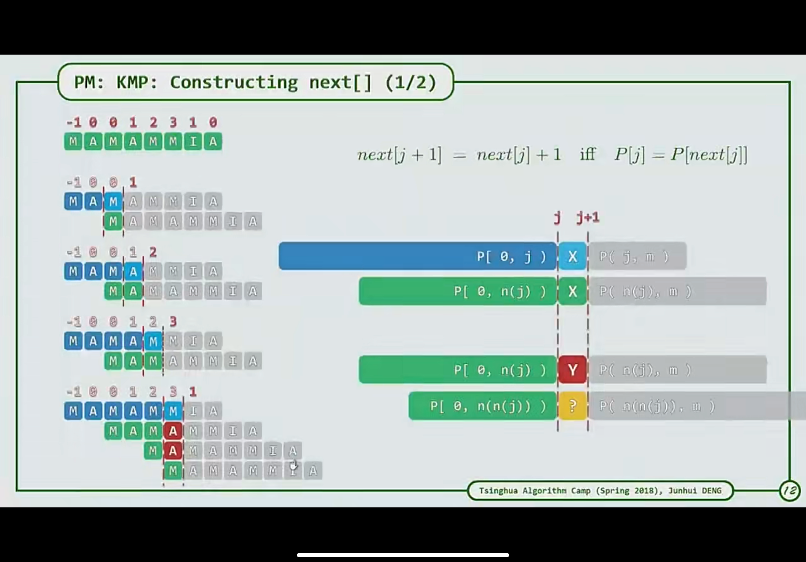
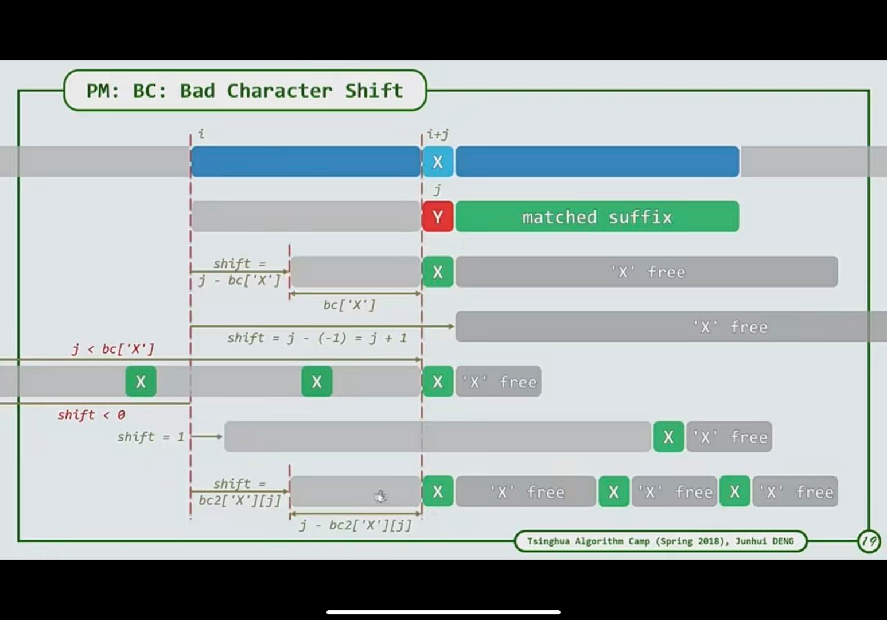
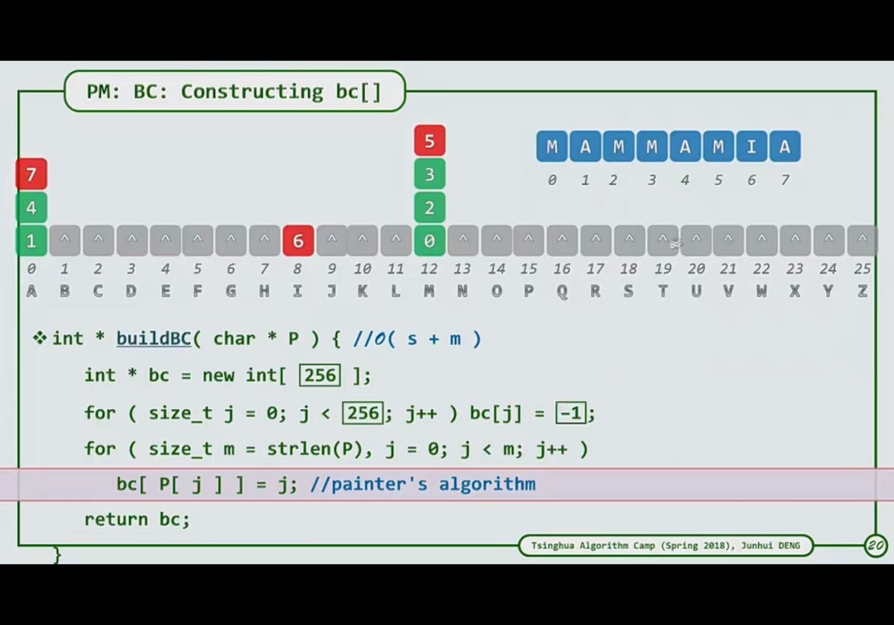
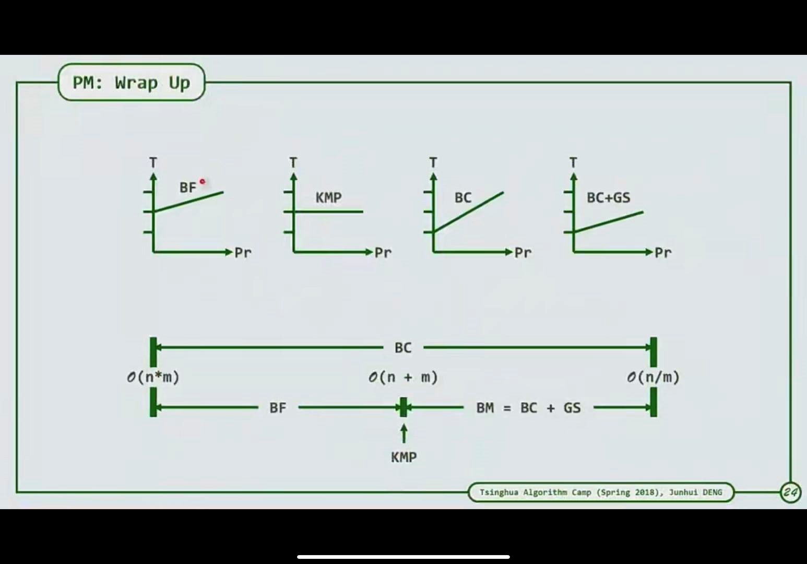

1. KMP
   1. 在一个长子串中找到一个短子串的位置。主要是利用==经验==之谈
   2. 相对来说适合字符集较少的序列，比如0101之类的序列，若是很多字符集使用蛮力法也可以，进行失配的概率小
   3. KMP算法核心：当一个长子串与一个短子串进行比较后，由于其是一个元素一个元素比较的，若比较到第k个元素，则相当于长子串的前k个元素与目标串的前k个元素相等。由于k的整个子串在开始比较前就已知该串之间元素的关系，而长子串的关系是通过比较后才可得的。因此可以在比较前就进行该短子串的特征构造出其特点。
   4. 由于在比较中，若发生失配，则相当仅知道第k个元素与长串对应的元素不等，而不知道具体关系，因此该位置的元素便不可用，只能用前k-1个元素。相当于在前k-1个元素中，找出其最大前缀，满足其最大前缀的最后一个元素与第k-1个元素之前的元素一一对应。可使用动态规划来解决。对于一个子串来说，添加一个元素，其最大满足的只可能比前一个元素大一个，不可能大多个。
   5. 其滑动的距离是选尽可能安全的选最短的，最为安全
   6. 若碰到坏字符，其每次向后移动一步，就是蛮力算法了，因此其存在局限性。
2. BC算法改进
   1. 其从目标串的后面往前面进行匹配，可以充分增大移动距离
   2. 示例：
   3. 若y位置发生失配，则其寻找y前面离y最近的一个x字符（为了简便直接选取每个字符在字符串中最靠后的位置；或者直接借鉴kmp算法，其后缀方向也构成kmp算法，然后进行查找，看x其滑动距离是否相等，若不等则看下一个x，若不等则滑动整个字符串）
   4. 方案：
   5. 对每个字符构建一个位置表，若一个字符的位置更加靠后则进行更新。
   6. 算法速度：

