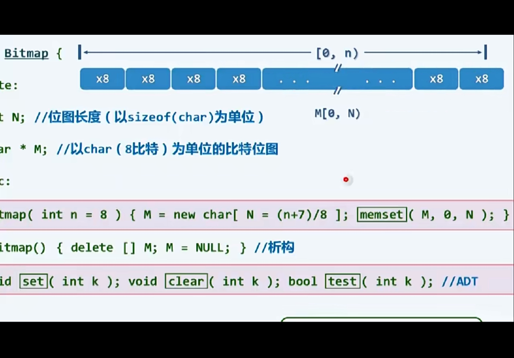
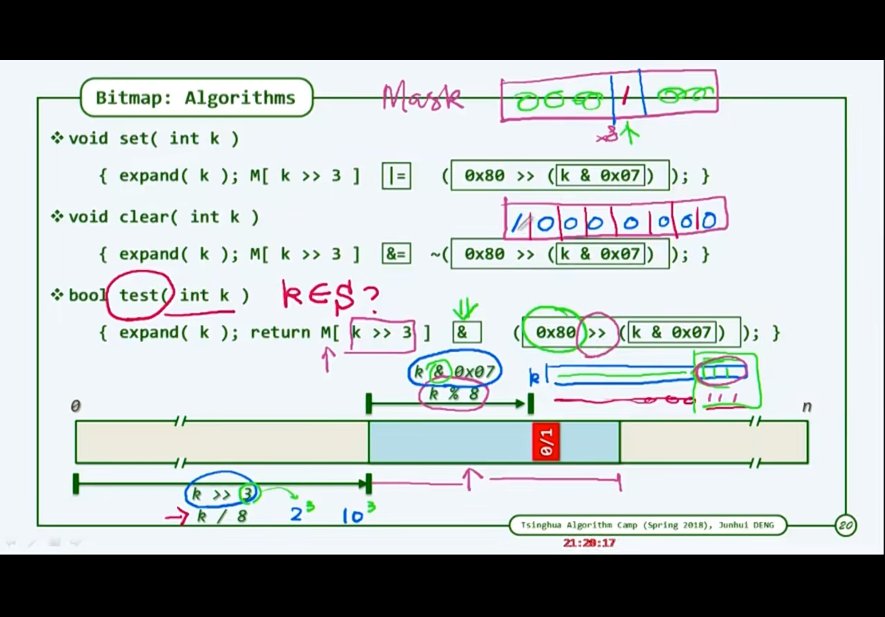

1. 对于一系列整数存储，若其密度足够大且足够多的话，可以用位数组来表示。在这个位数组中，若某个数存在，则其对应的秩数据为1，否则为0；

2. 优点：大大减少了内存，原本4*n 变成了n（n为最大的数）

3. 如图：

4. 关键在于如何快速搜寻一个数，首先看其在那个大段上，x%8==程序员写x<<3==;然后再根据x%8==程序员写0x80>>(x&0x07)==求出具体位置

5. 0x80>>(x&0x07)的含义，首先0x表示十六进制，x按位与0x07,则相当于x&1111，结果相当于其模八的结果，然后0x80表示1000000，再表示1再左移模八的位数

   