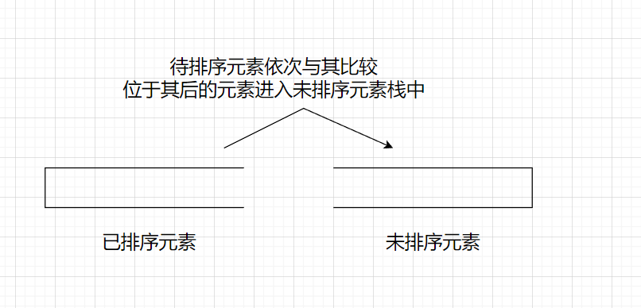
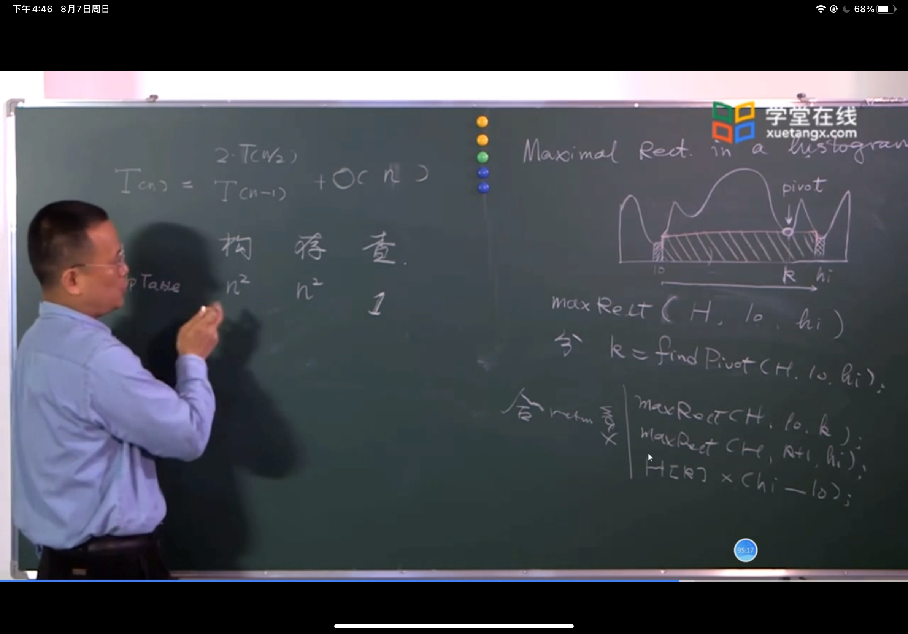
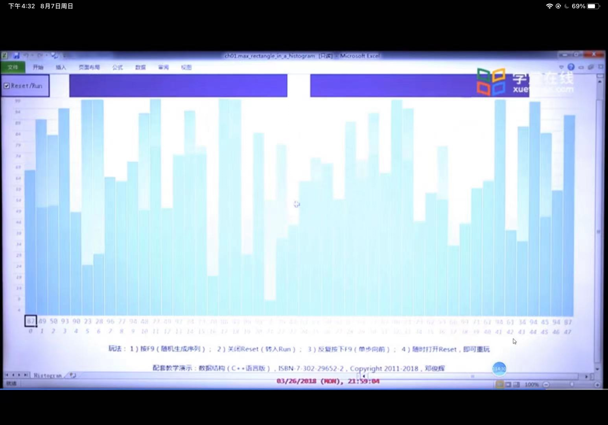

1. 用于插入排序

   1. 在插入排序中，由于前一部分是有序的，再使用一个未排序元素进行有序化。
   2. 则可以使用两个栈，一个栈存储为有序化元素，其top端为末端有序元素，另一个栈存储的为未排序元素，其top端为下一个待排序元素。
   3. 在进行排序时，待排序元素依次与有序化栈进行比较，不符合的元素则进入未排序栈，当找到其位置后，未排序栈中的临时存储的元素则再输出到有序化栈中，依次进行
   4. 

2. 用于直方图求最大面积

   1. 可抽象化为下图所示，求最大矩形面积。

   2. 

   3. 

   4. 通过观察可知，每个最低点都有唯一对应的两个左右边界（该边界均比其小，相当于两个边界中的最小值），相当于每个最低点只能用一次，但是边界可以用多次。因此，可以设置一个栈，该栈从最左侧开始，依次输入最低点，如果新输入的点是使top元素形成最低点，即top点左右两侧的元素值均比top元素小，则将其进行输出并计算其面积值。（相当于输出了两边界中的最低点值，该值进行输出，而边界值继续使用，并且既可以成为另一最低点的边界，其本身也可以成为一个边界，由于最低点的边界均比其小，且与其紧邻，则可通过假设法，若其后元素仍以其为边界，该其后最低点大于该值，且由于其右边界也小于该值，由于传递性，右边界也小于其后最低点值，且与其后最低值相距更短，因此应该是其右边界为其后最低点的边界，因此该点可以舍去）（同时也能发现，在栈中的元素是依次增大的，碰到待加入的元素比top元素小的元素则进行出栈并计算面积），同时，需要添加左右两个边界各为一个哨兵，则相当于两个边界值均要比其最小值小，则哨兵设置为-1，依次进行计算。

   5. 相关代码：

      - ```c++
        while(!stack.empt())
            if stack.top() < x and x >0
                stack.insert(x);
            else 
                y=stack.pop();
                s=y.h*(x-stack.top()-1);
                if(s>max)
                    max=s;
                
        ```

        

