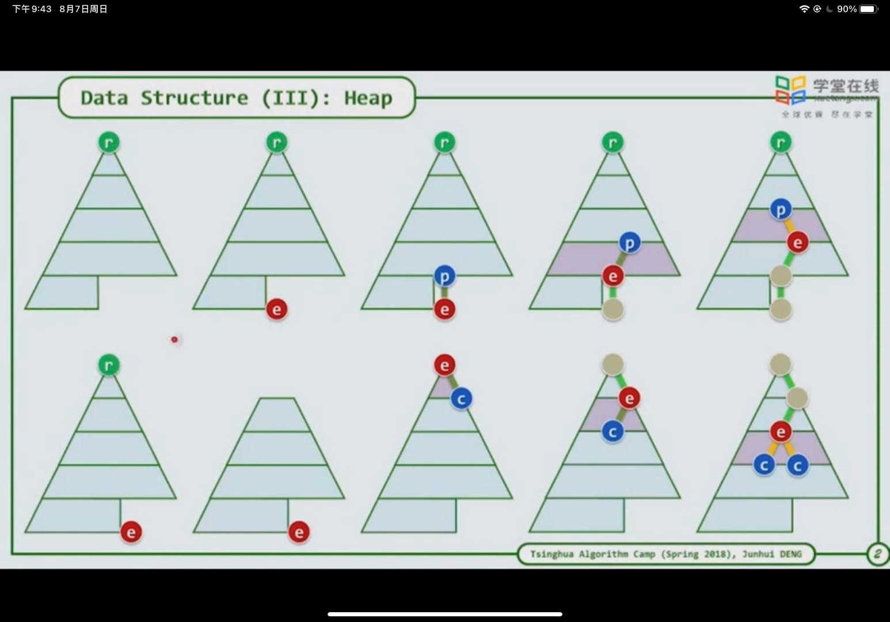

1. 堆排序：
   1. 每个父亲绝对大于其孩子，其左右孩子大小不定（要求不严格则进行调整较少，算法复杂度较低）
   2. 其整体形式为完全二叉树，即每层节点均为满节点，若不满则从左到右依次排列
   3. 第一个节点为0，则可根据完全二叉树的性质，可由在堆中其父亲的位置推算出其在数组中的位置，关系为 2*k+1 （左孩子） 2*k+2（右孩子） 由于计算机移位快，可简化为 Loc(k)=(k<<1)+1
2. 不论是插入还是删除，其结果形式均为完全二叉树，也就是说，要删除一个元素，则其最低层元素向左移一个（少一个），若增加一个元素，其末尾元素多一个
   1. 插入：由于插入元素大小未知，而该堆已经有序，因此只能将该待插入元素放入堆最后一个元素进行调整。若其大于其父亲，则与其父亲交换位置，否则不动（类似于冒泡排序）
   2. 删除，由于一般删除的是top元素，删除之后相当于上面少一个，下面相对于该数目的堆来说多一个元素，则下面多出来的一个元素应当移到top位置，再进行调整。只有均比其孩子大才能不动，否则移动到其大孩子位置
   3. 
   4. 