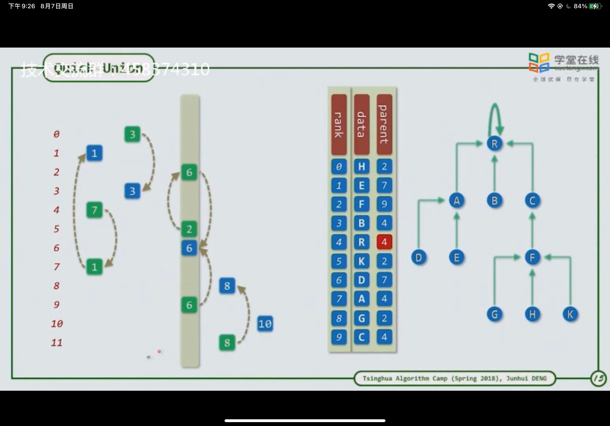
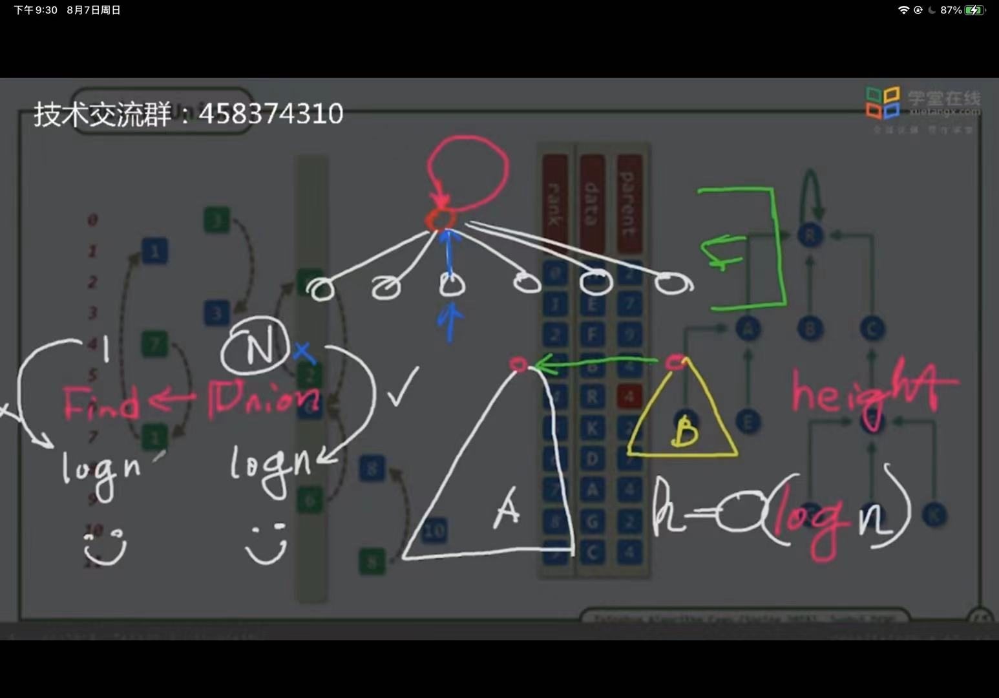

1. 并查集：判断一个元素分别属于哪一个集合

2. 蛮力法：

   1. 查询每一个集合，判断其是否在该集合中，若将该集合并入另一个集合，则需要将本集合中的全部元素遍历一编，将其归入另一个集合

3. 某元素代表法：

   1. 将两个元素连接起来，用一个元素代表集合，相当于一个班长代表一个班，但是并不是这个班中的所有元素均指向这个班长，而是其最终指向这个班长

   2. 基本思路：每个元素均指向一个元素，若一个元素指向其自己，则该元素相当于班长，用其代表整个集合（一个元素指向的元素可能还指向另一个元素，每个元素指向的元素可看做是一个大集合中的小集合），当两个元素所属的集合进行合并时，可直接将一个集合中的班长指向另一个集合的班长（或者指向该元素，一般是指向班长，更方便进行查找，在进行指向另一个班长时，另一个元素在查找过程中，也可以待到其班长找到后指向其班长，查询更加方便）

   3. 如图所示

   4. 

   5. 一条线上的表示其属于一个集合，每个集合都有其代表的元素，该元素指向其自己

   6. 同时，在两集合相互并入时，一般选择低集合并入高集合，此时其高度不变，还是高集合的高度（低集合就算整体并入根后，其高度仍小于等于高集合）

      