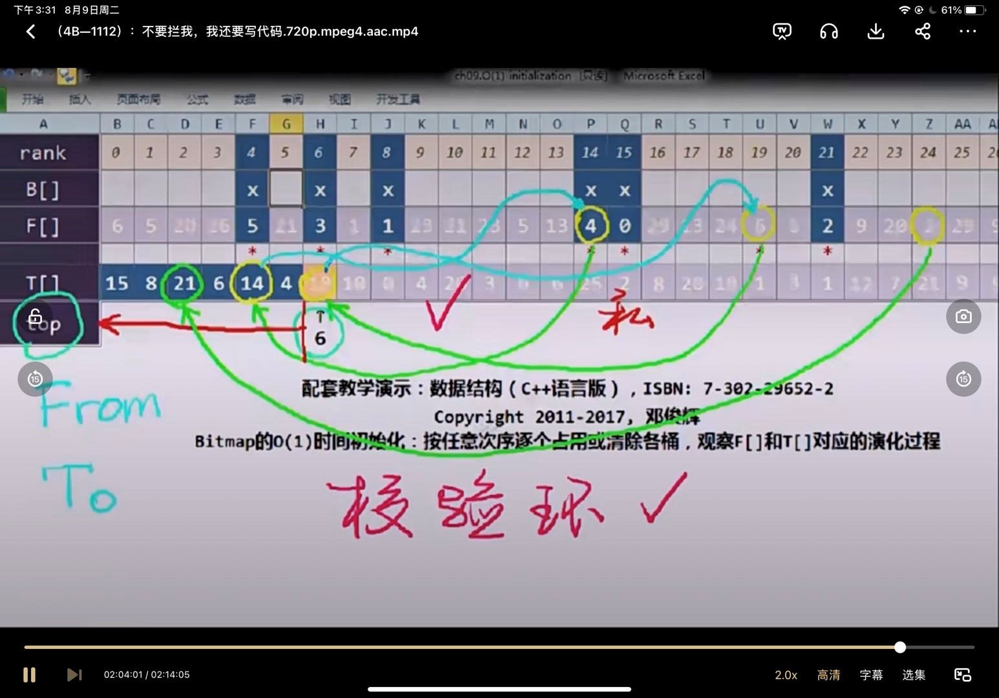

1. 大数组进行初始化时，由于其初始化速度较慢，因此可以利用空间换取时间。一个元素有两个值，一个是存储的数据，一个其第几个数，具有唯一性。创建双倍大小的数组，前一部分进行数据的存储，后一部分进行数据的校验。
2. 存储时，前一部分数组可随便添加，添加时加入数据和个数k，并更新最大存储个数，在数据的后一部分第k个元素中记录存入元素的下标，依次往后运算。即可以根据前一部分元素中的k值找到后一部分的第k个元素中的add值（其必须小于最大值），并验证地址是否相等。
3. 删除某个元素时，将其均删除后，后一部分最后一个元素移动到删除位置，并更新其对应元素的k值（类似堆排序）
4. 添加时直接在其后进行添加。
5. 若其有两个位置的元素相互对应但是其k值大于最大值，则表示其并不是存储数据。

