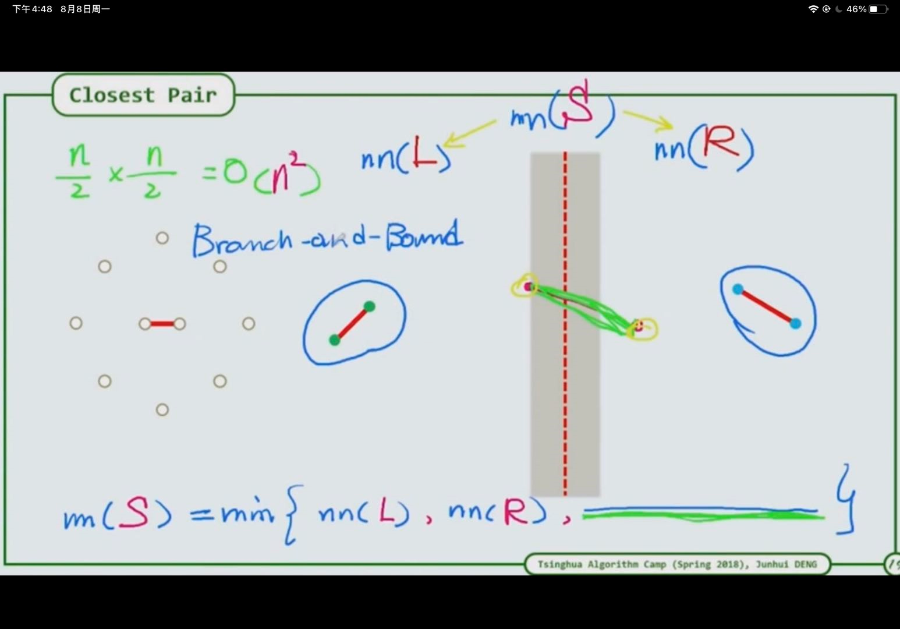
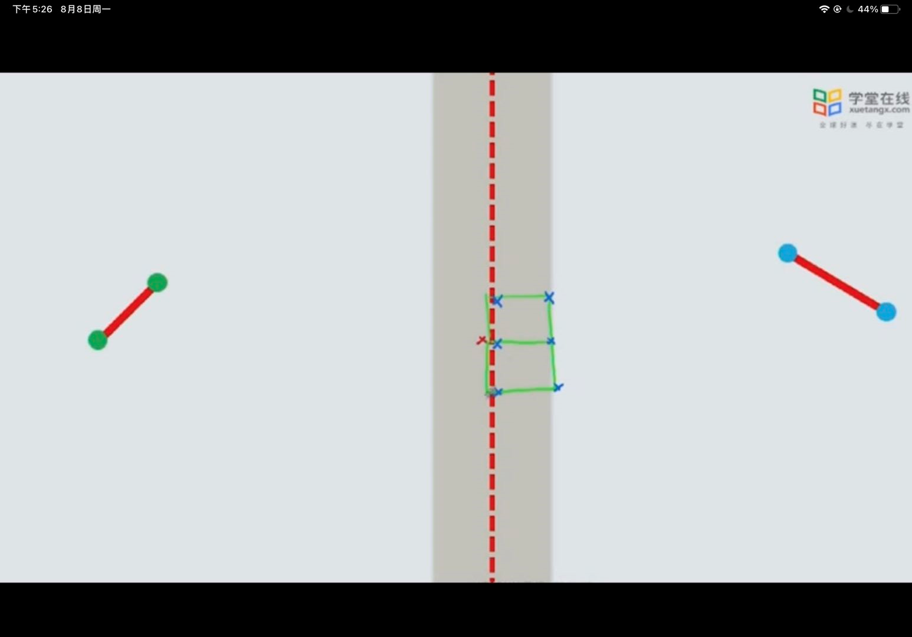
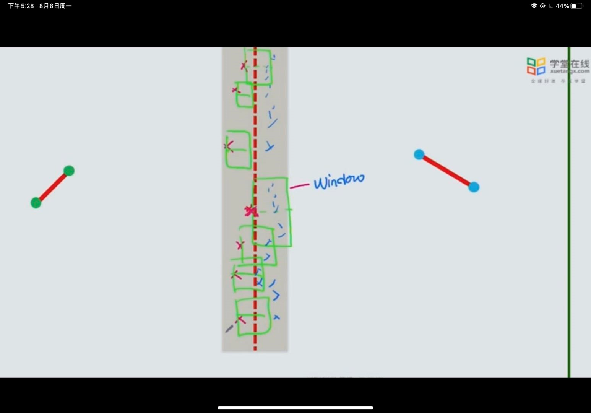

1. 分而治之：用一条线将其划分为两个区域，最小值有两种情况，一种在左右两个区域，一种跨越两个区域
2. 
3. 先求出两个区域中的最小值，再按该最小值min，在该划分线的左右两侧各min的距离，假设在该区域中存在两个点满足最小值，则其一个若在左侧，则其右侧中线区域中，其最多有六个点可以选，而左侧区域存在的也一定最多五个点，不可能过多点，较为稀疏，因此可以遍历左侧每个点，每个左侧点与其范围内的点进行匹配，寻找最终最小值

