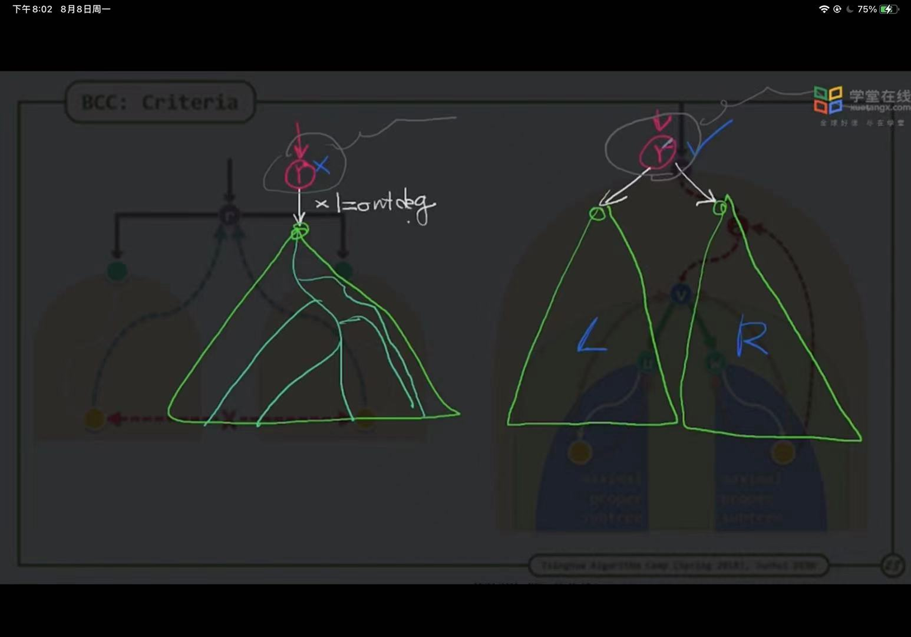
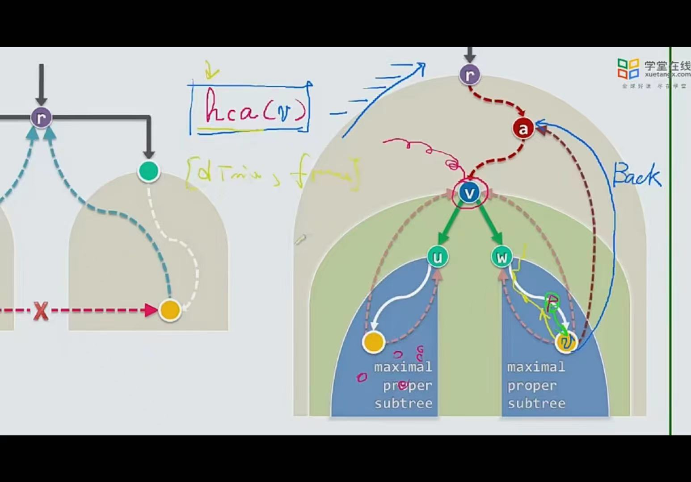
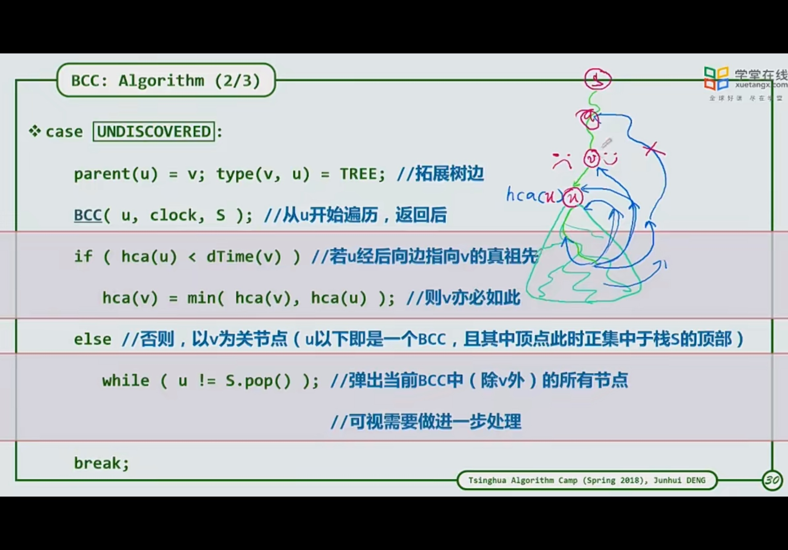
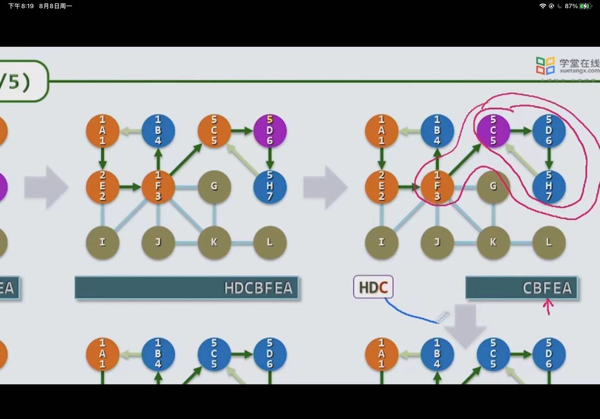
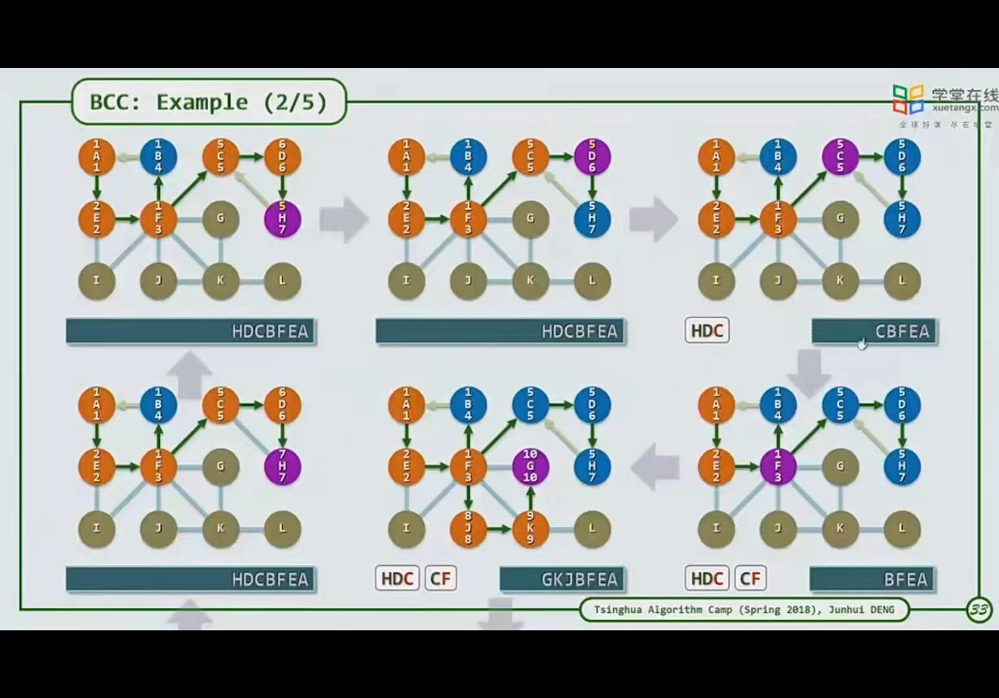
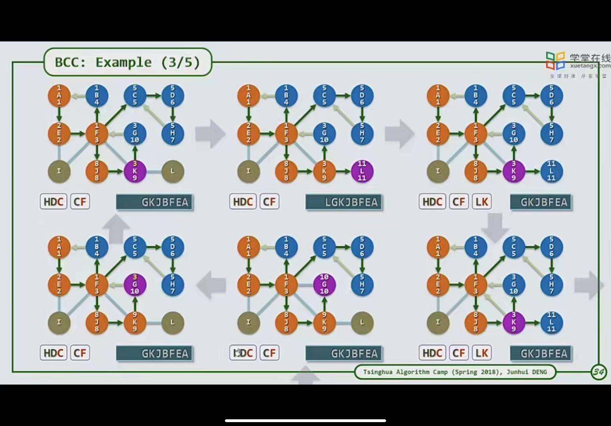
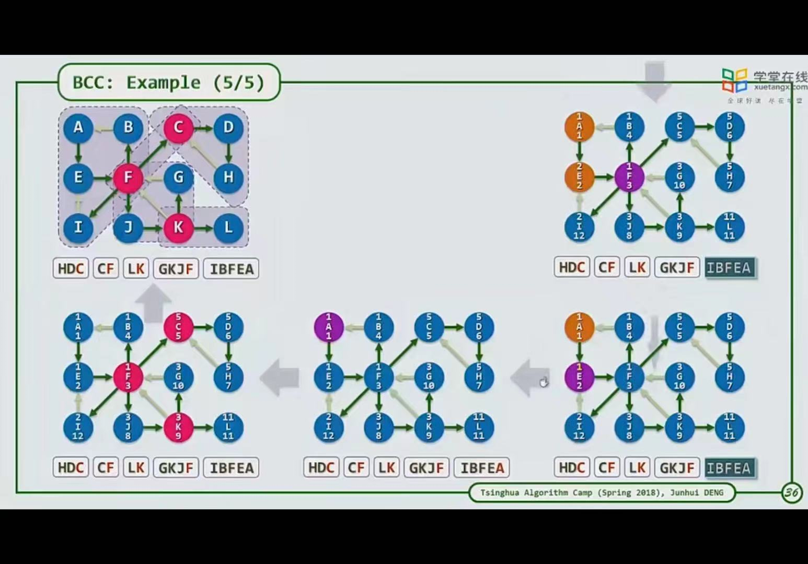

1. 单连通，两个区域只有一条路径相连。
2. 双连通，两个区域多条路径相连
   1. 相当于在两个区域内形成一个环路
   2. 求解过程：使用dfs中环路的概念
      1. 首先分析，其任取一个节点，构成dfs树，其每个叶节点若无其他出度可以删除，其根节点若无其他入度并且只有一条出度也可以删除。
      2. 
      3. 一个节点若进行bfs，其与其相连的节点均为其后代，不会存在其子树与其兄弟子树连接的节点
      4. 
      5. 利用BFS中的开始时间dtime，再增加一个其与祖先最近分量ftime默认为其dtime。由于开始时间相当于离跟最短的节点，则从在遍历时，若发现backword的节点，则将该节点的ftime更新为与其直接相连节点的dtime（其为相对于这棵子树最高的节点，其数值最小），并在返回递归时，依次更新其祖先的ftime（取最小），碰到其dtime和ftime相等时，可将这些以该节点为根的节点pop出，并且将该节点与其父亲pop出
      6. 
      7. 
      8. 实例：
         1. 
         2. 
         3. 

