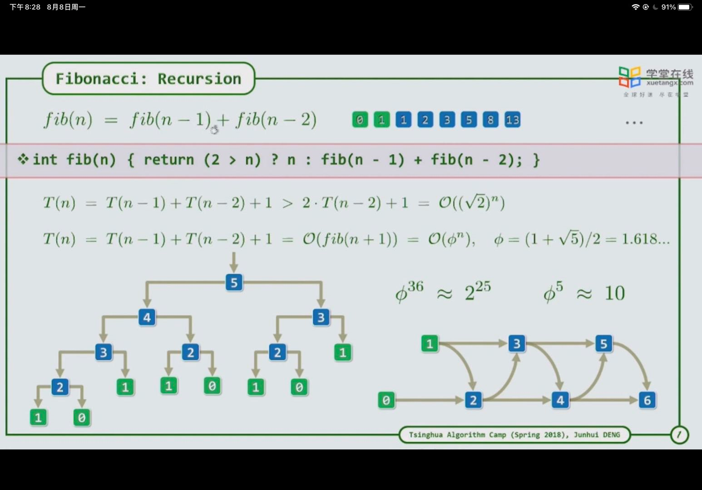
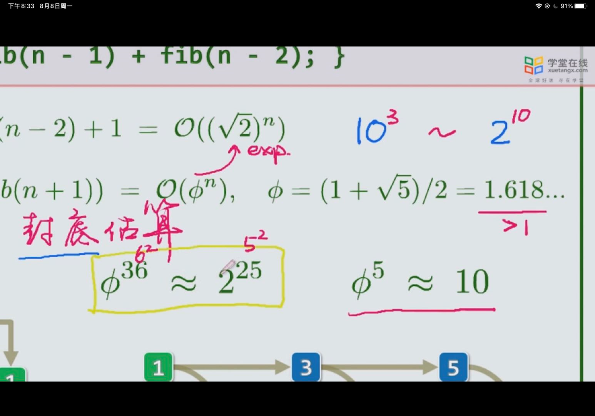

1. 动态规划本质上是分而治之，其最主要的区别是分而治之明确最优分法，而动态规划无法确定最优分法，只能依赖从大问题开始穷举不同的分法，再依次递归进行分解，因此，其不同的分法之间可能存在计算的重复，因此需要对其进行记录并查找。==动态规划=用分而治之分解每一种情况计算并比较==

2. 将大问题分解为小问题后，多个大问题可能会用到同一个小问题，也就是说一个小问题的结果对多个大问题提供服务，这时就需要将小问题的结果保存下来，以待大问题用

3. 

4. 进行封底估算关系

   1. 

      