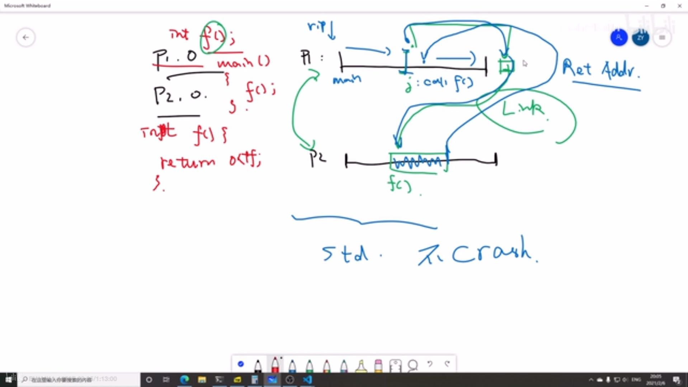
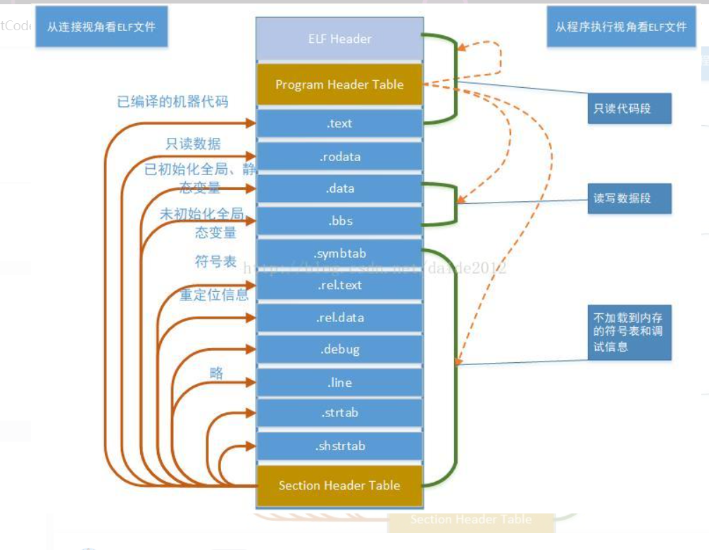
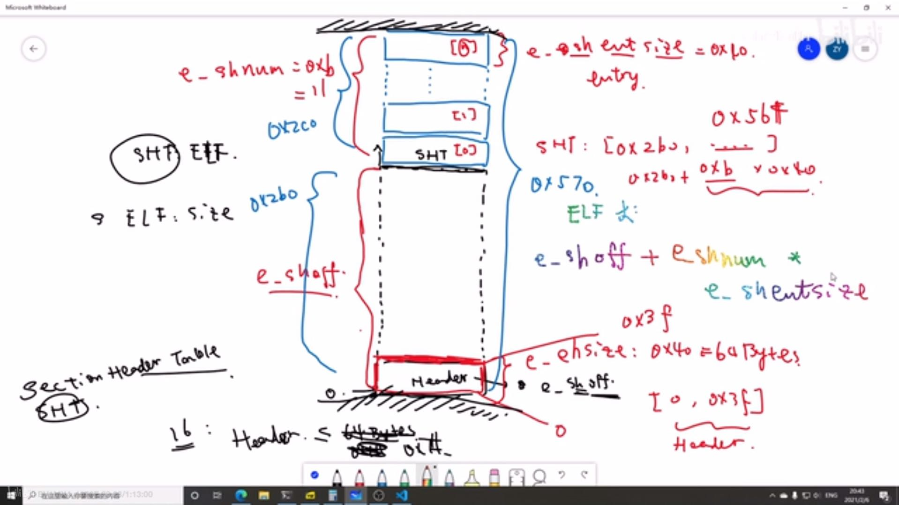

1. 程序文件
   1. 定义：指令集的集合，rip进行按顺序取指令
   2. 标准程序文件
      1. 文件中的下一条指令均是其执行时的下一条指令
   3. 非标准程序文件
      1. 文件中的下一条指令进行了跳转，不再是文件中的下一条指令
      2. eg：1 2 3 4 5 6 7 8 ，本来执行完指令6要执行指令7，但是由于进行了跳转，可能执行该文件后续指令，也可能跳转到其他程序执行指令
      3. 对于静态链接而言，其在指令集末尾加入一个无意义的指令（类似于nop），若进行跳转则直接跳转到最后一条指令，跳转之后再找到其下一个文件中跳转的目标地址，继续执行。若不需要则进行crash，需要继续执行则第二个程序执行完后跳回第一个程序执行
         1. 
2. 静态连接
   1. 过程：
      1. 定位 函数数据所在地方
         1. 一般是通过偏移量加大小来进行确定，即ELF文件的head来进行确定
      2. 进行符号解析
      3. 重定位
   2. 一般过程：一个文件需要另一个文件的数据或函数，则
3. ELF文件
   1. 含义
      1. E  可执行（指令集），因此指令集属于ELF文件
      2. L 可连接
      3. F format
   2. 二进制文件
   3. 文件格式
      1. 有头部，表示文件大小，头部偏移量，SHT偏移量。记录该文件信息
      2. SHT section  header table
         1. 
         2. 