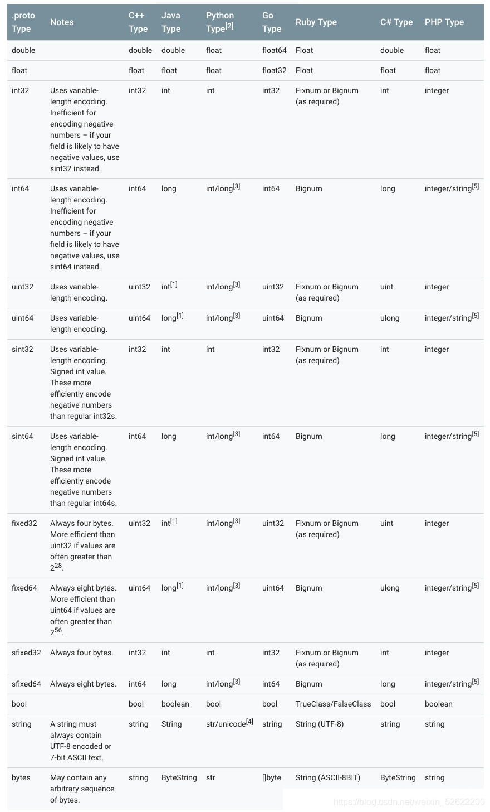

## Protobuf介绍

Protobuf (Protocol Buffers) 是谷歌开发的一款无关平台，无关语言，可扩展，轻量级高效的序列化结构的数据格式，用于将自定义数据结构序列化成字节流，和将字节流反序列化为数据结构。所以很适合做数据存储和为不同语言，不同应用之间互相通信的数据交换格式，只要实现相同的协议格式，即后缀为proto文件被编译成不同的语言版本，加入各自的项目中，这样不同的语言可以解析其它语言通过Protobuf序列化的数据。目前官方提供c++，java，go等语言支持。

下面表格是支持语言的列表及各个语言的插件

支持语言很多，C++ java python php golang 等，支持列表

| 语言                                 | github插件地址                                               |
| ------------------------------------ | ------------------------------------------------------------ |
| C++ (include C++ runtime and protoc) | src [https://github.com/protocolbuffers/protobuf/tree/master/src](https://github.com/protocolbuffers/protobuf/tree/master/src) |
| Java                                 | java [https://github.com/protocolbuffers/protobuf/tree/master/java](https://github.com/protocolbuffers/protobuf/tree/master/java) |
| Python                               | python [https://github.com/protocolbuffers/protobuf/tree/master/python](https://github.com/protocolbuffers/protobuf/tree/master/python) |
| Objective-C                          | objectivec [https://github.com/protocolbuffers/protobuf/tree/master/objectivec](https://github.com/protocolbuffers/protobuf/tree/master/objectivec) |
| C#                                   | csharp [https://github.com/protocolbuffers/protobuf/tree/master/csharp](https://github.com/protocolbuffers/protobuf/tree/master/csharp) |
| JavaScript                           | js [https://github.com/protocolbuffers/protobuf/tree/master/js](https://github.com/protocolbuffers/protobuf/tree/master/js) |
| PHP                                  | allegro/php-protobuf [https://github.com/allegro/php-protobuf](https://github.com/allegro/php-protobuf) |
| Go                                   | ruby [https://github.com/protocolbuffers/protobuf/tree/master/ruby](https://github.com/protocolbuffers/protobuf/tree/master/ruby) |
| PHP                                  | golang/protobuf [https://github.com/golang/protobuf](https://github.com/golang/protobuf) |

## Protobuf应用场景

对于protobuf的使用场景，简单来说，业务要求命中其优点越多，缺点越少，就更能够使用Protobuf，比如说在某些场景对消息大小很敏感，或者传输的数据量不大，比如说APP登录场景，那么可以考虑使用Protobuf

### 选择序列化协议需要考虑哪些

序列化之后的数据流的大小（占用网络带宽），对于高并发的场景下这点很重要。  
序列化和反序列化的性能（占用CPU和内存资源）。  
是否支持多语言。

**常见数据交互格式对比**

- JSON （JavaScript Object Notation）：一般用于WEB项目中，因为浏览器对JSON格式的数据支持非常好，大部分编程语言有很多内建函数支持，而且JSON几乎支持所有编程语言。
- XML：XML在WebService中的应用比较多，相比于JSON，它的数据更加冗余，因为需要成对的闭合标签，而JSON使用了键值对的方式，不仅压缩了一定的数据空间，同时也有更好的可读性。
- Protobuf：谷歌公司新开发的一种数据格式，适合高性能，对响应速度有要求的数据传输场景。因为Protobuf是二进制数据格式，需要编码和解码。数据本身不具有可读性，因此只能反序列化得到可读数据。

相对于其他数据格式Protobuf的优势：

- 序列化后体积比JSON和XML小，适合网络传输。
- 序列化反序列化速度快，比JSON的处理速度快。
- 消息格式升级和兼容性还不错。

### Protobuf的序列化与反序列化.

- 序列化：将数据结构或者对象转化成二进制串的过程。
- 反序列化：将序列化过程中所产生的二进制串转换成数据结构或对象的过程。

### Protobuf的优点和缺点

优点：

- Protobuf序列化速度快，序列化后的体积比xml更小，传输更快。使用相对也简单，因为Proto编译器能自己序列化和反序列化。
- 可以定义自己的数据结构，然后使用代码生成器去生成的代码来读写这个数据结构，甚至可以在不用重新部署的情况下来更新这个数据结构，只需要使用Protobuf对数据结构进行一次描述，就可以利用不同的语言或者从不同的数据流对你的结构化数据轻松的读写。
- 向后兼容性好，不需要破坏旧的数据格式，依靠老的数据格式的程序就可以对数据结构更新。
- 语义比xml更加清晰，无需类似xml解析器的东西（因为Protobuf编译器会将.proto文件编译成对应的数据访问用以对Protobuf数据进行序列化和反序列化操作）。  
    跨平台，跨语言，可扩展性好。
- 维护成本比较低，多个平台只需要维护一套.proto对象协议文件。  
    加密性好。

缺点：

- Protobuf功能简单，无法用来表示复杂的概念。
- 相比xml，xml具有某种程度的自解释性，因为最终是转成二进制流，不像xml和json能够直接查看明文。

### 那么为什么不直接使用XML

同XML相比，Protobuf的优势在于高性能，它以高效的二进制存储方式比XML小3到10倍，快20到100倍，原因在于：

- ProtoBuf序列化后所生成的二进制消息非常紧凑。
- ProtoBuf封解包过程非常简单。

protobuf对传输的数据采取一种最简单的key-value形式的存储方式（但其中有一种类型的数据不是k-v形式，后面会讲），这钟存储方式极大的节省了空间。除此之外protobuf还采取了varint(变长编码)形式来压缩数据，对体积较小的字段分配较少的空间，由此使得压缩后的文件非常“紧凑”。

### Protobuf语法

要想使用Protobuf就需要先定义proto文件，先熟悉protobuf消息定义的相关语法。

#### 1\. 定义消息类型

```bash
syntax = "proto3";

message SendRequest {
  string query = 1;
  int32 page_number = 2;
  repeated int32 result_per_page = 3;
}
```

.proto文件的第一行指定了使用proto3语法，说明使用的是proto3版本。如果省略protocol buffer编译器就默认使用proto2语法。他必须是文件中非空非注释行的第一行。

message表示消息类型，可以有多个。

SendRequest定义中指定了三个字段(name/value键值对)，每个字段都会有名称和类型。

repeated是字段规则。

#### Protobuf各个语言标量类型对应关系

一个标量消息字段可以含有一个如下类型，下面表格定义了在.proto文件中的类型，以及与之对应在自动生成访问类中定义类型。  


#### 2\. 定义字段的规则

message的字段必须符合以下规则：

singular：一个遵循singular规则的字段，在一个结构良好的message消息体(编码后的message)可以有0或1个该字段（但是不可以有多个）。这是proto3语法的默认字段规则。（这个理解起来有些晦涩，举例来说上面例子中三个字段都是singular类型的字段，在编码后的消息体中可以有0或者1个query字段，但不会有多个。）

repeated：遵循repeated规则的字段在消息体重可以有任意多个该字段值，这些值的顺序在消息体重可以保持（就是数组类型的字段）

#### 3\. 添加更多消息类型

在单个.proto文件中可以定义多个message，这在定义多个相关message时非常有用。比如说，我们定义SendRequest对应的响应messageSendResponse,把它加到之前的.proto文件中。

```bash
syntax = "proto3";

message SendRequest {
  string query = 1;
  int32 page_number = 2;
  repeated int32 result_per_page = 3;
}

message SendResponse {
 ...
}
```

#### 4\. 添加注释

.proto文件中的注释和C，C++的注释风格相同，使用// 和 /\* … \*/

```bash
syntax = "proto3";

message SendRequest {
  string query = 1;         // 查询
  int32 page_number = 2;    // 页码
  repeated int32 result_per_page = 3;   //分页数
}
```

#### 5\. message支持嵌套使用

```bash
message SendResponse {
    message Result {
        string url = 1;
        string title = 2;
        repeated string snippets = 3;
    }
    repeated Result results = 1;
}
```

#### 6.使用其它消息类型

可以将其它消息类型作为字段的类型，如下，有多个message中都包含Person类型，此时就可以在相同的.proto文件定义一个Person类型，然后在需要用到的message中指定一个Person字段。

```bash
message Personinfo {
        repeated Person info = 1;
}
message Person {
        string name = 1;
        int32 age = 2;
        repeated int32 weight = 3;
}
```

上面也可以嵌套在一起写

```bash
message Personinfo {
        message Person {
            string name = 1;
            int32 age = 2;
            repeated int32 weight = 3;
        }
        repeated Person info = 1;
}
```

如果想在它的父消息类型外部重用这个消息类型，可以使用Personinfo.Person的方式

```bash
message PersonMessage {
    Personinfo.Person info = 1
}
```

#### 7\. 定义服务（Service）

如果想将消息类型用在RPC系统中，可以在.proto文件中定义一个RPC服务接口，protobuf编译器会根据所选择语言生成对应语言的服务接口代码及存根。例如定义一个RPC服务并具有一个方法，该方法能够接受SearchRequest并返回一个SearchResponse，此时就可以在.proto文件进行如下定义：

```bash
service SearchService {
    //rpc（rpc关键字） 服务函数名  （传入参数） 返回（返回参数）
      rpc  Search （SearchRequest） returns （SearchResponse） ;
}
```

gRPC就是使用Protobuf的一个RPC系统，gRPC在使用Protobuf时候非常有效。

### Protobuf是如何工作的

.proto文件是protobuf一个重要的文件，它定义了需要序列化数据的结构，当protobuf编译器（protoc）来运行.proto文件时候，编译器将生成所选择的语言的代码，比如你选择go语言，那么就会将.proto转换成对应的go语言代码，对于go来说，编译器会为每个消息类型生成一个pd.go文件，而C++会生成一个.h文件和一个.cc文件。

使用protobuf的3个步骤是：

- 在.proto文件中定义消息格式。
- 用protobuf编译器编译.proto文件。
- 用C++/Java/go等对应的protobuf API来写或者读消息。

在.proto文件定义消息，message是.proto文件最小的逻辑单元，由一系列name-value键值对构成。下面的.proto文件定义了一个"人"的消息：

```bash
message Person {
  required string name = 1;
  required int32 id = 2;
  optional string email = 3;

  enum PhoneType {
    MOBILE = 0;
    HOME = 1;
    WORK = 2;
  }

  message PhoneNumber {
    required string number = 1;
    optional PhoneType type = 2 [default = HOME];
  }

  repeated PhoneNumber phone = 4;
}
```

message消息包含一个或多个编号唯一的字段，每个字段由字段限制,字段类型,字段名和编号四部分组成，字段限制分为：optional(可选的)、required(必须的)以及repeated(重复的)。定义好消息后，使用ProtoBuf编译器生成C++对应的.h和.cc文件，源文件提供了message消息的序列化和反序列化等方法

## 压缩算法

Varint 算法，过程如下：

- 将数据以 7 位为一组进行分割；
- 将组的顺序颠倒，即：将 ”高位 → 低位“ 规则，改为 ”低位 → 高位“；
- 识别每一组，如果该组后还有数据，就在该组前增加一位 ”1”，否则增加 “0”。

将数据 300 带入该算法，过程如下：

```c
300: 00000000 00000000 00000001 00101100
    → 7 位分割：0000 0000000 0000000 0000010 0101100
    → 颠倒顺序：0101100 0000010 0000000 0000
    → 组前加 1/0：10101100 00000010
 	→ 十进制：172 2

```

按照这套算法下来，将数据压缩为 2 个字节存储。而接收方拿到字节数据后，只需要按照高位识别，如果为 0，说明之后没有数据了。

最终，对于 int32 num = 2 结构和数据 300，压缩后的结果为：

```cobol
16 172 2
```