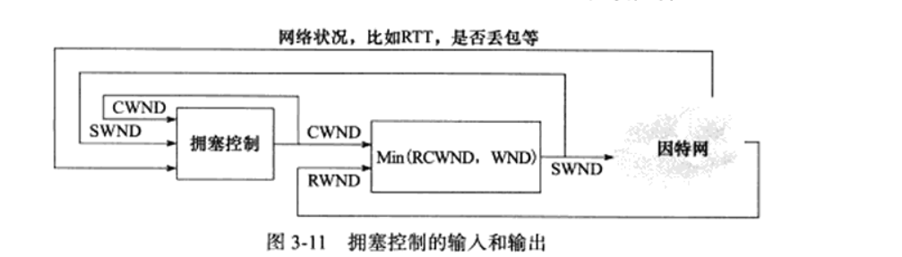

## 概述

tcp/ip协议不包括物理层

## 数据链路层

1. ARP协议：用于查询目标IP对应的MAC地址
   1. 0x806
   2. 
   3. 目的以太网地址均填F，即广播地址，该设备ip地址为目的ip地址的设备收到后会将其自身的mac地址填入数据包
   4. 其请求和应答直接从以太网驱动程序发出
   5. Linux操作
      1. arp -a 查看arp缓存
         1. -d 删除
         2. -s 添加
2. RARP协议：查询自身的IP地址
   1. mac ——>ip
   2. 向网络管理者发送，其本身由于不含存储设备，无法存储自身的ip地址
3. 根据帧类型字段的不同，将帧发送到不同的物理或应用设备。

## 网络层

1. Ip协议

   1. 类型：0x80

   2. 特点：

      1. 无状态：各报文相互独立，无上下文关系
         1. 缺点：无法处理重复乱序数据包

   3. 提供分片重组

      1. 分片：设置偏移地址和是否有后一块
         1. 偏移大小需要*2的3次方
         2. 
         3. 仅第一个icmp报文存储ip头部信息，其之后的仅存储ip数据报内容
      2. 重组，进行数据包合并

   4. 超时重传，当发生超时后，其收到icmp报文，其并不会主动重传，而是通知上层协议，需要上层协议再次进行传送

   5. TTL：数据报到达目的之前允许进过路由器跳数

   6. 工作流程

      1. 

   7. 路由表：

      1. 内容

         1. 准确ip地址，目的ip完全对应路由表中的ip，按对应端口发送
         2. 模糊ip地址，对应相应的网络区，使用掩码计算
         3. 默认

         

2. ICMP协议

   1. 类型
      1. 差错报文：回应网络错误，如网络不可达
      2. 查询报文：通过网络信息，如ping

## 传输层

1. tcp 基于流，面向连接，可靠
   1. 保证数据正确性：
      1. 超时重传
      2. 数据确认
   2. 数据结构
      1. 连接状态
      2. 读写缓冲区
      3. 定时器

   3. tcp头部信息

      1. 四元组，源端口，目的端口，源ip，目的ip
         1. 服务器端口一般使用知名的端口来进行通信，而客户端则使用系统分配的临时的端口进行通信
      2. 标志信息
         1. 
         2. urg用来表明其是紧急信息，将会引起异常
            1. 迅速通告对方本段发生的重要事件，立即被发送，其可以使用一条独立的传输连接，也可以映射到普通的数据连接中。
            2. 两个结构
               1. 头部进行标志
               2. 含有一个紧急标志指针，指向紧急报文的后一个字节，相当于只有最后一个字节被当做了紧急报文，而前面的都当做了普通报文
            3. 其缓冲仅一个字节，新来的紧急报文将对其进行覆盖
            4. 设置 SO_OOBINLINE
         3. 在抓包中一般用首字母来表示其信息，如
         4. p进行督促其读出
      3. 校验和包括头部和数据

   4. 状态转移

      1. close进行半关闭，而shutdown进行全关闭
      2. TIME_WAIT 状态
         1. 是当主动结束方收到被动结束方发来的关闭信息时，其需要等待2MSL的时间，来确保被动关闭方准确收到主动关闭方发送过去的确认信息。
         2. 存在的原因
            1. 可靠的终止tcp连接
            2. 保证让迟来的tcp报文有足够时间被识别并丢弃
               1. 若无该状态，主动方关闭，此时又有一个新的进程使用了该端口号，此时客户端发送过来的信息可能被该新的进程收到，造成错误
               2. 客户端无此问题，因为客户端使用的端口是临时分配的，其一般不会与上次的相同，而服务器一般都是同一个端口，因此其可能会导致错误
               3. 服务器可使用SO_REUSEADDR来强制进行复用

   5. 复位报文段 ：一端向另一段发送带有RST标志的报文段（复位）

      1. 出现情况
         1. 访问不存在的端口，返回携带
         2. 异常终止连接
            1. 当收到后，其待发送队列的数据将全部被丢弃
         3. 处理半打开连接
            1. 一端已经重启而另一端依旧维持着旧的半连接状态，当其维持半连接的一段向其发送数据时，其会返回一个复位报文段
      2. 数据包
         1. 其携带的接受窗口为0，用来通知对方关闭连接或重新连接，不进行回应
      3. 使用SO_LINGER 来进行发送复位报文段

   6. 数据流

      1. 字节流，不必双方执行相同次数的读写操作，接受和发送无边界限制，可以发很多，只不过会被底层拆分，但对传输层隐藏

      2. 类型

         1. 交互数据 仅包含很少的字节，用以进行控制，其对实时性要求高，如远程控制程序

         2. 成块数据，其长度一般为tcp报文所允许的最大报文长度，如ftp

            

   7. 流的控制

      1. 延迟确认，其收到一些报文后，会延迟发送确认包，等收到一些后再发送确认包

         1. nagle算法要求应该tcp连接的通信双方任意时刻最多只能发送应该未被确认的报文段，防止了长时间接受不到确认信息。

      2. 超时重传

         1. config信息控制参数
            1. /proc/sys/net/ipv4/tcp_retries1
               1. 指定底层ip接管之前tcp最少执行的重传次数，默认值为3  ==连接完成，新的连接==
            2. /proc/sys/net/ipv4/tcp_retries2
               1. 指定连接放弃前tcp最多可以执行的重传次数  ==连接进行，关闭连接==

      3. 拥塞控制 控制一次向tcp连接中发送的报文数量

         1. 慢启动

         2. 拥塞避免

            1. 判断拥塞
               1. 传输超时，tcp重传定时器溢出
                  1. 慢启动，拥塞控制
               2. 接收到重复的确认报文段
                  1. 快速重传，快速恢复

         3. 快速重传

            1. 连续收到几个重复确认报文，对该确认报文迅速重新传送

            2. 如图所示，报文段1成功接收并被确认ACK 2，接收端的期待序号为2，当报文段2丢失，报文段3失序到来，与接收端的期望不匹配，接收端重复发送冗余ACK 2。  
               

               这样，如果在超时重传定时器溢出之前，接收到连续的三个重复冗余ACK（其实是收到4个同样的ACK，第一个是正常的，后三个才是冗余的），发送端便知晓哪个报文段在传输过程中丢失了，于是重发该报文段，不需要等待超时重传定时器溢出，大大提高了效率。这便是快速重传机制。

         4. 快速恢复

            1. 当到达拥塞窗口后，其会迅速恢复到正常窗口大小

         5. 相关术语

            1. SWND 发送窗口
            2. SMSS 发送端能发送的最大报文长度
            3. MSS tcp报文最大传输长度
            4. RWND接受通告窗口
            5. CWND拥塞窗口
            6. 
            7. 发送窗口是min{接受窗口，拥塞窗口}
2. udp  基于数据包，不可靠，无状态
   1. 若出错需要从用户内存空间将数据重新拷贝到内核态，再进行数据的重新发送
   2. 不保留状态，每次传输都是用户数据到内核
   3. 有最大传输单元，超过后截断
      1. 需要应用有足够多的缓冲来接受数据
   4. 有一次写就有一次读

## 应用层

1. telnet：远程登录协议

2. OSPF （open Short path first） ，开放最短路径优先，动态路由协议，路由之间传输

3. DNS 域名服务，机器域名到IP地址的转化

   1. 
   2. 
      1. or 查询或应答
      2. opcode ，标准查询：域名到ip；反向查询：ip到域名，
      3. 递归查询和迭代查询
   3. 其使用UDP进行数据传输
   4. Linux操作
      1. host -t A 域名
         1. 返回域名别名，ip
         2. -t A表示使用A协议类型，dns查询
   5. 寻找ip地址两步
      1. 先在本地配置文件/etc/hosts中查询本地网络是否有目标域名
      2. 若无再使用dns进行域名到ip的查询

4. http协议

   1. 请求报文
      1. 
      2. 

   ## socket

   1. socket功能：
      1. 将应用程序数据从用户缓冲区复制到tcp/udP内核缓冲区，交付待传送数据
      2. 应用程序可通过其来修改内核各层协议的头部信息或其他数据结构，精细的控制，
         1. setsocket设置ip数据包的存活时间

   ##  代理

   1. 通过将该局域网中的一台主机设置其为代理服务器，该局域网中的其他主机可通过该服务器进行与外部通信

   2. 分类

      1. 正向代理服务器
         1. 要求客户端自己设置代理服务器地址
         2. 客户端每次请求发送到代理服务器，由代理服务器对请求进行资源请求
      2. 反向代理服务器
         1. 客户端无需设置，多用于服务器，在服务器和客户端中间加一层服务器，其表现为一个真实的服务器。分布式服务器
      3. 透明代理只能在网关上，其对用户是透明的

   3. 修改客户端配置文件

      1. /etc/squid3/squid/conf需要root

      2. ```bash
         acl localnet src 192.168.1.0/24
         http_access allow localnet
         ```

      3. 第一行：允许网络192.168.1.0上所有机器通过代理服务器