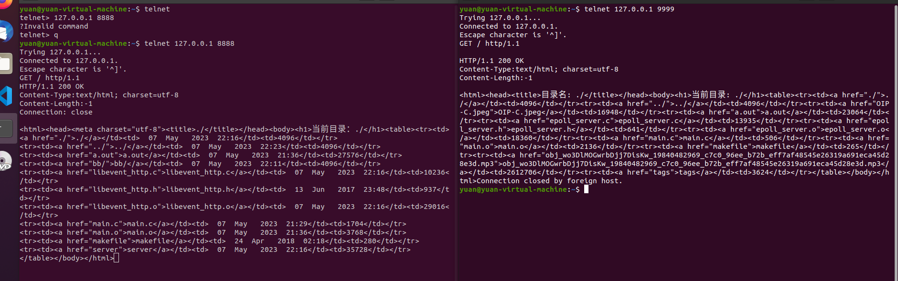

1. http协议自己封装不好，关键字出错，未察觉导致服务器无法给客户端发送消息
2. 对于path类型理解不深刻
3. libevent + ET模式 + 线程池，
4. bug ：对于目录发送完毕后依旧保持链接，libevent特有，对于epoll来说没有
   1. 
      1. 抓包对比，可以看到libevent服务器发送完毕后依旧在等数据，对于epoll来书服务器发送完毕后立即断开连接
      2. 其发送数据均是一样的，猜测可能是bufferevent缓冲
      3. 或者发送http大小为-1，但epoll没问题
   2. bufferevent发送http长度为-1，始终阻塞，当文件长度为-1时，其也会阻塞