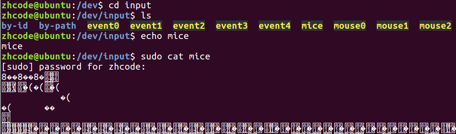

 

## 01P-Linux命令基础习惯-Linux系统编程

date 显示系统当前时间

cat /etc/shells 查看当前可使用的shell

echo \$SHELL 查看当前使用的shell

主键盘快捷键：

上 Ctrl-p

下 Ctrl-n

左 Ctrl-b

右 Ctrl-f

Del Ctrl-d delete 光标后面的

Home Ctrl-a first letter

End Ctrl-e end

Backspace Backspace delete光标前面的单个字符

清除整行 Ctrl-u

删除光标到行末 Ctrl-k

显示上滚 Shift-PgUp

显示下滚 Shift-PgDn

增大终端字体 Ctrl-Shift-+

减小终端字体 Ctrl- -

新打开一个终端 Ctrl-Alt-T

清屏 Ctrl-l 直接用clear也行

## 02P-类Unix系统目录

pwd 查看当前所在目录

Linux系统目录：

bin：存放二进制可执行文件

boot：存放开机启动程序

dev：存放设备文件： 字符设备、块设备

home：存放普通用户

etc：用户信息和系统配置文件 passwd、group

lib：库文件：libc.so.6

root：管理员宿主目录（家目录）

usr：用户资源管理目录 unix software resource

查看鼠标日志

## 03P-目录和文件操作1

cd – 返回上一个目录

Linux系统文件类型： 7/8 种

普通文件：-

目录文件：d

字符设备文件：c

块设备文件：b

软连接：l

管道文件：p

套接字：s

未知文件。

ls 列出当前文件夹下目录项

ll 竖排显示目录项和详细信息，ls -l的缩写

ls -l 显示目录项详细信息

ls -l dirname 显示dirname中目录详细信息

ls -dl dirname 显示dirname本身的详细信息

ls -R 递归查看目录

ls -Rl 递归展示详细信息

文件权限说明

目录项详细信息

文件权限 硬链接计数 所有者 所属组 大小 时间 文件名/文件夹名

权限具体展开

\-rw-r—r—

1234567890

1代表文件类型

234代表所有者读写执行权限

567代表同组用户读写执行权限

890代表其他人读写执行权限

which instruct查看instruct命令所在目录位置

隐藏终端中的路径

vi \~./bash 打开使用的shell环境配置文件

末尾添加 PS1=\$ 保存退出，重启终端即可

效果如下：

mkdir dirname 新建目录

rmdir dirname 删除空目录，非空目录删不掉

touch filename 创建名为name的空文件

rm filename删除文件

rm -r dirname 递归删除目录

rm -rf dirname 强制删除

mv file1 file2 location

将文件1和文件2移动到目标位置

cp filename dirname 复制文件到目录

cp filename1 filename2 复制文件1并重命名为文件2

cp -a dirname1 dirname2 复制目录1及其下所有文件到目录2

cp -r dirname1 dirname2 递归复制目录1到目录2

这里-a和-r的差别在于，-a是完全复制，文件权限，改动时间什么的也完全相同。

## 04P-目录和文件操作2

cat filename 查看文件内容

tac filename 逆转查看文件内容

cat 读取终端，就是回显

more filename 和cat差不多，但是对于大文件查看很强势

空格翻页，回车一行

用q或者Ctrl-c退出

less filename 也和cat差不多

空格翻页，回车一行

用q或者Ctrl-c退出

head -n filename 查看文件前n行

不加-n参数默认查看10行

tail -n filename 查看文件后n行

默认查看10行，顺序显示的，不是倒序显示，1-10查看后4行是78910

tree 命令，查看当前目录结构树

需要安装tree

